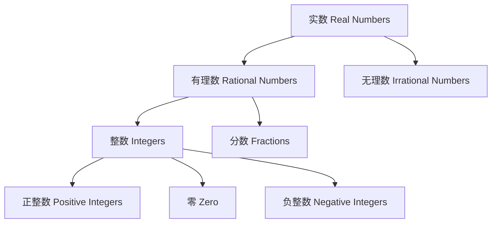
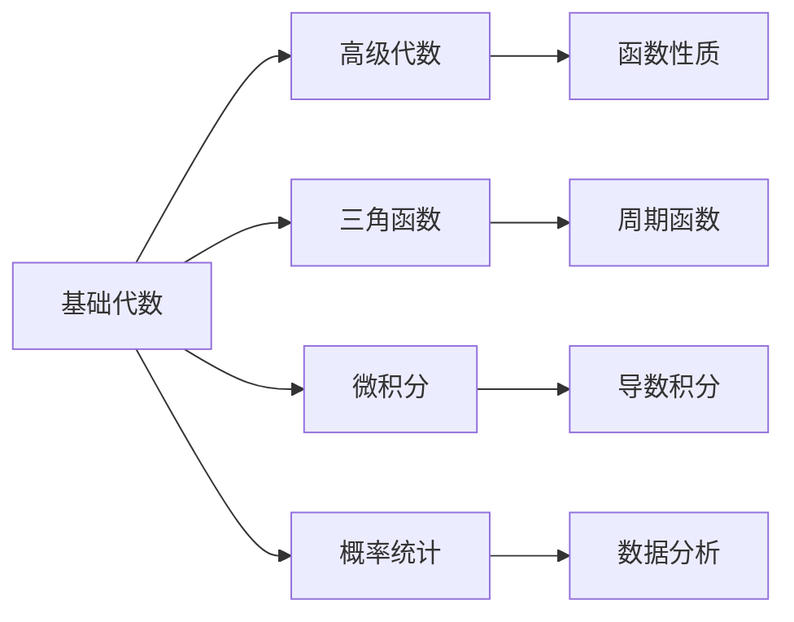

# 1.1 基础代数 | Basic Algebra

## 概述 | Overview

基础代数是高中数学的基石，为后续的数学学习奠定基础。本章将系统介绍实数系统、代数运算、方程与不等式以及函数的基本概念。

## 1. 实数系统与数轴 | Real Number System and Number Line

### 1.1 实数分类 | Classification of Real Numbers

**实数系统的性质**：

- **完备性**：实数系统是完备的，任何有界的实数序列都有极限
- **稠密性**：任意两个实数之间都存在无穷多个实数
- **有序性**：实数可以比较大小，满足传递律

### 1.2 数轴与绝对值 | Number Line and Absolute Value

**数轴表示**：

- 数轴是一条无限延伸的直线
- 每个实数对应数轴上的一个点
- 原点O对应实数0
- 正方向对应正数，负方向对应负数

**绝对值定义**：
对于任意实数a，其绝对值定义为：
$$|a| = \begin{cases}
a, & \text{if } a \geq 0 \\
-a, & \text{if } a < 0
\end{cases}$$

**绝对值性质**：
1. $|a| \geq 0$（非负性）
2. $|a| = |-a|$（对称性）
3. $|ab| = |a| \cdot |b|$（乘法性质）
4. $|a + b| \leq |a| + |b|$（三角不等式）

## 2. 代数运算与因式分解 | Algebraic Operations and Factoring

### 2.1 多项式运算 | Polynomial Operations

**多项式定义**：
形如 $P(x) = a_nx^n + a_{n-1}x^{n-1} + \cdots + a_1x + a_0$ 的表达式称为多项式，其中 $a_i$ 为系数，$n$ 为次数。

**多项式运算**：
- **加法**：同类项系数相加
- **减法**：同类项系数相减
- **乘法**：使用分配律展开
- **除法**：长除法或综合除法

### 2.2 因式分解 | Factoring

**常用因式分解公式**：

1. **平方差公式**：$a^2 - b^2 = (a + b)(a - b)$
2. **完全平方公式**：
   - $a^2 + 2ab + b^2 = (a + b)^2$
   - $a^2 - 2ab + b^2 = (a - b)^2$
3. **立方和差公式**：
   - $a^3 + b^3 = (a + b)(a^2 - ab + b^2)$
   - $a^3 - b^3 = (a - b)(a^2 + ab + b^2)$

**因式分解方法**：
- 提取公因式
- 分组分解
- 十字相乘法
- 配方法

### 2.3 分式运算 | Fraction Operations

**分式基本性质**：
- $\frac{a}{b} = \frac{ka}{kb}$（k ≠ 0）
- $\frac{a}{b} \cdot \frac{c}{d} = \frac{ac}{bd}$
- $\frac{a}{b} \div \frac{c}{d} = \frac{a}{b} \cdot \frac{d}{c} = \frac{ad}{bc}$

## 3. 方程与不等式 | Equations and Inequalities

### 3.1 线性方程 | Linear Equations

**一元一次方程**：$ax + b = 0$（a ≠ 0）

**解法**：
1. 移项：$ax = -b$
2. 系数化1：$x = -\frac{b}{a}$

**二元一次方程组**：
$$\begin{cases}
a_1x + b_1y = c_1 \\
a_2x + b_2y = c_2
\end{cases}$$

**解法**：
- 代入法
- 加减消元法
- 行列式法

### 3.2 二次方程 | Quadratic Equations

**标准形式**：$ax^2 + bx + c = 0$（a ≠ 0）

**求根公式**：
$$x = \frac{-b \pm \sqrt{b^2 - 4ac}}{2a}$$

**判别式**：$\Delta = b^2 - 4ac$
- $\Delta > 0$：两个不等实根
- $\Delta = 0$：两个相等实根
- $\Delta < 0$：两个共轭复根

**解法**：
- 因式分解法
- 配方法
- 求根公式法

### 3.3 不等式 | Inequalities

**一元一次不等式**：$ax + b > 0$（或 <, ≥, ≤）

**解法**：
1. 移项：$ax > -b$
2. 系数化1：注意不等号方向
   - 如果a > 0：$x > -\frac{b}{a}$
   - 如果a < 0：$x < -\frac{b}{a}$

**一元二次不等式**：$ax^2 + bx + c > 0$

**解法**：
1. 求对应方程的根
2. 根据a的符号和根的情况确定解集

## 4. 函数基础概念 | Basic Function Concepts

### 4.1 函数定义 | Function Definition

**函数定义**：
设A、B是两个非空集合，如果对于A中的每一个元素x，按照某种对应关系f，在B中都有唯一确定的元素y与之对应，则称f是从A到B的函数，记作 $f: A \rightarrow B$。

**函数表示方法**：
- 解析式：$y = f(x)$
- 表格法：列出对应值
- 图像法：绘制函数图像

### 4.2 函数性质 | Function Properties

**定义域与值域**：
- **定义域**：函数有意义的自变量的取值范围
- **值域**：函数值的取值范围

**函数的基本性质**：
1. **单调性**：
   - 单调递增：$x_1 < x_2 \Rightarrow f(x_1) < f(x_2)$
   - 单调递减：$x_1 < x_2 \Rightarrow f(x_1) > f(x_2)$

2. **奇偶性**：
   - 偶函数：$f(-x) = f(x)$
   - 奇函数：$f(-x) = -f(x)$

3. **周期性**：
   如果存在正数T，使得 $f(x + T) = f(x)$ 对所有x成立，则称f为周期函数，T为周期。

### 4.3 基本初等函数 | Basic Elementary Functions

**常数函数**：$f(x) = c$
- 定义域：R
- 值域：{c}
- 图像：平行于x轴的直线

**幂函数**：$f(x) = x^n$
- 当n为正整数时，定义域为R
- 当n为负整数时，定义域为R\{0}
- 当n为分数时，定义域需要具体分析

**指数函数**：$f(x) = a^x$（a > 0, a ≠ 1）
- 定义域：R
- 值域：(0, +∞)
- 单调性：a > 1时递增，0 < a < 1时递减

**对数函数**：$f(x) = \log_a x$（a > 0, a ≠ 1）
- 定义域：(0, +∞)
- 值域：R
- 单调性：a > 1时递增，0 < a < 1时递减

## 5. 应用实例 | Application Examples

### 5.1 实际问题建模 | Real-world Problem Modeling

**例1：利润最大化问题**
某商店销售某种商品，单价为p元时，销量为q = 1000 - 2p件。求使利润最大的价格。

**解**：
- 总收入：$R = pq = p(1000 - 2p) = 1000p - 2p^2$
- 假设成本为C，则利润：$L = R - C = 1000p - 2p^2 - C$
- 求导：$L' = 1000 - 4p$
- 令$L' = 0$，得$p = 250$

**例2：几何问题**
已知矩形的周长为20，求面积最大的长和宽。

**解**：
- 设长为x，则宽为10 - x
- 面积：$S = x(10 - x) = 10x - x^2$
- 求导：$S' = 10 - 2x$
- 令$S' = 0$，得$x = 5$
- 所以长为5，宽为5时面积最大

### 5.2 数学思维训练 | Mathematical Thinking Training

**思维方法**：
1. **抽象化**：将实际问题抽象为数学问题
2. **符号化**：用数学符号表示问题
3. **模型化**：建立数学模型
4. **求解**：运用数学方法求解
5. **验证**：检验结果的合理性

## 6. 知识关联 | Knowledge Connections

### 6.1 与后续内容的关联 | Connections with Later Content

### 6.2 跨学科应用 | Cross-disciplinary Applications

- **物理学**：运动学公式、力学计算
- **化学**：浓度计算、反应速率
- **经济学**：成本收益分析、供需关系
- **生物学**：种群增长模型、遗传计算

## 7. 习题与练习 | Exercises and Practice

### 7.1 基础练习 | Basic Exercises

1. **实数运算**
   - 计算：$\sqrt{16} + \sqrt{9} - \sqrt{25}$
   - 化简：$\frac{2\sqrt{3} + 3\sqrt{2}}{\sqrt{3} - \sqrt{2}}$

2. **因式分解**
   - $x^2 - 4x + 4$
   - $x^3 - 8$
   - $x^4 - 16$

3. **方程求解**
   - $2x + 3 = 7$
   - $x^2 - 5x + 6 = 0$
   - $\frac{1}{x} + \frac{1}{x+1} = \frac{5}{6}$

### 7.2 提高练习 | Advanced Exercises

1. **函数性质分析**
   - 分析函数$f(x) = \frac{x^2 - 1}{x - 1}$的定义域和值域
   - 判断函数$f(x) = x^3 - x$的奇偶性

2. **实际问题**
   - 一个长方形的周长是20，求面积的最大值
   - 某商品的价格p与销量q的关系为q = 100 - p，求总收入的最大值

### 7.3 竞赛练习 | Competition Exercises

1. **综合应用**
   - 证明：对于任意实数a, b, c，有$(a^2 + b^2)(b^2 + c^2)(c^2 + a^2) \geq 8a^2b^2c^2$
   - 求函数$f(x) = \sqrt{x^2 + 1} + \sqrt{(x-1)^2 + 1}$的最小值

## 总结 | Summary

基础代数为高中数学奠定了坚实的基础，通过系统学习实数系统、代数运算、方程不等式和函数概念，学生能够：

1. **建立数学思维**：培养抽象思维和逻辑推理能力
2. **掌握基本工具**：熟练运用代数运算和函数分析
3. **解决实际问题**：将数学知识应用于实际问题的解决
4. **为后续学习做准备**：为高级代数和微积分学习奠定基础

---

*基础代数是数学大厦的基石，掌握好这些基础知识，将为后续的数学学习提供强有力的支撑。*
