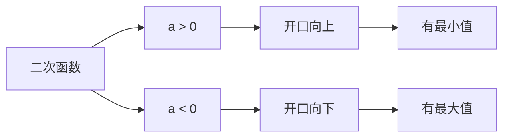
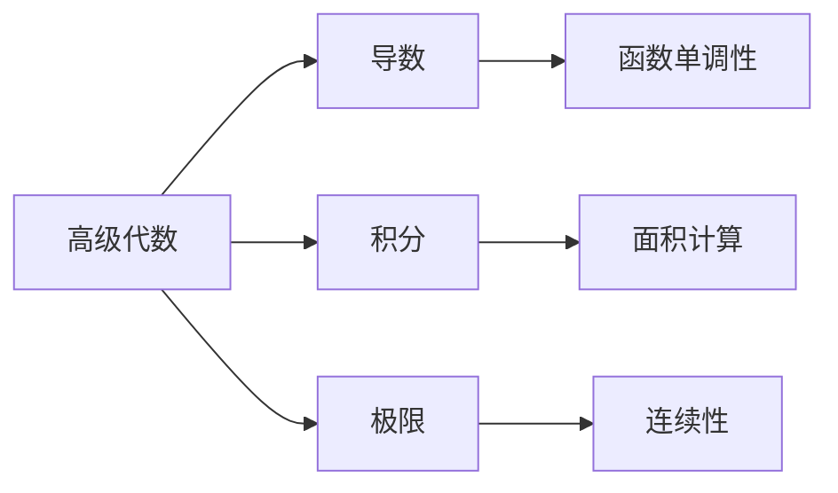

# 1.2 高级代数 | Advanced Algebra

## 概述 | Overview

高级代数是基础代数的深化和拓展，主要研究更复杂的函数类型和代数结构。本章将系统介绍二次函数、多项式函数、有理函数、指数对数函数、复合函数以及函数变换等内容。

## 1. 二次函数 | Quadratic Functions

### 1.1 二次函数定义与性质 | Definition and Properties

**标准形式**：$f(x) = ax^2 + bx + c$（a ≠ 0）

**顶点形式**：$f(x) = a(x - h)^2 + k$
其中顶点坐标为$(h, k)$，$h = -\frac{b}{2a}$，$k = f(h) = -\frac{b^2}{4a} + c$

**性质分析**：

- **开口方向**：a > 0时向上，a < 0时向下
- **对称轴**：$x = -\frac{b}{2a}$
- **顶点**：$(-\frac{b}{2a}, -\frac{b^2}{4a} + c)$
- **最值**：a > 0时有最小值，a < 0时有最大值

### 1.2 二次函数图像分析 | Graph Analysis

**图像特征**：

1. **对称性**：关于对称轴对称
2. **单调性**：在对称轴左侧递减，右侧递增（a > 0时）
3. **零点**：与x轴的交点，由判别式决定

### 1.3 二次函数应用 | Applications

**例1：抛物线运动**
物体以初速度v₀、角度θ抛出，其运动轨迹为：
$$y = x\tan\theta - \frac{gx^2}{2v_0^2\cos^2\theta}$$

**例2：利润最大化**
某商品的利润函数为$P(x) = -2x^2 + 100x - 500$，求最大利润。

**解**：

- 对称轴：$x = -\frac{100}{2(-2)} = 25$
- 最大利润：$P(25) = -2(25)^2 + 100(25) - 500 = 750$

## 2. 多项式函数 | Polynomial Functions

### 2.1 多项式函数定义 | Definition

**一般形式**：$P(x) = a_nx^n + a_{n-1}x^{n-1} + \cdots + a_1x + a_0$

**性质**：

- **次数**：最高次项的次数n
- **首项系数**：aₙ
- **常数项**：a₀
- **定义域**：R
- **连续性**：在R上连续

### 2.2 多项式函数的零点 | Zeros of Polynomial Functions

**零点定理**：
如果P(x)是一个多项式函数，且P(a) = 0，则称a为P(x)的零点。

**因式定理**：
如果a是多项式P(x)的零点，则(x - a)是P(x)的因式。

**重根**：
如果(x - a)ᵏ是P(x)的因式，但(x - a)ᵏ⁺¹不是，则称a为k重零点。

### 2.3 多项式函数的图像 | Graph of Polynomial Functions

**图像特征**：

1. **端行为**：由最高次项决定
   - 当n为偶数且aₙ > 0时，两端都向上
   - 当n为偶数且aₙ < 0时，两端都向下
   - 当n为奇数且aₙ > 0时，左端向下，右端向上
   - 当n为奇数且aₙ < 0时，左端向上，右端向下

2. **零点与图像**：
   - 单重零点：图像穿过x轴
   - 偶数重零点：图像在x轴处相切
   - 奇数重零点：图像穿过x轴

### 2.4 多项式除法 | Polynomial Division

**长除法**：
用于求多项式P(x)除以(x - a)的商和余数。

**综合除法**：
更高效的多项式除法方法，特别适用于除式为(x - a)的情况。

**余数定理**：
多项式P(x)除以(x - a)的余数等于P(a)。

## 3. 有理函数 | Rational Functions

### 3.1 有理函数定义 | Definition

**一般形式**：$R(x) = \frac{P(x)}{Q(x)}$
其中P(x)和Q(x)都是多项式函数，且Q(x) ≠ 0。

**定义域**：所有使Q(x) ≠ 0的实数。

### 3.2 有理函数的渐近线 | Asymptotes

**垂直渐近线**：
如果x = a是Q(x)的零点，则x = a是R(x)的垂直渐近线。

**水平渐近线**：

- 如果deg(P) < deg(Q)，则y = 0是水平渐近线
- 如果deg(P) = deg(Q)，则y = $\frac{a_n}{b_n}$是水平渐近线（aₙ, bₙ分别为P, Q的首项系数）
- 如果deg(P) > deg(Q)，则没有水平渐近线

**斜渐近线**：
当deg(P) = deg(Q) + 1时，存在斜渐近线，可通过长除法求得。

### 3.3 有理函数的图像 | Graph of Rational Functions

**图像特征**：

1. **零点**：P(x)的零点
2. **垂直渐近线**：Q(x)的零点
3. **水平或斜渐近线**：由次数关系决定
4. **单调性**：通过导数分析

**例**：分析函数$f(x) = \frac{x^2 - 1}{x - 2}$的图像

**解**：

- 零点：x = ±1
- 垂直渐近线：x = 2
- 斜渐近线：y = x + 2（通过长除法）

## 4. 指数与对数函数 | Exponential and Logarithmic Functions

### 4.1 指数函数 | Exponential Functions

**定义**：$f(x) = a^x$（a > 0, a ≠ 1）

**性质**：

- **定义域**：R
- **值域**：(0, +∞)
- **单调性**：a > 1时递增，0 < a < 1时递减
- **图像**：通过点(0, 1)
- **渐近线**：y = 0

**指数运算法则**：

1. $a^m \cdot a^n = a^{m+n}$
2. $\frac{a^m}{a^n} = a^{m-n}$
3. $(a^m)^n = a^{mn}$
4. $(ab)^n = a^n b^n$

### 4.2 对数函数 | Logarithmic Functions

**定义**：$f(x) = \log_a x$（a > 0, a ≠ 1）

**性质**：

- **定义域**：(0, +∞)
- **值域**：R
- **单调性**：a > 1时递增，0 < a < 1时递减
- **图像**：通过点(1, 0)
- **渐近线**：x = 0

**对数运算法则**：

1. $\log_a(xy) = \log_a x + \log_a y$
2. $\log_a(\frac{x}{y}) = \log_a x - \log_a y$
3. $\log_a(x^n) = n\log_a x$
4. $\log_a x = \frac{\log_b x}{\log_b a}$（换底公式）

### 4.3 自然对数与常用对数 | Natural and Common Logarithms

**自然对数**：$\ln x = \log_e x$

- 底数e ≈ 2.71828
- 在微积分中有重要应用

**常用对数**：$\log x = \log_{10} x$

- 在科学计算中常用

**关系**：
$$\ln x = \frac{\log x}{\log e} \approx 2.303\log x$$

## 5. 复合函数 | Composite Functions

### 5.1 复合函数定义 | Definition

**定义**：设f和g是两个函数，则复合函数$f \circ g$定义为：
$$(f \circ g)(x) = f(g(x))$$

**定义域**：所有使g(x)在f的定义域内的x值。

### 5.2 复合函数性质 | Properties

**运算性质**：

1. **结合律**：$(f \circ g) \circ h = f \circ (g \circ h)$
2. **不满足交换律**：$f \circ g \neq g \circ f$（一般情况）

**单调性**：

- 如果f和g都递增或都递减，则f ∘ g递增
- 如果f和g一个递增一个递减，则f ∘ g递减

### 5.3 复合函数求导 | Differentiation

**链式法则**：
$$(f \circ g)'(x) = f'(g(x)) \cdot g'(x)$$

**例**：求$f(x) = \sin(x^2)$的导数

**解**：

- $f'(x) = \cos(x^2) \cdot 2x = 2x\cos(x^2)$

## 6. 函数变换 | Function Transformations

### 6.1 基本变换 | Basic Transformations

**平移变换**：

- **水平平移**：$f(x - h)$向右平移h个单位
- **垂直平移**：$f(x) + k$向上平移k个单位

**伸缩变换**：

- **水平伸缩**：$f(ax)$（a > 0）
  - a > 1时压缩，0 < a < 1时拉伸
- **垂直伸缩**：$af(x)$（a > 0）
  - a > 1时拉伸，0 < a < 1时压缩

**反射变换**：

- **关于y轴反射**：$f(-x)$
- **关于x轴反射**：$-f(x)$

### 6.2 变换组合 | Combination of Transformations

**一般形式**：$af(b(x - h)) + k$

**变换顺序**：

1. 水平平移：h
2. 水平伸缩：b
3. 关于y轴反射：如果b < 0
4. 垂直伸缩：a
5. 关于x轴反射：如果a < 0
6. 垂直平移：k

**例**：分析函数$f(x) = 2\sin(3x - \frac{\pi}{6}) + 1$的变换

**解**：

1. 从$\sin x$开始
2. 水平平移：$\frac{\pi}{18}$（向右）
3. 水平压缩：压缩到原来的$\frac{1}{3}$
4. 垂直拉伸：拉伸到原来的2倍
5. 垂直平移：向上1个单位

### 6.3 变换的应用 | Applications of Transformations

**例1：函数图像变换**
将函数$f(x) = x^2$变换为$g(x) = 2(x - 3)^2 + 1$

**解**：

1. 向右平移3个单位：$(x - 3)^2$
2. 垂直拉伸2倍：$2(x - 3)^2$
3. 向上平移1个单位：$2(x - 3)^2 + 1$

**例2：实际问题建模**
某物体的温度变化函数为$T(t) = 20 + 10e^{-0.1t}$，分析其变化特征。

**解**：

- 初始温度：T(0) = 30°C
- 最终温度：T(∞) = 20°C
- 变化速率：由指数衰减决定

## 7. 应用实例 | Application Examples

### 7.1 经济学应用 | Economics Applications

**例1：需求函数**
某商品的需求函数为$D(p) = 1000 - 2p$，供给函数为$S(p) = 200 + 3p$，求均衡价格。

**解**：

- 均衡条件：D(p) = S(p)
- $1000 - 2p = 200 + 3p$
- $800 = 5p$
- $p = 160$

**例2：复利计算**
本金P₀以年利率r复利计算，t年后的金额为：
$$P(t) = P_0(1 + r)^t$$

### 7.2 物理学应用 | Physics Applications

**例1：简谐振动**
弹簧振子的位移函数为：
$$x(t) = A\cos(\omega t + \phi)$$
其中A为振幅，ω为角频率，φ为初相位。

**例2：放射性衰变**
放射性物质的衰变函数为：
$$N(t) = N_0e^{-\lambda t}$$
其中N₀为初始数量，λ为衰变常数。

### 7.3 生物学应用 | Biology Applications

**例1：种群增长**
种群数量增长函数为：
$$N(t) = \frac{K}{1 + (\frac{K}{N_0} - 1)e^{-rt}}$$
其中K为环境容量，N₀为初始数量，r为增长率。

**例2：药物浓度**
药物在体内的浓度变化为：
$$C(t) = C_0e^{-kt}$$
其中C₀为初始浓度，k为消除常数。

## 8. 知识关联 | Knowledge Connections

### 8.1 与微积分的关联 | Connections with Calculus

### 8.2 与几何的关联 | Connections with Geometry

- **二次函数**：抛物线
- **指数函数**：指数曲线
- **对数函数**：对数曲线
- **三角函数**：周期曲线

## 9. 习题与练习 | Exercises and Practice

### 9.1 基础练习 | Basic Exercises

1. **二次函数**
   - 求函数$f(x) = x^2 - 4x + 3$的顶点和零点
   - 分析函数$f(x) = -2x^2 + 8x - 5$的图像特征

2. **多项式函数**
   - 求多项式$P(x) = x^3 - 6x^2 + 11x - 6$的零点
   - 分析函数$f(x) = x^4 - 5x^2 + 4$的图像

3. **有理函数**
   - 分析函数$f(x) = \frac{x^2 - 1}{x - 2}$的渐近线
   - 求函数$f(x) = \frac{2x + 1}{x^2 - 4}$的定义域

### 9.2 提高练习 | Advanced Exercises

1. **指数对数函数**
   - 解方程：$2^{x+1} = 8$
   - 解不等式：$\log_2(x^2 - 4) > 1$

2. **复合函数**
   - 求函数$f(x) = \sqrt{x^2 + 1}$的定义域和值域
   - 分析函数$f(x) = \sin(e^x)$的性质

3. **函数变换**
   - 将函数$f(x) = x^2$变换为$g(x) = -2(x + 1)^2 + 3$
   - 分析函数$f(x) = 3\sin(2x - \frac{\pi}{4}) + 1$的变换

### 9.3 竞赛练习 | Competition Exercises

1. **综合应用**
   - 证明：对于任意实数x，有$e^x \geq 1 + x$
   - 求函数$f(x) = \frac{x^2 + 1}{x}$的最小值

2. **实际问题**
   - 某工厂的生产成本函数为$C(x) = 1000 + 50x + 0.1x^2$，求最小平均成本
   - 某商品的利润函数为$P(x) = -x^2 + 100x - 2000$，求最大利润

## 总结 | Summary

高级代数为学生提供了处理复杂数学问题的工具，通过系统学习：

1. **函数分析能力**：能够分析各种类型函数的性质和图像
2. **建模能力**：能够将实际问题转化为数学函数
3. **变换思维**：理解函数变换的几何意义
4. **应用能力**：将数学知识应用于各个领域

这些知识和技能为后续的微积分学习奠定了坚实的基础。

---

*高级代数是连接基础代数与微积分的重要桥梁，掌握好这些内容，将为数学学习的深入发展提供强有力的支撑。*
