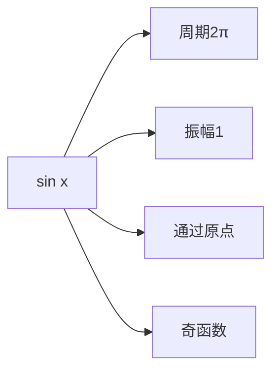
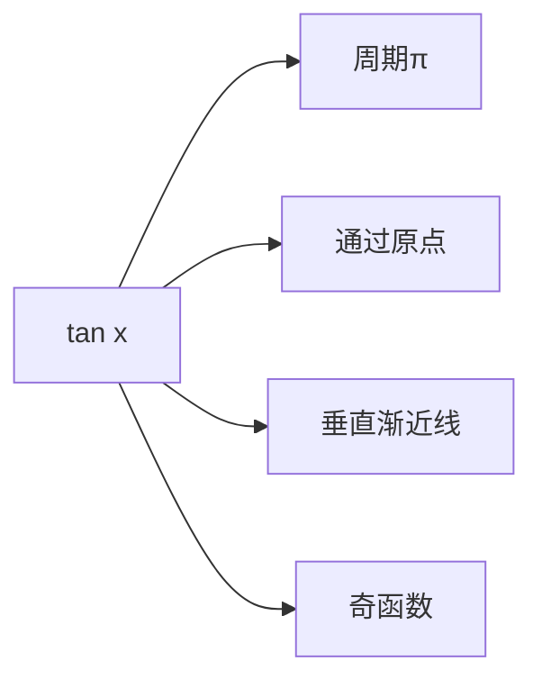
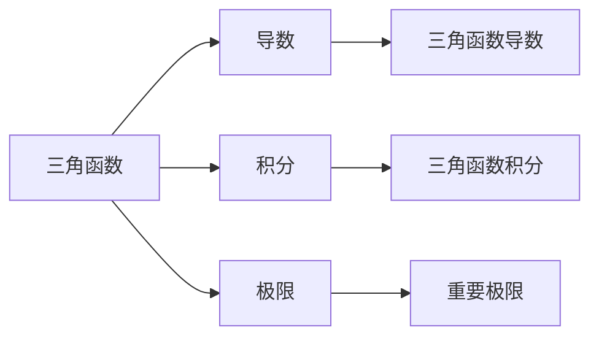

# 1.3 三角函数 | Trigonometric Functions

## 概述 | Overview

三角函数是数学中最重要的函数之一，在几何、物理、工程等领域有广泛应用。本章将系统介绍三角函数的定义、性质、图像、恒等式以及在实际问题中的应用。

## 1. 三角函数定义 | Definition of Trigonometric Functions

### 1.1 单位圆定义 | Unit Circle Definition

**单位圆**：以原点为圆心，半径为1的圆。

**三角函数定义**：
设点P(x, y)是单位圆上的一点，角θ的终边经过点P，则：

- **正弦函数**：$\sin\theta = y$
- **余弦函数**：$\cos\theta = x$
- **正切函数**：$\tan\theta = \frac{y}{x} = \frac{\sin\theta}{\cos\theta}$
- **余切函数**：$\cot\theta = \frac{x}{y} = \frac{\cos\theta}{\sin\theta}$
- **正割函数**：$\sec\theta = \frac{1}{x} = \frac{1}{\cos\theta}$
- **余割函数**：$\csc\theta = \frac{1}{y} = \frac{1}{\sin\theta}$

### 1.2 直角三角形定义 | Right Triangle Definition

在直角三角形中，设角A为锐角：

- **正弦**：$\sin A = \frac{\text{对边}}{\text{斜边}} = \frac{a}{c}$
- **余弦**：$\cos A = \frac{\text{邻边}}{\text{斜边}} = \frac{b}{c}$
- **正切**：$\tan A = \frac{\text{对边}}{\text{邻边}} = \frac{a}{b}$

### 1.3 角度与弧度 | Degrees and Radians

**角度制**：以度为单位，1周角 = 360°

**弧度制**：以弧度为单位，1周角 = 2π弧度

**转换关系**：

- $1° = \frac{\pi}{180}$ 弧度
- $1 \text{弧度} = \frac{180°}{\pi} \approx 57.3°$

**常用角度转换**：

- 30° = $\frac{\pi}{6}$ 弧度
- 45° = $\frac{\pi}{4}$ 弧度
- 60° = $\frac{\pi}{3}$ 弧度
- 90° = $\frac{\pi}{2}$ 弧度
- 180° = π 弧度
- 360° = 2π 弧度

## 2. 三角函数性质 | Properties of Trigonometric Functions

### 2.1 基本性质 | Basic Properties

**定义域与值域**：

| 函数 | 定义域 | 值域 |
|------|--------|------|
| sin x | R | [-1, 1] |
| cos x | R | [-1, 1] |
| tan x | R\{$\frac{\pi}{2} + k\pi$} | R |
| cot x | R\{kπ} | R |
| sec x | R\{$\frac{\pi}{2} + k\pi$} | (-∞, -1] ∪ [1, +∞) |
| csc x | R\{kπ} | (-∞, -1] ∪ [1, +∞) |

**奇偶性**：

- **奇函数**：sin x, tan x, cot x, csc x
- **偶函数**：cos x, sec x

### 2.2 周期性 | Periodicity

**周期**：

- sin x, cos x, sec x, csc x：周期为2π
- tan x, cot x：周期为π

**周期函数性质**：

- $f(x + T) = f(x)$，其中T为周期
- 如果T是周期，则kT（k为正整数）也是周期

### 2.3 单调性 | Monotonicity

**基本周期内的单调性**：

**sin x**：

- 在$[-\frac{\pi}{2}, \frac{\pi}{2}]$上递增
- 在$[\frac{\pi}{2}, \frac{3\pi}{2}]$上递减

**cos x**：

- 在[0, π]上递减
- 在[π, 2π]上递增

**tan x**：

- 在$(-\frac{\pi}{2}, \frac{\pi}{2})$上递增

## 3. 三角函数图像 | Graphs of Trigonometric Functions

### 3.1 基本三角函数图像 | Basic Trigonometric Function Graphs

**正弦函数图像**：



**余弦函数图像**：

```mermaid
graph LR
    A[cos x] --> B[周期2π]
    A --> C[振幅1]
    A --> D[通过点(0,1)]
    A --> E[偶函数]
```

**正切函数图像**：



### 3.2 图像变换 | Graph Transformations

**一般形式**：$y = A\sin(B(x - C)) + D$

**参数含义**：

- **A**：振幅（垂直伸缩）
- **B**：角频率（水平伸缩）
- **C**：相位移动（水平平移）
- **D**：垂直平移

**周期计算**：$T = \frac{2\pi}{|B|}$

**例**：分析函数$y = 2\sin(3x - \frac{\pi}{6}) + 1$

**解**：

- 振幅：2
- 周期：$\frac{2\pi}{3}$
- 相位移动：$\frac{\pi}{18}$（向右）
- 垂直平移：向上1个单位

### 3.3 反三角函数 | Inverse Trigonometric Functions

**定义**：

- **反正弦**：$y = \arcsin x$，定义域[-1, 1]，值域$[-\frac{\pi}{2}, \frac{\pi}{2}]$
- **反余弦**：$y = \arccos x$，定义域[-1, 1]，值域[0, π]
- **反正切**：$y = \arctan x$，定义域R，值域$(-\frac{\pi}{2}, \frac{\pi}{2})$

**性质**：

- 都是单调函数
- 与对应三角函数互为反函数
- 图像关于y = x对称

## 4. 三角函数恒等式 | Trigonometric Identities

### 4.1 基本恒等式 | Basic Identities

**倒数关系**：

- $\csc x = \frac{1}{\sin x}$
- $\sec x = \frac{1}{\cos x}$
- $\cot x = \frac{1}{\tan x}$

**商数关系**：

- $\tan x = \frac{\sin x}{\cos x}$
- $\cot x = \frac{\cos x}{\sin x}$

**平方关系**：

- $\sin^2 x + \cos^2 x = 1$
- $1 + \tan^2 x = \sec^2 x$
- $1 + \cot^2 x = \csc^2 x$

### 4.2 和差公式 | Sum and Difference Formulas

**正弦和差公式**：

- $\sin(A + B) = \sin A \cos B + \cos A \sin B$
- $\sin(A - B) = \sin A \cos B - \cos A \sin B$

**余弦和差公式**：

- $\cos(A + B) = \cos A \cos B - \sin A \sin B$
- $\cos(A - B) = \cos A \cos B + \sin A \sin B$

**正切和差公式**：

- $\tan(A + B) = \frac{\tan A + \tan B}{1 - \tan A \tan B}$
- $\tan(A - B) = \frac{\tan A - \tan B}{1 + \tan A \tan B}$

### 4.3 倍角公式 | Double Angle Formulas

**正弦倍角公式**：

- $\sin(2A) = 2\sin A \cos A$

**余弦倍角公式**：

- $\cos(2A) = \cos^2 A - \sin^2 A = 2\cos^2 A - 1 = 1 - 2\sin^2 A$

**正切倍角公式**：

- $\tan(2A) = \frac{2\tan A}{1 - \tan^2 A}$

### 4.4 半角公式 | Half Angle Formulas

**正弦半角公式**：

- $\sin(\frac{A}{2}) = \pm\sqrt{\frac{1 - \cos A}{2}}$

**余弦半角公式**：

- $\cos(\frac{A}{2}) = \pm\sqrt{\frac{1 + \cos A}{2}}$

**正切半角公式**：

- $\tan(\frac{A}{2}) = \frac{\sin A}{1 + \cos A} = \frac{1 - \cos A}{\sin A}$

### 4.5 积化和差公式 | Product-to-Sum Formulas

- $\sin A \cos B = \frac{1}{2}[\sin(A + B) + \sin(A - B)]$
- $\cos A \cos B = \frac{1}{2}[\cos(A + B) + \cos(A - B)]$
- $\sin A \sin B = \frac{1}{2}[\cos(A - B) - \cos(A + B)]$

### 4.6 和差化积公式 | Sum-to-Product Formulas

- $\sin A + \sin B = 2\sin(\frac{A + B}{2})\cos(\frac{A - B}{2})$
- $\sin A - \sin B = 2\cos(\frac{A + B}{2})\sin(\frac{A - B}{2})$
- $\cos A + \cos B = 2\cos(\frac{A + B}{2})\cos(\frac{A - B}{2})$
- $\cos A - \cos B = -2\sin(\frac{A + B}{2})\sin(\frac{A - B}{2})$

## 5. 解三角形 | Solving Triangles

### 5.1 正弦定理 | Law of Sines

**正弦定理**：
$$\frac{a}{\sin A} = \frac{b}{\sin B} = \frac{c}{\sin C} = 2R$$
其中R为外接圆半径。

**应用**：

- 已知两角一边，求其他边角
- 已知两边一对角，求其他边角

### 5.2 余弦定理 | Law of Cosines

**余弦定理**：

- $a^2 = b^2 + c^2 - 2bc\cos A$
- $b^2 = a^2 + c^2 - 2ac\cos B$
- $c^2 = a^2 + b^2 - 2ab\cos C$

**应用**：

- 已知三边，求角
- 已知两边夹角，求第三边

### 5.3 面积公式 | Area Formulas

**基本面积公式**：

- $S = \frac{1}{2}bh$（底边高）
- $S = \frac{1}{2}ab\sin C$（两边夹角）
- $S = \frac{abc}{4R}$（三边外接圆半径）
- $S = rs$（内切圆半径）

**海伦公式**：
$$S = \sqrt{s(s-a)(s-b)(s-c)}$$
其中$s = \frac{a + b + c}{2}$为半周长。

## 6. 三角函数应用 | Applications of Trigonometric Functions

### 6.1 物理学应用 | Physics Applications

**简谐振动**：
质点做简谐振动，位移函数为：
$$x(t) = A\cos(\omega t + \phi)$$
其中A为振幅，ω为角频率，φ为初相位。

**周期**：$T = \frac{2\pi}{\omega}$
**频率**：$f = \frac{1}{T} = \frac{\omega}{2\pi}$

**例**：弹簧振子的振动
弹簧振子的位移函数为$x(t) = 0.1\cos(10t)$，求：

1. 振幅和周期
2. t = 0.5s时的位移

**解**：

1. 振幅A = 0.1m，周期$T = \frac{2\pi}{10} = 0.628s$
2. $x(0.5) = 0.1\cos(5) \approx -0.087m$

### 6.2 几何应用 | Geometry Applications

**例1：测量高度**
在距离建筑物100m处，测得仰角为30°，求建筑物高度。

**解**：

- 设高度为h
- $\tan 30° = \frac{h}{100}$
- $h = 100\tan 30° = 100 \cdot \frac{\sqrt{3}}{3} \approx 57.7m$

**例2：航海问题**
一艘船从A点出发，向东北方向航行50海里到达B点，然后向正北方向航行30海里到达C点，求A到C的距离。

**解**：

- 设A到C的距离为d
- 使用余弦定理：
- $d^2 = 50^2 + 30^2 - 2 \cdot 50 \cdot 30 \cos 135°$
- $d^2 = 2500 + 900 + 3000 \cdot \frac{\sqrt{2}}{2}$
- $d \approx 74.2$海里

### 6.3 工程应用 | Engineering Applications

**例1：桥梁设计**
某桥梁的拱形结构可以用函数$y = 20\sin(\frac{\pi x}{100})$表示，其中x为水平距离（米），y为高度（米）。求：

1. 拱的最大高度
2. 拱的跨度

**解**：

1. 最大高度：20米
2. 跨度：200米（一个完整周期）

**例2：交流电路**
交流电压函数为$V(t) = 220\sqrt{2}\sin(100\pi t)$，求：

1. 有效电压
2. 频率

**解**：

1. 有效电压：220V
2. 频率：$f = \frac{100\pi}{2\pi} = 50Hz$

## 7. 三角函数方程 | Trigonometric Equations

### 7.1 基本三角函数方程 | Basic Trigonometric Equations

**sin x = a的解**：

- 如果|a| ≤ 1，则$x = \arcsin a + 2k\pi$ 或 $x = \pi - \arcsin a + 2k\pi$
- 如果|a| > 1，则无解

**cos x = a的解**：

- 如果|a| ≤ 1，则$x = \arccos a + 2k\pi$ 或 $x = -\arccos a + 2k\pi$
- 如果|a| > 1，则无解

**tan x = a的解**：

- $x = \arctan a + k\pi$

### 7.2 复杂三角函数方程 | Complex Trigonometric Equations

**例1**：解方程$2\sin^2 x - 3\sin x + 1 = 0$

**解**：

- 设y = sin x，则$2y^2 - 3y + 1 = 0$
- 解得$y = 1$ 或 $y = \frac{1}{2}$
- 当y = 1时，$x = \frac{\pi}{2} + 2k\pi$
- 当$y = \frac{1}{2}$时，$x = \frac{\pi}{6} + 2k\pi$ 或 $x = \frac{5\pi}{6} + 2k\pi$

**例2**：解方程$\sin x + \cos x = 1$

**解**：

- 使用和角公式：$\sin x + \cos x = \sqrt{2}\sin(x + \frac{\pi}{4})$
- 所以$\sqrt{2}\sin(x + \frac{\pi}{4}) = 1$
- $\sin(x + \frac{\pi}{4}) = \frac{1}{\sqrt{2}}$
- $x + \frac{\pi}{4} = \frac{\pi}{4} + 2k\pi$ 或 $x + \frac{\pi}{4} = \frac{3\pi}{4} + 2k\pi$
- $x = 2k\pi$ 或 $x = \frac{\pi}{2} + 2k\pi$

## 8. 知识关联 | Knowledge Connections

### 8.1 与微积分的关联 | Connections with Calculus



**重要导数**：

- $(\sin x)' = \cos x$
- $(\cos x)' = -\sin x$
- $(\tan x)' = \sec^2 x$

**重要积分**：

- $\int \sin x dx = -\cos x + C$
- $\int \cos x dx = \sin x + C$
- $\int \sec^2 x dx = \tan x + C$

### 8.2 与复数的关联 | Connections with Complex Numbers

**欧拉公式**：
$$e^{ix} = \cos x + i\sin x$$

**三角函数与复数的关系**：

- $\cos x = \frac{e^{ix} + e^{-ix}}{2}$
- $\sin x = \frac{e^{ix} - e^{-ix}}{2i}$

## 9. 习题与练习 | Exercises and Practice

### 9.1 基础练习 | Basic Exercises

1. **三角函数值计算**
   - 计算：$\sin 30°$, $\cos 45°$, $\tan 60°$
   - 计算：$\sin \frac{\pi}{6}$, $\cos \frac{\pi}{4}$, $\tan \frac{\pi}{3}$

2. **恒等式证明**
   - 证明：$\sin^2 x + \cos^2 x = 1$
   - 证明：$1 + \tan^2 x = \sec^2 x$

3. **图像分析**
   - 分析函数$y = 2\sin(x - \frac{\pi}{4})$的图像
   - 分析函数$y = \cos(2x + \frac{\pi}{3})$的图像

### 9.2 提高练习 | Advanced Exercises

1. **解三角形**
   - 在△ABC中，a = 5, b = 7, C = 60°，求c和面积
   - 在△ABC中，A = 30°, B = 45°, c = 10，求a和b

2. **三角函数方程**
   - 解方程：$2\sin^2 x - \sin x - 1 = 0$
   - 解方程：$\sin x + \cos x = \sqrt{2}$

3. **实际应用**
   - 某建筑物的影子长度为20m，太阳高度角为30°，求建筑物高度
   - 某交流电压为$V(t) = 110\sqrt{2}\sin(120\pi t)$，求有效电压和频率

### 9.3 竞赛练习 | Competition Exercises

1. **综合应用**
   - 证明：对于任意实数x，有$|\sin x| \leq |x|$
   - 求函数$f(x) = \sin x + \cos x$的最大值和最小值

2. **复杂问题**
   - 在△ABC中，证明：$\frac{a}{\sin A} = \frac{b}{\sin B} = \frac{c}{\sin C} = 2R$
   - 证明：$\sin A + \sin B + \sin C \leq \frac{3\sqrt{3}}{2}$（在锐角三角形中）

## 总结 | Summary

三角函数是数学中最重要的函数之一，通过系统学习：

1. **基本概念**：理解三角函数的定义和基本性质
2. **图像分析**：掌握三角函数图像的绘制和分析
3. **恒等式**：熟练运用各种三角恒等式
4. **实际应用**：能够将三角函数应用于实际问题
5. **解三角形**：掌握正弦定理、余弦定理等解三角形的方法

这些知识和技能为后续的微积分学习和其他数学分支奠定了坚实的基础。

---

*三角函数是连接代数与几何的重要桥梁，掌握好这些内容，将为数学学习的深入发展提供强有力的支撑。*
