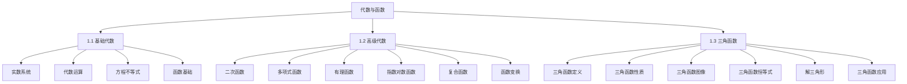
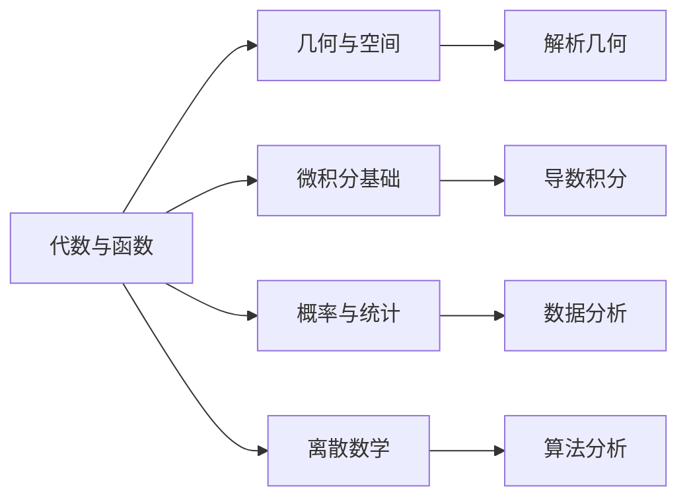

# 1. 代数与函数 | Algebra and Functions

## 模块概述 | Module Overview

代数与函数是高中数学的核心模块，为整个数学体系奠定基础。本模块系统介绍从基础代数到高级函数的所有重要内容，包括实数系统、代数运算、方程不等式、函数概念、三角函数等。

## 模块结构 | Module Structure

## 学习目标 | Learning Objectives

### 1.1 基础代数学习目标

**知识目标**：

- 理解实数系统的结构和性质
- 掌握代数运算的基本法则
- 熟练解各种类型的方程和不等式
- 理解函数的基本概念和性质

**能力目标**：

- 能够进行复杂的代数运算
- 能够分析函数的基本性质
- 能够解决实际应用问题
- 能够建立数学模型

### 1.2 高级代数学习目标

**知识目标**：

- 掌握二次函数的性质和应用
- 理解多项式函数的特征
- 掌握有理函数的分析方法
- 熟练运用指数对数函数
- 理解复合函数和函数变换

**能力目标**：

- 能够分析复杂函数的性质
- 能够进行函数变换和图像分析
- 能够解决函数相关的实际问题
- 能够建立复杂的数学模型

### 1.3 三角函数学习目标

**知识目标**：

- 理解三角函数的定义和性质
- 掌握三角函数的基本恒等式
- 理解三角函数的图像特征
- 掌握解三角形的方法

**能力目标**：

- 能够进行三角函数的计算
- 能够分析三角函数的图像
- 能够解决几何和物理问题
- 能够应用三角函数解决实际问题

## 知识关联 | Knowledge Connections

### 与后续模块的关联

### 跨学科应用

**物理学应用**：

- 运动学公式中的函数关系
- 力学计算中的代数运算
- 波动现象中的三角函数

**经济学应用**：

- 成本收益分析中的函数模型
- 供需关系中的代数方程
- 复利计算中的指数函数

**工程学应用**：

- 电路分析中的三角函数
- 结构设计中的函数优化
- 信号处理中的函数变换

## 学习路径 | Learning Path

### 第一阶段：基础代数

1. **实数系统**：理解实数的分类和性质
2. **代数运算**：掌握多项式运算和因式分解
3. **方程不等式**：熟练解各种方程和不等式
4. **函数基础**：理解函数概念和基本性质

### 第二阶段：高级代数

1. **二次函数**：掌握二次函数的性质和应用
2. **多项式函数**：理解多项式函数的特征
3. **有理函数**：掌握有理函数的分析方法
4. **指数对数**：熟练运用指数对数函数
5. **复合函数**：理解复合函数和函数变换

### 第三阶段：三角函数

1. **三角函数定义**：理解三角函数的定义
2. **三角函数性质**：掌握三角函数的基本性质
3. **三角函数图像**：理解三角函数的图像特征
4. **三角函数恒等式**：掌握各种三角恒等式
5. **解三角形**：掌握解三角形的方法
6. **三角函数应用**：应用三角函数解决实际问题

## 重点难点 | Key Points and Difficulties

### 重点内容

1. **函数概念**：理解函数的定义和表示方法
2. **函数性质**：掌握函数的单调性、奇偶性、周期性
3. **函数图像**：能够绘制和分析函数图像
4. **方程求解**：熟练解各种类型的方程
5. **三角函数**：掌握三角函数的基本性质和应用

### 难点分析

1. **抽象思维**：函数概念的抽象性
2. **符号运算**：复杂的代数运算
3. **图像分析**：函数图像的绘制和分析
4. **实际应用**：将数学知识应用于实际问题
5. **综合运用**：多个知识点的综合应用

## 学习方法 | Learning Methods

### 1. 概念理解

- **多角度理解**：从不同角度理解数学概念
- **实例分析**：通过具体实例理解抽象概念
- **类比学习**：通过类比加深理解

### 2. 技能训练

- **大量练习**：通过大量练习掌握基本技能
- **逐步提高**：从简单到复杂逐步提高
- **错误分析**：分析错误原因，避免重复

### 3. 应用实践

- **实际问题**：解决实际应用问题
- **建模训练**：建立数学模型
- **跨学科应用**：在其他学科中应用数学知识

## 评价标准 | Assessment Criteria

### 知识掌握

- **概念理解**：准确理解数学概念
- **公式运用**：熟练运用数学公式
- **定理应用**：正确应用数学定理

### 技能运用

- **计算能力**：准确进行数学计算
- **推理能力**：进行逻辑推理
- **分析能力**：分析数学问题

### 应用能力

- **建模能力**：建立数学模型
- **解决问题**：解决实际问题
- **创新思维**：运用创新思维解决问题

## 资源推荐 | Resource Recommendations

### 教材资源

- **基础教材**：高中数学教材
- **提高教材**：数学竞赛教材
- **参考书籍**：数学参考书

### 在线资源

- **教学视频**：在线教学视频
- **练习题库**：在线练习题库
- **互动平台**：数学学习平台

### 实践资源

- **实验软件**：数学软件
- **模拟工具**：数学模拟工具
- **竞赛平台**：数学竞赛平台

## 总结 | Summary

代数与函数模块是高中数学的核心内容，通过系统学习：

1. **建立数学基础**：为后续数学学习奠定基础
2. **培养数学思维**：培养抽象思维和逻辑推理能力
3. **掌握数学工具**：掌握解决数学问题的基本工具
4. **提高应用能力**：提高数学知识的应用能力

这些知识和技能为学生的数学学习和未来发展提供了强有力的支撑。

---

*代数与函数是数学大厦的基石，掌握好这些内容，将为数学学习的深入发展提供坚实的基础。*
