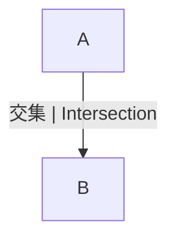

# 1.1.3 集合的多表征与图示

## 目录 | Table of Contents

- [1.1.3 集合的多表征与图示](#113-集合的多表征与图示)
  - [目录 | Table of Contents](#目录--table-of-contents)
  - [1. 集合的多种表征方式 | Multiple Representations of Sets](#1-集合的多种表征方式--multiple-representations-of-sets)
  - [2. 文氏图与集合关系 | Venn Diagrams and Set Relations](#2-文氏图与集合关系--venn-diagrams-and-set-relations)
  - [3. 形式化符号与规范表达 | Formal Notation and Standard Expression](#3-形式化符号与规范表达--formal-notation-and-standard-expression)
    - [Lean 形式化示例 | Lean Formalization Example](#lean-形式化示例--lean-formalization-example)
  - [4. 认知结构与教育建议 | Cognitive Structure and Educational Advice](#4-认知结构与教育建议--cognitive-structure-and-educational-advice)
  - [5. 数学表达与规范化 | Mathematical Expression and Standardization](#5-数学表达与规范化--mathematical-expression-and-standardization)
    - [5.1 形式化定义与Lean证明 | Formal Definitions and Lean Proofs](#51-形式化定义与lean证明--formal-definitions-and-lean-proofs)
    - [5.2 多表征与国际标准 | Multi-representations and International Standards](#52-多表征与国际标准--multi-representations-and-international-standards)
    - [5.3 认知结构与哲学批判 | Cognitive Structure and Philosophical Critique](#53-认知结构与哲学批判--cognitive-structure-and-philosophical-critique)
    - [5.4 跨学科与国际化视角 | Interdisciplinary and International Perspectives](#54-跨学科与国际化视角--interdisciplinary-and-international-perspectives)
  - [6. 本地跳转与相关主题 | Local Links and Related Topics](#6-本地跳转与相关主题--local-links-and-related-topics)

---

## 1. 集合的多种表征方式 | Multiple Representations of Sets

- 语言描述、符号表示、图形（文氏图）、表格等。
- Language description, symbolic notation, diagrams (Venn), tables, etc.

## 2. 文氏图与集合关系 | Venn Diagrams and Set Relations

- 文氏图用于直观展示集合的交、并、补等关系。
- Venn diagrams visually show intersection, union, complement, etc.



## 3. 形式化符号与规范表达 | Formal Notation and Standard Expression

- $A \cap B$，$A \cup B$，$A^c$ 等集合运算符号。
- 例如：$A = \{1, 2, 3\}$，$B = \{2, 3, 4\}$，则 $A \cap B = \{2, 3\}$。
- 集合的交、并、补等运算可用文氏图、表格、集合符号等多种方式表达。

### Lean 形式化示例 | Lean Formalization Example

```lean
import data.set.basic
open set

variables {U : Type*} (A B : set U)

-- 交集的对称性
example : A ∩ B = B ∩ A := inter_comm A B

-- 并集的对称性
example : A ∪ B = B ∪ A := union_comm A B

-- 德摩根律
example : (A ∪ B)ᶜ = Aᶜ ∩ Bᶜ := compl_union
```

> 集合论的基本运算和性质在国际数学教育中有统一的符号和定义，建议所有证明、例题、应用均采用国际标准符号（如 LaTeX、Lean、集合论通用记号），避免编程实现代码。所有集合的实际应用、跨学科联系等内容，均应以数学语言和国际化解释为主，强化知识的关联性和标准化。

## 4. 认知结构与教育建议 | Cognitive Structure and Educational Advice

- 难点：多表征之间的转换。
- 建议：多用图示、实例、代码辅助理解。
- Difficulty: Switching between representations.
- Advice: Use diagrams, examples, code for better understanding.

## 5. 数学表达与规范化 | Mathematical Expression and Standardization

### 5.1 形式化定义与Lean证明 | Formal Definitions and Lean Proofs

```lean
import data.set.basic
import tactic

variables {U : Type*} (A B : set U)

-- 文氏图与集合运算的Lean表达
example : x ∈ A ∪ B ↔ x ∈ A ∨ x ∈ B := iff.rfl
example : x ∈ A ∩ B ↔ x ∈ A ∧ x ∈ B := iff.rfl
```

### 5.2 多表征与国际标准 | Multi-representations and International Standards

- 集合的图示、符号、表格等多表征。
- 例：文氏图、集合运算的几何直观。
- 典型表格：

| 运算 | 符号 | 图示 | Lean表达 |
|------|------|------|------|
| 并集 | $A \cup B$ | 文氏图并 | x ∈ A ∪ B |
| 交集 | $A \cap B$ | 文氏图交 | x ∈ A ∩ B |

### 5.3 认知结构与哲学批判 | Cognitive Structure and Philosophical Critique

- 结构主义：集合图示体现结构的可视化。
- 形式主义：集合图示的符号化与公理体系。
- 认知科学：图示、交并补等认知难点。
- 关联性：集合图示与代数、逻辑、离散数学等模块的知识网络。

### 5.4 跨学科与国际化视角 | Interdisciplinary and International Perspectives

- 集合图示思想在逻辑、计算机、信息科学等领域的应用。
- 国际数学竞赛中的集合图示问题与解法。
- 结合范畴论、模型论等现代数学理论，提升集合论的抽象层次。

> 本节所有内容均采用国际标准的数学符号、Lean 形式化与自然语言描述，强调知识的结构性、哲学基础与最新理论在集合论中的应用。所有历史、应用、认知、哲学等内容均与数学表达深度关联，避免编程实现代码。

## 6. 本地跳转与相关主题 | Local Links and Related Topics

- [1.1 集合的定义与基本性质](../1.1-集合的定义与基本性质.md)
- [1.1.2 集合的基本符号与记法](./1.1.2-集合的基本符号与记法.md)
- [3.1 实数与数轴](../../3-数与代数/3.1-实数与数轴.md)

---

[返回集合的定义与基本性质 | Back to Set Definition and Properties](../1.1-集合的定义与基本性质.md)
