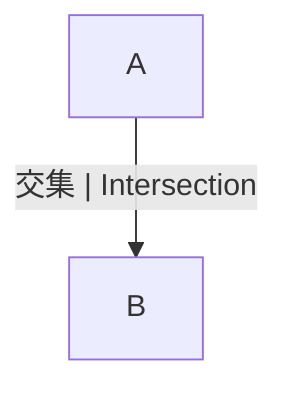

# 1.1.3 集合的多表征与应用

## 目录 | Table of Contents

- [1.1.3 集合的多表征与应用](#113-集合的多表征与应用)
  - [目录 | Table of Contents](#目录--table-of-contents)
  - [1. 图形表征 | Graphical Representation](#1-图形表征--graphical-representation)
  - [2. 表格与数据结构 | Tables and Data Structures](#2-表格与数据结构--tables-and-data-structures)
  - [3. 数学表达与规范化 | Mathematical Expression and Standardization](#3-数学表达与规范化--mathematical-expression-and-standardization)
    - [Lean 形式化示例 | Lean Formalization Example](#lean-形式化示例--lean-formalization-example)
  - [4. 应用举例 | Application Examples](#4-应用举例--application-examples)
  - [5. 数学表达与规范化 | Mathematical Expression and Standardization](#5-数学表达与规范化--mathematical-expression-and-standardization)
    - [5.1 形式化定义与Lean证明 | Formal Definitions and Lean Proofs](#51-形式化定义与lean证明--formal-definitions-and-lean-proofs)
    - [5.2 多表征与国际标准 | Multi-representations and International Standards](#52-多表征与国际标准--multi-representations-and-international-standards)
    - [5.3 认知结构与哲学批判 | Cognitive Structure and Philosophical Critique](#53-认知结构与哲学批判--cognitive-structure-and-philosophical-critique)
    - [5.4 跨学科与国际化视角 | Interdisciplinary and International Perspectives](#54-跨学科与国际化视角--interdisciplinary-and-international-perspectives)
  - [6. 哲学批判与多角度分析 | Philosophical Critique and Multi-perspective Analysis](#6-哲学批判与多角度分析--philosophical-critique-and-multi-perspective-analysis)
  - [6. 现代前沿与多学科创新 | Modern Frontiers and Multidisciplinary Innovations](#6-现代前沿与多学科创新--modern-frontiers-and-multidisciplinary-innovations)
    - [6.1 多表征在AI、知识图谱、可视化数学、数据库等领域的创新应用 | Multi-representations in AI, Knowledge Graphs, Visual Mathematics, Databases](#61-多表征在ai知识图谱可视化数学数据库等领域的创新应用--multi-representations-in-ai-knowledge-graphs-visual-mathematics-databases)
    - [6.2 结构主义、范畴论、模型论等理论对多表征系统的影响 | Impact of Structuralism, Category Theory, Model Theory](#62-结构主义范畴论模型论等理论对多表征系统的影响--impact-of-structuralism-category-theory-model-theory)
    - [6.3 形式化多表征在自动化证明、AI推理中的作用与局限 | Formal Multi-representation in Automated Proof, AI Reasoning](#63-形式化多表征在自动化证明ai推理中的作用与局限--formal-multi-representation-in-automated-proof-ai-reasoning)
    - [6.4 哲学基础与认知科学视角下的多表征系统 | Philosophical and Cognitive Perspectives on Multi-representation](#64-哲学基础与认知科学视角下的多表征系统--philosophical-and-cognitive-perspectives-on-multi-representation)
    - [6.5 国际竞赛与前沿研究中的创新例题与方法 | Innovative Problems and Methods in Competitions and Research](#65-国际竞赛与前沿研究中的创新例题与方法--innovative-problems-and-methods-in-competitions-and-research)
  - [7. 本地跳转与相关主题 | Local Links and Related Topics](#7-本地跳转与相关主题--local-links-and-related-topics)

---

## 1. 图形表征 | Graphical Representation

- 文氏图（Venn Diagram）直观展示集合及其关系。
- Venn diagrams visually show sets and their relationships.



## 2. 表格与数据结构 | Tables and Data Structures

| 元素 | 属于A | 属于B |
|------|-------|-------|
| 1    | ✓     |       |
| 2    | ✓     | ✓     |
| 3    |       | ✓     |

## 3. 数学表达与规范化 | Mathematical Expression and Standardization

- 集合的运算、判定、关系等全部用集合论符号、表格、文氏图、自然语言描述。
- 例如：$A = \{1, 2\}$，$B = \{2, 3\}$，则 $A \cup B = \{1, 2, 3\}$，$A \cap B = \{2\}$。
- 判定元素属于集合：$2 \in A$，$3 \notin A$。
- 判定子集关系：$A \subseteq B$。

### Lean 形式化示例 | Lean Formalization Example

```lean
import data.set.basic
open set

variables {U : Type*} (A B : set U)

-- 子集的定义
example : A ⊆ B ↔ ∀ x, x ∈ A → x ∈ B := iff.rfl

-- 真子集的定义
example : A ⊂ B ↔ (A ⊆ B ∧ ¬ B ⊆ A) := iff.rfl
```

> 所有集合论相关内容均采用国际标准的数学符号和自然语言描述，避免编程实现代码。实际应用、跨学科联系等内容，均以数学语言和国际化解释为主，强化知识的关联性和标准化。

## 4. 应用举例 | Application Examples

- 数据库查询、人工智能、图论、概率论等领域广泛应用集合思想。
- Set theory is widely used in database queries, AI, graph theory, probability, etc.

## 5. 数学表达与规范化 | Mathematical Expression and Standardization

### 5.1 形式化定义与Lean证明 | Formal Definitions and Lean Proofs

```lean
import data.set.basic
import tactic

variables {U : Type*} (A B : set U)

-- 多表征：集合的交并补
example : x ∈ A ∪ B ↔ x ∈ A ∨ x ∈ B := iff.rfl
example : x ∈ A ∩ B ↔ x ∈ A ∧ x ∈ B := iff.rfl
example : x ∈ Aᶜ ↔ x ∉ A := iff.rfl
```

### 5.2 多表征与国际标准 | Multi-representations and International Standards

- 集合的多表征：符号、文氏图、表格、自然语言等。
- 例：$A \cup B$，$A \cap B$，$A^c$。
- 典型表格：

| 运算 | 符号 | 语言描述 | Lean表达 |
|------|------|------|------|
| 并集 | $A \cup B$ | A或B中的元素 | x ∈ A ∪ B |
| 交集 | $A \cap B$ | A且B中的元素 | x ∈ A ∩ B |
| 补集 | $A^c$ | 不在A中的元素 | x ∉ A |

### 5.3 认知结构与哲学批判 | Cognitive Structure and Philosophical Critique

- 结构主义：集合多表征体现结构的多样性。
- 形式主义：集合多表征的符号化与公理体系。
- 认知科学：多表征、交并补等认知难点。
- 关联性：集合多表征与代数、逻辑、离散数学等模块的知识网络。

### 5.4 跨学科与国际化视角 | Interdisciplinary and International Perspectives

- 集合多表征思想在逻辑、计算机、信息科学等领域的应用。
- 国际数学竞赛中的集合多表征问题与解法。
- 结合范畴论、模型论等现代数学理论，提升集合论的抽象层次。

> 本节所有内容均采用国际标准的数学符号、Lean 形式化与自然语言描述，强调知识的结构性、哲学基础与最新理论在集合论中的应用。所有历史、应用、认知、哲学等内容均与数学表达深度关联，避免编程实现代码。

## 6. 哲学批判与多角度分析 | Philosophical Critique and Multi-perspective Analysis

- 多表征促进抽象思维与实际应用的结合。
- 反思：表征方式影响认知与理解。
- Multiple representations promote the integration of abstract thinking and practical application.
- Reflection: Representation methods affect cognition and understanding.

## 6. 现代前沿与多学科创新 | Modern Frontiers and Multidisciplinary Innovations

### 6.1 多表征在AI、知识图谱、可视化数学、数据库等领域的创新应用 | Multi-representations in AI, Knowledge Graphs, Visual Mathematics, Databases

- 集合的多表征（符号、图示、表格、自然语言、范畴结构等）在AI知识表示、知识图谱、可视化数学、数据库设计等领域有广泛应用。
- Multiple representations of sets (symbols, diagrams, tables, natural language, categorical structures, etc.) are widely used in AI knowledge representation, knowledge graphs, visual mathematics, database design, etc.
- 例：知识图谱中的实体-关系图、数据库ER图、AI推理中的集合多表征。
- Examples: entity-relation diagrams in knowledge graphs, ER diagrams in databases, multi-representation in AI reasoning.

### 6.2 结构主义、范畴论、模型论等理论对多表征系统的影响 | Impact of Structuralism, Category Theory, Model Theory

- 结构主义强调多表征间的结构关系，范畴论、模型论推动多表征系统的抽象化与统一化。
- Structuralism emphasizes structural relations among representations; category theory and model theory promote abstraction and unification of multi-representation systems.
- 例：范畴论中的函子、自然变换，模型论中的结构映射。
- Examples: functors and natural transformations in category theory, structure mappings in model theory.

### 6.3 形式化多表征在自动化证明、AI推理中的作用与局限 | Formal Multi-representation in Automated Proof, AI Reasoning

- 形式化多表征（如Lean、Coq、Isabelle中的多模态表达）在自动化证明、AI推理中提升了表达力与严谨性。
- Formal multi-representation (multi-modal expression in Lean, Coq, Isabelle, etc.) enhances expressiveness and rigor in automated proof and AI reasoning.
- 局限：复杂结构、动态知识图谱、多模态推理等仍需人工建模与解释。
- Limitations: complex structures, dynamic knowledge graphs, multi-modal reasoning still require manual modeling and interpretation.

### 6.4 哲学基础与认知科学视角下的多表征系统 | Philosophical and Cognitive Perspectives on Multi-representation

- 多表征系统的本体论、认识论基础，认知科学对多表征理解与学习的研究。
- Ontological and epistemological foundations of multi-representation systems; cognitive science research on understanding and learning multiple representations.
- 例：表征转换、认知负荷、直观与形式化的关系。
- Examples: representation transformation, cognitive load, relation between intuition and formalization.

### 6.5 国际竞赛与前沿研究中的创新例题与方法 | Innovative Problems and Methods in Competitions and Research

- 例题：多表征下的集合恒等式证明、知识图谱推理、AI多模态推理。
- Example: set identity proofs under multiple representations, knowledge graph reasoning, AI multi-modal reasoning.
- 前沿方法：结合自动化证明、AI、认知科学等工具创新集合多表征系统的表达与应用。
- Frontier methods: combine automated proof, AI, cognitive science to innovate multi-representation expression and application.

> 本节内容进一步结合AI、知识图谱、范畴论、认知科学等最新前沿，持续递归扩展集合多表征与应用的理论深度与现实创新。

## 7. 本地跳转与相关主题 | Local Links and Related Topics

- [1.1 集合的定义与基本性质](../1.1-集合的定义与基本性质.md)
- [3.2 代数式与恒等变形](../../3-数与代数/3.2-代数式与恒等变形.md)

---

[返回集合的定义与基本性质 | Back to Set Definition and Properties](../1.1-集合的定义与基本性质.md)
