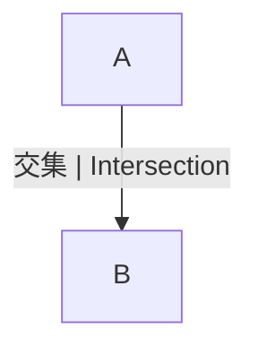

# 1.1.3 集合的多表征与应用

## 目录 | Table of Contents

- [1.1.3 集合的多表征与应用](#113-集合的多表征与应用)
  - [目录 | Table of Contents](#目录--table-of-contents)
  - [1. 图形表征 | Graphical Representation](#1-图形表征--graphical-representation)
  - [2. 表格与数据结构 | Tables and Data Structures](#2-表格与数据结构--tables-and-data-structures)
  - [3. 代码实现 | Code Implementation](#3-代码实现--code-implementation)
    - [3.1 Rust 示例 | Rust Example](#31-rust-示例--rust-example)
    - [3.2 Lean 示例 | Lean Example](#32-lean-示例--lean-example)
  - [4. 应用举例 | Application Examples](#4-应用举例--application-examples)
  - [5. 认知结构与教育建议 | Cognitive Structure and Educational Advice](#5-认知结构与教育建议--cognitive-structure-and-educational-advice)
  - [6. 哲学批判与多角度分析 | Philosophical Critique and Multi-perspective Analysis](#6-哲学批判与多角度分析--philosophical-critique-and-multi-perspective-analysis)
  - [7. 本地跳转与相关主题 | Local Links and Related Topics](#7-本地跳转与相关主题--local-links-and-related-topics)

---

## 1. 图形表征 | Graphical Representation

- 文氏图（Venn Diagram）直观展示集合及其关系。
- Venn diagrams visually show sets and their relationships.



## 2. 表格与数据结构 | Tables and Data Structures

| 元素 | 属于A | 属于B |
|------|-------|-------|
| 1    | ✓     |       |
| 2    | ✓     | ✓     |
| 3    |       | ✓     |

- Rust中可用HashSet、BTreeSet等实现集合。
- In Rust, sets can be implemented with HashSet, BTreeSet, etc.

## 3. 代码实现 | Code Implementation

### 3.1 Rust 示例 | Rust Example

```rust
use std::collections::HashSet;
let a: HashSet<i32> = [1, 2].iter().cloned().collect();
let b: HashSet<i32> = [2, 3].iter().cloned().collect();
let union: HashSet<_> = a.union(&b).cloned().collect();
let intersection: HashSet<_> = a.intersection(&b).cloned().collect();
```

### 3.2 Lean 示例 | Lean Example

```lean
import data.set.basic
open set
example : {1, 2} ∪ {2, 3} = {1, 2, 3} := rfl
example : {1, 2} ∩ {2, 3} = {2} := rfl
```

## 4. 应用举例 | Application Examples

- 数据库查询、人工智能、图论、概率论等领域广泛应用集合思想。
- Set theory is widely used in database queries, AI, graph theory, probability, etc.

## 5. 认知结构与教育建议 | Cognitive Structure and Educational Advice

- 难点：多表征的迁移与整合。
- 建议：多用图、表、代码、实际案例辅助理解。
- Difficulty: Transfer and integration of multiple representations.
- Advice: Use diagrams, tables, code, and real cases to aid understanding.

## 6. 哲学批判与多角度分析 | Philosophical Critique and Multi-perspective Analysis

- 多表征促进抽象思维与实际应用的结合。
- 反思：表征方式影响认知与理解。
- Multiple representations promote the integration of abstract thinking and practical application.
- Reflection: Representation methods affect cognition and understanding.

## 7. 本地跳转与相关主题 | Local Links and Related Topics

- [1.1 集合的定义与基本性质](../1.1-集合的定义与基本性质.md)
- [3.2 代数式与恒等变形](../../3-数与代数/3.2-代数式与恒等变形.md)

---

[返回集合的定义与基本性质 | Back to Set Definition and Properties](../1.1-集合的定义与基本性质.md)
