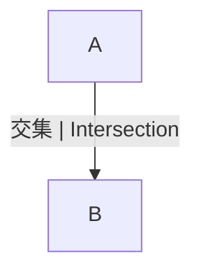

# 1.1.3 集合的多表征与应用

## 目录 | Table of Contents

- [1.1.3 集合的多表征与应用](#113-集合的多表征与应用)
  - [目录 | Table of Contents](#目录--table-of-contents)
  - [1. 图形表征 | Graphical Representation](#1-图形表征--graphical-representation)
  - [2. 表格与数据结构 | Tables and Data Structures](#2-表格与数据结构--tables-and-data-structures)
  - [3. 数学表达与规范化 | Mathematical Expression and Standardization](#3-数学表达与规范化--mathematical-expression-and-standardization)
    - [Lean 形式化示例 | Lean Formalization Example](#lean-形式化示例--lean-formalization-example)
  - [4. 应用举例 | Application Examples](#4-应用举例--application-examples)
  - [5. 认知结构与教育建议 | Cognitive Structure and Educational Advice](#5-认知结构与教育建议--cognitive-structure-and-educational-advice)
  - [6. 哲学批判与多角度分析 | Philosophical Critique and Multi-perspective Analysis](#6-哲学批判与多角度分析--philosophical-critique-and-multi-perspective-analysis)
  - [7. 本地跳转与相关主题 | Local Links and Related Topics](#7-本地跳转与相关主题--local-links-and-related-topics)

---

## 1. 图形表征 | Graphical Representation

- 文氏图（Venn Diagram）直观展示集合及其关系。
- Venn diagrams visually show sets and their relationships.



## 2. 表格与数据结构 | Tables and Data Structures

| 元素 | 属于A | 属于B |
|------|-------|-------|
| 1    | ✓     |       |
| 2    | ✓     | ✓     |
| 3    |       | ✓     |

## 3. 数学表达与规范化 | Mathematical Expression and Standardization

- 集合的运算、判定、关系等全部用集合论符号、表格、文氏图、自然语言描述。
- 例如：$A = \{1, 2\}$，$B = \{2, 3\}$，则 $A \cup B = \{1, 2, 3\}$，$A \cap B = \{2\}$。
- 判定元素属于集合：$2 \in A$，$3 \notin A$。
- 判定子集关系：$A \subseteq B$。

### Lean 形式化示例 | Lean Formalization Example

```lean
import data.set.basic
open set

variables {U : Type*} (A B : set U)

-- 子集的定义
example : A ⊆ B ↔ ∀ x, x ∈ A → x ∈ B := iff.rfl

-- 真子集的定义
example : A ⊂ B ↔ (A ⊆ B ∧ ¬ B ⊆ A) := iff.rfl
```

> 所有集合论相关内容均采用国际标准的数学符号和自然语言描述，避免编程实现代码。实际应用、跨学科联系等内容，均以数学语言和国际化解释为主，强化知识的关联性和标准化。

## 4. 应用举例 | Application Examples

- 数据库查询、人工智能、图论、概率论等领域广泛应用集合思想。
- Set theory is widely used in database queries, AI, graph theory, probability, etc.

## 5. 认知结构与教育建议 | Cognitive Structure and Educational Advice

- 难点：多表征的迁移与整合。
- 建议：多用图、表、代码、实际案例辅助理解。
- Difficulty: Transfer and integration of multiple representations.
- Advice: Use diagrams, tables, code, and real cases to aid understanding.

## 6. 哲学批判与多角度分析 | Philosophical Critique and Multi-perspective Analysis

- 多表征促进抽象思维与实际应用的结合。
- 反思：表征方式影响认知与理解。
- Multiple representations promote the integration of abstract thinking and practical application.
- Reflection: Representation methods affect cognition and understanding.

## 7. 本地跳转与相关主题 | Local Links and Related Topics

- [1.1 集合的定义与基本性质](../1.1-集合的定义与基本性质.md)
- [3.2 代数式与恒等变形](../../3-数与代数/3.2-代数式与恒等变形.md)

---

[返回集合的定义与基本性质 | Back to Set Definition and Properties](../1.1-集合的定义与基本性质.md)
