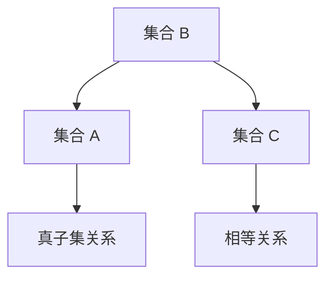

# 1.2 子集与集合运算

## 目录 | Table of Contents

- [1.2 子集与集合运算](#12-子集与集合运算)
  - [目录 | Table of Contents](#目录--table-of-contents)
  - [1. 子集的历史与发展 | History and Development of Subsets](#1-子集的历史与发展--history-and-development-of-subsets)
    - [1.1 早期发展 | Early Development](#11-早期发展--early-development)
    - [1.2 现代发展 | Modern Development](#12-现代发展--modern-development)
  - [2. 子集的基本定义 | Basic Definition of Subsets](#2-子集的基本定义--basic-definition-of-subsets)
    - [2.1 形式化定义 | Formal Definition](#21-形式化定义--formal-definition)
    - [2.2 子集的类型 | Types of Subsets](#22-子集的类型--types-of-subsets)
      - [2.2.1 真子集 | Proper Subset](#221-真子集--proper-subset)
      - [2.2.2 相等集合 | Equal Sets](#222-相等集合--equal-sets)
      - [2.2.3 空集 | Empty Set](#223-空集--empty-set)
  - [3. 子集的多表征 | Multiple Representations of Subsets](#3-子集的多表征--multiple-representations-of-subsets)
    - [3.1 符号表征 | Symbolic Representation](#31-符号表征--symbolic-representation)
    - [3.2 图形表征 | Graphical Representation](#32-图形表征--graphical-representation)
    - [3.3 文氏图表征 | Venn Diagram Representation](#33-文氏图表征--venn-diagram-representation)
    - [3.4 表格表征 | Tabular Representation](#34-表格表征--tabular-representation)
  - [4. 集合运算的类型与性质 | Types and Properties of Set Operations](#4-集合运算的类型与性质--types-and-properties-of-set-operations)
    - [4.1 基本运算 | Basic Operations](#41-基本运算--basic-operations)
      - [4.1.1 并集（Union）| Union](#411-并集union-union)
      - [4.1.2 交集（Intersection）| Intersection](#412-交集intersection-intersection)
      - [4.1.3 差集（Difference）| Difference](#413-差集difference-difference)
      - [4.1.4 补集（Complement）| Complement](#414-补集complement-complement)
    - [4.2 德摩根定律 | De Morgan's Laws](#42-德摩根定律--de-morgans-laws)
    - [4.3 分配律 | Distributive Laws](#43-分配律--distributive-laws)
  - [5. 集合运算的实际应用 | Real-world Applications of Set Operations](#5-集合运算的实际应用--real-world-applications-of-set-operations)
    - [5.1 数学应用 | Mathematical Applications](#51-数学应用--mathematical-applications)
    - [5.2 计算机科学应用 | Computer Science Applications](#52-计算机科学应用--computer-science-applications)
    - [5.3 社会科学应用 | Social Science Applications](#53-社会科学应用--social-science-applications)
  - [6. 形式化证明与代码示例 | Formal Proofs and Code Examples](#6-形式化证明与代码示例--formal-proofs-and-code-examples)
    - [6.1 形式化证明（Lean 示例） | Formal Proof (Lean Example)](#61-形式化证明lean-示例--formal-proof-lean-example)
    - [6.2 Rust 代码示例 | Rust Code Example](#62-rust-代码示例--rust-code-example)
  - [7. 认知结构与教育建议 | Cognitive Structure and Educational Advice](#7-认知结构与教育建议--cognitive-structure-and-educational-advice)
    - [7.1 学习难点 | Learning Difficulties](#71-学习难点--learning-difficulties)
    - [7.2 教学建议 | Teaching Suggestions](#72-教学建议--teaching-suggestions)
  - [8. 哲学批判与多角度分析 | Philosophical Critique and Multi-perspective Analysis](#8-哲学批判与多角度分析--philosophical-critique-and-multi-perspective-analysis)
    - [8.1 本体论问题 | Ontological Issues](#81-本体论问题--ontological-issues)
    - [8.2 认识论问题 | Epistemological Issues](#82-认识论问题--epistemological-issues)
    - [8.3 方法论意义 | Methodological Significance](#83-方法论意义--methodological-significance)
  - [9. 本地跳转与相关主题 | Local Links and Related Topics](#9-本地跳转与相关主题--local-links-and-related-topics)

---

## 1. 子集的历史与发展 | History and Development of Subsets

### 1.1 早期发展 | Early Development

- **古希腊**：欧几里得几何中的包含关系
- **中世纪**：逻辑学中的类包含概念
- **17-18世纪**：莱布尼茨对集合包含的研究

### 1.2 现代发展 | Modern Development

- **19世纪**：康托尔建立集合论，严格定义子集概念
- **20世纪**：策梅洛-弗兰克尔公理系统完善子集理论
- **当代**：在计算机科学、数据库等领域的广泛应用

## 2. 子集的基本定义 | Basic Definition of Subsets

### 2.1 形式化定义 | Formal Definition

若集合 $A$ 的任一元素都是集合 $B$ 的元素，则称 $A$ 是 $B$ 的子集，记作 $A \subseteq B$。

形式化表示为：$A \subseteq B \iff \forall x (x \in A \rightarrow x \in B)$

### 2.2 子集的类型 | Types of Subsets

#### 2.2.1 真子集 | Proper Subset

如果 $A \subseteq B$ 且 $A \neq B$，则称 $A$ 是 $B$ 的真子集，记作 $A \subset B$。

#### 2.2.2 相等集合 | Equal Sets

如果 $A \subseteq B$ 且 $B \subseteq A$，则称 $A$ 与 $B$ 相等，记作 $A = B$。

#### 2.2.3 空集 | Empty Set

空集 $\emptyset$ 是任意集合的子集。

## 3. 子集的多表征 | Multiple Representations of Subsets

### 3.1 符号表征 | Symbolic Representation

- **包含关系**：$A \subseteq B$
- **真包含关系**：$A \subset B$
- **相等关系**：$A = B$

### 3.2 图形表征 | Graphical Representation



### 3.3 文氏图表征 | Venn Diagram Representation

- **子集关系**：一个圆完全包含在另一个圆内
- **真子集关系**：一个圆完全包含在另一个圆内，但不重合
- **相等关系**：两个圆完全重合

### 3.4 表格表征 | Tabular Representation

| 集合 | 子集 | 真子集 | 相等 |
|------|------|--------|------|
| $A = \{1, 2\}$ | $\{1\}, \{2\}, \{1, 2\}$ | $\{1\}, \{2\}$ | $\{1, 2\}$ |
| $B = \{1, 2, 3\}$ | $\{1\}, \{2\}, \{3\}, \{1, 2\}, \{1, 3\}, \{2, 3\}, \{1, 2, 3\}$ | $\{1\}, \{2\}, \{3\}, \{1, 2\}, \{1, 3\}, \{2, 3\}$ | $\{1, 2, 3\}$ |

## 4. 集合运算的类型与性质 | Types and Properties of Set Operations

### 4.1 基本运算 | Basic Operations

#### 4.1.1 并集（Union）| Union

$A \cup B = \{x \mid x \in A \text{ 或 } x \in B\}$

**性质**：

- 交换律：$A \cup B = B \cup A$
- 结合律：$(A \cup B) \cup C = A \cup (B \cup C)$
- 幂等律：$A \cup A = A$

#### 4.1.2 交集（Intersection）| Intersection

$A \cap B = \{x \mid x \in A \text{ 且 } x \in B\}$

**性质**：

- 交换律：$A \cap B = B \cap A$
- 结合律：$(A \cap B) \cap C = A \cap (B \cap C)$
- 幂等律：$A \cap A = A$

#### 4.1.3 差集（Difference）| Difference

$A - B = \{x \mid x \in A \text{ 且 } x \notin B\}$

**性质**：

- $A - B = A \cap B^c$
- $A - \emptyset = A$
- $\emptyset - A = \emptyset$

#### 4.1.4 补集（Complement）| Complement

$A^c = U - A = \{x \mid x \in U \text{ 且 } x \notin A\}$

**性质**：

- $(A^c)^c = A$
- $A \cup A^c = U$
- $A \cap A^c = \emptyset$

### 4.2 德摩根定律 | De Morgan's Laws

- $(A \cup B)^c = A^c \cap B^c$
- $(A \cap B)^c = A^c \cup B^c$

### 4.3 分配律 | Distributive Laws

- $A \cap (B \cup C) = (A \cap B) \cup (A \cap C)$
- $A \cup (B \cap C) = (A \cup B) \cap (A \cup C)$

## 5. 集合运算的实际应用 | Real-world Applications of Set Operations

### 5.1 数学应用 | Mathematical Applications

- **概率论**：事件的关系和运算
- **数论**：数的分类和性质
- **代数**：群、环、域的子结构
- **拓扑学**：开集、闭集的运算

### 5.2 计算机科学应用 | Computer Science Applications

- **数据库**：查询操作中的集合运算
- **算法**：数据结构的集合操作
- **人工智能**：知识表示和推理
- **软件工程**：模块化和接口设计

### 5.3 社会科学应用 | Social Science Applications

- **社会学**：人群分类和关系分析
- **经济学**：市场分析和消费者行为
- **心理学**：认知分类和概念形成

## 6. 形式化证明与代码示例 | Formal Proofs and Code Examples

### 6.1 形式化证明（Lean 示例） | Formal Proof (Lean Example)

```lean
import data.set.basic
open set

-- 子集定义
variables {α : Type*} (A B : set α)

-- 子集性质证明
example : A ⊆ B ↔ ∀ x, x ∈ A → x ∈ B :=
begin
  refl,
end

-- 并集性质
example : A ∪ B = B ∪ A :=
begin
  ext x,
  split,
  { intro h,
    cases h with ha hb,
    { right, exact ha },
    { left, exact hb } },
  { intro h,
    cases h with hb ha,
    { right, exact hb },
    { left, exact ha } }
end

-- 德摩根定律
example : (A ∪ B)ᶜ = Aᶜ ∩ Bᶜ :=
begin
  ext x,
  split,
  { intro h,
    split,
    { intro ha,
      have h1 : x ∈ A ∪ B, from or.inl ha,
      contradiction },
    { intro hb,
      have h2 : x ∈ A ∪ B, from or.inr hb,
      contradiction } },
  { intro h,
    intro hab,
    cases hab with ha hb,
    { exact h.1 ha },
    { exact h.2 hb } }
end
```

### 6.2 Rust 代码示例 | Rust Code Example

```rust
use std::collections::HashSet;

// 集合运算的基本实现
#[derive(Debug, Clone)]
struct Set<T> {
    elements: HashSet<T>,
}

impl<T: Eq + std::hash::Hash + Clone> Set<T> {
    fn new() -> Self {
        Set {
            elements: HashSet::new(),
        }
    }
    
    fn from_vec(elements: Vec<T>) -> Self {
        Set {
            elements: elements.into_iter().collect(),
        }
    }
    
    // 添加元素
    fn insert(&mut self, element: T) {
        self.elements.insert(element);
    }
    
    // 检查元素是否属于集合
    fn contains(&self, element: &T) -> bool {
        self.elements.contains(element)
    }
    
    // 检查子集关系
    fn is_subset(&self, other: &Set<T>) -> bool {
        self.elements.iter().all(|x| other.contains(x))
    }
    
    // 检查真子集关系
    fn is_proper_subset(&self, other: &Set<T>) -> bool {
        self.is_subset(other) && !other.is_subset(self)
    }
    
    // 并集
    fn union(&self, other: &Set<T>) -> Set<T> {
        let mut result = self.clone();
        for element in &other.elements {
            result.elements.insert(element.clone());
        }
        result
    }
    
    // 交集
    fn intersection(&self, other: &Set<T>) -> Set<T> {
        let mut result = Set::new();
        for element in &self.elements {
            if other.contains(element) {
                result.elements.insert(element.clone());
            }
        }
        result
    }
    
    // 差集
    fn difference(&self, other: &Set<T>) -> Set<T> {
        let mut result = Set::new();
        for element in &self.elements {
            if !other.contains(element) {
                result.elements.insert(element.clone());
            }
        }
        result
    }
    
    // 补集（相对于全集）
    fn complement(&self, universe: &Set<T>) -> Set<T> {
        universe.difference(self)
    }
    
    // 对称差集
    fn symmetric_difference(&self, other: &Set<T>) -> Set<T> {
        self.union(other).difference(&self.intersection(other))
    }
    
    // 幂集
    fn power_set(&self) -> Set<Set<T>> {
        let elements: Vec<T> = self.elements.iter().cloned().collect();
        let mut power_set = Set::new();
        
        // 生成所有子集
        for i in 0..(1 << elements.len()) {
            let mut subset = Set::new();
            for j in 0..elements.len() {
                if (i >> j) & 1 == 1 {
                    subset.insert(elements[j].clone());
                }
            }
            power_set.insert(subset);
        }
        power_set
    }
}

// 集合运算示例
fn set_operations_example() {
    let mut a = Set::from_vec(vec![1, 2, 3, 4]);
    let mut b = Set::from_vec(vec![3, 4, 5, 6]);
    
    println!("集合 A: {:?}", a.elements);
    println!("集合 B: {:?}", b.elements);
    
    // 并集
    let union = a.union(&b);
    println!("A ∪ B: {:?}", union.elements);
    
    // 交集
    let intersection = a.intersection(&b);
    println!("A ∩ B: {:?}", intersection.elements);
    
    // 差集
    let difference = a.difference(&b);
    println!("A - B: {:?}", difference.elements);
    
    // 对称差集
    let symmetric_diff = a.symmetric_difference(&b);
    println!("A △ B: {:?}", symmetric_diff.elements);
    
    // 子集关系
    let c = Set::from_vec(vec![1, 2]);
    println!("C 是 A 的子集: {}", c.is_subset(&a));
    println!("C 是 A 的真子集: {}", c.is_proper_subset(&a));
    
    // 幂集
    let power_set = c.power_set();
    println!("C 的幂集大小: {}", power_set.elements.len());
}
```

## 7. 认知结构与教育建议 | Cognitive Structure and Educational Advice

### 7.1 学习难点 | Learning Difficulties

- **抽象概念**：集合运算的抽象性理解困难
- **符号理解**：集合符号的准确理解
- **运算规则**：复杂的集合运算规则记忆

### 7.2 教学建议 | Teaching Suggestions

- **具体实例**：从具体例子开始理解集合运算
- **多表征**：使用符号、图形、表格等多种表征
- **渐进抽象**：从具体到抽象的渐进过程
- **实际应用**：结合现实生活中的集合运算例子

## 8. 哲学批判与多角度分析 | Philosophical Critique and Multi-perspective Analysis

### 8.1 本体论问题 | Ontological Issues

- **集合的存在性**：集合是客观存在还是主观构造？
- **子集关系**：包含关系的哲学本质

### 8.2 认识论问题 | Epistemological Issues

- **集合的认识**：如何认识集合的本质？
- **抽象与具体**：抽象集合与具体实例的关系

### 8.3 方法论意义 | Methodological Significance

- **分类思想**：集合在分类中的作用
- **结构主义**：集合在数学结构中的地位

## 9. 本地跳转与相关主题 | Local Links and Related Topics

- [1.1 集合的定义与基本性质](./1.1-集合的定义与基本性质.md)
- [2.1 映射的定义](../../2-映射与关系/2.1-映射的定义.md)
- [3.1 实数与数轴](../../3-数与代数/3.1-实数与数轴.md)

---

[返回集合论目录 | Back to Set Theory](../README.md)
