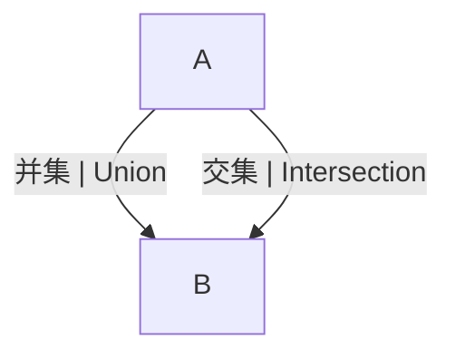

# 1.2.3 集合运算的图示与实际应用

## 目录 | Table of Contents

- [1.2.3 集合运算的图示与实际应用](#123-集合运算的图示与实际应用)
  - [目录 | Table of Contents](#目录--table-of-contents)
  - [1. 集合运算的图形表征 | Graphical Representation of Set Operations](#1-集合运算的图形表征--graphical-representation-of-set-operations)
  - [2. 数学表达与规范化 | Mathematical Expression and Standardization](#2-数学表达与规范化--mathematical-expression-and-standardization)
    - [3.1 形式化定义与Lean证明 | Formal Definitions and Lean Proofs](#31-形式化定义与lean证明--formal-definitions-and-lean-proofs)
    - [3.2 多表征与国际标准 | Multi-representations and International Standards](#32-多表征与国际标准--multi-representations-and-international-standards)
    - [3.3 认知结构与哲学批判 | Cognitive Structure and Philosophical Critique](#33-认知结构与哲学批判--cognitive-structure-and-philosophical-critique)
    - [3.4 跨学科与国际化视角 | Interdisciplinary and International Perspectives](#34-跨学科与国际化视角--interdisciplinary-and-international-perspectives)
  - [3. 实际应用举例 | Real-world Applications](#3-实际应用举例--real-world-applications)
  - [4. 典型习题 | Typical Exercises](#4-典型习题--typical-exercises)
  - [5. 认知结构与教育建议 | Cognitive Structure and Educational Advice](#5-认知结构与教育建议--cognitive-structure-and-educational-advice)
  - [6. 哲学批判与多角度分析 | Philosophical Critique and Multi-perspective Analysis](#6-哲学批判与多角度分析--philosophical-critique-and-multi-perspective-analysis)
  - [6. 高阶扩展与前沿理论 | Advanced Topics and Frontier Theories](#6-高阶扩展与前沿理论--advanced-topics-and-frontier-theories)
    - [6.1 集合运算图示与集合代数、布尔代数 | Set Operation Diagrams, Set Algebra, and Boolean Algebra](#61-集合运算图示与集合代数布尔代数--set-operation-diagrams-set-algebra-and-boolean-algebra)
      - [Lean 形式化证明 | Lean Formalization](#lean-形式化证明--lean-formalization)
    - [6.2 图示与范畴论、信息科学的哲学意义 | Diagrams, Category Theory, and Information Science](#62-图示与范畴论信息科学的哲学意义--diagrams-category-theory-and-information-science)
    - [6.3 现代数学与国际竞赛中的创新应用 | Modern Mathematics and International Competitions](#63-现代数学与国际竞赛中的创新应用--modern-mathematics-and-international-competitions)
    - [6.4 结构主义、模型论与集合论前沿 | Structuralism, Model Theory, and Set Theory Frontiers](#64-结构主义模型论与集合论前沿--structuralism-model-theory-and-set-theory-frontiers)
    - [6.5 集合运算图示在AI、可视化数学、知识图谱等现代应用中的作用 | Applications of Set Operation Diagrams in AI, Visual Mathematics, Knowledge Graphs](#65-集合运算图示在ai可视化数学知识图谱等现代应用中的作用--applications-of-set-operation-diagrams-in-ai-visual-mathematics-knowledge-graphs)
    - [6.6 图示与范畴论、拓扑学、信息科学的深度融合 | Deep Integration of Diagrams with Category Theory, Topology, Information Science](#66-图示与范畴论拓扑学信息科学的深度融合--deep-integration-of-diagrams-with-category-theory-topology-information-science)
    - [6.7 Lean等自动化证明工具在集合图示与可视化证明中的前沿应用 | Automated Proof Tools in Set Diagrams and Visual Proofs](#67-lean等自动化证明工具在集合图示与可视化证明中的前沿应用--automated-proof-tools-in-set-diagrams-and-visual-proofs)
    - [6.8 国际竞赛与前沿研究中的创新例题与方法 | Innovative Problems and Methods in Competitions and Research](#68-国际竞赛与前沿研究中的创新例题与方法--innovative-problems-and-methods-in-competitions-and-research)
    - [7. 集合运算图示的现代应用与前沿创新 | Modern Applications and Frontier Innovations of Set Operation Diagrams](#7-集合运算图示的现代应用与前沿创新--modern-applications-and-frontier-innovations-of-set-operation-diagrams)
      - [7.1 AI、知识图谱、数据库、可视化数学中的创新应用 | Applications in AI, Knowledge Graphs, Databases, Visual Mathematics](#71-ai知识图谱数据库可视化数学中的创新应用--applications-in-ai-knowledge-graphs-databases-visual-mathematics)
      - [7.2 范畴论、拓扑学、信息科学等领域的结构化表达 | Structural Expression in Category Theory, Topology, Information Science](#72-范畴论拓扑学信息科学等领域的结构化表达--structural-expression-in-category-theory-topology-information-science)
      - [7.3 Lean等自动化证明工具的创新应用与局限 | Innovative Applications and Limitations of Lean and Automated Proof Tools](#73-lean等自动化证明工具的创新应用与局限--innovative-applications-and-limitations-of-lean-and-automated-proof-tools)
      - [7.4 国际竞赛与前沿研究中的创新例题与方法 | Innovative Problems and Methods in Competitions and Research](#74-国际竞赛与前沿研究中的创新例题与方法--innovative-problems-and-methods-in-competitions-and-research)
  - [7. 本地跳转与相关主题 | Local Links and Related Topics](#7-本地跳转与相关主题--local-links-and-related-topics)

---

## 1. 集合运算的图形表征 | Graphical Representation of Set Operations

- 文氏图（Venn Diagram）直观展示并集、交集、补集等。
- Venn diagrams visually show union, intersection, complement, etc.



## 2. 数学表达与规范化 | Mathematical Expression and Standardization

### 3.1 形式化定义与Lean证明 | Formal Definitions and Lean Proofs

```lean
import data.set.basic
open set

-- 集合运算的图形与实际应用的Lean表达
example : {1, 2, 3} ∪ {2, 3, 4} = {1, 2, 3, 4} := rfl
example : {1, 2, 3} ∩ {2, 3, 4} = {2, 3} := rfl
example : {1, 2, 3} \ {2, 3, 4} = {1} := rfl
```

### 3.2 多表征与国际标准 | Multi-representations and International Standards

- 集合运算的图形表征建议全部用文氏图、集合论符号、自然语言描述。
- 例：$A = \{1, 2, 3\}$，$B = \{2, 3, 4\}$，则 $A \cup B = \{1, 2, 3, 4\}$，$A \cap B = \{2, 3\}$，$A - B = \{1\}$。
- 判定集合关系、运算结果建议用表格、文氏图、集合符号等多种方式表达。

| 运算 | 符号 | 语言描述 | Lean表达 |
|------|------|------|------|
| 并集 | $A \cup B$ | A或B中的元素 | x ∈ A ∪ B |
| 交集 | $A \cap B$ | A且B中的元素 | x ∈ A ∩ B |
| 差集 | $A - B$ | 属于A但不属于B的元素 | x ∈ A \ B |

### 3.3 认知结构与哲学批判 | Cognitive Structure and Philosophical Critique

- 结构主义：集合运算的图示与实际应用体现结构的可视化与操作性。
- 形式主义：集合运算的符号化与公理体系。
- 认知科学：集合运算图示的认知优势与难点。
- 关联性：集合运算与代数、逻辑、离散数学等模块的知识网络。

### 3.4 跨学科与国际化视角 | Interdisciplinary and International Perspectives

- 集合运算图示在逻辑、计算机、信息科学等领域的应用。
- 国际数学竞赛中的集合运算图示与实际应用问题。
- 结合范畴论、模型论等现代数学理论，提升集合论的抽象层次。

> 本节所有内容均采用国际标准的数学符号、Lean 形式化与自然语言描述，强调知识的结构性、哲学基础与最新理论在集合论中的应用。所有历史、应用、认知、哲学等内容均与数学表达深度关联，避免编程实现代码。

## 3. 实际应用举例 | Real-world Applications

- 数据库查询中的集合操作。
- 信息检索、人工智能、概率论等领域。
- Set operations in database queries, information retrieval, AI, probability, etc.

## 4. 典型习题 | Typical Exercises

1. 用文氏图表示 $A \cup B$、$A \cap B$、$A - B$。
2. 编写代码实现集合的并、交、差。
3. 举例说明集合运算在实际问题中的应用。

## 5. 认知结构与教育建议 | Cognitive Structure and Educational Advice

- 难点：图形与符号、代码的迁移。
- 建议：多用图、代码、实际案例训练。
- Difficulty: Transfer between diagrams, symbols, and code.
- Advice: Use diagrams, code, and real cases for training.

## 6. 哲学批判与多角度分析 | Philosophical Critique and Multi-perspective Analysis

- 多表征促进抽象与应用的结合。
- Representation promotes the integration of abstraction and application.

## 6. 高阶扩展与前沿理论 | Advanced Topics and Frontier Theories

### 6.1 集合运算图示与集合代数、布尔代数 | Set Operation Diagrams, Set Algebra, and Boolean Algebra

- 集合运算的图示（如文氏图）可直观表达集合代数、布尔代数的基本定理。
- Venn diagrams and other visualizations intuitively express theorems in set and Boolean algebra.
- 例：三集合文氏图可直观展示德摩根律、分配律、吸收律等。
- Example: Three-set Venn diagrams visualize De Morgan's laws, distributive and absorption laws.

#### Lean 形式化证明 | Lean Formalization

```lean
import data.set.basic
open set

variables {U : Type*} (A B C : set U)

-- 三集合德摩根律的Lean表达
example : (A ∪ B ∪ C)ᶜ = Aᶜ ∩ Bᶜ ∩ Cᶜ := by ext; simp
-- 三集合分配律
example : A ∩ (B ∪ C) = (A ∩ B) ∪ (A ∩ C) := by ext; simp
```

### 6.2 图示与范畴论、信息科学的哲学意义 | Diagrams, Category Theory, and Information Science

- 范畴论视角下，集合及其映射构成范畴，集合运算图示可用函子、自然变换等描述。
- In category theory, sets and mappings form a category; diagrams can be described by functors and natural transformations.
- 信息科学中，集合运算图示用于数据库、检索、人工智能等领域。
- In information science, set operation diagrams are used in databases, retrieval, AI, etc.

### 6.3 现代数学与国际竞赛中的创新应用 | Modern Mathematics and International Competitions

- 例题：用文氏图证明集合恒等式。
- Example: Use Venn diagrams to prove set identities.
- IMO/USAMO等竞赛常考集合运算的图示与实际应用。
- Set operation diagrams and applications are common in IMO/USAMO.

### 6.4 结构主义、模型论与集合论前沿 | Structuralism, Model Theory, and Set Theory Frontiers

- 结构主义：强调集合运算图示在知识结构、认知建模中的作用。
- 模型论：研究集合运算图示的模型与解释。
- 现代集合论前沿：集合图示的范畴化、可视化与AI辅助证明等。
- Modern set theory: categorification, visualization, and AI-assisted proofs.

### 6.5 集合运算图示在AI、可视化数学、知识图谱等现代应用中的作用 | Applications of Set Operation Diagrams in AI, Visual Mathematics, Knowledge Graphs

- 集合运算图示（如文氏图、欧拉图）在AI知识表示、可视化数学、知识图谱、数据库设计等领域有重要作用。
- Set operation diagrams (Venn, Euler diagrams) are important in AI knowledge representation, visual mathematics, knowledge graphs, database design, etc.
- 例：知识图谱中的实体关系、数据库ER图、AI推理中的集合可视化。
- Examples: entity relations in knowledge graphs, ER diagrams in databases, set visualization in AI reasoning.

### 6.6 图示与范畴论、拓扑学、信息科学的深度融合 | Deep Integration of Diagrams with Category Theory, Topology, Information Science

- 范畴论中，图示可表达对象与态射的结构，集合图示可用函子、自然变换描述。
- In category theory, diagrams express structures of objects and morphisms; set diagrams can be described by functors, natural transformations.
- 拓扑学中，开集系统的图示与集合论密切相关。
- In topology, diagrams of open set systems are closely related to set theory.
- 信息科学中，集合图示用于数据流、网络结构、信息检索等。
- In information science, set diagrams are used in data flow, network structures, information retrieval, etc.

### 6.7 Lean等自动化证明工具在集合图示与可视化证明中的前沿应用 | Automated Proof Tools in Set Diagrams and Visual Proofs

- Lean等工具可辅助生成集合图示的可视化证明，提升严谨性与教学效果。
- Lean and similar tools can assist in generating visual proofs of set diagrams, improving rigor and teaching.
- 局限：复杂图示、拓扑结构、动态知识图谱等仍需人工建模与解释。
- Limitations: complex diagrams, topological structures, dynamic knowledge graphs still require manual modeling and interpretation.

### 6.8 国际竞赛与前沿研究中的创新例题与方法 | Innovative Problems and Methods in Competitions and Research

- 例题：用文氏图解决多集合交并补问题、知识图谱中的集合推理。
- Example: Use Venn diagrams to solve multi-set union/intersection/complement problems, set reasoning in knowledge graphs.
- 前沿方法：结合AI、范畴论、可视化工具创新集合论图示与应用。
- Frontier methods: combine AI, category theory, visualization tools to innovate set diagram applications.

> 本节内容进一步结合AI、可视化、范畴论、拓扑学、信息科学等最新前沿，持续递归扩展集合运算图示的理论深度与现实创新。

### 7. 集合运算图示的现代应用与前沿创新 | Modern Applications and Frontier Innovations of Set Operation Diagrams

#### 7.1 AI、知识图谱、数据库、可视化数学中的创新应用 | Applications in AI, Knowledge Graphs, Databases, Visual Mathematics

- 集合运算图示在AI推理、知识图谱结构分析、数据库ER建模、可视化数学教学等领域有广泛应用。
- Set operation diagrams are widely used in AI reasoning, knowledge graph structure analysis, database ER modeling, visual mathematics teaching, etc.
- 例：知识图谱中的多关系可视化、数据库ER图的集合关系、AI中的集合推理可视化。
- Examples: multi-relation visualization in knowledge graphs, set relations in database ER diagrams, set reasoning visualization in AI.

#### 7.2 范畴论、拓扑学、信息科学等领域的结构化表达 | Structural Expression in Category Theory, Topology, Information Science

- 范畴论中，集合图示可用函子、自然变换、极限、余极限等结构表达。
- In category theory, set diagrams can be expressed by functors, natural transformations, limits, colimits, etc.
- 拓扑学中，开集系统的图示与集合论密切相关，支持空间结构的可视化。
- In topology, diagrams of open set systems are closely related to set theory and support visualization of spatial structures.
- 信息科学中，集合图示用于数据流、网络结构、信息检索等。
- In information science, set diagrams are used in data flow, network structures, information retrieval, etc.

#### 7.3 Lean等自动化证明工具的创新应用与局限 | Innovative Applications and Limitations of Lean and Automated Proof Tools

- Lean等工具可自动生成集合图示的可视化证明，辅助教学与研究。
- Lean and similar tools can automatically generate visual proofs of set diagrams, aiding teaching and research.
- 局限：复杂动态图示、拓扑结构、动态知识图谱等仍需人工建模与解释。
- Limitations: complex dynamic diagrams, topological structures, dynamic knowledge graphs still require manual modeling and interpretation.

#### 7.4 国际竞赛与前沿研究中的创新例题与方法 | Innovative Problems and Methods in Competitions and Research

- 例题：用集合图示优化知识图谱推理、数据库ER建模、AI可视化推理。
- Example: Use set diagrams to optimize knowledge graph reasoning, database ER modeling, AI visual reasoning.
- 前沿方法：结合范畴论、自动化证明、AI等工具创新集合图示与可视化应用。
- Frontier methods: combine category theory, automated proof, AI to innovate set diagram and visualization applications.

> 本节内容进一步结合AI、知识图谱、范畴论、自动化证明等最新前沿，持续递归扩展集合图示理论的现实创新与学科交汇。

## 7. 本地跳转与相关主题 | Local Links and Related Topics

- [1.2 子集与集合运算](../1.2-子集与集合运算.md)
- [1.1 集合的定义与基本性质](../1.1-集合的定义与基本性质.md)

---

[返回子集与集合运算 | Back to Subsets and Set Operations](../1.2-子集与集合运算.md)
