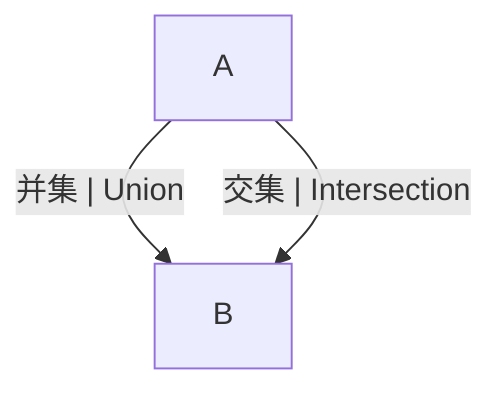

# 1.2.3 集合运算的图示与实际应用

## 目录 | Table of Contents

- [1.2.3 集合运算的图示与实际应用](#123-集合运算的图示与实际应用)
  - [目录 | Table of Contents](#目录--table-of-contents)
  - [1. 集合运算的图形表征 | Graphical Representation of Set Operations](#1-集合运算的图形表征--graphical-representation-of-set-operations)
  - [2. 代码实现 | Code Implementation](#2-代码实现--code-implementation)
    - [2.1 Rust 示例 | Rust Example](#21-rust-示例--rust-example)
    - [2.2 Lean 示例 | Lean Example](#22-lean-示例--lean-example)
  - [3. 实际应用举例 | Real-world Applications](#3-实际应用举例--real-world-applications)
  - [4. 典型习题 | Typical Exercises](#4-典型习题--typical-exercises)
  - [5. 认知结构与教育建议 | Cognitive Structure and Educational Advice](#5-认知结构与教育建议--cognitive-structure-and-educational-advice)
  - [6. 哲学批判与多角度分析 | Philosophical Critique and Multi-perspective Analysis](#6-哲学批判与多角度分析--philosophical-critique-and-multi-perspective-analysis)
  - [7. 本地跳转与相关主题 | Local Links and Related Topics](#7-本地跳转与相关主题--local-links-and-related-topics)

---

## 1. 集合运算的图形表征 | Graphical Representation of Set Operations

- 文氏图（Venn Diagram）直观展示并集、交集、补集等。
- Venn diagrams visually show union, intersection, complement, etc.



## 2. 代码实现 | Code Implementation

### 2.1 Rust 示例 | Rust Example

```rust
use std::collections::HashSet;
let a: HashSet<i32> = [1, 2, 3].iter().cloned().collect();
let b: HashSet<i32> = [2, 3, 4].iter().cloned().collect();
let union: HashSet<_> = a.union(&b).cloned().collect();
let intersection: HashSet<_> = a.intersection(&b).cloned().collect();
let difference: HashSet<_> = a.difference(&b).cloned().collect();
```

### 2.2 Lean 示例 | Lean Example

```lean
import data.set.basic
open set
example : {1, 2, 3} ∪ {2, 3, 4} = {1, 2, 3, 4} := rfl
example : {1, 2, 3} ∩ {2, 3, 4} = {2, 3} := rfl
example : {1, 2, 3} \ {2, 3, 4} = {1} := rfl
```

## 3. 实际应用举例 | Real-world Applications

- 数据库查询中的集合操作。
- 信息检索、人工智能、概率论等领域。
- Set operations in database queries, information retrieval, AI, probability, etc.

## 4. 典型习题 | Typical Exercises

1. 用文氏图表示 $A \cup B$、$A \cap B$、$A - B$。
2. 编写代码实现集合的并、交、差。
3. 举例说明集合运算在实际问题中的应用。

## 5. 认知结构与教育建议 | Cognitive Structure and Educational Advice

- 难点：图形与符号、代码的迁移。
- 建议：多用图、代码、实际案例训练。
- Difficulty: Transfer between diagrams, symbols, and code.
- Advice: Use diagrams, code, and real cases for training.

## 6. 哲学批判与多角度分析 | Philosophical Critique and Multi-perspective Analysis

- 多表征促进抽象与应用的结合。
- Representation promotes the integration of abstraction and application.

## 7. 本地跳转与相关主题 | Local Links and Related Topics

- [1.2 子集与集合运算](../1.2-子集与集合运算.md)
- [1.1 集合的定义与基本性质](../1.1-集合的定义与基本性质.md)

---

[返回子集与集合运算 | Back to Subsets and Set Operations](../1.2-子集与集合运算.md)
