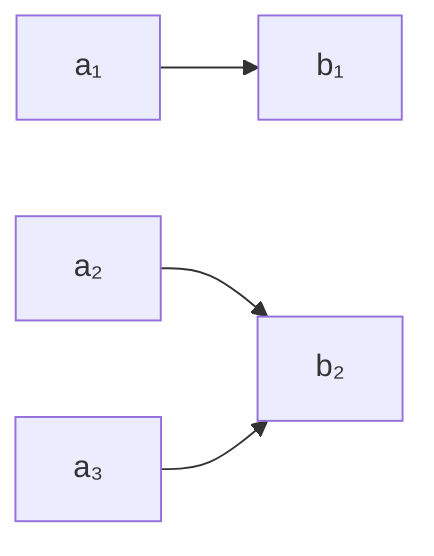

# 2.1.2 映射的多表征与类型

## 目录 | Table of Contents

- [2.1.2 映射的多表征与类型](#212-映射的多表征与类型)
  - [目录 | Table of Contents](#目录--table-of-contents)
  - [1. 映射的图形与表格表征 | Graphical and Tabular Representations](#1-映射的图形与表格表征--graphical-and-tabular-representations)
  - [2. 映射的类型 | Types of Mappings](#2-映射的类型--types-of-mappings)
  - [3. 数学表达与规范化 | Mathematical Expression and Standardization](#3-数学表达与规范化--mathematical-expression-and-standardization)
    - [Lean 形式化示例 | Lean Formalization Example](#lean-形式化示例--lean-formalization-example)
  - [4. 典型习题 | Typical Exercises](#4-典型习题--typical-exercises)
  - [5. 认知结构与教育建议 | Cognitive Structure and Educational Advice](#5-认知结构与教育建议--cognitive-structure-and-educational-advice)
  - [6. 哲学批判与多角度分析 | Philosophical Critique and Multi-perspective Analysis](#6-哲学批判与多角度分析--philosophical-critique-and-multi-perspective-analysis)
  - [7. 本地跳转与相关主题 | Local Links and Related Topics](#7-本地跳转与相关主题--local-links-and-related-topics)

---

## 1. 映射的图形与表格表征 | Graphical and Tabular Representations

- 箭头图、函数图像、表格等多种方式描述映射。
- Arrow diagrams, function graphs, tables, etc.



| x | f(x) |
|---|------|
| 1 | 2    |
| 2 | 4    |
| 3 | 8    |

## 2. 映射的类型 | Types of Mappings

- 单射（Injective）、满射（Surjective）、双射（Bijective）。
- Injective, surjective, bijective mappings.

## 3. 数学表达与规范化 | Mathematical Expression and Standardization

- 映射的图形、表格、符号等多种表征建议全部用数学语言、LaTeX、自然语言描述。
- 例如：$f: A \to B$，$f(x) = 2x$。
- 判定单射、满射、双射建议用定义、表格、函数图像等方式表达。

### Lean 形式化示例 | Lean Formalization Example

```lean
import data.set.basic
open set
variables {A B : Type*} (f : A → B)
-- 单射定义
example : function.injective f ↔ ∀ x y, f x = f y → x = y := iff.rfl
-- 满射定义
example : function.surjective f ↔ ∀ y, ∃ x, f x = y := iff.rfl
-- 双射定义
example : function.bijective f ↔ function.injective f ∧ function.surjective f := iff.rfl
```

> 所有映射相关内容均采用国际标准的数学符号和自然语言描述，避免编程实现代码。实际应用、跨学科联系等内容，均以数学语言和国际化解释为主，强化知识的关联性和标准化。

## 4. 典型习题 | Typical Exercises

1. 判断 $f(x) = 2x$ 是否为单射、满射、双射。
2. 用箭头图表示 $A = \{1,2,3\}, B = \{2,4,8\}, f(x) = 2^x$。

## 5. 认知结构与教育建议 | Cognitive Structure and Educational Advice

- 难点：映射类型的区分与理解。
- 建议：多用图、表、代码、实例训练。
- Difficulty: Distinguishing and understanding mapping types.
- Advice: Use diagrams, tables, code, and examples.

## 6. 哲学批判与多角度分析 | Philosophical Critique and Multi-perspective Analysis

- 映射类型与结构主义数学观。
- Mapping types and structuralist view of mathematics.

## 7. 本地跳转与相关主题 | Local Links and Related Topics

- [2.1 映射的定义](../2.1-映射的定义.md)
- [1.1 集合的定义与基本性质](../../1-集合论/1.1-集合的定义与基本性质.md)

---

[返回映射的定义 | Back to Mapping Definition](../2.1-映射的定义.md)
