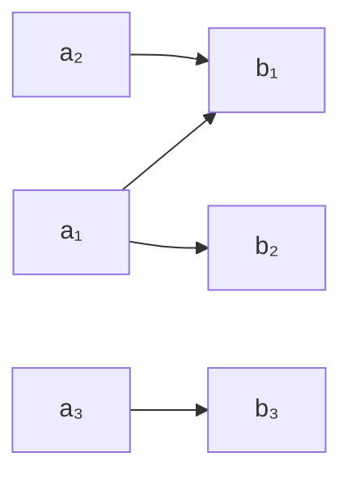

# 2.2 关系的定义

## 目录 | Table of Contents

- [2.2 关系的定义](#22-关系的定义)
  - [目录 | Table of Contents](#目录--table-of-contents)
  - [1. 关系的历史与发展 | History and Development of Relations](#1-关系的历史与发展--history-and-development-of-relations)
  - [2. 关系的基本定义 | Basic Definition of Relations](#2-关系的基本定义--basic-definition-of-relations)
  - [3. 关系的多表征 | Multiple Representations of Relations](#3-关系的多表征--multiple-representations-of-relations)
  - [4. 关系的类型与性质 | Types and Properties of Relations](#4-关系的类型与性质--types-and-properties-of-relations)
  - [5. 关系的实际应用 | Real-world Applications of Relations](#5-关系的实际应用--real-world-applications-of-relations)
  - [6. 形式化证明与代码示例 | Formal Proofs and Code Examples](#6-形式化证明与代码示例--formal-proofs-and-code-examples)
    - [6.1 形式化证明（Lean 示例） | Formal Proof (Lean Example)](#61-形式化证明lean-示例--formal-proof-lean-example)
    - [6.2 Rust 代码示例 | Rust Code Example](#62-rust-代码示例--rust-code-example)
  - [7. 认知结构与教育建议 | Cognitive Structure and Educational Advice](#7-认知结构与教育建议--cognitive-structure-and-educational-advice)
  - [8. 哲学批判与多角度分析 | Philosophical Critique and Multi-perspective Analysis](#8-哲学批判与多角度分析--philosophical-critique-and-multi-perspective-analysis)
  - [9. 本地跳转与相关主题 | Local Links and Related Topics](#9-本地跳转与相关主题--local-links-and-related-topics)

---

## 1. 关系的历史与发展 | History and Development of Relations

### 1.1 早期发展 | Early Development

- **古希腊**：亚里士多德的逻辑学中的关系概念
- **中世纪**：经院哲学对关系的研究
- **17-18世纪**：莱布尼茨对关系的数学化处理

### 1.2 现代发展 | Modern Development

- **19世纪**：德摩根、皮尔斯等建立关系代数
- **20世纪**：集合论基础上的关系理论
- **当代**：在数据库、人工智能等领域的广泛应用

## 2. 关系的基本定义 | Basic Definition of Relations

### 2.1 形式化定义 | Formal Definition

设 $A, B$ 为两个集合，$A \times B$ 的子集 $R$ 称为从 $A$ 到 $B$ 的一个关系，记作 $R: A \to B$。

如果 $A = B$，则称 $R$ 为 $A$ 上的关系。

### 2.2 关系的要素 | Elements of Relations

- **定义域**：$dom(R) = \{a \in A \mid \exists b \in B, (a,b) \in R\}$
- **值域**：$ran(R) = \{b \in B \mid \exists a \in A, (a,b) \in R\}$
- **关系图**：$R$ 的图形表示

## 3. 关系的多表征 | Multiple Representations of Relations

### 3.1 集合表征 | Set Representation

- **有序对集合**：$R = \{(a_1, b_1), (a_2, b_2), \ldots\}$
- **描述法**：$R = \{(x, y) \mid x \in A, y \in B, P(x, y)\}$

### 3.2 矩阵表征 | Matrix Representation

对于有限集合 $A = \{a_1, a_2, \ldots, a_n\}$，$B = \{b_1, b_2, \ldots, b_m\}$，关系 $R$ 的矩阵表示为：

$$M_R = [m_{ij}]_{n \times m}$$

其中 $m_{ij} = 1$ 如果 $(a_i, b_j) \in R$，否则 $m_{ij} = 0$。

### 3.3 图形表征 | Graphical Representation



### 3.4 表格表征 | Tabular Representation

| 元素 | 相关元素 |
|------|----------|
| $a_1$ | $b_1, b_2$ |
| $a_2$ | $b_1$ |
| $a_3$ | $b_3$ |

## 4. 关系的类型与性质 | Types and Properties of Relations

### 4.1 自反性（Reflexive）| Reflexive Relations

关系 $R$ 在集合 $A$ 上自反，当且仅当对任意 $a \in A$，都有 $(a, a) \in R$。

**特征**：每个元素都与自己相关

### 4.2 对称性（Symmetric）| Symmetric Relations

关系 $R$ 对称，当且仅当对任意 $(a, b) \in R$，都有 $(b, a) \in R$。

**特征**：如果 $a$ 与 $b$ 相关，则 $b$ 与 $a$ 也相关

### 4.3 传递性（Transitive）| Transitive Relations

关系 $R$ 传递，当且仅当对任意 $(a, b) \in R$ 和 $(b, c) \in R$，都有 $(a, c) \in R$。

**特征**：如果 $a$ 与 $b$ 相关，$b$ 与 $c$ 相关，则 $a$ 与 $c$ 相关

### 4.4 等价关系 | Equivalence Relations

同时具有自反性、对称性和传递性的关系称为等价关系。

**应用**：分类、同余、同构等

### 4.5 偏序关系 | Partial Order Relations

具有自反性、反对称性和传递性的关系称为偏序关系。

**应用**：集合包含、整除关系、子集关系等

## 5. 关系的实际应用 | Real-world Applications of Relations

### 5.1 数学应用 | Mathematical Applications

- **集合论**：包含关系、相等关系
- **数论**：整除关系、同余关系
- **代数**：同构关系、同态关系
- **几何**：相似关系、全等关系

### 5.2 计算机科学应用 | Computer Science Applications

- **数据库**：关系数据库模型
- **图论**：图的邻接关系
- **算法**：排序、搜索中的比较关系
- **人工智能**：知识表示、推理

### 5.3 社会科学应用 | Social Science Applications

- **社会学**：社会关系网络
- **经济学**：偏好关系、效用关系
- **心理学**：认知关系、情感关系

## 6. 形式化证明与代码示例 | Formal Proofs and Code Examples

### 6.1 形式化证明（Lean 示例） | Formal Proof (Lean Example)

```lean
import data.set.basic
open set

-- 关系的基本定义
variables {A : Type*} (R : A → A → Prop)

-- 自反性
def reflexive := ∀ a : A, R a a

-- 对称性
def symmetric := ∀ a b : A, R a b → R b a

-- 传递性
def transitive := ∀ a b c : A, R a b → R b c → R a c

-- 等价关系
def equivalence := reflexive R ∧ symmetric R ∧ transitive R

-- 反对称性
def antisymmetric := ∀ a b : A, R a b → R b a → a = b

-- 偏序关系
def partial_order := reflexive R ∧ antisymmetric R ∧ transitive R

-- 关系性质证明示例
example (R : A → A → Prop) : 
  reflexive R → symmetric R → transitive R → equivalence R :=
begin
  intros h1 h2 h3,
  split,
  { exact h1 },
  split,
  { exact h2 },
  { exact h3 }
end
```

### 6.2 Rust 代码示例 | Rust Code Example

```rust
use std::collections::HashSet;

// 关系的基本实现
#[derive(Debug, Clone)]
struct Relation<T> {
    pairs: HashSet<(T, T)>,
}

impl<T: Eq + std::hash::Hash + Clone> Relation<T> {
    fn new() -> Self {
        Relation {
            pairs: HashSet::new(),
        }
    }
    
    // 添加关系对
    fn add_pair(&mut self, a: T, b: T) {
        self.pairs.insert((a, b));
    }
    
    // 检查两个元素是否相关
    fn related(&self, a: &T, b: &T) -> bool {
        self.pairs.contains(&(a.clone(), b.clone()))
    }
    
    // 检查自反性
    fn is_reflexive(&self, elements: &[T]) -> bool {
        for element in elements {
            if !self.related(element, element) {
                return false;
            }
        }
        true
    }
    
    // 检查对称性
    fn is_symmetric(&self) -> bool {
        for (a, b) in &self.pairs {
            if !self.related(b, a) {
                return false;
            }
        }
        true
    }
    
    // 检查传递性
    fn is_transitive(&self) -> bool {
        for (a, b) in &self.pairs {
            for (c, d) in &self.pairs {
                if b == c && !self.related(a, d) {
                    return false;
                }
            }
        }
        true
    }
    
    // 检查等价关系
    fn is_equivalence(&self, elements: &[T]) -> bool {
        self.is_reflexive(elements) && 
        self.is_symmetric() && 
        self.is_transitive()
    }
    
    // 生成等价类
    fn equivalence_classes(&self, elements: &[T]) -> Vec<Vec<T>> 
    where T: Clone {
        let mut classes = Vec::new();
        let mut used = HashSet::new();
        
        for element in elements {
            if !used.contains(element) {
                let mut class = Vec::new();
                for other in elements {
                    if self.related(element, other) {
                        class.push(other.clone());
                        used.insert(other);
                    }
                }
                classes.push(class);
            }
        }
        classes
    }
}

// 关系运算
impl<T: Eq + std::hash::Hash + Clone> Relation<T> {
    // 关系的并
    fn union(&self, other: &Relation<T>) -> Relation<T> {
        let mut result = self.clone();
        for pair in &other.pairs {
            result.pairs.insert(pair.clone());
        }
        result
    }
    
    // 关系的交
    fn intersection(&self, other: &Relation<T>) -> Relation<T> {
        let mut result = Relation::new();
        for pair in &self.pairs {
            if other.pairs.contains(pair) {
                result.pairs.insert(pair.clone());
            }
        }
        result
    }
    
    // 关系的复合
    fn composition(&self, other: &Relation<T>) -> Relation<T> {
        let mut result = Relation::new();
        for (a, b) in &self.pairs {
            for (c, d) in &other.pairs {
                if b == c {
                    result.add_pair(a.clone(), d.clone());
                }
            }
        }
        result
    }
}

// 示例使用
fn relation_examples() {
    let mut relation = Relation::new();
    
    // 创建等价关系：模3同余
    let elements = vec![0, 1, 2, 3, 4, 5, 6, 7, 8];
    for i in 0..9 {
        for j in 0..9 {
            if i % 3 == j % 3 {
                relation.add_pair(i, j);
            }
        }
    }
    
    println!("关系是等价关系: {}", relation.is_equivalence(&elements));
    
    // 生成等价类
    let classes = relation.equivalence_classes(&elements);
    println!("等价类: {:?}", classes);
    
    // 创建偏序关系：整除关系
    let mut divisibility = Relation::new();
    for i in 1..=6 {
        for j in 1..=6 {
            if j % i == 0 {
                divisibility.add_pair(i, j);
            }
        }
    }
    
    println!("整除关系是偏序: {}", 
        divisibility.is_reflexive(&[1, 2, 3, 4, 5, 6]) && 
        divisibility.is_transitive());
}
```

## 7. 认知结构与教育建议 | Cognitive Structure and Educational Advice

### 7.1 学习难点 | Learning Difficulties

- **抽象概念**：关系的抽象性理解困难
- **性质区分**：自反、对称、传递等性质的区分
- **符号理解**：关系符号的准确理解

### 7.2 教学建议 | Teaching Suggestions

- **具体实例**：从具体例子开始理解关系
- **多表征**：使用集合、矩阵、图形等多种表征
- **渐进抽象**：从具体到抽象的渐进过程
- **实际应用**：结合现实生活中的关系例子

## 8. 哲学批判与多角度分析 | Philosophical Critique and Multi-perspective Analysis

### 8.1 本体论问题 | Ontological Issues

- **关系的存在性**：关系是客观存在还是主观构造？
- **关系与实体**：关系与实体的哲学关系

### 8.2 认识论问题 | Epistemological Issues

- **关系的认识**：如何认识关系的本质？
- **抽象与具体**：抽象关系与具体实例的关系

### 8.3 方法论意义 | Methodological Significance

- **建模思想**：关系在数学建模中的作用
- **结构主义**：关系在数学结构中的地位

## 9. 本地跳转与相关主题 | Local Links and Related Topics

- [2.1 映射的定义](./2.1-映射的定义.md)
- [1.1 集合的定义与基本性质](../../1-集合论/1.1-集合的定义与基本性质.md)
- [4.1 欧几里得几何基础](../../4-几何与空间/4.1-欧几里得几何基础.md)

---

[返回映射与关系目录 | Back to Mappings and Relations](../README.md)
