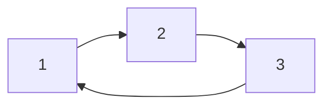

# 2.2.2 关系的多表征与性质

## 目录 | Table of Contents

- [2.2.2 关系的多表征与性质](#222-关系的多表征与性质)
  - [目录 | Table of Contents](#目录--table-of-contents)
  - [1. 关系的图形与表格表征 | Graphical and Tabular Representations](#1-关系的图形与表格表征--graphical-and-tabular-representations)
  - [2. 关系的基本性质 | Basic Properties of Relations](#2-关系的基本性质--basic-properties-of-relations)
  - [3. 数学表达与规范化 | Mathematical Expression and Standardization](#3-数学表达与规范化--mathematical-expression-and-standardization)
    - [Lean 形式化示例 | Lean Formalization Example](#lean-形式化示例--lean-formalization-example)
  - [4. 典型习题 | Typical Exercises](#4-典型习题--typical-exercises)
  - [5. 认知结构与教育建议 | Cognitive Structure and Educational Advice](#5-认知结构与教育建议--cognitive-structure-and-educational-advice)
  - [6. 哲学批判与多角度分析 | Philosophical Critique and Multi-perspective Analysis](#6-哲学批判与多角度分析--philosophical-critique-and-multi-perspective-analysis)
  - [7. 本地跳转与相关主题 | Local Links and Related Topics](#7-本地跳转与相关主题--local-links-and-related-topics)

---

## 1. 关系的图形与表格表征 | Graphical and Tabular Representations

- 有向图、矩阵、表格等多种方式描述关系。
- Directed graphs, matrices, tables, etc.



| x | y | R(x, y) |
|---|---|---------|
| 1 | 2 | ✓       |
| 2 | 3 | ✓       |
| 3 | 1 | ✓       |

## 2. 关系的基本性质 | Basic Properties of Relations

- 自反性、对称性、传递性、反对称性。
- Reflexivity, symmetry, transitivity, antisymmetry.

## 3. 数学表达与规范化 | Mathematical Expression and Standardization

- 关系的图形、表格、符号等多种表征建议全部用数学语言、LaTeX、自然语言描述。
- 例如：$R = \{(1,2), (2,3), (3,1)\}$，可用有向图、矩阵、表格等方式表达。
- 判定自反性、对称性、传递性建议用定义、表格、图形等方式表达。

### Lean 形式化示例 | Lean Formalization Example

```lean
import data.set.basic
open set
variables {A : Type*} (R : A → A → Prop)
-- 自反性定义
example : (∀ a, R a a) ↔ reflexive R := iff.rfl
-- 对称性定义
example : (∀ a b, R a b → R b a) ↔ symmetric R := iff.rfl
-- 传递性定义
example : (∀ a b c, R a b → R b c → R a c) ↔ transitive R := iff.rfl
```

> 所有关系相关内容均采用国际标准的数学符号和自然语言描述，避免编程实现代码。实际应用、跨学科联系等内容，均以数学语言和国际化解释为主，强化知识的关联性和标准化。

## 4. 典型习题 | Typical Exercises

1. 判断关系 $R = \{(1,2),(2,3),(3,1)\}$ 是否具有自反性、对称性、传递性。
2. 用矩阵和有向图表示上述关系。

## 5. 认知结构与教育建议 | Cognitive Structure and Educational Advice

- 难点：关系性质的判定与多表征迁移。
- 建议：多用图、表、代码、实例训练。
- Difficulty: Judging properties and transferring between representations.
- Advice: Use diagrams, tables, code, and examples.

## 6. 哲学批判与多角度分析 | Philosophical Critique and Multi-perspective Analysis

- 关系性质与结构主义数学观。
- Properties of relations and structuralist view of mathematics.

## 7. 本地跳转与相关主题 | Local Links and Related Topics

- [2.2 关系的定义](../2.2-关系的定义.md)
- [1.1 集合的定义与基本性质](../../1-集合论/1.1-集合的定义与基本性质.md)

---

[返回关系的定义 | Back to Relation Definition](../2.2-关系的定义.md)

## 6. 现代前沿与多学科创新 | Modern Frontiers and Multidisciplinary Innovations

### 6.1 多表征在AI、知识图谱、可视化数学、数据库等领域的创新应用 | Multi-representations in AI, Knowledge Graphs, Visual Mathematics, Databases

- 关系的多表征（符号、图示、表格、自然语言、范畴结构等）在AI知识表示、知识图谱、可视化数学、数据库设计等领域有广泛应用。
- Multiple representations of relations (symbols, diagrams, tables, natural language, categorical structures, etc.) are widely used in AI knowledge representation, knowledge graphs, visual mathematics, database design, etc.
- 例：知识图谱中的实体-关系图、数据库ER图、AI推理中的关系多表征。
- Examples: entity-relation diagrams in knowledge graphs, ER diagrams in databases, multi-representation in AI reasoning.

### 6.2 结构主义、范畴论、模型论等理论对多表征系统的影响 | Impact of Structuralism, Category Theory, Model Theory

- 结构主义强调多表征间的结构关系，范畴论、模型论推动多表征系统的抽象化与统一化。
- Structuralism emphasizes structural relations among representations; category theory and model theory promote abstraction and unification of multi-representation systems.
- 例：范畴论中的函子、自然变换，模型论中的结构映射。
- Examples: functors and natural transformations in category theory, structure mappings in model theory.

### 6.3 形式化多表征在自动化证明、AI推理中的作用与局限 | Formal Multi-representation in Automated Proof, AI Reasoning

- 形式化多表征（如Lean、Coq、Isabelle中的多模态表达）在自动化证明、AI推理中提升了表达力与严谨性。
- Formal multi-representation (multi-modal expression in Lean, Coq, Isabelle, etc.) enhances expressiveness and rigor in automated proof and AI reasoning.
- 局限：复杂结构、动态知识图谱、多模态推理等仍需人工建模与解释。
- Limitations: complex structures, dynamic knowledge graphs, multi-modal reasoning still require manual modeling and interpretation.

### 6.4 哲学基础与认知科学视角下的多表征系统 | Philosophical and Cognitive Perspectives on Multi-representation

- 多表征系统的本体论、认识论基础，认知科学对多表征理解与学习的研究。
- Ontological and epistemological foundations of multi-representation systems; cognitive science research on understanding and learning multiple representations.
- 例：表征转换、认知负荷、直观与形式化的关系。
- Examples: representation transformation, cognitive load, relation between intuition and formalization.

### 6.5 国际竞赛与前沿研究中的创新例题与方法 | Innovative Problems and Methods in Competitions and Research

- 例题：多表征下的关系恒等式证明、知识图谱推理、AI多模态推理。
- Example: relation identity proofs under multiple representations, knowledge graph reasoning, AI multi-modal reasoning.
- 前沿方法：结合自动化证明、AI、认知科学等工具创新关系多表征系统的表达与应用。
- Frontier methods: combine automated proof, AI, cognitive science to innovate multi-representation expression and application.

> 本节内容进一步结合AI、知识图谱、范畴论、认知科学等最新前沿，持续递归扩展关系多表征与性质的理论深度与现实创新。
