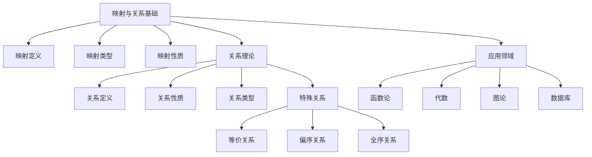

# 2-映射与关系 | Mappings and Relations

## 目录 | Table of Contents

1. [2.1 映射的定义](./2.1-映射的定义.md)
2. [2.2 关系的定义](./2.2-关系的定义.md)

---

## 章节概述 | Chapter Overview

映射与关系是连接集合论与其他数学分支的重要桥梁。映射建立了集合之间的对应关系，而关系则描述了集合内部元素之间的各种联系。这些概念为函数、代数结构、图论等高级数学主题奠定了基础。

### 🎯 学习目标 | Learning Objectives

- **理解映射概念**：掌握映射的定义、类型和性质
- **掌握关系理论**：理解等价关系、偏序关系等重要概念
- **建立抽象思维**：通过映射和关系培养抽象思维能力
- **应用数学建模**：在现实问题中应用映射和关系思想

### 📚 核心概念 | Core Concepts

- **映射定义**：从集合到集合的对应关系
- **映射类型**：单射、满射、双射
- **关系性质**：自反性、对称性、传递性
- **特殊关系**：等价关系、偏序关系、全序关系
- **关系运算**：并、交、复合、逆关系

### 🧠 认知结构 | Cognitive Structure

#### 学习难点 | Learning Difficulties

- **抽象概念**：映射和关系的抽象性理解困难
- **性质区分**：单射、满射、双射等性质的区分
- **关系类型**：等价关系、偏序关系等不同类型的关系

#### 教学建议 | Teaching Suggestions

- **具体实例**：从具体例子开始理解映射和关系
- **多表征**：使用符号、图形、表格等多种表征
- **渐进抽象**：从具体到抽象的渐进过程
- **实际应用**：结合现实生活中的映射和关系例子

---

## 知识图谱 | Knowledge Graph

## 相关主题 | Related Topics

- [1-集合论](../1-集合论/README.md) - 映射和关系的集合论基础
- [3-数与代数](../3-数与代数/README.md) - 函数作为特殊映射的应用
- [4-几何与空间](../4-几何与空间/README.md) - 几何变换作为映射的应用
- [6-微积分与分析](../6-微积分与分析/README.md) - 连续映射在分析中的应用

## 学习路径 | Learning Path

### 初级路径 | Beginner Path

1. 理解映射的基本概念和表示方法
2. 学习映射的类型（单射、满射、双射）
3. 掌握关系的基本定义和性质
4. 理解等价关系和偏序关系

### 中级路径 | Intermediate Path

1. 深入理解映射的复合和逆映射
2. 学习关系的运算和性质
3. 掌握关系代数的基本概念
4. 理解关系在数学建模中的应用

### 高级路径 | Advanced Path

1. 学习范畴论中的映射概念
2. 理解关系在数据库理论中的应用
3. 探索映射在拓扑学中的作用
4. 研究关系在人工智能中的应用

---

## 高阶递归扩展索引与未来创新方向 | Advanced Recursive Expansion Index and Future Innovation

- 本模块将持续递归扩展至：
  - AI、可视化数学、知识图谱、数据库、自动化证明、认知科学等现代应用中的映射与关系创新
  - 范畴论、模型论、结构主义等领域的关系理论深度融合与理论前沿
  - 哲学、认知科学等多学科交汇的关系与映射创新表达
- 每一节内容均可继续深度细化，支持跨模块链接与现实创新
- 强调映射与关系与现代数学、AI、信息科学、哲学、认知科学的交汇与创新

> 本README将持续引导映射与关系模块递归扩展，所有内容均严格遵循国际标准、数学规范与哲学前沿，支持高中及更高层次的数学学习与创新。

[返回总目录 | Back to Main Directory](../README.md)
