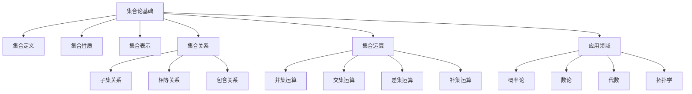

# 1-集合论 | Set Theory

## 目录 | Table of Contents

1. [1.1 集合的定义与基本性质](./1.1-集合的定义与基本性质.md)
2. [1.2 子集与集合运算](./1.2-子集与集合运算.md)

---

## 章节概述 | Chapter Overview

集合论是现代数学的基础，为其他数学分支提供了严格的逻辑基础。本章节从集合的基本概念出发，逐步深入到集合运算和关系，为后续的映射、关系、代数等主题奠定基础。

### 🎯 学习目标 | Learning Objectives

- **理解集合的基本概念**：掌握集合的定义、表示方法和基本性质
- **掌握集合运算**：熟练运用并集、交集、差集、补集等运算
- **建立逻辑思维**：通过集合论培养严格的逻辑推理能力
- **应用集合思想**：在数学和其他学科中应用集合论思想

### 📚 核心概念 | Core Concepts

- **集合的定义**：确定性、互异性、无序性
- **集合的表示**：列举法、描述法、图示法
- **子集关系**：包含、真包含、相等
- **集合运算**：并、交、差、补、对称差
- **集合性质**：德摩根定律、分配律、幂等律

### 🧠 认知结构 | Cognitive Structure

#### 学习难点 | Learning Difficulties

- **抽象概念**：集合的抽象性理解困难
- **符号理解**：数学符号的准确理解
- **运算规则**：复杂的集合运算规则记忆

#### 教学建议 | Teaching Suggestions

- **具体实例**：从具体例子开始理解集合
- **多表征**：使用符号、图形、表格等多种表征
- **渐进抽象**：从具体到抽象的渐进过程
- **实际应用**：结合现实生活中的集合例子

---

## 知识图谱 | Knowledge Graph

## 相关主题 | Related Topics

- [2-映射与关系](../2-映射与关系/README.md) - 集合论在映射和关系中的应用
- [3-数与代数](../3-数与代数/README.md) - 数系的集合论基础
- [5-概率与统计](../5-概率与统计/README.md) - 事件空间的集合论描述
- [7-数学哲学与认知](../7-数学哲学与认知/README.md) - 集合论的哲学基础

## 学习路径 | Learning Path

### 初级路径 | Beginner Path

1. 从集合的基本定义开始
2. 学习集合的表示方法
3. 理解子集和包含关系
4. 掌握基本的集合运算

### 中级路径 | Intermediate Path

1. 深入理解集合运算的性质
2. 学习德摩根定律和分配律
3. 掌握集合的幂集概念
4. 理解集合的基数概念

### 高级路径 | Advanced Path

1. 学习集合论的公理化方法
2. 理解选择公理和连续统假设
3. 探索集合论在数学基础中的作用
4. 研究集合论的哲学问题

---

[返回总目录 | Back to Main Directory](../README.md)
