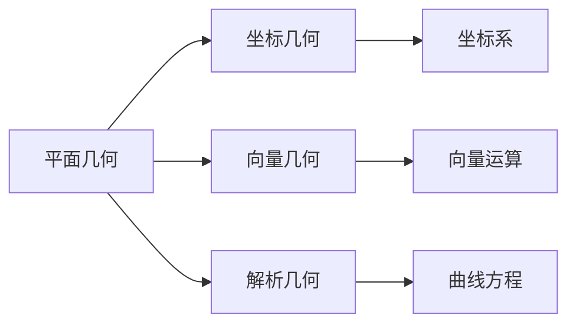

# 2.1 平面几何 | Plane Geometry

## 概述 | Overview

平面几何是几何学的基础，研究平面上的点、线、面及其相互关系。本章将系统介绍基本几何概念、三角形、四边形、圆的性质与应用，以及相似与全等理论。

## 1. 基本几何概念 | Basic Geometric Concepts

### 1.1 点、线、面 | Points, Lines, and Planes

**点**：几何空间中的基本元素，没有大小，只有位置。

**线**：由无数个点组成的几何体，有长度，没有宽度和高度。

**面**：由无数条线组成的几何体，有长度和宽度，没有高度。

**基本公理**：

1. **两点确定一条直线**
2. **三点不共线确定一个平面**
3. **两条直线相交于一点**
4. **平行公理**：过直线外一点有且仅有一条直线与已知直线平行

### 1.2 角的概念 | Concept of Angles

**角的定义**：两条射线从同一点出发所形成的图形。

**角的分类**：

- **锐角**：0° < θ < 90°
- **直角**：θ = 90°
- **钝角**：90° < θ < 180°
- **平角**：θ = 180°
- **周角**：θ = 360°

**角的度量**：

- **角度制**：以度为单位
- **弧度制**：以弧度为单位
- **转换关系**：1° = $\frac{\pi}{180}$ 弧度

### 1.3 平行线与垂直线 | Parallel and Perpendicular Lines

**平行线**：在同一平面内，永不相交的两条直线。

**平行线性质**：

1. 两条平行线之间的距离处处相等
2. 平行线被第三条直线所截，同位角相等
3. 平行线被第三条直线所截，内错角相等
4. 平行线被第三条直线所截，同旁内角互补

**垂直线**：两条直线相交成直角。

**垂直线性质**：

1. 两条垂直线相交成四个直角
2. 点到直线的距离是点到直线的垂线段的长度
3. 两条直线互相垂直，则它们的斜率乘积为-1

## 2. 三角形 | Triangles

### 2.1 三角形的基本概念 | Basic Concepts of Triangles

**三角形定义**：由三条线段围成的平面图形。

**三角形分类**：

**按边长分类**：

- **等边三角形**：三条边相等
- **等腰三角形**：两条边相等
- **不等边三角形**：三条边都不相等

**按角度分类**：

- **锐角三角形**：三个角都是锐角
- **直角三角形**：有一个角是直角
- **钝角三角形**：有一个角是钝角

### 2.2 三角形的性质 | Properties of Triangles

**基本性质**：

1. **内角和**：三角形内角和等于180°
2. **外角和**：三角形外角和等于360°
3. **边的关系**：任意两边之和大于第三边
4. **角的关系**：大边对大角，小边对小角

**重要线段**：

**中线**：连接顶点和对边中点的线段。

- 三条中线交于一点（重心）
- 重心到顶点的距离是到对边中点距离的2倍

**高线**：从顶点向对边或其延长线作的垂线。

- 三条高线交于一点（垂心）
- 锐角三角形的垂心在三角形内部
- 直角三角形的垂心在直角顶点
- 钝角三角形的垂心在三角形外部

**角平分线**：平分内角的射线。

- 三条角平分线交于一点（内心）
- 内心到三边的距离相等

**垂直平分线**：垂直平分边的直线。

- 三条垂直平分线交于一点（外心）
- 外心到三个顶点的距离相等

### 2.3 特殊三角形 | Special Triangles

**等边三角形**：

- 三条边相等，三个角都是60°
- 高线、中线、角平分线、垂直平分线重合
- 面积：$S = \frac{\sqrt{3}}{4}a^2$

**等腰三角形**：

- 两条边相等，两个底角相等
- 顶角平分线、底边中线、底边高线重合
- 面积：$S = \frac{1}{2}bh$

**直角三角形**：

- 有一个角是90°
- 勾股定理：$a^2 + b^2 = c^2$
- 面积：$S = \frac{1}{2}ab$
- 斜边上的高：$h = \frac{ab}{c}$

### 2.4 三角形的面积 | Area of Triangles

**基本公式**：

- $S = \frac{1}{2}bh$（底边高）
- $S = \frac{1}{2}ab\sin C$（两边夹角）
- $S = \sqrt{s(s-a)(s-b)(s-c)}$（海伦公式）

**特殊公式**：

- 等边三角形：$S = \frac{\sqrt{3}}{4}a^2$
- 直角三角形：$S = \frac{1}{2}ab$

## 3. 四边形 | Quadrilaterals

### 3.1 平行四边形 | Parallelograms

**定义**：对边平行的四边形。

**性质**：

1. 对边平行且相等
2. 对角相等
3. 对角线互相平分
4. 对角线的平方和等于四边平方和

**面积公式**：$S = bh$

### 3.2 矩形 | Rectangles

**定义**：四个角都是直角的四边形。

**性质**：

1. 对边平行且相等
2. 四个角都是90°
3. 对角线相等且互相平分
4. 对角线长度：$d = \sqrt{a^2 + b^2}$

**面积公式**：$S = ab$

### 3.3 正方形 | Squares

**定义**：四条边相等且四个角都是直角的四边形。

**性质**：

1. 四条边相等
2. 四个角都是90°
3. 对角线相等且互相垂直平分
4. 对角线长度：$d = a\sqrt{2}$

**面积公式**：$S = a^2$

### 3.4 梯形 | Trapezoids

**定义**：一组对边平行的四边形。

**分类**：

- **等腰梯形**：两条腰相等
- **直角梯形**：有一个角是直角

**面积公式**：$S = \frac{1}{2}(a + b)h$

**中位线**：连接两腰中点的线段，长度等于上下底和的一半。

## 4. 圆 | Circles

### 4.1 圆的基本概念 | Basic Concepts of Circles

**定义**：平面上到定点（圆心）距离相等的点的集合。

**基本元素**：

- **圆心**：圆的中心点
- **半径**：圆心到圆上任意点的距离
- **直径**：通过圆心的弦，长度是半径的2倍
- **弦**：圆上任意两点间的线段
- **弧**：圆上两点间的部分

### 4.2 圆的性质 | Properties of Circles

**基本性质**：

1. 圆心到圆上任意点的距离相等
2. 直径是圆中最长的弦
3. 直径平分圆
4. 圆心角是圆周角的2倍

**弦的性质**：

1. 垂直于弦的直径平分弦
2. 平分弦的直径垂直于弦
3. 等弦对等弧，等弧对等弦

**切线性质**：

1. 切线与半径垂直
2. 从圆外一点到圆的两条切线长度相等
3. 切点与圆心的连线垂直于切线

### 4.3 圆的位置关系 | Positional Relationships of Circles

**两圆的位置关系**：

1. **相离**：两圆没有公共点
2. **外切**：两圆有一个公共点，圆心距等于半径和
3. **相交**：两圆有两个公共点
4. **内切**：两圆有一个公共点，圆心距等于半径差
5. **内含**：一圆在另一圆内部

**直线与圆的位置关系**：

1. **相离**：直线与圆没有公共点
2. **相切**：直线与圆有一个公共点
3. **相交**：直线与圆有两个公共点

### 4.4 圆的面积和周长 | Area and Circumference of Circles

**周长公式**：$C = 2\pi r$

**面积公式**：$S = \pi r^2$

**弧长公式**：$l = \frac{n}{360} \cdot 2\pi r$（n为圆心角度数）

**扇形面积**：$S = \frac{n}{360} \cdot \pi r^2$

## 5. 相似与全等 | Similarity and Congruence

### 5.1 全等三角形 | Congruent Triangles

**定义**：两个三角形能够完全重合。

**全等条件**：

1. **SSS**：三边对应相等
2. **SAS**：两边及其夹角对应相等
3. **ASA**：两角及其夹边对应相等
4. **AAS**：两角及其中一边对应相等
5. **HL**：直角三角形斜边和一条直角边对应相等

### 5.2 相似三角形 | Similar Triangles

**定义**：两个三角形的对应角相等，对应边成比例。

**相似条件**：

1. **AA**：两个角对应相等
2. **SAS**：一个角相等，夹边成比例
3. **SSS**：三边对应成比例

**相似性质**：

1. 对应角相等
2. 对应边成比例
3. 对应高、中线、角平分线成比例
4. 面积比等于相似比的平方

### 5.3 相似多边形 | Similar Polygons

**定义**：两个多边形的对应角相等，对应边成比例。

**相似性质**：

1. 对应角相等
2. 对应边成比例
3. 对应对角线成比例
4. 面积比等于相似比的平方
5. 周长比等于相似比

## 6. 几何证明 | Geometric Proofs

### 6.1 证明方法 | Proof Methods

**直接证明**：从已知条件直接推导出结论。

**反证法**：假设结论不成立，推导出矛盾。

**归纳法**：通过证明特殊情况，推广到一般情况。

**构造法**：通过构造辅助线或辅助图形来证明。

### 6.2 常用辅助线 | Common Auxiliary Lines

**中点连线**：连接三角形两边中点。

**平行线**：过一点作已知直线的平行线。

**垂线**：过一点作已知直线的垂线。

**角平分线**：作已知角的平分线。

**中位线**：连接三角形两边中点的线段。

## 7. 应用实例 | Application Examples

### 7.1 测量应用 | Measurement Applications

**例1：测量高度**
利用相似三角形测量建筑物高度。

**解**：

- 设建筑物高度为h
- 利用相似三角形：$\frac{h}{d_1} = \frac{h'}{d_2}$
- $h = \frac{d_1 \cdot h'}{d_2}$

**例2：测量距离**
利用勾股定理测量不可直接测量的距离。

**解**：

- 构造直角三角形
- 利用勾股定理：$c = \sqrt{a^2 + b^2}$

### 7.2 设计应用 | Design Applications

**例1：圆形花坛设计**
设计一个半径为5m的圆形花坛，求周长和面积。

**解**：

- 周长：$C = 2\pi \cdot 5 = 10\pi$ m
- 面积：$S = \pi \cdot 5^2 = 25\pi$ m²

**例2：矩形场地设计**
设计一个面积为100m²的矩形场地，求最小周长。

**解**：

- 设长为x，宽为y
- xy = 100，求2(x + y)的最小值
- 当x = y = 10时，周长最小为40m

### 7.3 工程应用 | Engineering Applications

**例1：桥梁设计**
设计一个拱形桥梁，拱形可以用圆弧表示。

**解**：

- 利用圆的几何性质
- 计算拱形的弧长和面积
- 考虑结构的稳定性

**例2：道路设计**
设计一条弯曲的道路，需要考虑转弯半径。

**解**：

- 利用圆的切线性质
- 计算转弯半径
- 确保车辆安全通过

## 8. 知识关联 | Knowledge Connections

### 8.1 与代数的关联 | Connections with Algebra

### 8.2 与三角函数的关联 | Connections with Trigonometry

- **三角形**：正弦定理、余弦定理
- **圆**：弧度制、三角函数定义
- **角度**：角度与弧度的转换

### 8.3 与微积分的关联 | Connections with Calculus

- **面积计算**：定积分的几何意义
- **弧长计算**：曲线积分的应用
- **体积计算**：旋转体的体积

## 9. 习题与练习 | Exercises and Practice

### 9.1 基础练习 | Basic Exercises

1. **三角形问题**
   - 在△ABC中，A = 30°, B = 60°, c = 10，求a和b
   - 证明：三角形内角和等于180°

2. **四边形问题**
   - 证明：平行四边形的对角线互相平分
   - 求正方形的对角线长度

3. **圆的问题**
   - 求半径为5的圆的周长和面积
   - 证明：直径是圆中最长的弦

### 9.2 提高练习 | Advanced Exercises

1. **相似三角形**
   - 在△ABC中，D、E分别是AB、AC的中点，证明DE∥BC
   - 利用相似三角形测量不可直接测量的距离

2. **几何证明**
   - 证明：三角形的三条高线交于一点
   - 证明：圆内接四边形的对角互补

3. **实际应用**
   - 设计一个面积为100m²的矩形花园，求最小周长
   - 利用几何知识解决测量问题

### 9.3 竞赛练习 | Competition Exercises

1. **综合应用**
   - 证明：三角形内切圆半径$r = \frac{S}{s}$
   - 证明：三角形外接圆半径$R = \frac{abc}{4S}$

2. **复杂问题**
   - 在圆内接四边形中，证明对角线乘积等于对边乘积之和
   - 利用几何变换解决复杂几何问题

## 总结 | Summary

平面几何是几何学的基础，通过系统学习：

1. **基本概念**：理解点、线、面的基本概念
2. **图形性质**：掌握各种图形的性质
3. **证明方法**：学会几何证明的基本方法
4. **实际应用**：能够将几何知识应用于实际问题

这些知识和技能为后续的立体几何和解析几何学习奠定了坚实的基础。

---

*平面几何是几何学的基础，掌握好这些内容，将为几何学习的深入发展提供强有力的支撑。*
