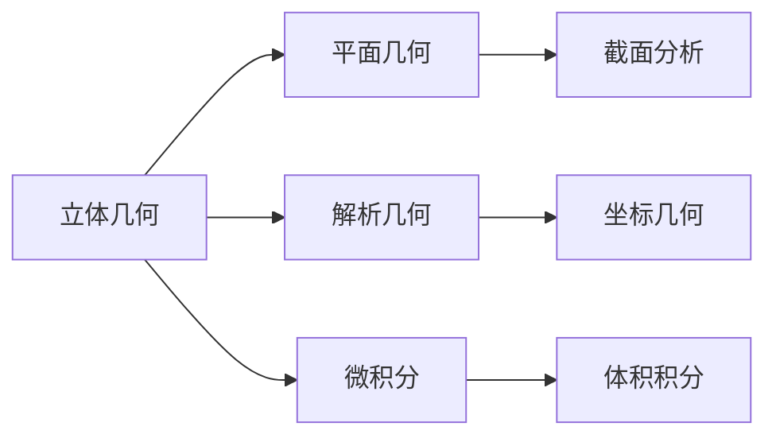

# 2.2 立体几何 | Solid Geometry

## 概述 | Overview

立体几何研究三维空间中的几何体及其性质。
本章将系统介绍空间几何基础、多面体、旋转体、空间向量以及立体几何的计算方法。

## 1. 空间几何基础 | Basic Spatial Geometry

### 1.1 空间点、线、面 | Spatial Points, Lines, and Planes

**空间点**：三维空间中的基本元素，用坐标(x, y, z)表示。

**空间直线**：三维空间中的直线，可以用参数方程表示：

$$
\begin{cases}
x = x_0 + at \\
y = y_0 + bt \\
z = z_0 + ct
\end{cases}
$$

**空间平面**：三维空间中的平面，可以用一般式表示：
$$Ax + By + Cz + D = 0$$

**空间几何公理**：

1. **不共线三点确定一个平面**
2. **两条相交直线确定一个平面**
3. **一条直线和直线外一点确定一个平面**
4. **两个平行平面之间的距离处处相等**

### 1.2 空间位置关系 | Spatial Positional Relationships

**直线与直线的关系**：

1. **相交**：两条直线有且仅有一个公共点
2. **平行**：两条直线在同一平面内且不相交
3. **异面**：两条直线不在同一平面内

**直线与平面的关系**：

1. **直线在平面内**：直线上所有点都在平面内
2. **直线与平面相交**：直线与平面有且仅有一个公共点
3. **直线与平面平行**：直线与平面没有公共点

**平面与平面的关系**：

1. **相交**：两个平面有公共直线
2. **平行**：两个平面没有公共点
3. **重合**：两个平面完全重合

### 1.3 空间距离与角度 | Spatial Distances and Angles

**点到直线的距离**：
$$d = \frac{|\vec{v} \times \vec{u}|}{|\vec{u}|}$$
其中$\vec{v}$是从点到直线上一点的向量，$\vec{u}$是直线的方向向量。

**点到平面的距离**：
$$d = \frac{|Ax_0 + By_0 + Cz_0 + D|}{\sqrt{A^2 + B^2 + C^2}}$$
其中(x₀, y₀, z₀)是点的坐标，(A, B, C, D)是平面方程。

**两直线间的距离**：
$$d = \frac{|\vec{v}_1 \times \vec{v}_2 \cdot \vec{P}_1\vec{P}_2|}{|\vec{v}_1 \times \vec{v}_2|}$$
其中$\vec{v}_1, \vec{v}_2$是两直线的方向向量，$\vec{P}_1\vec{P}_2$是两直线上点的连线向量。

## 2. 多面体 | Polyhedra

### 2.1 棱柱 | Prisms

**定义**：两个全等的多边形平行放置，对应顶点用平行线段连接形成的几何体。

**分类**：

- **直棱柱**：侧棱垂直于底面
- **斜棱柱**：侧棱不垂直于底面
- **正棱柱**：底面是正多边形且是直棱柱

**性质**：

1. 上下底面全等且平行
2. 侧棱平行且相等
3. 侧面都是平行四边形
4. 体积：$V = Sh$（S为底面积，h为高）

**表面积**：

- 侧面积：$S_{侧} = ph$（p为底面周长，h为高）
- 全面积：$S_{全} = S_{侧} + 2S_{底}$

### 2.2 棱锥 | Pyramids

**定义**：一个多边形底面和一个顶点，顶点到底面各顶点的连线形成的几何体。

**分类**：

- **正棱锥**：底面是正多边形，顶点在底面中心的正上方
- **直棱锥**：顶点在底面中心的正上方
- **斜棱锥**：顶点不在底面中心的正上方

**性质**：

1. 底面是多边形
2. 侧面都是三角形
3. 体积：$V = \frac{1}{3}Sh$（S为底面积，h为高）

**表面积**：

- 侧面积：$S_{侧} = \frac{1}{2}pl$（p为底面周长，l为斜高）
- 全面积：$S_{全} = S_{侧} + S_{底}$

### 2.3 正多面体 | Regular Polyhedra

**定义**：所有面都是全等的正多边形，所有棱长相等，所有二面角相等的多面体。

**五种正多面体**：

1. **正四面体**：
   - 4个面，都是等边三角形
   - 6条棱，4个顶点
   - 体积：$V = \frac{\sqrt{2}}{12}a^3$

2. **正六面体（立方体）**：
   - 6个面，都是正方形
   - 12条棱，8个顶点
   - 体积：$V = a^3$

3. **正八面体**：
   - 8个面，都是等边三角形
   - 12条棱，6个顶点
   - 体积：$V = \frac{\sqrt{2}}{3}a^3$

4. **正十二面体**：
   - 12个面，都是正五边形
   - 30条棱，20个顶点
   - 体积：$V = \frac{15 + 7\sqrt{5}}{4}a^3$

5. **正二十面体**：
   - 20个面，都是等边三角形
   - 30条棱，12个顶点
   - 体积：$V = \frac{5(3 + \sqrt{5})}{12}a^3$

### 2.4 欧拉公式 | Euler's Formula

**欧拉公式**：对于任何凸多面体，
$$V - E + F = 2$$
其中V是顶点数，E是棱数，F是面数。

**应用**：

- 验证多面体的正确性
- 计算多面体的未知参数
- 证明多面体的性质

## 3. 旋转体 | Solids of Revolution

### 3.1 圆柱 | Cylinders

**定义**：矩形绕其一边旋转一周形成的几何体。

**性质**：

1. 上下底面是全等的圆
2. 母线平行且相等
3. 轴截面是矩形
4. 体积：$V = \pi r^2h$

**表面积**：

- 侧面积：$S_{侧} = 2\pi rh$
- 全面积：$S_{全} = 2\pi r^2 + 2\pi rh$

### 3.2 圆锥 | Cones

**定义**：直角三角形绕其一直角边旋转一周形成的几何体。

**性质**：

1. 底面是圆
2. 母线相等
3. 轴截面是等腰三角形
4. 体积：$V = \frac{1}{3}\pi r^2h$

**表面积**：

- 侧面积：$S_{侧} = \pi rl$（l为母线长）
- 全面积：$S_{全} = \pi r^2 + \pi rl$

**母线长**：$l = \sqrt{r^2 + h^2}$

### 3.3 球 | Spheres

**定义**：半圆绕其直径旋转一周形成的几何体。

**性质**：

1. 所有点到球心的距离相等
2. 球面上任意两点间的距离不超过直径
3. 体积：$V = \frac{4}{3}\pi r^3$
4. 表面积：$S = 4\pi r^2$

**球冠**：球被平面截去一部分后剩余的部分。

- 体积：$V = \frac{\pi h^2(3r - h)}{3}$
- 表面积：$S = 2\pi rh$

**球缺**：球被两个平行平面截去一部分后剩余的部分。

- 体积：$V = \frac{\pi h(3r_1^2 + 3r_2^2 + h^2)}{6}$

### 3.4 其他旋转体 | Other Solids of Revolution

**圆台**：梯形绕其高旋转一周形成的几何体。

- 体积：$V = \frac{1}{3}\pi h(r_1^2 + r_1r_2 + r_2^2)$
- 侧面积：$S_{侧} = \pi l(r_1 + r_2)$

**球台**：球被两个平行平面截去一部分后剩余的部分。

- 体积：$V = \frac{\pi h(3r_1^2 + 3r_2^2 + h^2)}{6}$

## 4. 空间向量 | Spatial Vectors

### 4.1 向量基本概念 | Basic Vector Concepts

**向量定义**：既有大小又有方向的量。

**向量表示**：

- 坐标表示：$\vec{a} = (x, y, z)$
- 分量表示：$\vec{a} = x\vec{i} + y\vec{j} + z\vec{k}$

**向量运算**：

1. **加法**：$\vec{a} + \vec{b} = (x_1 + x_2, y_1 + y_2, z_1 + z_2)$
2. **数乘**：$k\vec{a} = (kx, ky, kz)$
3. **点积**：$\vec{a} \cdot \vec{b} = x_1x_2 + y_1y_2 + z_1z_2$
4. **叉积**：$\vec{a} \times \vec{b} = (y_1z_2 - z_1y_2, z_1x_2 - x_1z_2, x_1y_2 - y_1x_2)$

### 4.2 向量性质 | Vector Properties

**点积性质**：

1. $\vec{a} \cdot \vec{b} = |\vec{a}||\vec{b}|\cos\theta$
2. $\vec{a} \cdot \vec{b} = \vec{b} \cdot \vec{a}$
3. $(\vec{a} + \vec{b}) \cdot \vec{c} = \vec{a} \cdot \vec{c} + \vec{b} \cdot \vec{c}$

**叉积性质**：

1. $|\vec{a} \times \vec{b}| = |\vec{a}||\vec{b}|\sin\theta$
2. $\vec{a} \times \vec{b} = -\vec{b} \times \vec{a}$
3. $(\vec{a} + \vec{b}) \times \vec{c} = \vec{a} \times \vec{c} + \vec{b} \times \vec{c}$

### 4.3 向量应用 | Vector Applications

**平面方程**：过点P₀(x₀, y₀, z₀)且法向量为$\vec{n} = (A, B, C)$的平面方程为：
$$A(x - x_0) + B(y - y_0) + C(z - z_0) = 0$$

**直线方程**：过点P₀(x₀, y₀, z₀)且方向向量为$\vec{v} = (a, b, c)$的直线方程为：
$$\frac{x - x_0}{a} = \frac{y - y_0}{b} = \frac{z - z_0}{c}$$

**距离公式**：

- 点到平面距离：$d = \frac{|\vec{n} \cdot \vec{P_0P}|}{|\vec{n}|}$
- 点到直线距离：$d = \frac{|\vec{v} \times \vec{P_0P}|}{|\vec{v}|}$

## 5. 几何计算 | Geometric Calculations

### 5.1 体积计算 | Volume Calculations

**基本公式**：

- 棱柱：$V = Sh$
- 棱锥：$V = \frac{1}{3}Sh$
- 圆柱：$V = \pi r^2h$
- 圆锥：$V = \frac{1}{3}\pi r^2h$
- 球：$V = \frac{4}{3}\pi r^3$

**组合体体积**：

- 相加法：将复杂几何体分解为简单几何体
- 相减法：从大几何体中减去小几何体
- 积分法：使用定积分计算体积

### 5.2 表面积计算 | Surface Area Calculations

**基本公式**：

- 棱柱：$S_{全} = S_{侧} + 2S_{底}$
- 棱锥：$S_{全} = S_{侧} + S_{底}$
- 圆柱：$S_{全} = 2\pi r^2 + 2\pi rh$
- 圆锥：$S_{全} = \pi r^2 + \pi rl$
- 球：$S = 4\pi r^2$

**侧面积计算**：

- 棱柱：$S_{侧} = ph$
- 棱锥：$S_{侧} = \frac{1}{2}pl$
- 圆柱：$S_{侧} = 2\pi rh$
- 圆锥：$S_{侧} = \pi rl$

### 5.3 几何变换 | Geometric Transformations

**平移**：几何体在空间中沿某个方向移动。

- 保持形状和大小不变
- 改变位置

**旋转**：几何体绕某条轴旋转。

- 保持形状和大小不变
- 改变方向

**缩放**：几何体按比例放大或缩小。

- 保持形状不变
- 改变大小

**反射**：几何体关于某个平面对称。

- 保持形状和大小不变
- 改变方向

## 6. 应用实例 | Application Examples

### 6.1 建筑应用 | Architectural Applications

**例1：圆柱形储罐**
设计一个容积为1000m³的圆柱形储罐，求最小表面积。

**解**：

- 设半径为r，高为h
- 体积：$\pi r^2h = 1000$
- 表面积：$S = 2\pi r^2 + 2\pi rh$
- 当$h = 2r$时，表面积最小
- $r = \sqrt[3]{\frac{500}{\pi}} \approx 5.4m$

**例2：圆锥形帐篷**
设计一个底面半径为3m，高为4m的圆锥形帐篷，求表面积。

**解**：

- 母线长：$l = \sqrt{3^2 + 4^2} = 5m$
- 侧面积：$S_{侧} = \pi \cdot 3 \cdot 5 = 15\pi$ m²
- 底面积：$S_{底} = \pi \cdot 3^2 = 9\pi$ m²
- 全面积：$S_{全} = 24\pi$ m²

### 6.2 工程应用 | Engineering Applications

**例1：球形容器**
设计一个表面积为100m²的球形容器，求体积。

**解**：

- 表面积：$4\pi r^2 = 100$
- 半径：$r = \sqrt{\frac{25}{\pi}} \approx 2.8m$
- 体积：$V = \frac{4}{3}\pi r^3 \approx 92.4$ m³

**例2：棱锥形塔**
设计一个底面边长为10m的正方形，高为20m的正四棱锥形塔，求体积和表面积。

**解**：

- 底面积：$S_{底} = 10^2 = 100$ m²
- 体积：$V = \frac{1}{3} \cdot 100 \cdot 20 = \frac{2000}{3}$ m³
- 斜高：$l = \sqrt{5^2 + 20^2} = \sqrt{425} \approx 20.6m$
- 侧面积：$S_{侧} = \frac{1}{2} \cdot 40 \cdot 20.6 = 412$ m²
- 全面积：$S_{全} = 412 + 100 = 512$ m²

### 6.3 物理应用 | Physics Applications

**例1：流体力学**
计算圆柱形容器中液体的体积。

**解**：

- 使用圆柱体积公式：$V = \pi r^2h$
- 考虑液体的实际高度
- 计算液体的质量：$m = \rho V$

**例2：热力学**
计算球形容器的表面积与体积比。

**解**：

- 表面积：$S = 4\pi r^2$
- 体积：$V = \frac{4}{3}\pi r^3$
- 比值：$\frac{S}{V} = \frac{3}{r}$

## 7. 知识关联 | Knowledge Connections

### 7.1 与平面几何的关联 | Connections with Plane Geometry

### 7.2 与代数的关联 | Connections with Algebra

- **向量运算**：向量的代数运算
- **坐标几何**：空间坐标系的建立
- **方程求解**：几何问题的代数解法

### 7.3 与微积分的关联 | Connections with Calculus

- **体积积分**：使用定积分计算体积
- **表面积积分**：使用定积分计算表面积
- **曲线积分**：计算空间曲线的长度

## 8. 习题与练习 | Exercises and Practice

### 8.1 基础练习 | Basic Exercises

1. **多面体问题**
   - 求边长为a的正四面体的体积
   - 求边长为a的正六面体的表面积

2. **旋转体问题**
   - 求半径为r，高为h的圆柱的体积和表面积
   - 求半径为r的球的体积和表面积

3. **向量问题**
   - 计算向量$\vec{a} = (1, 2, 3)$和$\vec{b} = (4, 5, 6)$的点积和叉积
   - 求点P(1, 2, 3)到平面2x + 3y + 4z = 5的距离

### 8.2 提高练习 | Advanced Exercises

1. **组合体问题**
   - 求一个底面半径为r，高为h的圆柱内接一个圆锥的体积
   - 求一个边长为a的正方体内切球的体积

2. **几何证明**
   - 证明：正四面体的高线交于一点
   - 证明：球的表面积是体积对半径的导数

3. **实际应用**
   - 设计一个容积为1000L的圆柱形储罐，求最小表面积
   - 计算一个圆锥形沙堆的体积

### 8.3 竞赛练习 | Competition Exercises

1. **综合应用**
   - 证明：正多面体只有五种
   - 求一个球内接正四面体的体积

2. **复杂问题**
   - 求一个球被两个平行平面截去一部分后的体积
   - 计算一个复杂几何体的表面积

## 典型例题与详细解答 | Typical Examples and Detailed Solutions

### 例题1：正方体体积 | Example 1: Volume of Cube

**题目 | Problem**：已知正方体的棱长为3，求其体积。
**解答 | Solution**：
体积=棱长³=3³=27。
Volume = side³ = 3³ = 27.

### 例题2：正方体对角线长度 | Example 2: Diagonal of Cube

**题目 | Problem**：已知正方体的棱长为2，求其空间对角线长度。
**解答 | Solution**：
空间对角线=2×√3≈3.464。
Space diagonal = 2×√3 ≈ 3.464.

### 例题3：空间中两直线的位置关系 | Example 3: Position Relationship of Two Lines in Space

**题目 | Problem**：空间中两直线l₁: x=1, y=2与l₂: x=2, y=1，判断其位置关系。
**解答 | Solution**：
两直线不平行也不相交，互为异面直线。
The two lines are neither parallel nor intersecting, so they are skew lines.

### 例题4：球的表面积 | Example 4: Surface Area of Sphere

**题目 | Problem**：已知球的半径为4，求其表面积。
**解答 | Solution**：
表面积=4πr²=4π×16=64π。
Surface area = 4πr² = 64π.

### 例题5：空间向量夹角 | Example 5: Angle Between Vectors in Space

**题目 | Problem**：已知向量a=(1,2,2)，b=(2,1,2)，求两向量夹角的余弦值。
**解答 | Solution**：
a·b=1×2+2×1+2×2=8
|a|=√(1²+2²+2²)=3
|b|=√(2²+1²+2²)=3
cosθ=8/(3×3)=8/9
The cosine of the angle is 8/9.

## 创新与挑战性例题 | Innovative and Challenging Examples

### 例题6：空间异面直线距离 | Example 6: Distance Between Skew Lines

**题目 | Problem**：已知空间中两异面直线l₁: (1,2,3)+t(1,0,0)，l₂: (2,1,0)+s(0,1,1)，求它们的距离。
**解答 | Solution**：
PQ=向量(−1,1,3)，a=(1,0,0)，b=(0,1,1)
距离d=|a×b·PQ|/|a×b|=3/√2
The distance is d=|a×b·PQ|/|a×b|=3/√2.

### 例题7：球的体积与表面积比 | Example 7: Ratio of Volume to Surface Area of Sphere

**题目 | Problem**：已知球的半径为r，求其体积与表面积的比值。
**解答 | Solution**：
体积V=4/3πr³，表面积S=4πr²，V/S=r/3
Volume V=4/3πr³, Surface area S=4πr², V/S=r/3.

### 例题8：空间向量综合 | Example 8: Comprehensive Application of Space Vectors

**题目 | Problem**：已知向量a=(1,2,2)，b=(2,1,2)，求a与b的夹角θ。
**解答 | Solution**：
a·b=8，|a|=|b|=3，cosθ=8/9，θ=arccos(8/9)
The angle θ=arccos(8/9).

## 7. 现代前沿与多学科创新 | Modern Frontiers and Multidisciplinary Innovations

### 7.1 立体几何在AI、自动化证明、知识图谱、可视化数学、计算机科学、物理等领域的创新应用 | Applications of Solid Geometry in AI, Automated Proof, Knowledge Graphs, Visual Mathematics, Computer Science, Physics

- 立体几何在AI三维建模、自动化空间证明、知识图谱结构、可视化数学、计算机科学、物理建模等领域有广泛应用。
- Solid geometry is widely applied in AI 3D modeling, automated spatial proof, knowledge graph structures, visual mathematics, computer science, physical modeling, etc.
- 例：AI中的三维物体识别、自动化空间定理证明器、知识图谱中的空间关系、可视化立体构造、物理中的空间运动建模。
- Examples: 3D object recognition in AI, automated spatial theorem provers, spatial relations in knowledge graphs, visual solid constructions, spatial motion modeling in physics.

### 7.2 结构主义、范畴论、模型论等理论对立体几何的影响 | Impact of Structuralism, Category Theory, Model Theory on Solid Geometry

- 结构主义强调空间结构的层次性与公理化，范畴论、模型论推动立体几何的抽象化与统一化。
- Structuralism emphasizes the hierarchy and axiomatization of spatial structures; category theory and model theory promote abstraction and unification of solid geometry.
- 例：范畴论中的空间对象与态射，模型论中的空间结构解释。
- Examples: spatial objects and morphisms in category theory, spatial structure interpretations in model theory.

### 7.3 形式化立体几何在自动化证明、AI推理中的作用与局限 | Formal Solid Geometry in Automated Proof, AI Reasoning

- 形式化立体几何（如Lean、Coq、Isabelle中的空间表达）在自动化证明、AI推理中提升了表达力与严谨性。
- Formal solid geometry (spatial expressions in Lean, Coq, Isabelle, etc.) enhances expressiveness and rigor in automated proof and AI reasoning.
- 局限：高阶空间结构、复杂三维图形、动态系统、多模态推理等仍需人工建模与解释。
- Limitations: higher-order spatial structures, complex 3D figures, dynamic systems, multi-modal reasoning still require manual modeling and interpretation.

### 7.4 哲学基础与认知科学视角下的立体几何 | Philosophical and Cognitive Perspectives on Solid Geometry

- 立体几何的本体论、认识论基础，认知科学对空间理解与学习的研究。
- Ontological and epistemological foundations of solid geometry; cognitive science research on understanding and learning spatial concepts.
- 例：空间直观、认知负荷、抽象与具体的转换、空间思维发展。
- Examples: spatial intuition, cognitive load, transformation between abstraction and concreteness, development of spatial thinking.

### 7.5 国际竞赛与前沿研究中的创新例题与方法 | Innovative Problems and Methods in Competitions and Research

- 例题：AI中的三维物体识别、自动化空间定理证明、知识图谱空间推理、可视化立体建模。
- Example: 3D object recognition in AI, automated spatial theorem proving, spatial reasoning in knowledge graphs, visual solid modeling.
- 前沿方法：结合自动化证明、AI、认知科学等工具创新立体几何的表达与应用。
- Frontier methods: combine automated proof, AI, cognitive science to innovate expression and application of solid geometry.

> 本节内容进一步结合AI、知识图谱、范畴论、认知科学等最新前沿，持续递归扩展立体几何的理论深度与现实创新。

## 总结 | Summary

立体几何是几何学的重要组成部分，通过系统学习：

1. **空间概念**：理解三维空间中的几何概念
2. **几何体性质**：掌握各种几何体的性质
3. **计算方法**：学会体积和表面积的计算
4. **实际应用**：能够将立体几何知识应用于实际问题

这些知识和技能为后续的解析几何和微积分学习奠定了坚实的基础。

---

*立体几何是连接平面几何与高等数学的重要桥梁，掌握好这些内容，将为数学学习的深入发展提供强有力的支撑。*
