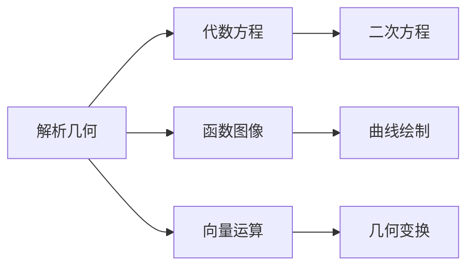

# 2.3 解析几何 | Analytic Geometry

## 概述 | Overview

解析几何是几何学与代数学的结合，通过坐标系将几何问题转化为代数问题。本章将系统介绍坐标系、直线、圆锥曲线、参数方程以及极坐标方程等内容。

## 1. 坐标系 | Coordinate Systems

### 1.1 直角坐标系 | Rectangular Coordinate System

**平面直角坐标系**：

- 两条互相垂直的数轴
- 横轴（x轴）和纵轴（y轴）
- 原点O(0, 0)
- 点的坐标表示为(x, y)

**空间直角坐标系**：

- 三条互相垂直的数轴
- x轴、y轴、z轴
- 原点O(0, 0, 0)
- 点的坐标表示为(x, y, z)

**坐标系性质**：

1. **距离公式**：$d = \sqrt{(x_2 - x_1)^2 + (y_2 - y_1)^2}$
2. **中点公式**：$M(\frac{x_1 + x_2}{2}, \frac{y_1 + y_2}{2})$
3. **分点公式**：$P(\frac{mx_2 + nx_1}{m + n}, \frac{my_2 + ny_1}{m + n})$

### 1.2 极坐标系 | Polar Coordinate System

**平面极坐标系**：

- 极点O（原点）
- 极轴（参考轴）
- 点的坐标表示为(r, θ)
- r为极径（点到极点的距离）
- θ为极角（极轴到点的角度）

**坐标转换**：

- 极坐标转直角坐标：$x = r\cos\theta$, $y = r\sin\theta$
- 直角坐标转极坐标：$r = \sqrt{x^2 + y^2}$, $\theta = \arctan\frac{y}{x}$

**极坐标性质**：

1. **距离公式**：$d = \sqrt{r_1^2 + r_2^2 - 2r_1r_2\cos(\theta_1 - \theta_2)}$
2. **对称性**：(r, θ)与(r, -θ)关于极轴对称

### 1.3 其他坐标系 | Other Coordinate Systems

**柱坐标系**：

- 空间坐标系的一种
- 坐标表示为(ρ, θ, z)
- ρ为到z轴的距离，θ为方位角，z为高度

**球坐标系**：

- 空间坐标系的一种
- 坐标表示为(r, θ, φ)
- r为到原点的距离，θ为方位角，φ为仰角

## 2. 直线 | Lines

### 2.1 直线方程 | Line Equations

**一般式**：$Ax + By + C = 0$

**斜截式**：$y = kx + b$

- k为斜率
- b为y轴截距

**点斜式**：$y - y_1 = k(x - x_1)$

- 过点(x₁, y₁)且斜率为k

**两点式**：$\frac{y - y_1}{y_2 - y_1} = \frac{x - x_1}{x_2 - x_1}$

- 过两点(x₁, y₁)和(x₂, y₂)

**截距式**：$\frac{x}{a} + \frac{y}{b} = 1$

- a为x轴截距，b为y轴截距

### 2.2 直线性质 | Line Properties

**斜率**：

- 定义：$k = \tan\alpha = \frac{y_2 - y_1}{x_2 - x_1}$
- 平行线：斜率相等
- 垂直线：斜率乘积为-1

**距离**：

- 点到直线距离：$d = \frac{|Ax_0 + By_0 + C|}{\sqrt{A^2 + B^2}}$
- 两平行线距离：$d = \frac{|C_2 - C_1|}{\sqrt{A^2 + B^2}}$

**夹角**：

- 两直线夹角：$\tan\theta = |\frac{k_2 - k_1}{1 + k_1k_2}|$

### 2.3 直线应用 | Line Applications

**例1：直线方程**
求过点(2, 3)且斜率为2的直线方程。

**解**：

- 使用点斜式：$y - 3 = 2(x - 2)$
- 整理得：$y = 2x - 1$

**例2：距离计算**
求点P(1, 2)到直线3x + 4y - 5 = 0的距离。

**解**：

- $d = \frac{|3 \cdot 1 + 4 \cdot 2 - 5|}{\sqrt{3^2 + 4^2}} = \frac{|3 + 8 - 5|}{5} = \frac{6}{5}$

## 3. 圆锥曲线 | Conic Sections

### 3.1 圆 | Circles

**标准方程**：$(x - h)^2 + (y - k)^2 = r^2$

- 圆心：(h, k)
- 半径：r

**一般方程**：$x^2 + y^2 + Dx + Ey + F = 0$

- 圆心：$(-\frac{D}{2}, -\frac{E}{2})$
- 半径：$r = \sqrt{\frac{D^2 + E^2}{4} - F}$

**圆的性质**：

1. 圆心到圆上任意点的距离相等
2. 直径是圆中最长的弦
3. 切线垂直于半径

**例**：求圆心为(2, -1)，半径为3的圆的方程。

**解**：

- $(x - 2)^2 + (y + 1)^2 = 9$

### 3.2 椭圆 | Ellipses

**标准方程**：

- 长轴在x轴：$\frac{x^2}{a^2} + \frac{y^2}{b^2} = 1$（a > b）
- 长轴在y轴：$\frac{x^2}{b^2} + \frac{y^2}{a^2} = 1$（a > b）

**椭圆性质**：

1. **焦点**：F₁(-c, 0), F₂(c, 0)，其中$c^2 = a^2 - b^2$
2. **离心率**：$e = \frac{c}{a} < 1$
3. **准线**：$x = \pm\frac{a}{e}$
4. **面积**：$S = \pi ab$

**椭圆定义**：

- 到两定点的距离之和为常数的点的轨迹
- $PF_1 + PF_2 = 2a$

**例**：求椭圆$\frac{x^2}{25} + \frac{y^2}{16} = 1$的焦点和离心率。

**解**：

- $a = 5$, $b = 4$
- $c = \sqrt{25 - 16} = 3$
- 焦点：F₁(-3, 0), F₂(3, 0)
- 离心率：$e = \frac{3}{5}$

### 3.3 双曲线 | Hyperbolas

**标准方程**：

- 实轴在x轴：$\frac{x^2}{a^2} - \frac{y^2}{b^2} = 1$
- 实轴在y轴：$\frac{y^2}{a^2} - \frac{x^2}{b^2} = 1$

**双曲线性质**：

1. **焦点**：F₁(-c, 0), F₂(c, 0)，其中$c^2 = a^2 + b^2$
2. **离心率**：$e = \frac{c}{a} > 1$
3. **准线**：$x = \pm\frac{a}{e}$
4. **渐近线**：$y = \pm\frac{b}{a}x$

**双曲线定义**：

- 到两定点的距离之差的绝对值为常数的点的轨迹
- $|PF_1 - PF_2| = 2a$

**例**：求双曲线$\frac{x^2}{16} - \frac{y^2}{9} = 1$的焦点和渐近线。

**解**：

- $a = 4$, $b = 3$
- $c = \sqrt{16 + 9} = 5$
- 焦点：F₁(-5, 0), F₂(5, 0)
- 渐近线：$y = \pm\frac{3}{4}x$

### 3.4 抛物线 | Parabolas

**标准方程**：

- 开口向右：$y^2 = 4px$
- 开口向左：$y^2 = -4px$
- 开口向上：$x^2 = 4py$
- 开口向下：$x^2 = -4py$

**抛物线性质**：

1. **焦点**：F(p, 0)（开口向右）
2. **准线**：$x = -p$（开口向右）
3. **离心率**：e = 1
4. **对称轴**：y = 0（开口向右）

**抛物线定义**：

- 到定点和定直线距离相等的点的轨迹
- $PF = d$（P到焦点F的距离等于P到准线的距离）

**例**：求抛物线$y^2 = 8x$的焦点和准线。

**解**：

- $4p = 8$，所以$p = 2$
- 焦点：F(2, 0)
- 准线：$x = -2$

## 4. 参数方程 | Parametric Equations

### 4.1 参数方程概念 | Concept of Parametric Equations

**定义**：用参数t表示曲线上点的坐标的方程。

**一般形式**：
$$\begin{cases}
x = f(t) \\
y = g(t)
\end{cases}$$

**参数方程的应用**：
1. 描述复杂曲线
2. 表示运动轨迹
3. 简化计算

### 4.2 常见曲线的参数方程 | Parametric Equations of Common Curves

**直线的参数方程**：
$$\begin{cases}
x = x_0 + at \\
y = y_0 + bt
\end{cases}$$
其中(x₀, y₀)是直线上一点，(a, b)是方向向量。

**圆的参数方程**：
$$\begin{cases}
x = h + r\cos t \\
y = k + r\sin t
\end{cases}$$
其中(h, k)是圆心，r是半径，t ∈ [0, 2π]。

**椭圆的参数方程**：
$$\begin{cases}
x = h + a\cos t \\
y = k + b\sin t
\end{cases}$$
其中(h, k)是中心，a、b是半轴长，t ∈ [0, 2π]。

**双曲线的参数方程**：
$$\begin{cases}
x = h + a\sec t \\
y = k + b\tan t
\end{cases}$$
其中(h, k)是中心，a、b是半轴长。

**抛物线的参数方程**：
$$\begin{cases}
x = h + 2pt^2 \\
y = k + 2pt
\end{cases}$$
其中(h, k)是顶点，p是焦点到顶点的距离。

### 4.3 参数方程的应用 | Applications of Parametric Equations

**例1：运动轨迹**
一个物体做匀速圆周运动，求其轨迹的参数方程。

**解**：
- 设圆心为原点，半径为r，角速度为ω
- $x = r\cos(\omega t)$
- $y = r\sin(\omega t)$

**例2：摆线**
一个圆在直线上滚动，圆上一点的轨迹称为摆线。

**解**：
- 设圆的半径为r
- $x = r(t - \sin t)$
- $y = r(1 - \cos t)$

## 5. 极坐标方程 | Polar Coordinate Equations

### 5.1 极坐标方程概念 | Concept of Polar Coordinate Equations

**定义**：用极坐标(r, θ)表示的曲线方程。

**常见极坐标方程**：

**圆**：
- 圆心在极点：$r = a$
- 圆心在极轴上：$r = 2a\cos\theta$

**直线**：
- 过极点：$\theta = \alpha$
- 不过极点：$r = \frac{p}{\cos(\theta - \alpha)}$

**圆锥曲线**：
- 椭圆：$r = \frac{ep}{1 - e\cos\theta}$
- 双曲线：$r = \frac{ep}{1 - e\cos\theta}$
- 抛物线：$r = \frac{p}{1 - \cos\theta}$

### 5.2 特殊曲线 | Special Curves

**心形线**：$r = a(1 + \cos\theta)$

**玫瑰线**：$r = a\sin(n\theta)$或$r = a\cos(n\theta)$

**螺旋线**：$r = a\theta$

**双纽线**：$r^2 = a^2\cos(2\theta)$

### 5.3 极坐标方程的应用 | Applications of Polar Coordinate Equations

**例1：心形线**
绘制心形线$r = 2(1 + \cos\theta)$的图像。

**解**：
- 当θ = 0时，r = 4
- 当θ = π时，r = 0
- 当θ = π/2时，r = 2
- 当θ = 3π/2时，r = 2

**例2：玫瑰线**
绘制四叶玫瑰线$r = 2\sin(2\theta)$的图像。

**解**：
- 当θ = 0时，r = 0
- 当θ = π/4时，r = 2
- 当θ = π/2时，r = 0
- 当θ = 3π/4时，r = -2

## 6. 几何变换 | Geometric Transformations

### 6.1 平移变换 | Translation

**平移公式**：
$$\begin{cases}
x' = x + h \\
y' = y + k
\end{cases}$$
其中(h, k)是平移向量。

**例**：将圆$(x - 2)^2 + (y - 1)^2 = 4$向右平移3个单位，向上平移2个单位。

**解**：
- 新圆心：(2 + 3, 1 + 2) = (5, 3)
- 新方程：$(x - 5)^2 + (y - 3)^2 = 4$

### 6.2 旋转变换 | Rotation

**旋转公式**：
$$\begin{cases}
x' = x\cos\theta - y\sin\theta \\
y' = x\sin\theta + y\cos\theta
\end{cases}$$
其中θ是旋转角度。

**例**：将点(1, 0)绕原点逆时针旋转90°。

**解**：
- $x' = 1 \cdot \cos 90° - 0 \cdot \sin 90° = 0$
- $y' = 1 \cdot \sin 90° + 0 \cdot \cos 90° = 1$
- 新坐标：(0, 1)

### 6.3 缩放变换 | Scaling

**缩放公式**：
$$\begin{cases}
x' = kx \\
y' = ky
\end{cases}$$
其中k是缩放因子。

**例**：将椭圆$\frac{x^2}{4} + \frac{y^2}{9} = 1$在x方向放大2倍。

**解**：
- 新方程：$\frac{x^2}{16} + \frac{y^2}{9} = 1$

## 7. 应用实例 | Application Examples

### 7.1 物理学应用 | Physics Applications

**例1：抛体运动**
物体以初速度v₀、角度θ抛出，其轨迹方程为：
$$y = x\tan\theta - \frac{gx^2}{2v_0^2\cos^2\theta}$$

**解**：
- 这是一个抛物线方程
- 顶点：$(\frac{v_0^2\sin(2\theta)}{2g}, \frac{v_0^2\sin^2\theta}{2g})$
- 射程：$R = \frac{v_0^2\sin(2\theta)}{g}$

**例2：行星轨道**
行星绕太阳的轨道是椭圆，太阳在椭圆的一个焦点上。

**解**：
- 轨道方程：$\frac{x^2}{a^2} + \frac{y^2}{b^2} = 1$
- 太阳位置：F(c, 0)，其中$c^2 = a^2 - b^2$

### 7.2 工程应用 | Engineering Applications

**例1：桥梁设计**
拱桥的形状可以用抛物线表示。

**解**：
- 设抛物线方程为$y = ax^2 + bx + c$
- 根据边界条件确定参数a、b、c
- 计算拱的高度和跨度

**例2：天线设计**
抛物面天线的形状是抛物线绕轴旋转形成的。

**解**：
- 抛物线方程：$y^2 = 4px$
- 旋转后的曲面方程：$x^2 + y^2 = 4pz$

### 7.3 艺术应用 | Artistic Applications

**例1：建筑设计**
某些建筑物的形状可以用圆锥曲线表示。

**解**：
- 圆形建筑：圆
- 椭圆形建筑：椭圆
- 拱形建筑：抛物线

**例2：装饰图案**
许多装饰图案可以用极坐标方程表示。

**解**：
- 心形图案：心形线
- 花朵图案：玫瑰线
- 螺旋图案：螺旋线

## 8. 知识关联 | Knowledge Connections

### 8.1 与代数的关联 | Connections with Algebra

### 8.2 与微积分的关联 | Connections with Calculus

- **切线斜率**：曲线的导数
- **弧长计算**：定积分的应用
- **面积计算**：定积分的几何意义
- **曲率计算**：高阶导数的应用

### 8.3 与物理学的关联 | Connections with Physics

- **运动轨迹**：抛体运动、圆周运动
- **力学分析**：力的分解与合成
- **光学应用**：反射、折射定律

## 9. 习题与练习 | Exercises and Practice

### 9.1 基础练习 | Basic Exercises

1. **直线问题**
   - 求过点(1, 2)且斜率为3的直线方程
   - 求点P(2, 3)到直线x + 2y - 5 = 0的距离

2. **圆锥曲线问题**
   - 求圆心为(3, -2)，半径为4的圆的方程
   - 求椭圆$\frac{x^2}{16} + \frac{y^2}{9} = 1$的焦点和离心率

3. **参数方程问题**
   - 求圆心为(2, 1)，半径为3的圆的参数方程
   - 求过点(1, 2)且方向向量为(3, 4)的直线的参数方程

### 9.2 提高练习 | Advanced Exercises

1. **几何变换**
   - 将椭圆$\frac{x^2}{4} + \frac{y^2}{9} = 1$向右平移2个单位，向上平移1个单位
   - 将点(1, 1)绕原点逆时针旋转45°

2. **极坐标问题**
   - 绘制心形线$r = 2(1 + \cos\theta)$的图像
   - 求双纽线$r^2 = 4\cos(2\theta)$的面积

3. **实际应用**
   - 设计一个抛物线形拱桥，跨度20m，高度5m
   - 计算行星轨道的离心率

### 9.3 竞赛练习 | Competition Exercises

1. **综合应用**
   - 证明：圆锥曲线的焦点性质
   - 求复杂曲线的参数方程

2. **复杂问题**
   - 求多条曲线的交点
   - 计算复杂图形的面积和周长

## 总结 | Summary

解析几何是几何学与代数学的重要结合，通过系统学习：

1. **坐标系**：理解各种坐标系的特点和应用
2. **曲线方程**：掌握各种曲线的方程和性质
3. **参数方程**：学会用参数表示复杂曲线
4. **几何变换**：理解几何变换的代数表示
5. **实际应用**：能够将解析几何知识应用于实际问题

这些知识和技能为后续的微积分和高等数学学习奠定了坚实的基础。

---

*解析几何是连接几何与代数的重要桥梁，掌握好这些内容，将为数学学习的深入发展提供强有力的支撑。*

## 典型例题与详细解答 | Typical Examples and Detailed Solutions

### 例题1：直线方程 | Example 1: Equation of a Line
**题目 | Problem**：求过点(1,2)且与x轴夹角为45°的直线方程。
**解答 | Solution**：
斜率k=tan45°=1，方程为y-2=1(x-1)，即y=x+1。
The slope k=tan45°=1, so the equation is y-2=1(x-1), or y=x+1.

### 例题2：圆的标准方程 | Example 2: Standard Equation of a Circle
**题目 | Problem**：写出以(2,-1)为圆心，半径为3的圆的方程。
**解答 | Solution**：
(x-2)²+(y+1)²=9。
The equation is (x-2)²+(y+1)²=9.

### 例题3：椭圆焦点 | Example 3: Foci of Ellipse
**题目 | Problem**：已知椭圆x²/9 + y²/4 = 1，求其焦点坐标。
**解答 | Solution**：
a=3, b=2, c=√(a²-b²)=√5
焦点：(±√5, 0)
The foci are (±√5, 0).

### 例题4：参数方程 | Example 4: Parametric Equation
**题目 | Problem**：写出圆x²+y²=4的参数方程。
**解答 | Solution**：
x=2cosθ, y=2sinθ (θ∈[0,2π])
The parametric equations are x=2cosθ, y=2sinθ, θ∈[0,2π].

### 例题5：几何变换 | Example 5: Geometric Transformation
**题目 | Problem**：将点(1,2)关于y轴对称，求对称点坐标。
**解答 | Solution**：
对称点为(-1,2)。
The symmetric point is (-1,2).

## 创新与挑战性例题 | Innovative and Challenging Examples

### 例题6：椭圆与直线交点 | Example 6: Intersection of Ellipse and Line
**题目 | Problem**：已知椭圆x²/9+y²/4=1，直线y=kx与椭圆有两个交点，求k的取值范围。
**解答 | Solution**：
将y=kx代入椭圆得x²/9+(k²x²)/4=1
x²(1/9+k²/4)=1
x²=[1]/[1/9+k²/4]
有两个交点需x²>0，分母>0，k任意实数。
Substitute y=kx into the ellipse, the line always has two intersection points for any real k.

### 例题7：圆锥曲线参数方程 | Example 7: Parametric Equation of Conic
**题目 | Problem**：写出椭圆x²/16+y²/9=1的参数方程。
**解答 | Solution**：
x=4cosθ，y=3sinθ，θ∈[0,2π]
The parametric equations are x=4cosθ, y=3sinθ, θ∈[0,2π].

### 例题8：几何变换与对称 | Example 8: Geometric Transformation and Symmetry
**题目 | Problem**：将点(2,−3)关于直线x−y=0对称，求对称点坐标。
**解答 | Solution**：
设对称点为(x',y')，则x'+y'=2，x'−y'=−5，解得x'=−1.5，y'=3.5
Let the symmetric point be (x',y'), then x'+y'=2, x'−y'=−5, so x'=−1.5, y'=3.5.

---

> 以上例题覆盖解析几何核心知识点，配有详细解答，便于学习者理解与创新训练。
> The above examples cover the core knowledge points of analytic geometry, with detailed solutions to help learners understand and practice.
