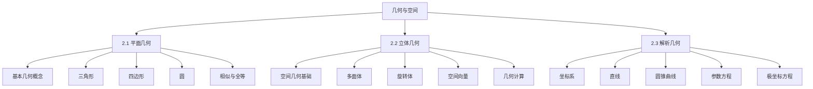
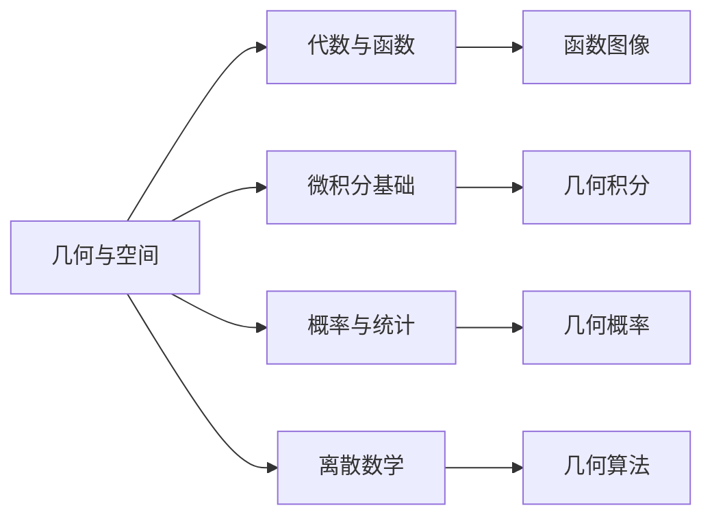

# 2. 几何与空间 | Geometry and Space

## 模块概述 | Module Overview

几何与空间是高中数学的重要组成部分，研究平面和空间中的几何图形及其性质。本模块系统介绍平面几何、立体几何、解析几何等内容，培养学生的空间想象能力和几何思维能力。

## 模块结构 | Module Structure

## 学习目标 | Learning Objectives

### 2.1 平面几何学习目标

**知识目标**：

- 理解基本几何概念和公理
- 掌握三角形、四边形、圆的性质
- 理解相似与全等理论
- 掌握几何证明的基本方法

**能力目标**：

- 能够进行几何证明
- 能够计算几何图形的面积和周长
- 能够解决几何应用问题
- 能够建立几何模型

### 2.2 立体几何学习目标

**知识目标**：

- 理解空间几何的基本概念
- 掌握多面体和旋转体的性质
- 理解空间向量的概念和运算
- 掌握立体几何的计算方法

**能力目标**：

- 能够进行空间几何证明
- 能够计算几何体的体积和表面积
- 能够解决立体几何应用问题
- 能够建立空间几何模型

### 2.3 解析几何学习目标

**知识目标**：

- 理解坐标系的概念和性质
- 掌握直线和圆锥曲线的方程
- 理解参数方程和极坐标方程
- 掌握几何变换的代数表示

**能力目标**：

- 能够建立几何问题的代数模型
- 能够分析几何图形的性质
- 能够进行几何变换
- 能够解决解析几何应用问题

## 知识关联 | Knowledge Connections

### 与代数函数的关联

### 跨学科应用

**物理学应用**：

- 运动轨迹的几何分析
- 力学问题的几何建模
- 光学现象的几何解释

**工程学应用**：

- 建筑设计的几何原理
- 机械结构的几何分析
- 电路设计的几何方法

**艺术学应用**：

- 绘画中的透视原理
- 雕塑中的空间几何
- 设计中的几何美学

## 学习路径 | Learning Path

### 第一阶段：平面几何基础

1. **基本概念**：理解点、线、面的基本概念
2. **三角形**：掌握三角形的性质和计算方法
3. **四边形**：理解各种四边形的性质
4. **圆**：掌握圆的性质和应用
5. **相似全等**：理解相似与全等理论

### 第二阶段：立体几何

1. **空间概念**：理解空间几何的基本概念
2. **多面体**：掌握各种多面体的性质
3. **旋转体**：理解旋转体的特征
4. **空间向量**：掌握向量的概念和运算
5. **几何计算**：学会体积和表面积的计算

### 第三阶段：解析几何

1. **坐标系**：理解各种坐标系的特点
2. **直线**：掌握直线的方程和性质
3. **圆锥曲线**：理解各种圆锥曲线的特征
4. **参数方程**：掌握参数方程的应用
5. **几何变换**：理解几何变换的代数表示

## 重点难点 | Key Points and Difficulties

### 重点内容

1. **几何概念**：理解几何学的基本概念和公理
2. **几何性质**：掌握各种几何图形的性质
3. **几何证明**：学会几何证明的基本方法
4. **几何计算**：能够进行几何量的计算
5. **几何应用**：能够将几何知识应用于实际问题

### 难点分析

1. **空间想象**：立体几何的空间想象能力
2. **抽象思维**：几何概念的抽象性
3. **逻辑推理**：几何证明的逻辑性
4. **综合应用**：多个知识点的综合运用
5. **实际建模**：将实际问题转化为几何问题

## 学习方法 | Learning Methods

### 1. 直观理解

- **图形分析**：通过图形分析理解几何概念
- **模型制作**：制作几何模型加深理解
- **动态演示**：使用动态演示观察几何变化

### 2. 逻辑推理

- **公理体系**：理解几何学的公理体系
- **证明方法**：掌握几何证明的基本方法
- **逻辑思维**：培养逻辑推理能力

### 3. 计算技能

- **公式运用**：熟练运用几何计算公式
- **代数方法**：结合代数方法解决几何问题
- **数值计算**：进行精确的数值计算

### 4. 应用实践

- **实际问题**：解决实际应用问题
- **建模训练**：建立几何模型
- **跨学科应用**：在其他学科中应用几何知识

## 评价标准 | Assessment Criteria

### 知识掌握

- **概念理解**：准确理解几何概念
- **性质掌握**：掌握几何图形的性质
- **公式运用**：熟练运用几何公式

### 技能运用

- **证明能力**：能够进行几何证明
- **计算能力**：能够进行几何计算
- **分析能力**：能够分析几何问题

### 应用能力

- **建模能力**：能够建立几何模型
- **解决问题**：能够解决几何应用问题
- **创新思维**：运用创新思维解决几何问题

## 资源推荐 | Resource Recommendations

### 教材资源

- **基础教材**：高中数学几何教材
- **提高教材**：几何竞赛教材
- **参考书籍**：几何学参考书

### 在线资源

- **教学视频**：几何教学视频
- **互动软件**：几何绘图软件
- **练习题库**：几何练习题库

### 实践资源

- **几何模型**：立体几何模型
- **绘图工具**：几何绘图工具
- **测量仪器**：几何测量仪器

## 总结 | Summary

几何与空间模块是高中数学的重要组成部分，通过系统学习：

1. **建立几何基础**：为后续数学学习奠定几何基础
2. **培养空间思维**：培养空间想象和几何思维能力
3. **掌握几何工具**：掌握解决几何问题的基本工具
4. **提高应用能力**：提高几何知识的应用能力

这些知识和技能为学生的数学学习和未来发展提供了强有力的支撑。

---

*几何与空间是数学世界的重要组成部分，掌握好这些内容，将为数学学习的深入发展提供坚实的基础。*
