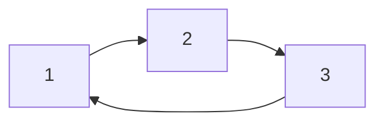

# 2.2.2 关系的多表征与性质

## 目录 | Table of Contents

- [2.2.2 关系的多表征与性质](#222-关系的多表征与性质)
  - [目录 | Table of Contents](#目录--table-of-contents)
  - [1. 关系的图形与表格表征 | Graphical and Tabular Representations](#1-关系的图形与表格表征--graphical-and-tabular-representations)
  - [2. 关系的基本性质 | Basic Properties of Relations](#2-关系的基本性质--basic-properties-of-relations)
  - [3. 代码实现 | Code Implementation](#3-代码实现--code-implementation)
    - [3.1 Rust 示例 | Rust Example](#31-rust-示例--rust-example)
    - [3.2 Lean 示例 | Lean Example](#32-lean-示例--lean-example)
  - [4. 典型习题 | Typical Exercises](#4-典型习题--typical-exercises)
  - [5. 认知结构与教育建议 | Cognitive Structure and Educational Advice](#5-认知结构与教育建议--cognitive-structure-and-educational-advice)
  - [6. 哲学批判与多角度分析 | Philosophical Critique and Multi-perspective Analysis](#6-哲学批判与多角度分析--philosophical-critique-and-multi-perspective-analysis)
  - [7. 本地跳转与相关主题 | Local Links and Related Topics](#7-本地跳转与相关主题--local-links-and-related-topics)

---

## 1. 关系的图形与表格表征 | Graphical and Tabular Representations

- 有向图、矩阵、表格等多种方式描述关系。
- Directed graphs, matrices, tables, etc.



| x | y | R(x, y) |
|---|---|---------|
| 1 | 2 | ✓       |
| 2 | 3 | ✓       |
| 3 | 1 | ✓       |

## 2. 关系的基本性质 | Basic Properties of Relations

- 自反性、对称性、传递性、反对称性。
- Reflexivity, symmetry, transitivity, antisymmetry.

## 3. 代码实现 | Code Implementation

### 3.1 Rust 示例 | Rust Example

```rust
let r = vec![(1, 2), (2, 3), (3, 1)];
assert!(r.contains(&(1, 2)));
```

### 3.2 Lean 示例 | Lean Example

```lean
variables {A : Type*} (R : A → A → Prop)
def reflexive := ∀ a, R a a
def symmetric := ∀ a b, R a b → R b a
def transitive := ∀ a b c, R a b → R b c → R a c
```

## 4. 典型习题 | Typical Exercises

1. 判断关系 $R = \{(1,2),(2,3),(3,1)\}$ 是否具有自反性、对称性、传递性。
2. 用矩阵和有向图表示上述关系。

## 5. 认知结构与教育建议 | Cognitive Structure and Educational Advice

- 难点：关系性质的判定与多表征迁移。
- 建议：多用图、表、代码、实例训练。
- Difficulty: Judging properties and transferring between representations.
- Advice: Use diagrams, tables, code, and examples.

## 6. 哲学批判与多角度分析 | Philosophical Critique and Multi-perspective Analysis

- 关系性质与结构主义数学观。
- Properties of relations and structuralist view of mathematics.

## 7. 本地跳转与相关主题 | Local Links and Related Topics

- [2.2 关系的定义](../2.2-关系的定义.md)
- [1.1 集合的定义与基本性质](../../1-集合论/1.1-集合的定义与基本性质.md)

---

[返回关系的定义 | Back to Relation Definition](../2.2-关系的定义.md)
