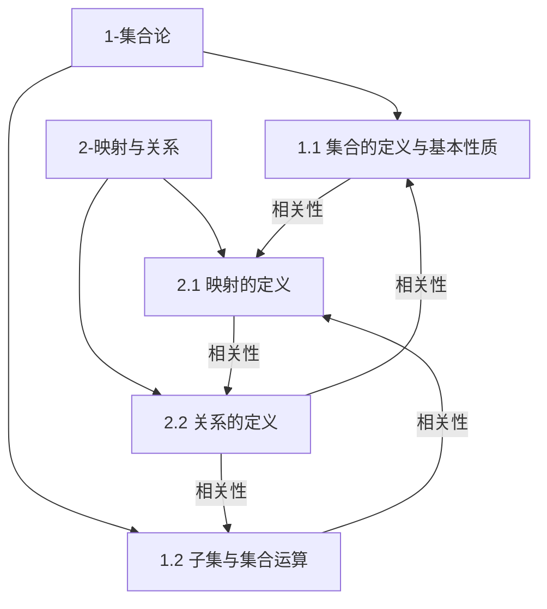

# 2-映射与关系

## 目录

1. [2.1 映射的定义](./2.1-映射的定义.md)
2. [2.2 关系的定义](./2.2-关系的定义.md)

---

```mermaid
graph TD;
  A["1-集合论"]
  A1["1.1 集合的定义与基本性质"]
  A2["1.2 子集与集合运算"]
  B["2-映射与关系"]
  B1["2.1 映射的定义"]
  B2["2.2 关系的定义"]
  A --> A1
  A --> A2
  B --> B1
  B --> B2
  A1 -- 相关性 --> B1
  A2 -- 相关性 --> B1
  B1 -- 相关性 --> B2
  B2 -- 相关性 --> A1
  B2 -- 相关性 --> A2
```

## 相关主题

- [1-集合论](../1-集合论/README.md)

[返回总目录](../README.md)
