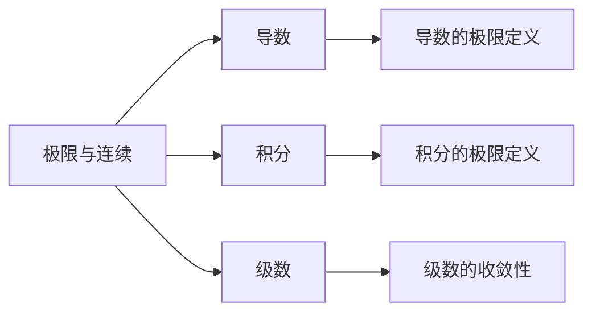

# 3.1 极限与连续 | Limits and Continuity

## 概述 | Overview

极限与连续是微积分的基础概念，为后续的导数和积分学习奠定基础。
本章将系统介绍数列极限、函数极限、连续性概念以及相关应用。

## 1. 数列极限 | Sequence Limits

### 1.1 数列极限定义 | Definition of Sequence Limits

**数列**：按一定规律排列的无穷多个数：a₁, a₂, a₃, ..., aₙ, ...

**极限定义**：
对于数列{aₙ}，如果存在常数A，使得对于任意给定的正数ε，总存在正整数N，当n > N时，有|aₙ - A| < ε，则称数列{aₙ}收敛于A，记作：
$$\lim_{n \to \infty} a_n = A$$

**几何意义**：

- 数列{aₙ}收敛于A意味着，当n充分大时，aₙ与A的距离可以任意小
- 在数轴上，数列的点越来越接近A

### 1.2 数列极限性质 | Properties of Sequence Limits

**唯一性**：如果数列收敛，则极限唯一。

**有界性**：收敛数列必有界。

**保号性**：

- 如果$\lim_{n \to \infty} a_n = A > 0$，则存在N，当n > N时，aₙ > 0
- 如果$\lim_{n \to \infty} a_n = A < 0$，则存在N，当n > N时，aₙ < 0

**运算性质**：

1. $\lim_{n \to \infty} (a_n + b_n) = \lim_{n \to \infty} a_n + \lim_{n \to \infty} b_n$
2. $\lim_{n \to \infty} (a_n - b_n) = \lim_{n \to \infty} a_n - \lim_{n \to \infty} b_n$
3. $\lim_{n \to \infty} (a_n \cdot b_n) = \lim_{n \to \infty} a_n \cdot \lim_{n \to \infty} b_n$
4. $\lim_{n \to \infty} \frac{a_n}{b_n} = \frac{\lim_{n \to \infty} a_n}{\lim_{n \to \infty} b_n}$（分母极限不为0）

### 1.3 常见数列极限 | Common Sequence Limits

**基本极限**：

1. $\lim_{n \to \infty} \frac{1}{n} = 0$
2. $\lim_{n \to \infty} \frac{1}{n^2} = 0$
3. $\lim_{n \to \infty} \sqrt[n]{n} = 1$
4. $\lim_{n \to \infty} (1 + \frac{1}{n})^n = e$

**几何数列**：

- 如果|q| < 1，则$\lim_{n \to \infty} q^n = 0$
- 如果|q| > 1，则$\lim_{n \to \infty} q^n = \infty$（发散）

**例1**：求数列$\{1 + \frac{1}{n}\}$的极限。

**解**：

- $\lim_{n \to \infty} (1 + \frac{1}{n}) = \lim_{n \to \infty} 1 + \lim_{n \to \infty} \frac{1}{n} = 1 + 0 = 1$

**例2**：求数列$\{\frac{n^2 + 1}{n^2 + n}\}$的极限。

**解**：

- 分子分母同除以n²：$\frac{1 + \frac{1}{n^2}}{1 + \frac{1}{n}}$
- $\lim_{n \to \infty} \frac{1 + \frac{1}{n^2}}{1 + \frac{1}{n}} = \frac{1 + 0}{1 + 0} = 1$

### 1.4 数列极限的判定 | Criteria for Sequence Limits

**夹逼准则**：
如果数列{aₙ}、{bₙ}、{cₙ}满足：

1. aₙ ≤ bₙ ≤ cₙ（n充分大时）
2. $\lim_{n \to \infty} a_n = \lim_{n \to \infty} c_n = A$

则$\lim_{n \to \infty} b_n = A$

**单调有界准则**：

- 单调递增且有上界的数列必收敛
- 单调递减且有下界的数列必收敛

**例**：证明数列$\{1 + \frac{1}{2} + \frac{1}{3} + \cdots + \frac{1}{n}\}$发散。

**解**：

- 这个数列是调和级数的部分和
- 可以证明它无界，因此发散

## 2. 函数极限 | Function Limits

### 2.1 函数极限定义 | Definition of Function Limits

**x → x₀时的极限**：
对于函数f(x)，如果存在常数A，使得对于任意给定的正数ε，总存在正数δ，当0 < |x - x₀| < δ时，有|f(x) - A| < ε，则称函数f(x)在x → x₀时的极限为A，记作：
$$\lim_{x \to x_0} f(x) = A$$

**x → ∞时的极限**：
$$\lim_{x \to \infty} f(x) = A$$
意味着当x充分大时，f(x)与A的距离可以任意小。

### 2.2 函数极限性质 | Properties of Function Limits

**唯一性**：如果函数极限存在，则极限唯一。

**局部有界性**：如果$\lim_{x \to x_0} f(x) = A$，则f(x)在x₀的某个去心邻域内有界。

**保号性**：

- 如果$\lim_{x \to x_0} f(x) = A > 0$，则存在δ > 0，当0 < |x - x₀| < δ时，f(x) > 0
- 如果$\lim_{x \to x_0} f(x) = A < 0$，则存在δ > 0，当0 < |x - x₀| < δ时，f(x) < 0

**运算性质**：

1. $\lim_{x \to x_0} [f(x) + g(x)] = \lim_{x \to x_0} f(x) + \lim_{x \to x_0} g(x)$
2. $\lim_{x \to x_0} [f(x) - g(x)] = \lim_{x \to x_0} f(x) - \lim_{x \to x_0} g(x)$
3. $\lim_{x \to x_0} [f(x) \cdot g(x)] = \lim_{x \to x_0} f(x) \cdot \lim_{x \to x_0} g(x)$
4. $\lim_{x \to x_0} \frac{f(x)}{g(x)} = \frac{\lim_{x \to x_0} f(x)}{\lim_{x \to x_0} g(x)}$（分母极限不为0）

### 2.3 重要极限 | Important Limits

**第一个重要极限**：
$$\lim_{x \to 0} \frac{\sin x}{x} = 1$$

**第二个重要极限**：
$$\lim_{x \to \infty} (1 + \frac{1}{x})^x = e$$

**其他重要极限**：

1. $\lim_{x \to 0} \frac{1 - \cos x}{x^2} = \frac{1}{2}$
2. $\lim_{x \to 0} \frac{e^x - 1}{x} = 1$
3. $\lim_{x \to 0} \frac{\ln(1 + x)}{x} = 1$

**例1**：求$\lim_{x \to 0} \frac{\sin 3x}{x}$。

**解**：

- $\lim_{x \to 0} \frac{\sin 3x}{x} = \lim_{x \to 0} \frac{3\sin 3x}{3x} = 3 \cdot 1 = 3$

**例2**：求$\lim_{x \to \infty} (1 + \frac{2}{x})^x$。

**解**：

- $\lim_{x \to \infty} (1 + \frac{2}{x})^x = \lim_{x \to \infty} [(1 + \frac{1}{x/2})^{x/2}]^2 = e^2$

### 2.4 极限的判定方法 | Methods for Determining Limits

**直接代入法**：
如果函数在x₀处连续，则$\lim_{x \to x_0} f(x) = f(x_0)$

**因式分解法**：
对于$\frac{0}{0}$型极限，可以通过因式分解约分。

**有理化法**：
对于含有根号的极限，可以通过有理化处理。

**夹逼准则**：
如果函数f(x)、g(x)、h(x)满足：

1. g(x) ≤ f(x) ≤ h(x)（在x₀的某个去心邻域内）
2. $\lim_{x \to x_0} g(x) = \lim_{x \to x_0} h(x) = A$

则$\lim_{x \to x_0} f(x) = A$

**例**：求$\lim_{x \to 1} \frac{x^2 - 1}{x - 1}$。

**解**：

- $\lim_{x \to 1} \frac{x^2 - 1}{x - 1} = \lim_{x \to 1} \frac{(x + 1)(x - 1)}{x - 1} = \lim_{x \to 1} (x + 1) = 2$

## 3. 连续性 | Continuity

### 3.1 连续性定义 | Definition of Continuity

**函数在一点的连续性**：
函数f(x)在点x₀处连续，当且仅当：

1. f(x₀)存在
2. $\lim_{x \to x_0} f(x)$存在
3. $\lim_{x \to x_0} f(x) = f(x_0)$

**等价定义**：
对于任意给定的正数ε，总存在正数δ，当|x - x₀| < δ时，有|f(x) - f(x₀)| < ε。

### 3.2 连续函数性质 | Properties of Continuous Functions

**局部性质**：

- 连续函数在连续点附近有界
- 连续函数在连续点附近保持符号

**全局性质**：

- 闭区间上的连续函数必有最大值和最小值
- 闭区间上的连续函数的值域是闭区间
- 连续函数的复合函数仍连续

**运算性质**：

1. 连续函数的和、差、积、商（分母不为0）仍连续
2. 连续函数的复合函数仍连续
3. 反函数（如果存在）也连续

### 3.3 间断点 | Discontinuity Points

**第一类间断点**：

- 左右极限都存在但不相等
- 或者左右极限存在且相等，但不等于函数值

**第二类间断点**：

- 至少有一个单侧极限不存在或为无穷大

**可去间断点**：

- 左右极限存在且相等，但不等于函数值
- 可以通过重新定义函数值使其连续

**跳跃间断点**：

- 左右极限存在但不相等

**例**：分析函数$f(x) = \frac{x^2 - 1}{x - 1}$在x = 1处的连续性。

**解**：

- 函数在x = 1处无定义
- $\lim_{x \to 1} f(x) = 2$
- 这是可去间断点，可以通过定义f(1) = 2使其连续

### 3.4 初等函数的连续性 | Continuity of Elementary Functions

**基本初等函数的连续性**：

1. **常数函数**：处处连续
2. **幂函数**：在定义域内连续
3. **指数函数**：处处连续
4. **对数函数**：在定义域内连续
5. **三角函数**：处处连续
6. **反三角函数**：在定义域内连续

**初等函数**：
由基本初等函数经过有限次四则运算和复合运算得到的函数，在其定义域内连续。

**例**：判断函数$f(x) = \frac{x^2 + 1}{x - 2}$的连续性。

**解**：

- 函数在x = 2处无定义
- 在其他点处连续
- x = 2是第二类间断点

## 4. 应用实例 | Application Examples

### 4.1 物理学应用 | Physics Applications

**例1：瞬时速度**
物体做直线运动，位置函数为s(t) = t²，求t = 2时的瞬时速度。

**解**：

- 瞬时速度：$v(2) = \lim_{h \to 0} \frac{s(2 + h) - s(2)}{h}$
- $= \lim_{h \to 0} \frac{(2 + h)^2 - 4}{h}$
- $= \lim_{h \to 0} \frac{4 + 4h + h^2 - 4}{h}$
- $= \lim_{h \to 0} (4 + h) = 4$

**例2：电流强度**
电路中电流强度I(t) = 2e⁻ᵗ，求t → ∞时的电流强度。

**解**：

- $\lim_{t \to \infty} I(t) = \lim_{t \to \infty} 2e^{-t} = 0$
- 电流强度随时间逐渐减小到零

### 4.2 经济学应用 | Economics Applications

**例1：边际成本**
某产品的成本函数为C(x) = 100 + 10x + 0.1x²，求生产第101个产品的边际成本。

**解**：

- 边际成本：$\lim_{h \to 0} \frac{C(100 + h) - C(100)}{h}$
- $= \lim_{h \to 0} \frac{100 + 10(100 + h) + 0.1(100 + h)^2 - (100 + 1000 + 1000)}{h}$
- $= \lim_{h \to 0} \frac{10h + 20h + 0.1h^2}{h} = 30$

**例2：需求弹性**
某商品的需求函数为Q(p) = 1000 - 2p，求价格p = 100时的需求弹性。

**解**：

- 需求弹性：$E = \lim_{\Delta p \to 0} \frac{\Delta Q / Q}{\Delta p / p}$
- $= \frac{p}{Q} \cdot \lim_{\Delta p \to 0} \frac{\Delta Q}{\Delta p}$
- $= \frac{100}{800} \cdot (-2) = -0.25$

### 4.3 生物学应用 | Biology Applications

**例1：种群增长**
某生物种群数量N(t) = 1000e⁰·¹ᵗ，求t → ∞时的种群数量。

**解**：

- $\lim_{t \to \infty} N(t) = \lim_{t \to \infty} 1000e^{0.1t} = \infty$
- 种群数量无限增长

**例2：药物浓度**
药物在体内的浓度C(t) = 50e⁻⁰·⁵ᵗ，求t → ∞时的浓度。

**解**：

- $\lim_{t \to \infty} C(t) = \lim_{t \to \infty} 50e^{-0.5t} = 0$
- 药物浓度逐渐降低到零

## 5. 知识关联 | Knowledge Connections

### 5.1 与导数的关联 | Connections with Derivatives

### 5.2 与函数的关联 | Connections with Functions

- **函数性质**：极限是研究函数性质的重要工具
- **函数图像**：极限帮助理解函数图像的渐近行为
- **函数运算**：极限运算为函数运算提供基础

### 5.3 与微积分的关联 | Connections with Calculus

- **导数定义**：导数是函数极限的特殊形式
- **积分定义**：定积分是极限的另一种形式
- **级数收敛**：级数收敛性基于数列极限

## 6. 习题与练习 | Exercises and Practice

### 6.1 基础练习 | Basic Exercises

1. **数列极限**
   - 求$\lim_{n \to \infty} \frac{n^2 + 3n + 1}{n^2 + 1}$
   - 求$\lim_{n \to \infty} (\sqrt{n + 1} - \sqrt{n})$

2. **函数极限**
   - 求$\lim_{x \to 0} \frac{\sin 2x}{x}$
   - 求$\lim_{x \to 1} \frac{x^3 - 1}{x - 1}$

3. **连续性**
   - 判断函数$f(x) = \frac{x^2 - 4}{x - 2}$在x = 2处的连续性
   - 求函数$f(x) = \frac{1}{x}$的间断点

### 6.2 提高练习 | Advanced Exercises

1. **复杂极限**
   - 求$\lim_{x \to 0} \frac{\sqrt{1 + x} - 1}{x}$
   - 求$\lim_{x \to \infty} x(\sqrt{x^2 + 1} - x)$

2. **连续性分析**
   - 分析函数$f(x) = \begin{cases} x^2, & x \leq 1 \\ 2x - 1, & x > 1 \end{cases}$的连续性
   - 求函数$f(x) = \frac{1}{x^2 - 1}$的间断点类型

3. **实际应用**
   - 某物体的速度函数为v(t) = 3t²，求t = 2时的瞬时加速度
   - 某产品的成本函数为C(x) = 100 + 5x + 0.01x²，求生产第100个产品的边际成本

### 6.3 竞赛练习 | Competition Exercises

1. **综合应用**
   - 证明：$\lim_{n \to \infty} \sqrt[n]{n!} = \infty$
   - 求$\lim_{x \to 0} \frac{\tan x - \sin x}{x^3}$

2. **复杂问题**
   - 分析函数$f(x) = \frac{\sin x}{x}$在x = 0处的连续性
   - 求函数$f(x) = \frac{x^2 \sin \frac{1}{x}}{x}$在x = 0处的极限

## 典型例题与详细解答 | Typical Examples and Detailed Solutions

### 例题1：极限的ε-δ定义证明 | Example 1: Proof of Limit by ε-δ Definition

**题目 | Problem**：用ε-δ语言证明limₓ→2 (3x+1)=7。
**证明 | Proof**：
对任意ε>0，取δ=ε/3，则当0<|x-2|<δ时，|3x+1-7|=|3x-6|=3|x-2|<3δ=ε，故极限成立。
For any ε>0, let δ=ε/3. If 0<|x-2|<δ, then |3x+1-7|=3|x-2|<ε, so the limit holds.

### 例题2：无穷小与无穷大的关系 | Example 2: Relationship between Infinitesimal and Infinite

**题目 | Problem**：证明若x→0时f(x)为无穷小，则1/f(x)为无穷大。
**证明 | Proof**：
对任意M>0，存在δ>0使0<|x|<δ时|f(x)|<1/M，则|1/f(x)|>M，故1/f(x)为无穷大。
For any M>0, there exists δ>0 such that 0<|x|<δ implies |f(x)|<1/M, so |1/f(x)|>M, thus 1/f(x) is infinite.

### 例题3：连续性的判别 | Example 3: Test for Continuity

**题目 | Problem**：判断函数f(x)=\begin{cases}x^2, & x\leq1 \\ 2x-1, & x>1\end{cases}在x=1处是否连续。
**证明 | Proof**：
左极限limₓ→1⁻f(x)=1，右极限limₓ→1⁺f(x)=1，f(1)=1，三者相等，故在x=1处连续。
Left limit, right limit, and function value at x=1 are all 1, so f(x) is continuous at x=1.

## 创新与挑战性例题 | Innovative and Challenging Examples

### 例题4：间断点分类 | Example 4: Classification of Discontinuities

**题目 | Problem**：举例说明可去间断、第一类间断、第二类间断的区别。
**解答 | Solution**：
f(x)=\begin{cases}1, x<0 \\ 2, x=0 \\ 1, x>0\end{cases}在x=0处为可去间断；f(x)=\begin{cases}1, x<0 \\ 2, x\geq0\end{cases}在x=0处为第一类间断；f(x)=\sin(1/x), x\neq0; f(0)=0在x=0处为第二类间断。
Removable: value can be redefined to make continuous; first kind: left/right limits exist but not equal; second kind: limit does not exist.

### 例题5：极限存在性判别 | Example 5: Test for Existence of Limit

**题目 | Problem**：判断limₓ→0 (sinx)/x是否存在，并证明。
**证明 | Proof**：
利用夹逼定理：-1≤sinx≤1，0<x<π/2时0<sinx<x，得1≥(sinx)/x≥cosx，x→0时cosx→1，故极限为1。
By squeeze theorem, 1≥(sinx)/x≥cosx, as x→0, cosx→1, so the limit is 1.

### 例题6：Heine定理应用 | Example 6: Application of Heine's Theorem

**题目 | Problem**：用Heine定理证明limₓ→a f(x)=A等价于对任意收敛于a的数列xₙ，有limₙ→∞f(xₙ)=A。
**证明 | Proof**：
Heine定理指出极限的数列定义与ε-δ定义等价。证明略。
Heine's theorem states the equivalence of sequence and ε-δ definitions of limit. Proof omitted.

## 7. 现代前沿与多学科创新 | Modern Frontiers and Multidisciplinary Innovations

### 7.1 极限与连续在AI、自动化证明、知识图谱、可视化数学、计算机科学、物理等领域的创新应用 | Applications of Limits and Continuity in AI, Automated Proof, Knowledge Graphs, Visual Mathematics, Computer Science, Physics

- 极限与连续在AI数值分析、自动化极限判定、知识图谱中的连续性建模、可视化数学、计算机科学、物理建模等领域有广泛应用。
- Limits and continuity are widely applied in AI numerical analysis, automated limit determination, continuity modeling in knowledge graphs, visual mathematics, computer science, physical modeling, etc.
- 例：AI中的极限求解器、自动化连续性判定、知识图谱中的极限关系、可视化极限过程、物理中的连续介质建模。
- Examples: limit solvers in AI, automated continuity determination, limit relations in knowledge graphs, visual limit processes, continuous medium modeling in physics.

### 7.2 结构主义、范畴论、模型论等理论对极限与连续的影响 | Impact of Structuralism, Category Theory, Model Theory on Limits and Continuity

- 结构主义强调极限与连续的结构层次与公理化，范畴论、模型论推动极限与连续的抽象化与统一化。
- Structuralism emphasizes the structural hierarchy and axiomatization of limits and continuity; category theory and model theory promote abstraction and unification of limits and continuity.
- 例：范畴论中的极限对象与态射，模型论中的连续结构解释。
- Examples: limit objects and morphisms in category theory, continuous structure interpretations in model theory.

### 7.3 形式化极限与连续在自动化证明、AI推理中的作用与局限 | Formal Limits and Continuity in Automated Proof, AI Reasoning

- 形式化极限与连续（如Lean、Coq、Isabelle中的极限表达）在自动化证明、AI推理中提升了表达力与严谨性。
- Formal limits and continuity (limit expressions in Lean, Coq, Isabelle, etc.) enhance expressiveness and rigor in automated proof and AI reasoning.
- 局限：高阶极限结构、复杂连续过程、动态系统、多模态推理等仍需人工建模与解释。
- Limitations: higher-order limit structures, complex continuous processes, dynamic systems, multi-modal reasoning still require manual modeling and interpretation.

### 7.4 哲学基础与认知科学视角下的极限与连续 | Philosophical and Cognitive Perspectives on Limits and Continuity

- 极限与连续的本体论、认识论基础，认知科学对极限思维、连续性理解的研究。
- Ontological and epistemological foundations of limits and continuity; cognitive science research on limit thinking and understanding of continuity.
- 例：极限直观、认知负荷、抽象与具体的转换、极限思维发展。
- Examples: limit intuition, cognitive load, transformation between abstraction and concreteness, development of limit thinking.

### 7.5 国际竞赛与前沿研究中的创新例题与方法 | Innovative Problems and Methods in Competitions and Research

- 例题：AI中的极限求解、自动化连续性判定、知识图谱极限推理、可视化极限过程建模。
- Example: limit solving in AI, automated continuity determination, limit reasoning in knowledge graphs, visual modeling of limit processes.
- 前沿方法：结合自动化证明、AI、认知科学等工具创新极限与连续的表达与应用。
- Frontier methods: combine automated proof, AI, cognitive science to innovate expression and application of limits and continuity.

> 本节内容进一步结合AI、知识图谱、范畴论、认知科学等最新前沿，持续递归扩展极限与连续的理论深度与现实创新。

## 总结 | Summary

极限与连续是微积分的基础概念，通过系统学习：

1. **极限概念**：理解数列极限和函数极限的定义
2. **极限性质**：掌握极限的基本性质和运算法则
3. **连续性**：理解连续性的定义和性质
4. **应用能力**：能够将极限和连续知识应用于实际问题

这些知识和技能为后续的导数和积分学习奠定了坚实的基础。

---

*极限与连续是微积分的基石，掌握好这些内容，将为微积分学习的深入发展提供强有力的支撑。*
