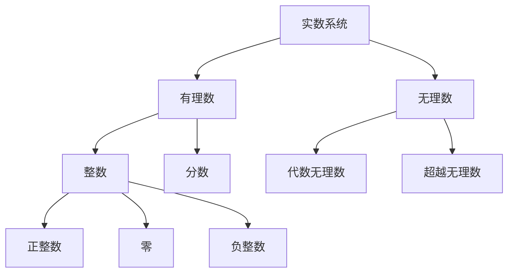
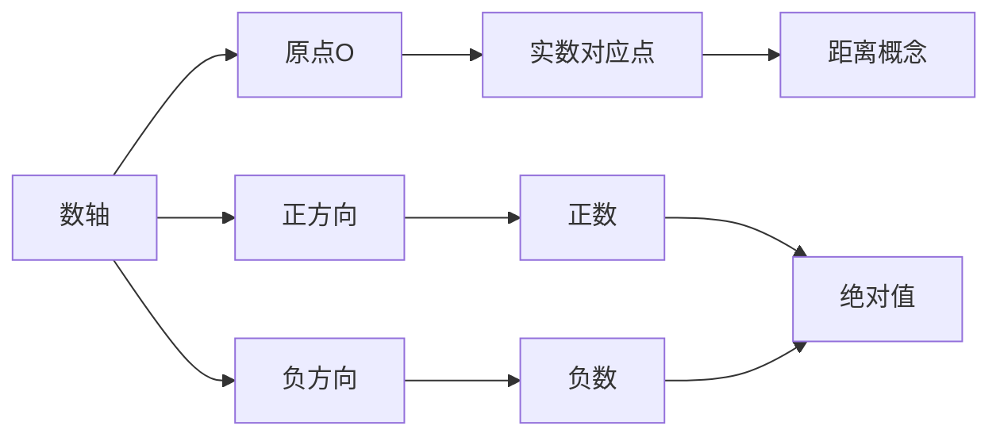
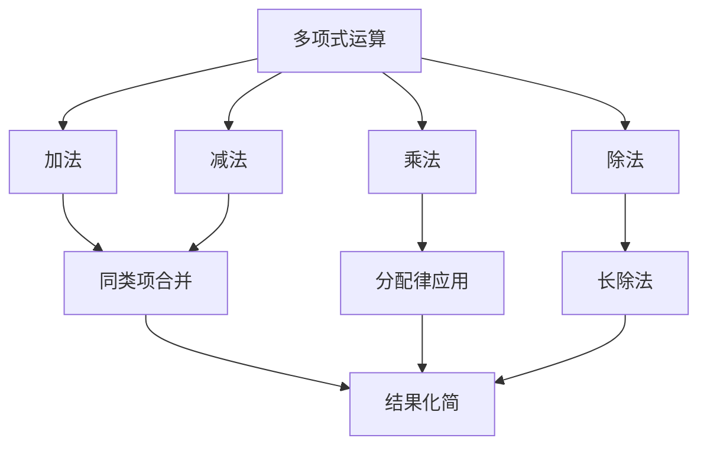
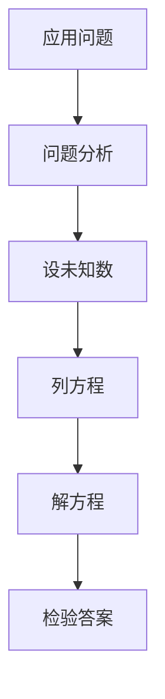
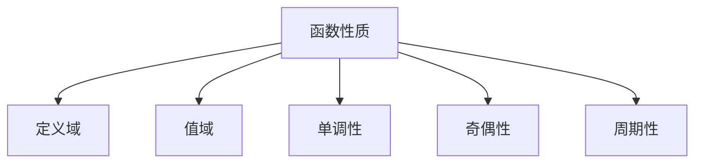
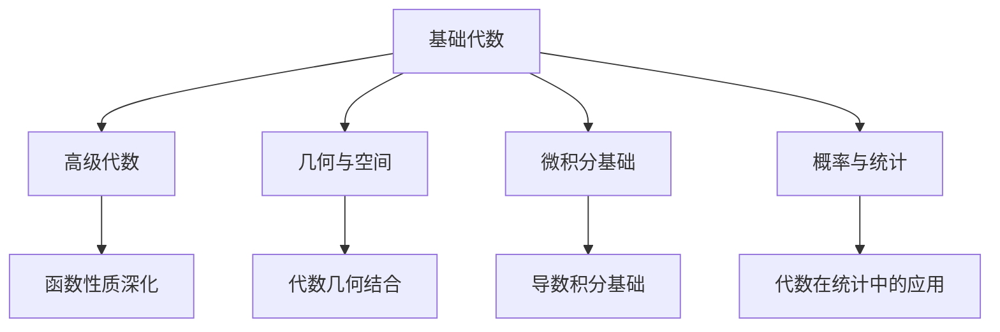

# 1.1 基础代数 | Basic Algebra

## 内容概述 | Content Overview

基础代数是高中数学的核心基础，包括实数系统、代数运算、方程与不等式、函数基础等核心内容。这些内容是后续高级数学学习的基础，也是解决实际问题的重要工具。

### 学习目标 | Learning Objectives

- **理解实数系统**：掌握实数的性质、数轴表示和绝对值概念
- **掌握代数运算**：熟练进行多项式运算和因式分解
- **解决方程不等式**：能够解决线性方程、二次方程和各种不等式
- **建立函数概念**：理解函数的基本概念、图像和性质

## 1. 实数系统 | Real Number System

### 1.1 实数性质 | Properties of Real Numbers

**实数的基本性质**：



**实数的运算性质**：

- **交换律**：a + b = b + a, a × b = b × a
- **结合律**：(a + b) + c = a + (b + c), (a × b) × c = a × (b × c)
- **分配律**：a × (b + c) = a × b + a × c
- **单位元**：a + 0 = a, a × 1 = a
- **逆元**：a + (-a) = 0, a × (1/a) = 1 (a ≠ 0)

### 1.2 数轴与绝对值 | Number Line and Absolute Value

**数轴表示**：



**绝对值定义**：

- |a| = a (a ≥ 0)
- |a| = -a (a < 0)

**绝对值性质**：

- |a| ≥ 0
- |a| = |-a|
- |a × b| = |a| × |b|
- |a + b| ≤ |a| + |b| (三角不等式)

### 1.3 实数比较 | Real Number Comparison

**比较方法**：

1. **数轴法**：在数轴上比较位置
2. **差值法**：a > b ⇔ a - b > 0
3. **商值法**：a > b > 0 ⇔ a/b > 1

**不等式性质**：

- 传递性：a > b, b > c ⇒ a > c
- 加法性：a > b ⇒ a + c > b + c
- 乘法性：a > b, c > 0 ⇒ ac > bc
- 乘法性：a > b, c < 0 ⇒ ac < bc

## 2. 代数运算 | Algebraic Operations

### 2.1 多项式运算 | Polynomial Operations

**多项式定义**：
P(x) = aₙxⁿ + aₙ₋₁xⁿ⁻¹ + ... + a₁x + a₀

**多项式运算**：



**运算规则**：

- **加法**：同类项系数相加
- **减法**：同类项系数相减
- **乘法**：使用分配律，逐项相乘
- **除法**：使用长除法或综合除法

### 2.2 因式分解 | Factoring

**基本因式分解方法**：

**1. 提取公因式**:

- 找出所有项的公因式
- 使用分配律提取

**2. 分组分解**:

- 将多项式分组
- 每组提取公因式
- 再次提取公因式

**3. 公式分解**:

```mermaid
graph LR
    A[公式分解] --> B[平方差公式]
    A --> C[完全平方公式]
    A --> D[立方和差公式]
    
    B --> E[a² - b² = (a+b)(a-b)]
    C --> F[a² ± 2ab + b² = (a±b)²]
    D --> G[a³ ± b³ = (a±b)(a² ∓ ab + b²)]
```

**4. 十字相乘法**:

- 适用于二次三项式
- ax² + bx + c = (px + q)(rx + s)

### 2.3 有理式运算 | Rational Expression Operations

**有理式定义**：
R(x) = P(x)/Q(x)，其中P(x)、Q(x)为多项式，Q(x) ≠ 0

**运算规则**：

- **约分**：分子分母同除以公因式
- **通分**：找最小公倍式
- **加减法**：通分后分子相加减
- **乘除法**：分子分母分别相乘除

## 3. 方程与不等式 | Equations and Inequalities

### 3.1 线性方程 | Linear Equations

**标准形式**：ax + b = 0 (a ≠ 0)

**解法**：

1. **移项**：ax = -b
2. **系数化一**：x = -b/a

**应用问题**：



### 3.2 二次方程 | Quadratic Equations

**标准形式**：ax² + bx + c = 0 (a ≠ 0)

**解法**：

**1. 因式分解法**:

- 将方程化为(x - p)(x - q) = 0
- 解得x = p或x = q

**2. 配方法**:

- 将方程化为(x + b/2a)² = (b² - 4ac)/4a²
- 开平方求解

**3. 公式法**:

- 判别式Δ = b² - 4ac
- x = (-b ± √Δ)/2a

**根的性质**：

- Δ > 0：两个不等实根
- Δ = 0：两个相等实根
- Δ < 0：无实根

### 3.3 不等式 | Inequalities

**线性不等式**：

- ax + b > 0
- 解法：移项、系数化一、注意符号

**二次不等式**：

- ax² + bx + c > 0
- 解法：因式分解、数轴法

**不等式组**：


## 4. 函数基础 | Function Fundamentals

### 4.1 函数概念 | Function Concept

**函数定义**：
设A、B为非空集合，如果对于A中的每一个元素x，都有B中唯一确定的元素y与之对应，则称这种对应关系为从A到B的函数。

**函数表示**：

- **解析式**：y = f(x)
- **图像法**：函数图像
- **表格法**：函数值表

**函数性质**：



### 4.2 基本函数 | Basic Functions

**1. 常数函数**:

- f(x) = c
- 图像：水平直线

**2. 线性函数**:

- f(x) = ax + b
- 图像：直线，斜率为a

**3. 二次函数**:

- f(x) = ax² + bx + c
- 图像：抛物线

**4. 幂函数**:

- f(x) = xⁿ
- 图像：根据n的奇偶性不同

### 4.3 函数图像 | Function Graphs

**图像绘制步骤**：

1. **确定定义域**
2. **计算关键点**
3. **分析函数性质**
4. **绘制图像**

**图像变换**：

```mermaid
graph LR
    A[原函数f(x)] --> B[平移变换]
    A --> C[伸缩变换]
    A --> D[对称变换]
    
    B --> E[f(x±a) 左右平移]
    B --> F[f(x)±a 上下平移]
    C --> G[af(x) 纵向伸缩]
    C --> H[f(ax) 横向伸缩]
    D --> I[f(-x) 关于y轴对称]
    D --> J[-f(x) 关于x轴对称]
```

## 5. 应用实例 | Application Examples

### 5.1 实际问题建模 | Real-world Problem Modeling

**例1：利润最大化问题**
某商店销售某种商品，单价为p元时，销量为q = 1000 - 10p件。求使利润最大的价格。

**建模过程**：

1. **收入函数**：R(p) = p × q = p(1000 - 10p) = 1000p - 10p²
2. **成本函数**：假设成本为C(p) = 500p
3. **利润函数**：L(p) = R(p) - C(p) = 500p - 10p²
4. **求极值**：L'(p) = 500 - 20p = 0
5. **最优价格**：p = 25元

### 5.2 几何问题应用 | Geometric Problem Applications

**例2：面积最大化问题**
用长度为L的绳子围成一个矩形，求面积最大的长宽比。

**建模过程**：

1. **设变量**：长为x，宽为y
2. **约束条件**：2x + 2y = L
3. **目标函数**：S = xy = x(L/2 - x)
4. **求极值**：S'(x) = L/2 - 2x = 0
5. **最优解**：x = L/4，y = L/4，即正方形

## 6. 习题练习 | Exercise Practice

### 6.1 基础习题 | Basic Exercises

**习题1：实数运算**
计算：|3 - 5| + |2 - 7| - |4 - 1|

**习题2：多项式运算**
计算：(2x² - 3x + 1)(x + 2)

**习题3：因式分解**
分解：x³ - 8

**习题4：方程求解**
解方程：2x² - 5x + 3 = 0

**习题5：不等式求解**
解不等式：x² - 4x + 3 > 0

### 6.2 提高习题 | Advanced Exercises

**习题6：函数图像**
画出函数f(x) = x² - 2x - 3的图像，并求其顶点坐标。

**习题7：应用题**
某工厂生产某种产品，固定成本为1000元，每件产品的可变成本为20元。如果售价为p元，销量为q = 200 - p件。求使利润最大的售价。

**习题8：综合题**
已知函数f(x) = ax² + bx + c的图像经过点(1,2)、(2,3)、(3,8)，求a、b、c的值。

## 7. 知识关联 | Knowledge Connections

### 7.1 与后续内容的关联 | Connections with Subsequent Content



### 7.2 跨领域应用 | Cross-domain Applications

- **物理应用**：运动学中的代数建模
- **经济应用**：成本收益分析
- **工程应用**：优化问题求解
- **计算机应用**：算法复杂度分析

## 8. 学习建议 | Learning Suggestions

### 8.1 学习方法 | Learning Methods

1. **概念理解**：深入理解每个概念的本质
2. **运算熟练**：通过大量练习提高运算能力
3. **应用拓展**：将代数知识应用到实际问题
4. **思维培养**：培养抽象思维和逻辑推理能力

### 8.2 常见错误 | Common Mistakes

1. **符号错误**：注意正负号的使用
2. **运算错误**：多项式运算中的系数错误
3. **概念混淆**：函数与方程的概念混淆
4. **应用错误**：实际问题建模中的错误

### 8.3 提高建议 | Improvement Suggestions

1. **多做练习**：通过大量练习巩固基础
2. **总结规律**：总结运算规律和解题方法
3. **应用实践**：将知识应用到实际问题中
4. **思维训练**：培养数学思维和创新能力

## 9. 数学表达与规范化 | Mathematical Expression and Standardization

### 9.1 形式化定义与Lean证明 | Formal Definitions and Lean Proofs

```lean
import data.real.basic
import tactic

-- 实数的交换律
example (a b : ℝ) : a + b = b + a :=
begin
  exact add_comm a b,
end

-- 多项式加法的结合律
example (a b c : ℝ) : (a + b) + c = a + (b + c) :=
begin
  exact add_assoc a b c,
end

-- 因式分解公式
example (a b : ℝ) : a^2 - b^2 = (a - b) * (a + b) :=
begin
  ring,
end
```

### 9.2 多表征与国际标准 | Multi-representations and International Standards

- 代数结构（群、环、域）用集合论符号、表格、图形等多种方式表达。
- 例：$(\mathbb{R}, +, \cdot)$ 是一个有序域。
- 典型表格：

| 结构 | 公理 | 例子 |
|------|------|------|
| 群 | 封闭、结合、单位元、逆元 | $(\mathbb{Z}, +)$ |
| 环 | 群+乘法结合、分配 | $(\mathbb{Z}, +, \cdot)$ |
| 域 | 环+乘法逆元 | $(\mathbb{Q}, +, \cdot)$ |

### 9.3 认知结构与哲学批判 | Cognitive Structure and Philosophical Critique

- 结构主义：代数对象作为结构中的位置。
- 形式主义：代数规则的符号操作。
- 认知科学：变量、函数、结构的认知难点。
- 关联性：基础代数与函数、集合论、几何、概率统计等模块的知识网络。

### 9.4 跨学科与国际化视角 | Interdisciplinary and International Perspectives

- 代数思想在物理、经济、工程、计算机等领域的应用。
- 国际数学竞赛中的代数问题与解法。
- 结合范畴论、模型论等现代数学理论，提升代数的抽象层次。

> 本节所有内容均采用国际标准的数学符号、Lean 形式化与自然语言描述，强调知识的结构性、哲学基础与最新理论在代数基础中的应用。所有历史、应用、认知、哲学等内容均与数学表达深度关联，避免编程实现代码。

---

*基础代数是高中数学的重要基础，掌握好这些内容对后续学习至关重要。通过系统学习和大量练习，可以建立扎实的代数基础。*
