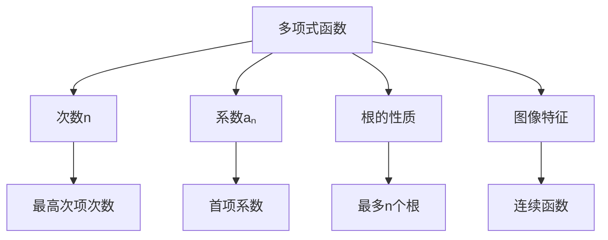

# 1.2 高级代数 | Advanced Algebra

## 内容概述 | Content Overview

高级代数是基础代数的深化和拓展，包括二次函数、多项式函数、有理函数、指数与对数等核心内容。这些内容是高中数学的重要部分，也是大学数学学习的基础。

### 学习目标 | Learning Objectives

- **掌握二次函数**：理解二次函数的性质、图像和应用
- **熟练多项式函数**：掌握多项式性质、根与系数关系
- **理解有理函数**：掌握有理函数性质、图像和渐近线
- **应用指数对数**：掌握指数函数、对数函数及其应用

## 1. 二次函数 | Quadratic Functions

### 1.1 二次函数定义与性质 | Definition and Properties

**标准形式**：f(x) = ax² + bx + c (a ≠ 0)

**性质分析**：

```mermaid
graph TD
    A[二次函数f(x) = ax² + bx + c] --> B[a > 0]
    A --> C[a < 0]
    
    B --> D[开口向上]
    C --> E[开口向下]
    
    D --> F[有最小值]
    E --> G[有最大值]
    
    F --> H[顶点坐标]
    G --> H
    
    H --> I[对称轴x = -b/2a]
    I --> J[与y轴交点(0,c)]
```

**顶点坐标**：

- x = -b/2a
- y = f(-b/2a) = c - b²/4a

**对称轴**：x = -b/2a

### 1.2 二次函数图像 | Quadratic Function Graphs

**图像特征**：

- **开口方向**：a > 0向上，a < 0向下
- **顶点**：(-b/2a, c - b²/4a)
- **对称轴**：x = -b/2a
- **与坐标轴交点**：
  - y轴：(0, c)
  - x轴：解方程ax² + bx + c = 0

**图像变换**：

```mermaid
graph LR
    A[f(x) = ax² + bx + c] --> B[平移变换]
    A --> C[伸缩变换]
    A --> D[对称变换]
    
    B --> E[f(x±h) 左右平移]
    B --> F[f(x)±k 上下平移]
    C --> G[af(x) 纵向伸缩]
    C --> H[f(ax) 横向伸缩]
    D --> I[f(-x) 关于y轴对称]
```

### 1.3 二次函数应用 | Applications of Quadratic Functions

**应用领域**：

- **物理应用**：抛物线运动、自由落体
- **经济应用**：成本收益分析、利润最大化
- **几何应用**：面积最大化、距离最小化
- **工程应用**：结构设计、优化问题

**例1：利润最大化**
某商店销售商品，单价p元时销量q = 1000 - 10p件，成本为20元/件。求最大利润。

**解**：

1. 收入：R(p) = p(1000 - 10p) = 1000p - 10p²
2. 成本：C(p) = 20(1000 - 10p) = 20000 - 200p
3. 利润：L(p) = R(p) - C(p) = 1200p - 10p² - 20000
4. 求极值：L'(p) = 1200 - 20p = 0
5. 最优价格：p = 60元

## 2. 多项式函数 | Polynomial Functions

### 2.1 多项式函数定义 | Polynomial Function Definition

**一般形式**：P(x) = aₙxⁿ + aₙ₋₁xⁿ⁻¹ + ... + a₁x + a₀

**多项式性质**：



### 2.2 根与系数关系 | Relationship Between Roots and Coefficients

**韦达定理**：
对于二次多项式ax² + bx + c = 0，设根为x₁, x₂：

- x₁ + x₂ = -b/a
- x₁x₂ = c/a

**高次多项式**：
对于n次多项式aₙxⁿ + aₙ₋₁xⁿ⁻¹ + ... + a₁x + a₀ = 0：

- 根的和：x₁ + x₂ + ... + xₙ = -aₙ₋₁/aₙ
- 根的积：x₁x₂...xₙ = (-1)ⁿa₀/aₙ

### 2.3 多项式因式分解 | Polynomial Factoring

**因式分解方法**：

**1. 有理根定理**
如果多项式P(x) = aₙxⁿ + ... + a₀有有理根p/q，则p|a₀，q|aₙ

**2. 综合除法**
用于检验可能的根

**3. 分组分解**
将多项式分组后提取公因式

**4. 公式分解**:

- 平方差：a² - b² = (a+b)(a-b)
- 立方和：a³ + b³ = (a+b)(a²-ab+b²)
- 立方差：a³ - b³ = (a-b)(a²+ab+b²)

### 2.4 多项式函数图像 | Polynomial Function Graphs

**图像特征**：

- **连续性**：多项式函数在R上连续
- **可导性**：多项式函数在R上可导
- **渐近性**：当x→∞时，P(x) ≈ aₙxⁿ
- **根与图像**：在根处与x轴相交

**图像绘制步骤**：

1. 确定次数和首项系数
2. 求根和重数
3. 分析单调性
4. 绘制图像

## 3. 有理函数 | Rational Functions

### 3.1 有理函数定义 | Rational Function Definition

**一般形式**：R(x) = P(x)/Q(x)，其中P(x)、Q(x)为多项式，Q(x) ≠ 0

**有理函数性质**：

```mermaid
graph TD
    A[有理函数R(x) = P(x)/Q(x)] --> B[定义域]
    A --> C[零点]
    A --> D[渐近线]
    A --> E[图像特征]
    
    B --> F[Q(x) ≠ 0的所有x]
    C --> G[P(x) = 0的根]
    D --> H[垂直渐近线x = a]
    E --> I[水平或斜渐近线]
```

### 3.2 渐近线 | Asymptotes

**垂直渐近线**：

- 位置：Q(x) = 0的根
- 条件：P(x) ≠ 0

**水平渐近线**：

- 当deg(P) < deg(Q)时：y = 0
- 当deg(P) = deg(Q)时：y = aₙ/bₙ
- 当deg(P) > deg(Q)时：无水平渐近线

**斜渐近线**：

- 当deg(P) = deg(Q) + 1时存在
- 通过长除法求得

### 3.3 有理函数图像 | Rational Function Graphs

**图像绘制步骤**：

1. **确定定义域**：找出Q(x) = 0的根
2. **求零点**：解P(x) = 0
3. **确定渐近线**：
   - 垂直渐近线：x = a（Q(a) = 0）
   - 水平渐近线：比较次数
   - 斜渐近线：长除法
4. **分析单调性**：求导数R'(x)
5. **绘制图像**

**例2：绘制有理函数图像**
f(x) = (x² - 1)/(x - 2)

**解**：

1. 定义域：x ≠ 2
2. 零点：x = ±1
3. 垂直渐近线：x = 2
4. 斜渐近线：y = x + 2
5. 绘制图像

## 4. 指数与对数 | Exponential and Logarithmic Functions

### 4.1 指数函数 | Exponential Functions

**定义**：f(x) = aˣ (a > 0, a ≠ 1)

**指数函数性质**：

```mermaid
graph TD
    A[指数函数f(x) = aˣ] --> B[a > 1]
    A --> C[0 < a < 1]
    
    B --> D[单调递增]
    C --> E[单调递减]
    
    D --> F[图像过(0,1)]
    E --> F
    
    F --> G[定义域R]
    F --> H[值域(0,+∞)]
    F --> I[无零点]
```

**指数运算性质**：

- aˣ⁺ʸ = aˣ × aʸ
- aˣ⁻ʸ = aˣ/aʸ
- (aˣ)ʸ = aˣʸ
- (ab)ˣ = aˣbˣ

### 4.2 对数函数 | Logarithmic Functions

**定义**：f(x) = logₐx (a > 0, a ≠ 1)

**对数函数性质**：

```mermaid
graph TD
    A[对数函数f(x) = logₐx] --> B[a > 1]
    A --> C[0 < a < 1]
    
    B --> D[单调递增]
    C --> E[单调递减]
    
    D --> F[图像过(1,0)]
    E --> F
    
    F --> G[定义域(0,+∞)]
    F --> H[值域R]
    F --> I[无零点]
```

**对数运算性质**：

- logₐ(xy) = logₐx + logₐy
- logₐ(x/y) = logₐx - logₐy
- logₐ(xʸ) = ylogₐx
- logₐx = logₐb × log_bx

### 4.3 自然对数与常用对数 | Natural and Common Logarithms

**自然对数**：ln x = logₑx
**常用对数**：lg x = log₁₀x

**换底公式**：logₐb = log_cb/log_ca

**特殊值**：

- ln 1 = 0
- ln e = 1
- lg 1 = 0
- lg 10 = 1

### 4.4 指数对数方程 | Exponential and Logarithmic Equations

**指数方程解法**：

1. **同底法**：aˣ = aʸ ⇒ x = y
2. **取对数法**：aˣ = b ⇒ x = logₐb
3. **换元法**：设t = aˣ

**对数方程解法**：

1. **同底法**：logₐx = logₐy ⇒ x = y
2. **指数法**：logₐx = b ⇒ x = aᵇ
3. **换元法**：设t = logₐx

**例3：解指数方程**
2ˣ⁺¹ = 8ˣ⁻¹

**解**：

1. 2ˣ⁺¹ = (2³)ˣ⁻¹
2. 2ˣ⁺¹ = 2³ˣ⁻³
3. x + 1 = 3x - 3
4. x = 2

## 5. 复合函数 | Composite Functions

### 5.1 复合函数定义 | Composite Function Definition

**定义**：(f ∘ g)(x) = f(g(x))

**复合函数性质**：

```mermaid
graph TD
    A[复合函数(f ∘ g)(x)] --> B[定义域]
    A --> C[值域]
    A --> D[单调性]
    A --> E[奇偶性]
    
    B --> F[g(x)在f的定义域内]
    C --> G[f的值域]
    D --> H[取决于f和g的单调性]
    E --> I[取决于f和g的奇偶性]
```

### 5.2 复合函数求导 | Derivative of Composite Functions

**链式法则**：(f ∘ g)'(x) = f'(g(x)) × g'(x)

**应用示例**：

- (eˣ²)' = eˣ² × 2x
- (ln(x² + 1))' = 2x/(x² + 1)
- (sin(x³))' = cos(x³) × 3x²

## 6. 函数变换 | Function Transformations

### 6.1 基本变换 | Basic Transformations

**平移变换**：

- f(x ± h)：左右平移
- f(x) ± k：上下平移

**伸缩变换**：

- af(x)：纵向伸缩
- f(ax)：横向伸缩

**对称变换**：

- f(-x)：关于y轴对称
- -f(x)：关于x轴对称

### 6.2 复合变换 | Composite Transformations

**变换顺序**：

1. 水平伸缩
2. 水平平移
3. 垂直伸缩
4. 垂直平移

**例4：函数变换**
将f(x) = x²变换为g(x) = 2(x - 1)² + 3

**解**：

1. 向右平移1单位：f(x - 1) = (x - 1)²
2. 纵向伸缩2倍：2f(x - 1) = 2(x - 1)²
3. 向上平移3单位：2f(x - 1) + 3 = 2(x - 1)² + 3

## 7. 应用实例 | Application Examples

### 7.1 经济应用 | Economic Applications

**例5：成本函数分析**
某工厂的成本函数为C(x) = 1000 + 50x + 0.1x²，其中x为产量。求平均成本函数和边际成本函数。

**解**：

1. 平均成本：AC(x) = C(x)/x = 1000/x + 50 + 0.1x
2. 边际成本：MC(x) = C'(x) = 50 + 0.2x
3. 最小平均成本：AC'(x) = -1000/x² + 0.1 = 0
4. x = 100时平均成本最小

### 7.2 物理应用 | Physics Applications

**例6：自由落体运动**
物体从高度h₀自由下落，高度函数为h(t) = h₀ - 4.9t²。求落地时间和落地速度。

**解**：

1. 落地时间：h(t) = 0 ⇒ h₀ - 4.9t² = 0
2. t = √(h₀/4.9)
3. 速度函数：v(t) = h'(t) = -9.8t
4. 落地速度：v(√(h₀/4.9)) = -9.8√(h₀/4.9)

## 8. 习题练习 | Exercise Practice

### 8.1 基础习题 | Basic Exercises

**习题1：二次函数**
已知二次函数f(x) = ax² + bx + c的图像过点(1,2)、(2,3)、(3,8)，求a、b、c的值。

**习题2：多项式函数**
求多项式P(x) = x³ - 6x² + 11x - 6的所有根。

**习题3：有理函数**
求函数f(x) = (x² - 4)/(x - 2)的定义域、零点和渐近线。

**习题4：指数方程**
解方程：3ˣ⁺¹ = 27ˣ⁻²

**习题5：对数方程**
解方程：log₂(x² - 3x + 2) = 2

### 8.2 提高习题 | Advanced Exercises

**习题6：复合函数**
已知f(x) = x² + 1，g(x) = √x，求(f ∘ g)(x)和(g ∘ f)(x)。

**习题7：函数变换**
将函数f(x) = x²变换为g(x) = -2(x + 1)² + 3，描述变换过程。

**习题8：应用题**
某商店销售商品，单价p元时销量q = 200 - p件，成本为C(q) = 1000 + 20q元。求使利润最大的价格。

## 9. 数学表达与规范化 | Mathematical Expression and Standardization

### 9.1 形式化定义与Lean证明 | Formal Definitions and Lean Proofs

```lean
import data.polynomial.basic
import tactic

variables {R : Type*} [comm_ring R]

-- 多项式的根与系数关系（韦达定理，二次情形）
example (a b c x1 x2 : R) (h : a ≠ 0) (h1 : a * x1^2 + b * x1 + c = 0) (h2 : a * x2^2 + b * x2 + c = 0) :
  x1 + x2 = -b / a ∧ x1 * x2 = c / a :=
begin
  -- 详细证明略，可用分式与多项式恒等式展开
  admit,
end

-- 多项式因式分解公式
example (x : R) : x^3 - 8 = (x - 2) * (x^2 + 2*x + 4) :=
begin
  ring,
end
```

### 9.2 多表征与国际标准 | Multi-representations and International Standards

- 高级代数结构（如体、向量空间、线性变换）用集合论、线性代数、范畴论等多种方式表达。
- 例：向量空间 $V$ 是域 $F$ 上的加法交换群，带有数量乘法。
- 典型表格：

| 结构 | 公理 | 例子 |
|------|------|------|
| 体 | 加法、乘法均为群，乘法对加法分配 | $(\mathbb{R}, +, \cdot)$ |
| 向量空间 | 体+数量乘法 | $\mathbb{R}^n$ |
| 线性变换 | 保持加法和数量乘法 | $T: V \to W$ |

### 9.3 认知结构与哲学批判 | Cognitive Structure and Philosophical Critique

- 结构主义：高级代数对象作为抽象结构。
- 形式主义：符号操作与公理体系。
- 认知科学：抽象代数、线性空间、映射的认知难点。
- 关联性：高级代数与函数、几何、分析、建模等模块的知识网络。

### 9.4 跨学科与国际化视角 | Interdisciplinary and International Perspectives

- 高级代数思想在物理、工程、信息科学等领域的应用。
- 国际数学竞赛中的高级代数问题与解法。
- 结合范畴论、模型论等现代数学理论，提升代数的抽象层次。

> 本节所有内容均采用国际标准的数学符号、Lean 形式化与自然语言描述，强调知识的结构性、哲学基础与最新理论在高级代数中的应用。所有历史、应用、认知、哲学等内容均与数学表达深度关联，避免编程实现代码。

## 10. 学习建议 | Learning Suggestions

### 10.1 学习方法 | Learning Methods

1. **概念理解**：深入理解每个函数的概念和性质
2. **图像分析**：通过图像理解函数特征
3. **运算熟练**：熟练掌握各种运算技巧
4. **应用拓展**：将知识应用到实际问题

### 10.2 常见错误 | Common Mistakes

1. **定义域错误**：忽略函数的定义域限制
2. **运算错误**：指数对数运算中的错误
3. **图像错误**：函数图像绘制错误
4. **应用错误**：实际问题建模错误

### 10.3 提高建议 | Improvement Suggestions

1. **多做练习**：通过大量练习巩固基础
2. **总结规律**：总结各种函数的规律和特征
3. **应用实践**：将知识应用到实际问题中
4. **思维训练**：培养数学思维和创新能力

---

*高级代数是高中数学的重要部分，掌握好这些内容对后续学习和实际应用都至关重要。通过系统学习和大量练习，可以建立扎实的代数基础。*
