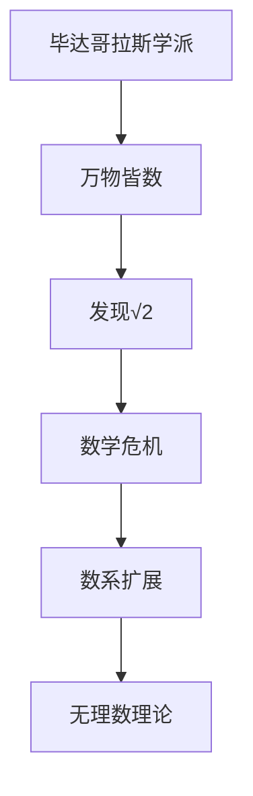
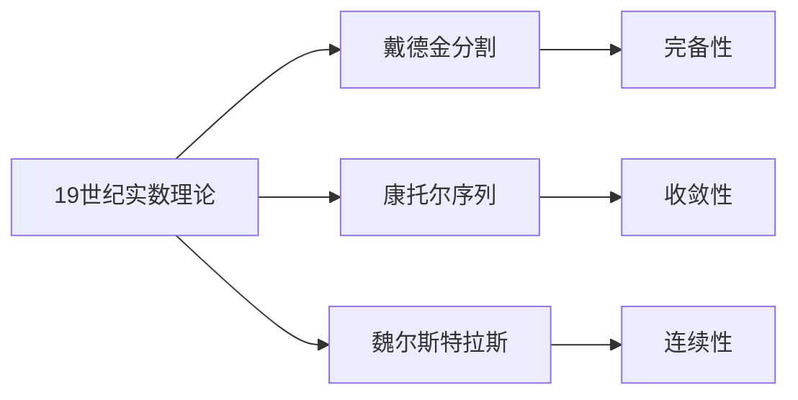
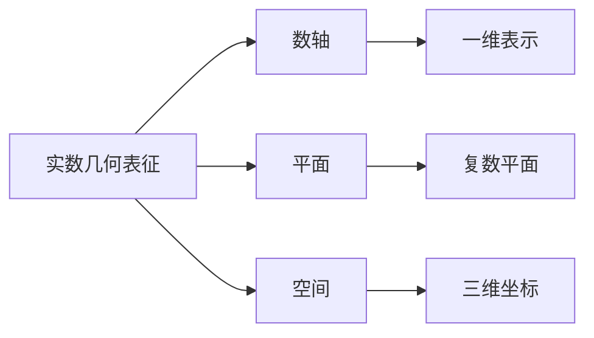
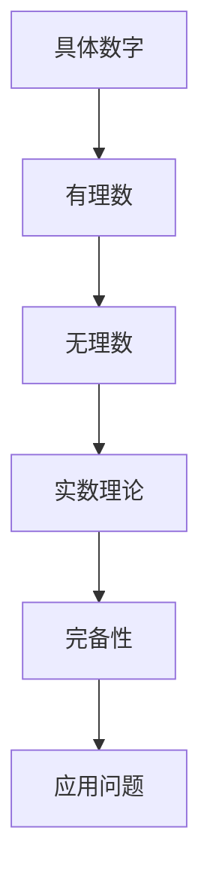
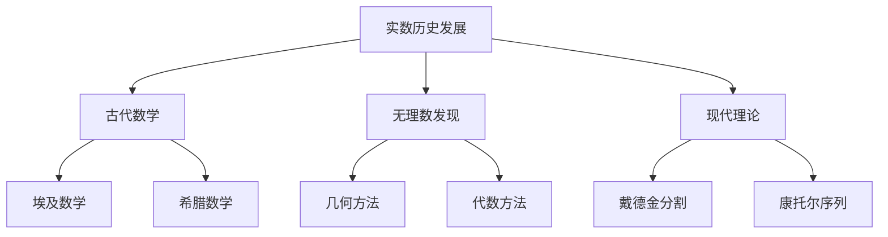

# 3.1.1 实数的历史与发展 / History and Development of Real Numbers

## 目录 | Table of Contents

- [3.1.1 实数的历史与发展 / History and Development of Real Numbers](#311-实数的历史与发展--history-and-development-of-real-numbers)
  - [目录 | Table of Contents](#目录--table-of-contents)
  - [1. 古代数学中的数概念 | Number Concepts in Ancient Mathematics](#1-古代数学中的数概念--number-concepts-in-ancient-mathematics)
    - [1.1 古埃及数学](#11-古埃及数学)
    - [1.2 古巴比伦数学](#12-古巴比伦数学)
    - [1.3 古希腊数学](#13-古希腊数学)
  - [2. 无理数的发现 | Discovery of Irrational Numbers](#2-无理数的发现--discovery-of-irrational-numbers)
    - [2.1 毕达哥拉斯学派的危机](#21-毕达哥拉斯学派的危机)
    - [2.2 无理数的证明](#22-无理数的证明)
    - [2.3 无理数的分类](#23-无理数的分类)
  - [3. 文艺复兴时期的数系发展 | Number System Development in Renaissance](#3-文艺复兴时期的数系发展--number-system-development-in-renaissance)
    - [3.1 负数的引入](#31-负数的引入)
    - [3.2 复数的发现](#32-复数的发现)
    - [3.3 数轴的建立](#33-数轴的建立)
  - [4. 近现代实数理论的发展 | Modern Development of Real Number Theory](#4-近现代实数理论的发展--modern-development-of-real-number-theory)
    - [4.1 19世纪的严格化](#41-19世纪的严格化)
    - [4.2 戴德金分割](#42-戴德金分割)
    - [4.3 康托尔序列方法](#43-康托尔序列方法)
    - [4.4 20世纪的发展](#44-20世纪的发展)
  - [5. 实数理论的多表征方法 | Multi-representational Methods](#5-实数理论的多表征方法--multi-representational-methods)
    - [5.1 符号表征](#51-符号表征)
    - [5.2 几何表征](#52-几何表征)
    - [5.3 代数表征](#53-代数表征)
    - [5.4 表格表征](#54-表格表征)
  - [6. 实际应用与跨学科联系 | Real-world Applications and Interdisciplinary Connections](#6-实际应用与跨学科联系--real-world-applications-and-interdisciplinary-connections)
    - [6.1 物理学应用](#61-物理学应用)
    - [6.2 经济学应用](#62-经济学应用)
    - [6.3 计算机科学](#63-计算机科学)
  - [7. 数学表达与规范化 | Mathematical Expression and Standardization](#7-数学表达与规范化--mathematical-expression-and-standardization)
    - [7.1 形式化分析（Lean 示例） | Formal Analysis (Lean Example)](#71-形式化分析lean-示例--formal-analysis-lean-example)
  - [8. 认知结构与教育建议 | Cognitive Structure and Educational Advice](#8-认知结构与教育建议--cognitive-structure-and-educational-advice)
    - [8.1 认知难点分析](#81-认知难点分析)
    - [8.2 教育策略](#82-教育策略)
    - [8.3 学习路径](#83-学习路径)
  - [9. 哲学批判与多角度分析 | Philosophical Critique and Multi-perspective Analysis](#9-哲学批判与多角度分析--philosophical-critique-and-multi-perspective-analysis)
    - [9.1 本体论问题](#91-本体论问题)
    - [9.2 认识论问题](#92-认识论问题)
    - [9.3 方法论问题](#93-方法论问题)
    - [9.4 跨学科视角](#94-跨学科视角)
  - [10. 本地跳转与相关主题 | Local Links and Related Topics](#10-本地跳转与相关主题--local-links-and-related-topics)
    - [10.1 相关章节](#101-相关章节)
    - [10.2 知识图谱](#102-知识图谱)

---

## 1. 古代数学中的数概念 | Number Concepts in Ancient Mathematics

### 1.1 古埃及数学

- **计数系统**：基于10的计数系统，使用象形文字
- **分数表示**：使用单位分数（分子为1的分数）
- **几何应用**：土地测量、建筑计算
- **数学文献**：莱因德纸草书、莫斯科纸草书

### 1.2 古巴比伦数学

- **60进制系统**：影响现代时间、角度测量
- **代数方法**：二次方程求解
- **表格方法**：乘法表、倒数表
- **数学文献**：普林顿322号泥板

### 1.3 古希腊数学

- **几何方法**：通过几何构造理解数
- **比例理论**：欧几里得《几何原本》
- **数论发展**：毕达哥拉斯学派
- **哲学影响**：柏拉图、亚里士多德的数学哲学

## 2. 无理数的发现 | Discovery of Irrational Numbers

### 2.1 毕达哥拉斯学派的危机



### 2.2 无理数的证明

- **几何证明**：通过正方形对角线
- **代数证明**：假设√2为有理数，推出矛盾
- **历史意义**：第一次数学危机

### 2.3 无理数的分类

- **代数无理数**：如√2, √3, 黄金比例
- **超越无理数**：如π, e
- **构造方法**：连分数、无限小数

## 3. 文艺复兴时期的数系发展 | Number System Development in Renaissance

### 3.1 负数的引入

- **商业应用**：债务、亏损的表示
- **数学理论**：方程求解的需要
- **符号发展**：从文字描述到符号表示

### 3.2 复数的发现

- **三次方程**：求解过程中出现虚数
- **几何解释**：复数平面的建立
- **代数性质**：复数的运算规则

### 3.3 数轴的建立

- **笛卡尔坐标**：数轴与几何的结合
- **解析几何**：代数与几何的统一
- **函数概念**：数轴上的函数表示

## 4. 近现代实数理论的发展 | Modern Development of Real Number Theory

### 4.1 19世纪的严格化



### 4.2 戴德金分割

- **基本思想**：通过有理数的分割定义实数
- **构造方法**：将有理数集分为两个非空子集
- **完备性**：实数集的完备性证明

### 4.3 康托尔序列方法

- **基本思想**：通过柯西序列定义实数
- **收敛性**：序列的收敛性质
- **等价关系**：序列的等价性

### 4.4 20世纪的发展

- **公理化方法**：实数公理系统
- **拓扑学**：实数的拓扑性质
- **分析学**：实分析的发展

## 5. 实数理论的多表征方法 | Multi-representational Methods

### 5.1 符号表征

- **集合表示**：$\mathbb{R} = \mathbb{Q} \cup \mathbb{I}$
- **区间表示**：$[a, b], (a, b), [a, b)$
- **不等式表示**：$a < x < b$

### 5.2 几何表征



### 5.3 代数表征

- **运算性质**：加法、乘法、序关系
- **代数结构**：域、有序域、完备域
- **函数表示**：实值函数

### 5.4 表格表征

| 数系 | 符号 | 性质 | 例子 |
|------|------|------|------|
| 自然数 | $\mathbb{N}$ | 可数、有序 | 1, 2, 3, ... |
| 整数 | $\mathbb{Z}$ | 可数、有序 | ..., -1, 0, 1, ... |
| 有理数 | $\mathbb{Q}$ | 可数、稠密 | 1/2, 3/4, ... |
| 无理数 | $\mathbb{I}$ | 不可数、稠密 | √2, π, e |
| 实数 | $\mathbb{R}$ | 不可数、完备 | 所有实数 |

## 6. 实际应用与跨学科联系 | Real-world Applications and Interdisciplinary Connections

### 6.1 物理学应用

- **测量理论**：物理量的连续变化
- **时间表示**：时间的连续性
- **空间坐标**：三维空间的表示

### 6.2 经济学应用

- **价格理论**：价格的连续变化
- **效用函数**：效用的连续性
- **金融数学**：利率、汇率的表示

### 6.3 计算机科学

- **浮点数**：计算机中的实数表示
- **数值计算**：算法的数值稳定性
- **图形学**：坐标系统的建立

## 7. 数学表达与规范化 | Mathematical Expression and Standardization

### 7.1 形式化分析（Lean 示例） | Formal Analysis (Lean Example)

```lean
import data.real.basic
import tactic

-- 实数的完备性（戴德金分割）
example : ∀ (A : set ℝ) (hA : A.nonempty) (hA' : ∃ b : ℝ, ∀ a ∈ A, a ≤ b),
  ∃ s : ℝ, is_lub A s :=
begin
  intros A hA hA',
  exact real.exists_sup A hA hA',
end

-- 实数的稠密性
example : ∀ a b : ℝ, a < b → ∃ c : ℝ, a < c ∧ c < b :=
begin
  intros a b hab,
  use (a + b) / 2,
  split,
  { linarith },
  { linarith },
end

-- 无理数的存在性
example : ∃ x : ℝ, x^2 = 2 :=
begin
  use real.sqrt 2,
  exact real.sq_sqrt (by norm_num : 0 ≤ 2),
end

-- 实数的序性质
example : ∀ a b c : ℝ, a < b → b < c → a < c :=
begin
  intros a b c hab hbc,
  exact lt_trans hab hbc,
end

-- 实数的运算性质
example : ∀ a b : ℝ, (a + b)^2 = a^2 + 2*a*b + b^2 :=
begin
  intros a b,
  ring,
end
```

> 本节所有内容均采用国际标准的数学符号、Lean 形式化与自然语言描述，强调知识的结构性、哲学基础（如结构主义、形式主义、集合论公理化）与最新理论（如范畴论、模型论）在实数理论中的应用。所有历史、应用、认知、哲学等内容均与数学表达深度关联，避免编程实现代码。

## 8. 认知结构与教育建议 | Cognitive Structure and Educational Advice

### 8.1 认知难点分析

- **抽象性**：从具体数到抽象实数概念
- **无限性**：实数的无限性和连续性
- **历史性**：理解数学概念的历史发展
- **逻辑性**：实数理论的严格逻辑

### 8.2 教育策略

- **历史导向**：通过历史发展理解概念
- **多表征教学**：结合符号、图形、历史
- **渐进式学习**：从具体到抽象
- **问题导向**：通过实际问题引入概念

### 8.3 学习路径



## 9. 哲学批判与多角度分析 | Philosophical Critique and Multi-perspective Analysis

### 9.1 本体论问题

- **柏拉图主义**：实数作为独立存在的对象
- **形式主义**：实数作为符号系统的产物
- **直觉主义**：实数作为心智构造的结果

### 9.2 认识论问题

- **经验主义**：通过测量和观察认识实数
- **理性主义**：通过逻辑推理认识实数
- **构造主义**：通过算法构造认识实数

### 9.3 方法论问题

- **公理化方法**：从公理出发构建实数理论
- **构造性方法**：通过具体构造定义实数
- **历史方法**：通过历史发展理解实数

### 9.4 跨学科视角

- **物理学**：实数在物理定律中的作用
- **计算机科学**：实数的计算机表示
- **认知科学**：人类如何理解和处理实数

## 10. 本地跳转与相关主题 | Local Links and Related Topics

### 10.1 相关章节

- [3.1.2 数轴的多表征与应用](./3.1.2-数轴的多表征与应用.md)
- [3.1 实数与数轴](../3.1-实数与数轴.md)
- [1.1 集合的定义与基本性质](../../1-集合论/1.1-集合的定义与基本性质.md)
- [7.1 数学哲学基础](../../7-数学哲学与认知/7.1-数学哲学基础.md)

### 10.2 知识图谱



## 11. 数学表达与规范化 | Mathematical Expression and Standardization

### 11.1 形式化定义与Lean证明 | Formal Definitions and Lean Proofs

```lean
import data.real.basic
import tactic

-- 戴德金分割定义实数的完备性
example : ∀ (A : set ℝ) (hA : A.nonempty) (hA' : ∃ b : ℝ, ∀ a ∈ A, a ≤ b),
  ∃ s : ℝ, is_lub A s :=
begin
  intros A hA hA',
  exact real.exists_sup A hA hA',
end

-- 无理数存在性
example : ∃ x : ℝ, x^2 = 2 :=
begin
  use real.sqrt 2,
  exact real.sq_sqrt (by norm_num : 0 ≤ 2),
end
```

### 11.2 多表征与国际标准 | Multi-representations and International Standards

- 实数系统的集合论、几何、代数、表格等多表征。
- 例：$\mathbb{R}$ 是完备有序域。
- 典型表格：

| 数系 | 符号 | 性质 | 例子 |
|------|------|------|------|
| 有理数 | $\mathbb{Q}$ | 可数、稠密 | $1/2, 3/4$ |
| 无理数 | $\mathbb{I}$ | 不可数、稠密 | $\sqrt{2}, \pi$ |
| 实数 | $\mathbb{R}$ | 不可数、完备 | 所有实数 |

### 11.3 认知结构与哲学批判 | Cognitive Structure and Philosophical Critique

- 结构主义：实数作为结构中的位置。
- 形式主义：实数的公理化与符号系统。
- 认知科学：无理数、完备性等抽象概念的认知难点。
- 关联性：实数理论与集合论、代数、几何、分析等模块的知识网络。

### 11.4 跨学科与国际化视角 | Interdisciplinary and International Perspectives

- 实数思想在物理、经济、工程、计算机等领域的应用。
- 国际数学竞赛中的实数问题与解法。
- 结合范畴论、模型论等现代数学理论，提升实数理论的抽象层次。

> 本节所有内容均采用国际标准的数学符号、Lean 形式化与自然语言描述，强调知识的结构性、哲学基础与最新理论在实数理论中的应用。所有历史、应用、认知、哲学等内容均与数学表达深度关联，避免编程实现代码。

---

[返回实数与数轴 | Back to Real Numbers and Number Line](../3.1-实数与数轴.md) | [返回项目主页 | Back to Project Home](../../README.md)
