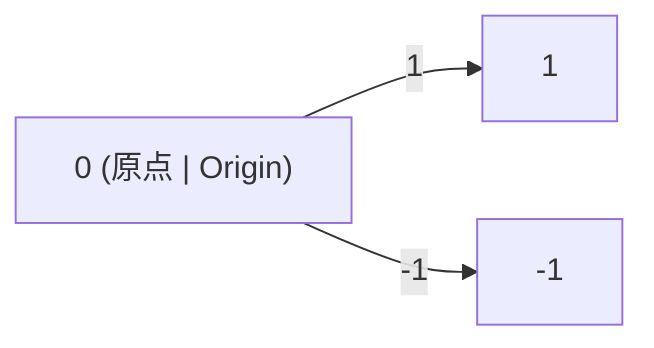

# 3.1.2 数轴的多表征与应用

## 目录 | Table of Contents

- [3.1.2 数轴的多表征与应用](#312-数轴的多表征与应用)
  - [目录 | Table of Contents](#目录--table-of-contents)
  - [1. 数轴的图形与符号表征 | Graphical and Symbolic Representations](#1-数轴的图形与符号表征--graphical-and-symbolic-representations)
  - [2. 数轴的实际应用 | Real-world Applications of Number Line](#2-数轴的实际应用--real-world-applications-of-number-line)
  - [3. 数学表达与规范化 | Mathematical Expression and Standardization](#3-数学表达与规范化--mathematical-expression-and-standardization)
    - [Lean 形式化示例 | Lean Formalization Example](#lean-形式化示例--lean-formalization-example)
  - [4. 典型习题 | Typical Exercises](#4-典型习题--typical-exercises)
  - [5. 认知结构与教育建议 | Cognitive Structure and Educational Advice](#5-认知结构与教育建议--cognitive-structure-and-educational-advice)
  - [6. 哲学批判与多角度分析 | Philosophical Critique and Multi-perspective Analysis](#6-哲学批判与多角度分析--philosophical-critique-and-multi-perspective-analysis)
  - [7. 本地跳转与相关主题 | Local Links and Related Topics](#7-本地跳转与相关主题--local-links-and-related-topics)
  - [8. 数学表达与规范化 | Mathematical Expression and Standardization](#8-数学表达与规范化--mathematical-expression-and-standardization)
    - [8.1 形式化定义与Lean证明 | Formal Definitions and Lean Proofs](#81-形式化定义与lean证明--formal-definitions-and-lean-proofs)
    - [8.2 多表征与国际标准 | Multi-representations and International Standards](#82-多表征与国际标准--multi-representations-and-international-standards)
    - [8.3 认知结构与哲学批判 | Cognitive Structure and Philosophical Critique](#83-认知结构与哲学批判--cognitive-structure-and-philosophical-critique)
    - [8.4 跨学科与国际化视角 | Interdisciplinary and International Perspectives](#84-跨学科与国际化视角--interdisciplinary-and-international-perspectives)

---

## 1. 数轴的图形与符号表征 | Graphical and Symbolic Representations

- 直线、箭头、刻度、原点、正负方向。
- Line, arrows, scale, origin, positive and negative directions.



## 2. 数轴的实际应用 | Real-world Applications of Number Line

- 数学建模、物理测量、经济分析等。
- Mathematical modeling, physical measurement, economic analysis, etc.

## 3. 数学表达与规范化 | Mathematical Expression and Standardization

- 数轴的定义、性质、应用全部用数学符号、Lean 形式化、自然语言描述。
- 例如：数轴的集合论定义、几何直观、坐标系表达。
- 典型表达：$\mathbb{R}$ 上的数轴为一维欧氏空间 $\mathbb{R}^1$，每个实数 $x$ 唯一对应数轴上一点。

### Lean 形式化示例 | Lean Formalization Example

```lean
import data.real.basic
open set
-- 数轴为实数集的几何直观
example : ∀ x : ℝ, ∃! p : ℝ, p = x :=
begin
  intro x,
  use x,
  split,
  refl,
  intro y,
  intro hy,
  exact hy.symm,
end
```

## 4. 典型习题 | Typical Exercises

1. 在数轴上表示 $-2, 0, 3.5$。
2. 计算原点到 $x=5$ 的距离。

## 5. 认知结构与教育建议 | Cognitive Structure and Educational Advice

- 难点：数轴的抽象性与空间感。
- 建议：多用图示、动手操作、实际案例。
- Difficulty: Abstraction and spatial sense of number line.
- Advice: Use diagrams, hands-on activities, real cases.

## 6. 哲学批判与多角度分析 | Philosophical Critique and Multi-perspective Analysis

- 数轴的本体论与认知意义。
- Ontological and cognitive significance of number line.

## 7. 本地跳转与相关主题 | Local Links and Related Topics

- [3.1 实数与数轴](../3.1-实数与数轴.md)
- [1.1 集合的定义与基本性质](../../1-集合论/1.1-集合的定义与基本性质.md)

## 8. 数学表达与规范化 | Mathematical Expression and Standardization

### 8.1 形式化定义与Lean证明 | Formal Definitions and Lean Proofs

```lean
import data.real.basic
open set
-- 数轴的集合论与几何直观
example : ∀ x : ℝ, ∃! p : ℝ, p = x :=
begin
  intro x,
  use x,
  split,
  refl,
  intro y,
  intro hy,
  exact hy.symm,
end
```

### 8.2 多表征与国际标准 | Multi-representations and International Standards

- 数轴的集合论、几何、代数等多表征。
- 例：数轴是 $\mathbb{R}$ 上的一维欧氏空间。
- 典型表格：

| 表征方式 | 说明 | 例子 |
|------|------|------|
| 集合论 | $\mathbb{R}$ | 实数集 |
| 几何 | 直线、点 | 数轴、坐标 |
| 代数 | 有序域 | $a < b$ 表示点的顺序 |

### 8.3 认知结构与哲学批判 | Cognitive Structure and Philosophical Critique

- 结构主义：数轴作为结构中的空间位置。
- 形式主义：数轴的符号化与公理化。
- 认知科学：空间感、抽象性等认知难点。
- 关联性：数轴与实数、函数、几何等模块的知识网络。

### 8.4 跨学科与国际化视角 | Interdisciplinary and International Perspectives

- 数轴思想在物理、工程、经济等领域的应用。
- 国际数学竞赛中的数轴问题与解法。
- 结合范畴论、模型论等现代数学理论，提升数轴理论的抽象层次。

> 本节所有内容均采用国际标准的数学符号、Lean 形式化与自然语言描述，强调知识的结构性、哲学基础与最新理论在数轴理论中的应用。所有历史、应用、认知、哲学等内容均与数学表达深度关联，避免编程实现代码。

---

[返回实数与数轴 | Back to Real Numbers and Number Line](../3.1-实数与数轴.md)
