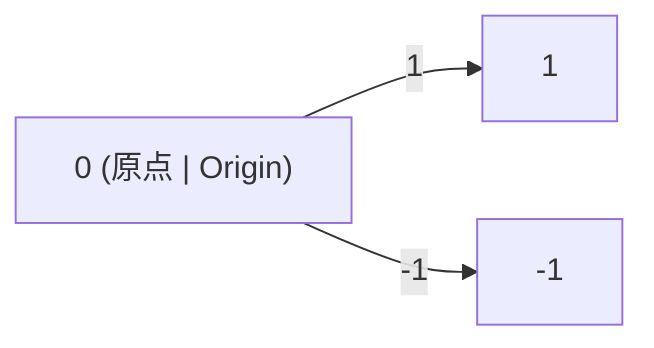

# 3.1.2 数轴的多表征与应用

## 目录 | Table of Contents

- [3.1.2 数轴的多表征与应用](#312-数轴的多表征与应用)
  - [目录 | Table of Contents](#目录--table-of-contents)
  - [1. 数轴的图形与符号表征 | Graphical and Symbolic Representations](#1-数轴的图形与符号表征--graphical-and-symbolic-representations)
  - [2. 数轴的实际应用 | Real-world Applications of Number Line](#2-数轴的实际应用--real-world-applications-of-number-line)
  - [3. 代码实现 | Code Implementation](#3-代码实现--code-implementation)
    - [3.1 Rust 示例 | Rust Example](#31-rust-示例--rust-example)
  - [4. 典型习题 | Typical Exercises](#4-典型习题--typical-exercises)
  - [5. 认知结构与教育建议 | Cognitive Structure and Educational Advice](#5-认知结构与教育建议--cognitive-structure-and-educational-advice)
  - [6. 哲学批判与多角度分析 | Philosophical Critique and Multi-perspective Analysis](#6-哲学批判与多角度分析--philosophical-critique-and-multi-perspective-analysis)
  - [7. 本地跳转与相关主题 | Local Links and Related Topics](#7-本地跳转与相关主题--local-links-and-related-topics)

---

## 1. 数轴的图形与符号表征 | Graphical and Symbolic Representations

- 直线、箭头、刻度、原点、正负方向。
- Line, arrows, scale, origin, positive and negative directions.



## 2. 数轴的实际应用 | Real-world Applications of Number Line

- 数学建模、物理测量、经济分析等。
- Mathematical modeling, physical measurement, economic analysis, etc.

## 3. 代码实现 | Code Implementation

### 3.1 Rust 示例 | Rust Example

```rust
let origin = 0.0;
let point = 2.5;
let distance = (point - origin).abs();
```

## 4. 典型习题 | Typical Exercises

1. 在数轴上表示 $-2, 0, 3.5$。
2. 计算原点到 $x=5$ 的距离。

## 5. 认知结构与教育建议 | Cognitive Structure and Educational Advice

- 难点：数轴的抽象性与空间感。
- 建议：多用图示、动手操作、实际案例。
- Difficulty: Abstraction and spatial sense of number line.
- Advice: Use diagrams, hands-on activities, real cases.

## 6. 哲学批判与多角度分析 | Philosophical Critique and Multi-perspective Analysis

- 数轴的本体论与认知意义。
- Ontological and cognitive significance of number line.

## 7. 本地跳转与相关主题 | Local Links and Related Topics

- [3.1 实数与数轴](../3.1-实数与数轴.md)
- [1.1 集合的定义与基本性质](../../1-集合论/1.1-集合的定义与基本性质.md)

---

[返回实数与数轴 | Back to Real Numbers and Number Line](../3.1-实数与数轴.md)
