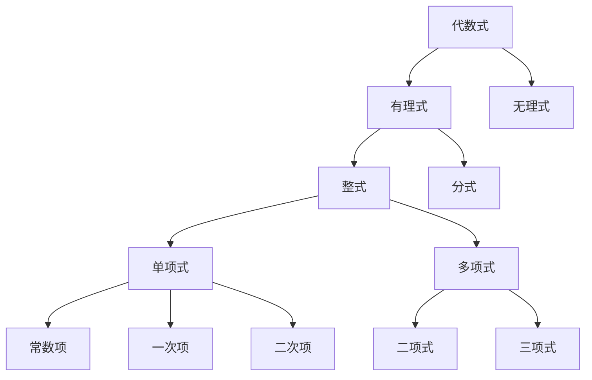
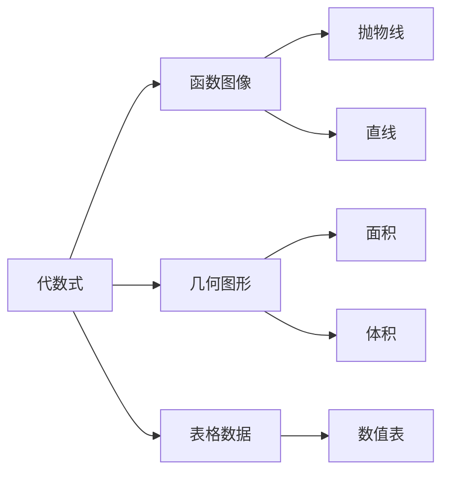
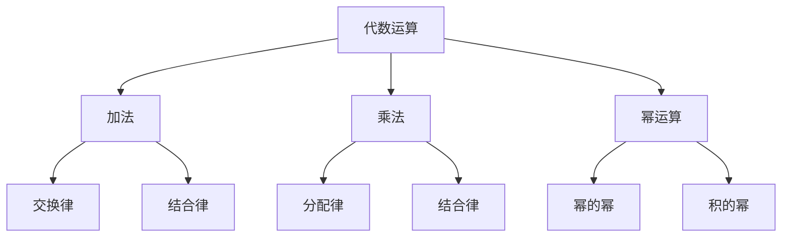
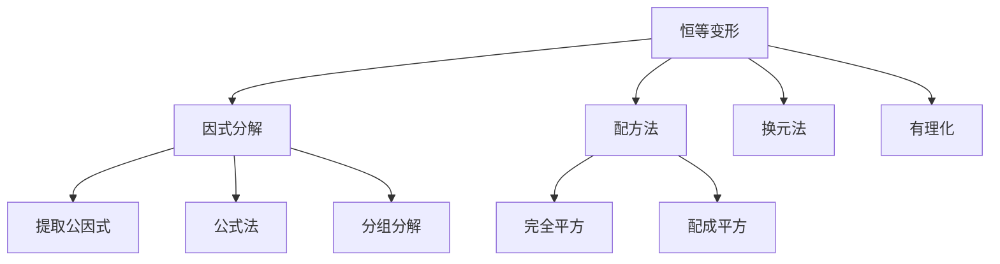
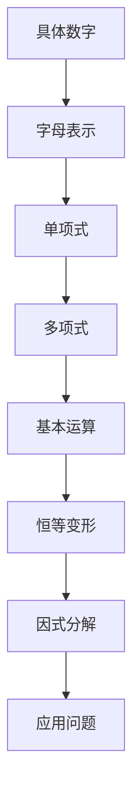
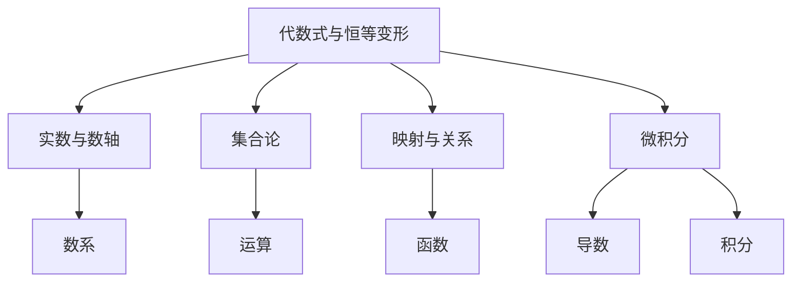

# 3.2 代数式与恒等变形 / Algebraic Expressions and Identities

## 目录

- [3.2 代数式与恒等变形 / Algebraic Expressions and Identities](#32-代数式与恒等变形--algebraic-expressions-and-identities)
  - [目录](#目录)
  - [1. 历史发展与背景](#1-历史发展与背景)
    - [1.1 历史发展](#11-历史发展)
    - [1.2 认知发展理论](#12-认知发展理论)
  - [2. 代数式的定义与分类](#2-代数式的定义与分类)
    - [2.1 代数式的定义](#21-代数式的定义)
    - [2.2 代数式分类](#22-代数式分类)
    - [2.3 基本概念](#23-基本概念)
  - [3. 代数式的多表征方法](#3-代数式的多表征方法)
    - [3.1 符号表征](#31-符号表征)
    - [3.2 图形表征](#32-图形表征)
    - [3.3 表格表征](#33-表格表征)
  - [4. 基本运算与性质](#4-基本运算与性质)
    - [4.1 加法运算](#41-加法运算)
    - [4.2 乘法运算](#42-乘法运算)
    - [4.3 运算性质](#43-运算性质)
  - [5. 恒等变形的概念与方法](#5-恒等变形的概念与方法)
    - [5.1 恒等变形的定义](#51-恒等变形的定义)
    - [5.2 基本恒等式](#52-基本恒等式)
    - [5.3 变形方法](#53-变形方法)
    - [5.4 变形策略](#54-变形策略)
  - [6. 实际应用与跨学科联系](#6-实际应用与跨学科联系)
    - [6.1 物理学应用](#61-物理学应用)
    - [6.2 经济学应用](#62-经济学应用)
    - [6.3 计算机科学](#63-计算机科学)
  - [7. 数学表达与规范化 | Mathematical Expression and Standardization](#7-数学表达与规范化--mathematical-expression-and-standardization)
    - [7.1 形式化证明（Lean 示例） | Formal Proof (Lean Example)](#71-形式化证明lean-示例--formal-proof-lean-example)
  - [8. 认知结构与教育建议](#8-认知结构与教育建议)
    - [8.1 认知难点分析](#81-认知难点分析)
    - [8.2 教育策略](#82-教育策略)
    - [8.3 学习路径](#83-学习路径)
  - [9. 哲学批判与多角度分析](#9-哲学批判与多角度分析)
    - [9.1 本体论问题](#91-本体论问题)
    - [9.2 认识论问题](#92-认识论问题)
    - [9.3 方法论问题](#93-方法论问题)
    - [9.4 跨学科视角](#94-跨学科视角)
  - [10. 本地跳转与相关主题](#10-本地跳转与相关主题)
    - [10.1 相关章节](#101-相关章节)
    - [10.2 知识图谱](#102-知识图谱)

---

## 1. 历史发展与背景

### 1.1 历史发展

- **古代数学**：巴比伦、埃及的代数问题
- **中世纪**：阿拉伯数学家发展符号代数
- **文艺复兴**：韦达引入字母表示未知数
- **17-18世纪**：牛顿、莱布尼茨发展微积分中的代数方法
- **现代发展**：抽象代数、计算机代数系统

### 1.2 认知发展理论

根据皮亚杰的认知发展理论：

- **具体运算期**：能处理具体的代数运算
- **形式运算期**：能进行抽象的代数推理和证明

## 2. 代数式的定义与分类

### 2.1 代数式的定义

代数式是由数、字母和运算符号组成的有意义的数学表达式。

### 2.2 代数式分类



### 2.3 基本概念

- **项**：代数式中被加号或减号分隔的部分
- **系数**：字母前的数字因子
- **次数**：单项式中所有字母指数的和
- **同类项**：字母部分相同的项

## 3. 代数式的多表征方法

### 3.1 符号表征

- 标准形式：$ax^n + bx^{n-1} + \cdots + c$
- 因式分解形式：$(x-a_1)(x-a_2)\cdots(x-a_n)$
- 完全平方形式：$(x+h)^2 + k$

### 3.2 图形表征



### 3.3 表格表征

| 代数式类型 | 一般形式 | 示例 |
|-----------|----------|------|
| 单项式 | $ax^n$ | $3x^2$ |
| 二项式 | $ax^n + bx^m$ | $x^2 + 1$ |
| 多项式 | $\sum_{i=0}^n a_i x^i$ | $2x^3 + 3x^2 + x + 1$ |
| 分式 | $\frac{P(x)}{Q(x)}$ | $\frac{x+1}{x-1}$ |

## 4. 基本运算与性质

### 4.1 加法运算

- 同类项合并：$ax^n + bx^n = (a+b)x^n$
- 交换律：$A + B = B + A$
- 结合律：$(A + B) + C = A + (B + C)$

### 4.2 乘法运算

- 分配律：$a(b + c) = ab + ac$
- 幂的运算：$x^m \cdot x^n = x^{m+n}$
- 积的幂：$(ab)^n = a^n b^n$

### 4.3 运算性质



## 5. 恒等变形的概念与方法

### 5.1 恒等变形的定义

恒等变形是指在不改变表达式值域的前提下，通过合法的运算步骤将表达式变为等价形式。

### 5.2 基本恒等式

- **平方差公式**：$a^2 - b^2 = (a-b)(a+b)$
- **完全平方公式**：$(a+b)^2 = a^2 + 2ab + b^2$
- **立方和公式**：$a^3 + b^3 = (a+b)(a^2 - ab + b^2)$
- **立方差公式**：$a^3 - b^3 = (a-b)(a^2 + ab + b^2)$

### 5.3 变形方法



### 5.4 变形策略

- **目标导向**：根据目标选择变形方向
- **结构分析**：识别表达式的结构特征
- **逐步变形**：分步骤进行变形，保持等价性

## 6. 实际应用与跨学科联系

### 6.1 物理学应用

- **运动学**：位移、速度、加速度的代数关系
- **力学**：力的分解与合成的代数表示
- **电磁学**：电路分析的代数方法

### 6.2 经济学应用

- **成本函数**：$C(x) = ax + b$
- **收益函数**：$R(x) = px$
- **利润函数**：$P(x) = R(x) - C(x)$

### 6.3 计算机科学

- **算法复杂度**：多项式时间算法
- **数据结构**：多项式表示
- **符号计算**：计算机代数系统

## 7. 数学表达与规范化 | Mathematical Expression and Standardization

### 7.1 形式化证明（Lean 示例） | Formal Proof (Lean Example)

```lean
import data.polynomial.basic
import tactic

variables {R : Type*} [comm_ring R]

-- 多项式的结合律
example (a b c : R) : (a + b) + c = a + (b + c) :=
begin
  exact add_assoc a b c,
end

-- 平方差公式
example (a b : R) : a^2 - b^2 = (a - b) * (a + b) :=
begin
  ring,
end

-- 多项式因式分解
example (x : R) : x^3 - 8 = (x - 2) * (x^2 + 2*x + 4) :=
begin
  ring,
end
```

### 7.2 多表征与国际标准 | Multi-representations and International Standards

- 代数式与恒等变形的集合论、代数、几何、表格等多表征。
- 例：多项式 $P(x) = a_nx^n + \cdots + a_0$ 可用符号、图形、表格等多种方式表达。
- 典型表格：

| 变形类型 | 公式 | 例子 |
|------|------|------|
| 平方差 | $a^2 - b^2 = (a-b)(a+b)$ | $x^2 - 9 = (x-3)(x+3)$ |
| 完全平方 | $(a+b)^2 = a^2 + 2ab + b^2$ | $(x+2)^2 = x^2 + 4x + 4$ |
| 立方和 | $a^3 + b^3 = (a+b)(a^2-ab+b^2)$ | $x^3 + 8 = (x+2)(x^2-2x+4)$ |

### 7.3 认知结构与哲学批判 | Cognitive Structure and Philosophical Critique

- 结构主义：代数式与恒等变形作为结构中的变换。
- 形式主义：代数恒等式的符号操作与公理体系。
- 认知科学：多项式、因式分解、变形等认知难点。
- 关联性：代数式与恒等变形与函数、集合论、几何、建模等模块的知识网络。

### 7.4 跨学科与国际化视角 | Interdisciplinary and International Perspectives

- 代数式与恒等变形思想在物理、工程、经济、计算机等领域的应用。
- 国际数学竞赛中的代数变形问题与解法。
- 结合范畴论、模型论等现代数学理论，提升代数式理论的抽象层次。

> 本节所有内容均采用国际标准的数学符号、Lean 形式化与自然语言描述，强调知识的结构性、哲学基础与最新理论在代数式与恒等变形理论中的应用。所有历史、应用、认知、哲学等内容均与数学表达深度关联，避免编程实现代码。

## 8. 认知结构与教育建议

### 8.1 认知难点分析

- **符号理解**：字母表示数的抽象概念
- **运算规则**：多项式的运算规律
- **变形技巧**：恒等变形的策略选择
- **结构识别**：识别代数式的结构特征

### 8.2 教育策略

- **具体到抽象**：从具体数字到字母表示
- **多表征教学**：符号、图形、表格相结合
- **问题导向**：通过实际问题引入概念
- **技术辅助**：使用计算机软件验证变形

### 8.3 学习路径



## 9. 哲学批判与多角度分析

### 9.1 本体论问题

- **形式主义**：代数式作为符号系统
- **柏拉图主义**：代数式反映数学对象的本质
- **构造主义**：代数式作为构造过程的产物

### 9.2 认识论问题

- **经验主义**：通过具体计算认识代数式
- **理性主义**：通过逻辑推理认识代数式
- **直觉主义**：通过直观构造认识代数式

### 9.3 方法论问题

- **公理化方法**：从公理出发构建代数理论
- **算法方法**：通过算法处理代数式
- **模型论方法**：通过模型理解代数式

### 9.4 跨学科视角

- **语言学**：代数符号的语言学特征
- **认知科学**：人类如何处理代数符号
- **计算机科学**：计算机如何处理代数式

## 10. 本地跳转与相关主题

### 10.1 相关章节

- [3.1 实数与数轴](./3.1-实数与数轴.md)
- [1.1 集合的定义与基本性质](../../1-集合论/1.1-集合的定义与基本性质.md)
- [2.1 映射的定义](../../2-映射与关系/2.1-映射的定义.md)
- [6.2 导数与微分](../../6-微积分与分析/6.2-导数与微分.md)

### 10.2 知识图谱



---

[返回数与代数目录](../README.md) | [返回项目主页](../../README.md)
