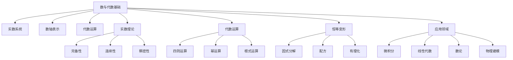

# 3-数与代数 | Numbers and Algebra

## 目录 | Table of Contents

- [3.1 实数与数轴](./3.1-实数与数轴.md)
- [3.2 代数式与恒等变形](./3.2-代数式与恒等变形.md)

---

## 章节概述 | Chapter Overview

数与代数是数学的核心基础，从实数的严格定义到代数式的运算，为高等数学提供了坚实的数系基础。本章节不仅介绍数的概念，还深入探讨代数运算的本质，为后续的微积分、线性代数等高级主题奠定基础。

### 🎯 学习目标 | Learning Objectives

- **理解数系结构**：掌握实数系的完整性和连续性
- **掌握代数运算**：熟练进行代数式的运算和变形
- **建立数感**：培养对数的直觉和抽象思维能力
- **应用数学建模**：在现实问题中应用数和代数的思想

### 📚 核心概念 | Core Concepts

- **实数系统**：完备性、连续性、稠密性
- **数轴表示**：几何直观、坐标系统
- **代数运算**：四则运算、幂运算、根式运算
- **恒等变形**：因式分解、配方、有理化
- **代数结构**：群、环、域的基本思想

### 🧠 认知结构 | Cognitive Structure

#### 学习难点 | Learning Difficulties

- **抽象概念**：实数的抽象性理解困难
- **符号运算**：复杂的代数运算规则
- **几何直观**：数轴的几何意义理解

#### 教学建议 | Teaching Suggestions

- **具体实例**：从具体例子开始理解数系
- **多表征**：使用符号、图形、表格等多种表征
- **渐进抽象**：从具体到抽象的渐进过程
- **实际应用**：结合现实生活中的数和代数例子

---

## 知识图谱 | Knowledge Graph

## 相关主题 | Related Topics

- [1-集合论](../1-集合论/README.md) - 数系的集合论基础
- [2-映射与关系](../2-映射与关系/README.md) - 函数作为特殊映射
- [4-几何与空间](../4-几何与空间/README.md) - 数轴与几何空间的联系
- [6-微积分与分析](../6-微积分与分析/README.md) - 实数在分析中的应用

## 学习路径 | Learning Path

### 初级路径 | Beginner Path

1. 理解实数的基本概念和性质
2. 掌握数轴的几何表示
3. 学习基本的代数运算
4. 理解恒等变形的基本方法

### 中级路径 | Intermediate Path

1. 深入理解实数的完备性
2. 掌握复杂的代数运算技巧
3. 学习因式分解和配方方法
4. 理解代数结构的基本思想

### 高级路径 | Advanced Path

1. 学习实数的公理化定义
2. 理解代数在抽象代数中的作用
3. 探索数系在数学分析中的应用
4. 研究代数在数学建模中的作用

---

[返回总目录 | Back to Main Directory](../README.md)
