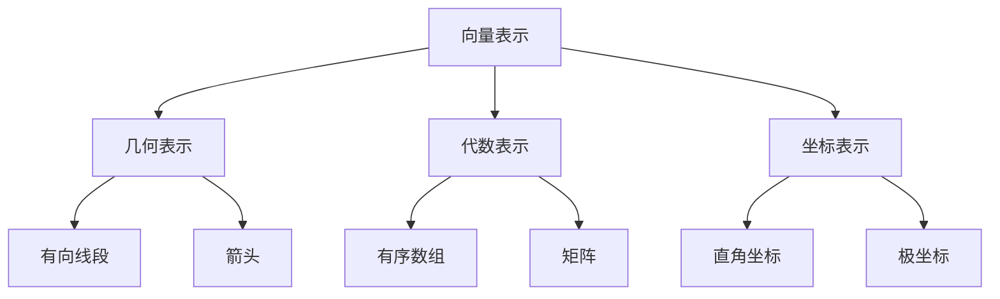
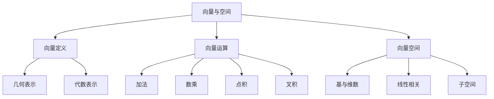

# 4.2 向量与空间 / Vectors and Space

## 目录

- [4.2 向量与空间 / Vectors and Space](#42-向量与空间--vectors-and-space)
  - [目录](#目录)
  - [1. 历史发展与背景](#1-历史发展与背景)
    - [1.1 历史发展](#11-历史发展)
    - [1.2 认知发展理论](#12-认知发展理论)
  - [2. 向量的定义与表示](#2-向量的定义与表示)
    - [2.1 向量的定义](#21-向量的定义)
    - [2.2 向量的表示方法](#22-向量的表示方法)
    - [2.3 向量的分类](#23-向量的分类)
  - [3. 向量的多表征方法](#3-向量的多表征方法)
    - [3.1 几何表征](#31-几何表征)
    - [3.2 代数表征](#32-代数表征)
    - [3.3 物理表征](#33-物理表征)
  - [4. 向量的基本运算](#4-向量的基本运算)
    - [4.1 向量的加法](#41-向量的加法)
    - [4.2 向量的减法](#42-向量的减法)
    - [4.3 数乘运算](#43-数乘运算)
    - [4.4 点积运算](#44-点积运算)
    - [4.5 叉积运算](#45-叉积运算)
  - [5. 空间的基本概念](#5-空间的基本概念)
    - [5.1 向量空间的定义](#51-向量空间的定义)
    - [5.2 基与维数](#52-基与维数)
    - [5.3 线性相关与无关](#53-线性相关与无关)
    - [5.4 子空间](#54-子空间)
  - [6. 实际应用与跨学科联系](#6-实际应用与跨学科联系)
    - [6.1 物理学应用](#61-物理学应用)
    - [6.2 计算机图形学](#62-计算机图形学)
    - [6.3 机器学习](#63-机器学习)
  - [7. 形式化证明与代码示例](#7-形式化证明与代码示例)
    - [7.1 形式化证明（Lean 示例）](#71-形式化证明lean-示例)
    - [7.2 Rust 代码示例](#72-rust-代码示例)
  - [8. 认知结构与教育建议](#8-认知结构与教育建议)
    - [8.1 认知难点分析](#81-认知难点分析)
    - [8.2 教育策略](#82-教育策略)
    - [8.3 学习路径](#83-学习路径)
  - [9. 哲学批判与多角度分析](#9-哲学批判与多角度分析)
    - [9.1 本体论问题](#91-本体论问题)
    - [9.2 认识论问题](#92-认识论问题)
    - [9.3 方法论问题](#93-方法论问题)
  - [10. 本地跳转与相关主题](#10-本地跳转与相关主题)
    - [10.1 相关章节](#101-相关章节)
    - [10.2 知识图谱](#102-知识图谱)

---

## 1. 历史发展与背景

### 1.1 历史发展

- **古代几何**：欧几里得几何中的有向线段概念
- **17世纪**：笛卡尔引入坐标几何，为向量代数奠定基础
- **19世纪**：哈密顿发展四元数理论，格拉斯曼发展外代数
- **20世纪**：吉布斯发展向量分析，广泛应用于物理学
- **现代发展**：线性代数理论完善，在计算机科学中广泛应用

### 1.2 认知发展理论

根据皮亚杰的认知发展理论：

- **具体运算期**：能理解向量的几何表示
- **形式运算期**：能进行抽象的向量运算和证明

## 2. 向量的定义与表示

### 2.1 向量的定义

向量是既有大小又有方向的量，在数学中通常用有序数组表示。

### 2.2 向量的表示方法



### 2.3 向量的分类

- **自由向量**：只考虑大小和方向，不考虑起点
- **固定向量**：有确定的起点和终点
- **零向量**：大小为0的向量
- **单位向量**：大小为1的向量

## 3. 向量的多表征方法

### 3.1 几何表征

- **有向线段**：用带箭头的线段表示
- **坐标点**：用起点和终点的坐标表示
- **极坐标**：用大小和方向角表示

### 3.2 代数表征

- **坐标表示**：$\vec{a} = (a_1, a_2, a_3)$
- **分量表示**：$\vec{a} = a_1\vec{i} + a_2\vec{j} + a_3\vec{k}$
- **矩阵表示**：$\vec{a} = \begin{bmatrix} a_1 \\ a_2 \\ a_3 \end{bmatrix}$

### 3.3 物理表征

- **力向量**：表示力的大小和方向
- **速度向量**：表示运动的速度和方向
- **位移向量**：表示位置的变化

## 4. 向量的基本运算

### 4.1 向量的加法

- **几何意义**：首尾相接的平行四边形法则
- **代数运算**：对应分量相加
- **性质**：交换律、结合律

### 4.2 向量的减法

- **几何意义**：$\vec{a} - \vec{b} = \vec{a} + (-\vec{b})$
- **代数运算**：对应分量相减

### 4.3 数乘运算

- **定义**：$k\vec{a} = (ka_1, ka_2, ka_3)$
- **几何意义**：缩放向量大小，保持或改变方向
- **性质**：分配律、结合律

### 4.4 点积运算

- **定义**：$\vec{a} \cdot \vec{b} = a_1b_1 + a_2b_2 + a_3b_3$
- **几何意义**：$\vec{a} \cdot \vec{b} = |\vec{a}||\vec{b}|\cos\theta$
- **应用**：计算夹角、投影、判断垂直

### 4.5 叉积运算

- **定义**：$\vec{a} \times \vec{b} = (a_2b_3-a_3b_2, a_3b_1-a_1b_3, a_1b_2-a_2b_1)$
- **几何意义**：垂直于两向量的向量，大小为平行四边形面积
- **应用**：计算面积、判断平行、确定法向量

## 5. 空间的基本概念

### 5.1 向量空间的定义

向量空间是满足以下公理的集合：

- **加法封闭性**：$\vec{a} + \vec{b} \in V$
- **数乘封闭性**：$k\vec{a} \in V$
- **加法交换律**：$\vec{a} + \vec{b} = \vec{b} + \vec{a}$
- **加法结合律**：$(\vec{a} + \vec{b}) + \vec{c} = \vec{a} + (\vec{b} + \vec{c})$
- **零向量存在**：存在$\vec{0}$使得$\vec{a} + \vec{0} = \vec{a}$
- **逆向量存在**：存在$-\vec{a}$使得$\vec{a} + (-\vec{a}) = \vec{0}$

### 5.2 基与维数

- **基的定义**：线性无关的向量组，能生成整个空间
- **维数**：基中向量的个数
- **标准基**：$\{\vec{i}, \vec{j}, \vec{k}\}$（三维空间）

### 5.3 线性相关与无关

- **线性相关**：存在不全为零的系数使得线性组合为零
- **线性无关**：只有全零系数才能使线性组合为零
- **判定方法**：行列式法、秩法

### 5.4 子空间

- **定义**：向量空间的子集，本身也是向量空间
- **例子**：直线、平面、超平面
- **性质**：包含零向量，对加法和数乘封闭

## 6. 实际应用与跨学科联系

### 6.1 物理学应用

- **力学**：力的合成与分解
- **电磁学**：电场、磁场的向量表示
- **流体力学**：速度场、压力梯度

### 6.2 计算机图形学

- **3D建模**：顶点、法向量、纹理坐标
- **动画**：位置、速度、加速度向量
- **光照**：光线方向、表面法向量

### 6.3 机器学习

- **特征向量**：数据点的向量表示
- **相似度计算**：向量间的距离和夹角
- **降维**：主成分分析、奇异值分解

## 7. 形式化证明与代码示例

### 7.1 形式化证明（Lean 示例）

```lean
import linear_algebra.basic
variables {V : Type*} [add_comm_group V] [vector_space ℝ V]

-- 向量加法交换律
example (a b : V) : a + b = b + a := add_comm a b

-- 向量加法结合律
example (a b c : V) : (a + b) + c = a + (b + c) := add_assoc a b c

-- 数乘分配律
example (k : ℝ) (a b : V) : k • (a + b) = k • a + k • b := smul_add k a b
```

### 7.2 Rust 代码示例

```rust
use nalgebra::{Vector3, Point3};

// 向量基本运算
fn vector_operations() {
    let a = Vector3::new(1.0, 2.0, 3.0);
    let b = Vector3::new(4.0, 5.0, 6.0);
    
    // 向量加法
    let sum = a + b;
    println!("向量加法: {:?}", sum);
    
    // 点积
    let dot_product = a.dot(&b);
    println!("点积: {}", dot_product);
    
    // 叉积
    let cross_product = a.cross(&b);
    println!("叉积: {:?}", cross_product);
    
    // 向量长度
    let magnitude = a.norm();
    println!("向量长度: {}", magnitude);
}

// 向量空间运算
fn vector_space_operations() {
    let vectors = vec![
        Vector3::new(1.0, 0.0, 0.0),
        Vector3::new(0.0, 1.0, 0.0),
        Vector3::new(0.0, 0.0, 1.0)
    ];
    
    // 检查线性无关
    let matrix = nalgebra::Matrix3::from_columns(&[
        vectors[0], vectors[1], vectors[2]
    ]);
    let determinant = matrix.determinant();
    println!("行列式: {}", determinant);
    
    if determinant.abs() > 1e-10 {
        println!("向量组线性无关");
    } else {
        println!("向量组线性相关");
    }
}
```

## 8. 认知结构与教育建议

### 8.1 认知难点分析

- **空间想象困难**：三维向量的几何表示
- **抽象概念理解**：向量空间的公理化定义
- **运算规则记忆**：各种向量运算的公式
- **几何与代数转换**：几何意义与代数运算的联系

### 8.2 教育策略

- **多表征教学**：结合几何、代数、物理表征
- **渐进式学习**：从二维到三维，从具体到抽象
- **应用导向**：通过实际问题引入向量概念
- **可视化工具**：使用计算机软件辅助教学

### 8.3 学习路径

1. **基础阶段**：理解向量的几何表示和基本运算
2. **发展阶段**：掌握向量的代数表示和运算规则
3. **应用阶段**：解决实际问题和跨学科应用
4. **抽象阶段**：理解向量空间的公理化结构

## 9. 哲学批判与多角度分析

### 9.1 本体论问题

- **向量的存在性**：向量是客观存在还是数学构造？
- **空间的本性**：向量空间是物理空间还是抽象空间？
- **维度的意义**：高维空间是否具有现实意义？

### 9.2 认识论问题

- **几何直觉**：几何直觉在向量学习中的作用
- **抽象思维**：从具体到抽象的认识过程
- **符号系统**：数学符号系统的认知功能

### 9.3 方法论问题

- **公理化方法**：向量空间的公理化定义
- **构造性方法**：向量的具体构造和表示
- **应用导向**：从应用出发理解向量概念

## 10. 本地跳转与相关主题

### 10.1 相关章节

- [4.1 欧几里得几何基础](./4.1-欧几里得几何基础.md)
- [3.1 实数与数轴](../3-数与代数/3.1-实数与数轴.md)
- [2.1 映射的定义](../2-映射与关系/2.1-映射的定义.md)

### 10.2 知识图谱



---

[返回几何与空间目录](../README.md) | [返回项目主页](../../README.md)
