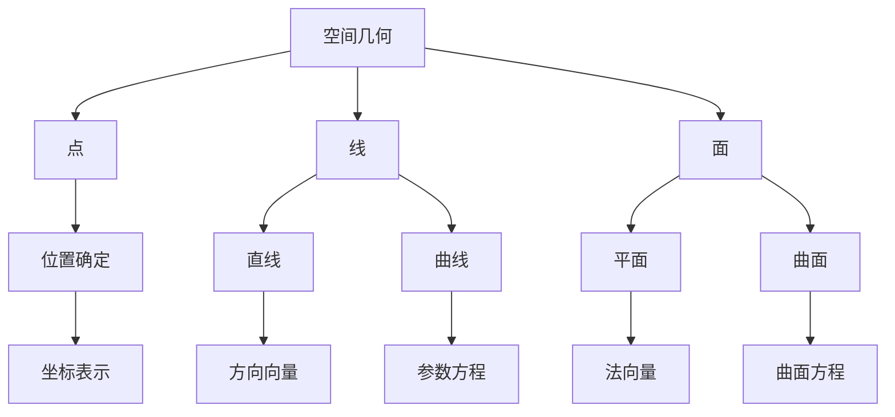
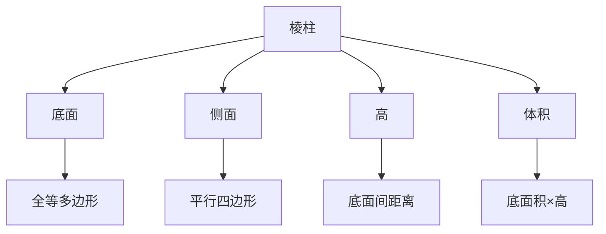
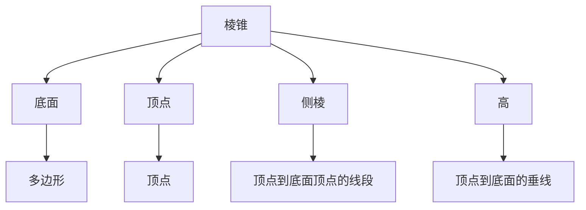
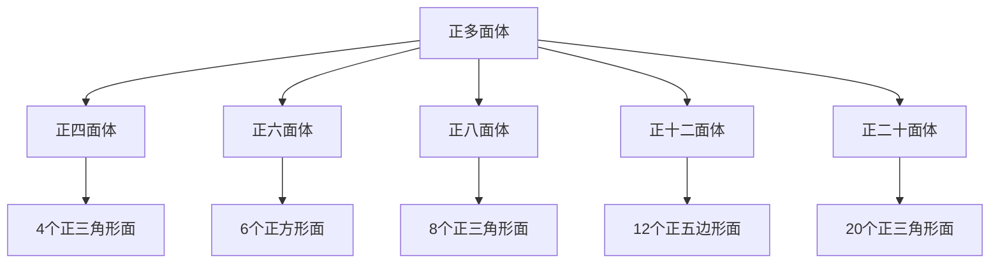
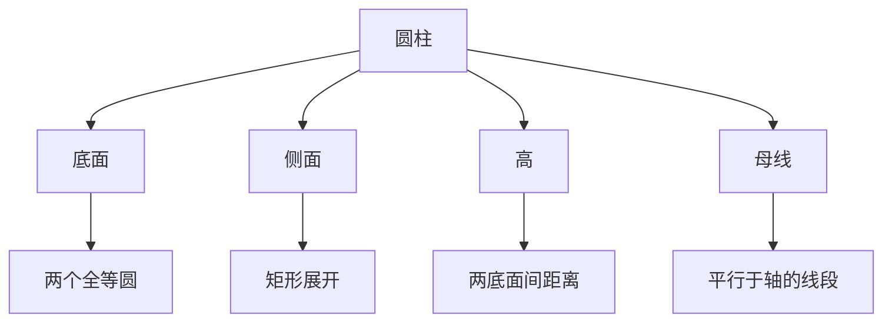
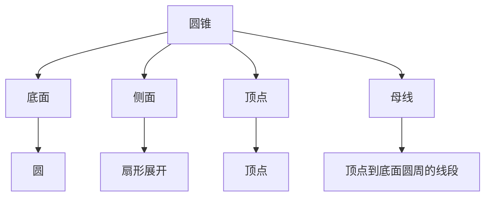
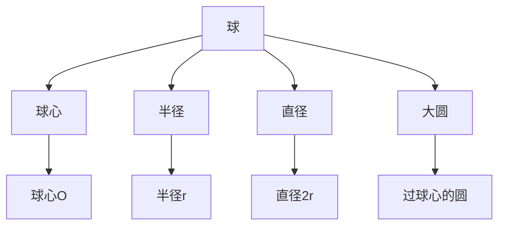
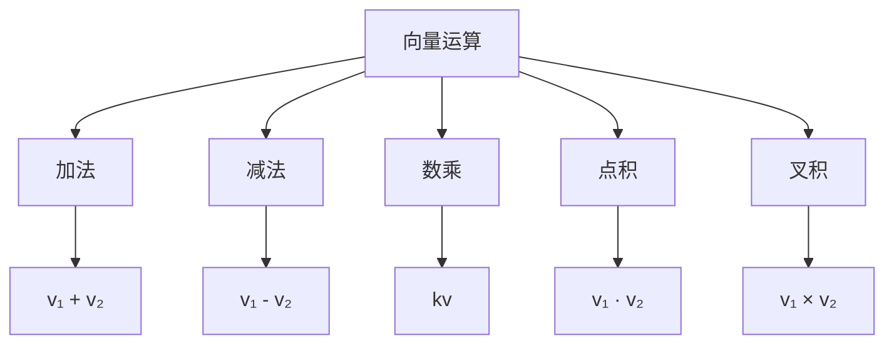
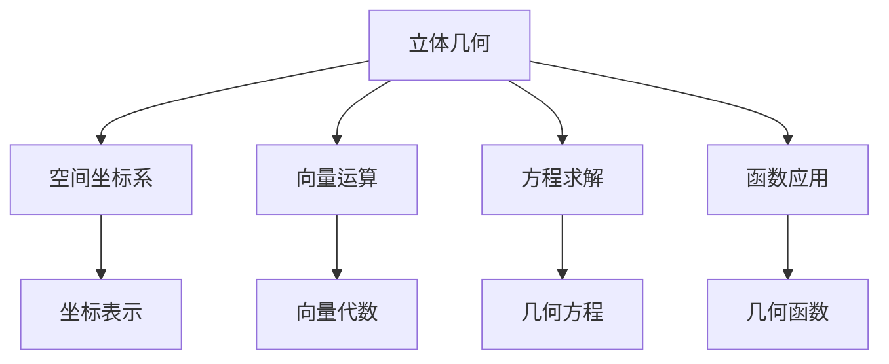

# 2.2 立体几何 | Solid Geometry

## 内容概述 | Content Overview

立体几何是研究三维空间中几何图形性质的数学分支，包括空间几何基础、多面体、旋转体、空间向量等核心内容。这些内容是高中数学的重要组成部分，也是工程、建筑等领域的重要基础。

### 学习目标 | Learning Objectives

- **理解空间概念**：掌握空间点、线、面的基本概念和性质
- **掌握多面体**：理解棱柱、棱锥、正多面体的性质和计算
- **熟悉旋转体**：掌握圆柱、圆锥、球的性质和计算
- **应用空间向量**：掌握空间向量的运算和应用

## 1. 空间几何基础 | Fundamentals of Solid Geometry

### 1.1 空间基本概念 | Basic Concepts in Space

**空间点、线、面**：

**空间坐标系**：

- **直角坐标系**：(x, y, z)
- **球坐标系**：(r, θ, φ)
- **柱坐标系**：(r, θ, z)

### 1.2 空间直线 | Lines in Space

**直线方程**：

1. **点向式**：r = r₀ + tv
2. **参数式**：x = x₀ + at, y = y₀ + bt, z = z₀ + ct
3. **对称式**：(x - x₀)/a = (y - y₀)/b = (z - z₀)/c

**直线性质**：

- **方向向量**：v = (a, b, c)
- **点向式**：过点P₀(x₀, y₀, z₀)，方向向量v
- **平行条件**：方向向量成比例
- **垂直条件**：方向向量点积为零

### 1.3 空间平面 | Planes in Space

**平面方程**：

1. **点法式**：n · (r - r₀) = 0
2. **一般式**：ax + by + cz + d = 0
3. **截距式**：x/a + y/b + z/c = 1

**平面性质**：

- **法向量**：n = (a, b, c)
- **点到平面距离**：d = |ax₀ + by₀ + cz₀ + d|/√(a² + b² + c²)
- **两平面夹角**：cos θ = |n₁ · n₂|/(|n₁||n₂|)

## 2. 多面体 | Polyhedra

### 2.1 棱柱 | Prisms

**棱柱定义**：
两个全等多边形平行放置，对应顶点用平行线段连接形成的几何体。

**棱柱性质**：

**常见棱柱**：

- **三棱柱**：底面为三角形
- **四棱柱**：底面为四边形
- **正棱柱**：底面为正多边形，侧面为矩形

**体积公式**：V = S × h
**表面积公式**：S = 2S底 + S侧

### 2.2 棱锥 | Pyramids

**棱锥定义**：
一个多边形底面，一个顶点，顶点到底面各顶点的连线形成的几何体。

**棱锥性质**：

**常见棱锥**：

- **三棱锥**：底面为三角形
- **四棱锥**：底面为四边形
- **正棱锥**：底面为正多边形，侧棱相等

**体积公式**：V = (1/3)S × h
**表面积公式**：S = S底 + S侧

### 2.3 正多面体 | Regular Polyhedra

**正多面体定义**：
所有面都是全等的正多边形，所有棱长相等，所有二面角相等的凸多面体。

**五种正多面体**：

**正多面体性质**：

- **面数F、棱数E、顶点数V**：F + V = E + 2（欧拉公式）
- **对称性**：具有高度的对称性
- **内切球和外接球**：存在唯一的内切球和外接球

## 3. 旋转体 | Solids of Revolution

### 3.1 圆柱 | Cylinders

**圆柱定义**：
矩形绕其一边旋转一周形成的几何体。

**圆柱性质**：

**圆柱公式**：

- **体积**：V = πr²h
- **表面积**：S = 2πr² + 2πrh
- **侧面积**：S侧 = 2πrh

### 3.2 圆锥 | Cones

**圆锥定义**：
直角三角形绕其一直角边旋转一周形成的几何体。

**圆锥性质**：

**圆锥公式**：

- **体积**：V = (1/3)πr²h
- **表面积**：S = πr² + πrl
- **侧面积**：S侧 = πrl
- **母线长**：l = √(r² + h²)

### 3.3 球 | Spheres

**球定义**：
空间中到定点距离相等的点的集合。

**球性质**：

**球公式**：

- **体积**：V = (4/3)πr³
- **表面积**：S = 4πr²
- **球冠体积**：V = πh²(3r - h)/3
- **球冠表面积**：S = 2πrh

## 4. 空间向量 | Vectors in Space

### 4.1 空间向量基础 | Basic Space Vectors

**向量定义**：
既有大小又有方向的量。

**向量表示**：

- **坐标表示**：v = (x, y, z)
- **模长**：|v| = √(x² + y² + z²)
- **单位向量**：v/|v|

**向量运算**：

### 4.2 向量运算 | Vector Operations

**加法**：(x₁, y₁, z₁) + (x₂, y₂, z₂) = (x₁ + x₂, y₁ + y₂, z₁ + z₂)

**数乘**：k(x, y, z) = (kx, ky, kz)

**点积**：(x₁, y₁, z₁) · (x₂, y₂, z₂) = x₁x₂ + y₁y₂ + z₁z₂

**叉积**：(x₁, y₁, z₁) × (x₂, y₂, z₂) = (y₁z₂ - z₁y₂, z₁x₂ - x₁z₂, x₁y₂ - y₁x₂)

### 4.3 向量应用 | Vector Applications

**几何应用**：

- **直线方向向量**：确定直线方向
- **平面法向量**：确定平面方向
- **距离计算**：点到直线、点到平面距离
- **夹角计算**：两直线、两平面夹角

**物理应用**：

- **力向量**：力的合成与分解
- **速度向量**：运动分析
- **加速度向量**：动力学分析

## 5. 空间几何计算 | Solid Geometry Calculations

### 5.1 距离计算 | Distance Calculations

**点到直线距离**：
d = |v × (P - P₀)|/|v|

**点到平面距离**：
d = |n · (P - P₀)|/|n|

**两直线距离**：
d = |(P₂ - P₁) · (v₁ × v₂)|/|v₁ × v₂|

### 5.2 夹角计算 | Angle Calculations

**两直线夹角**：
cos θ = |v₁ · v₂|/(|v₁||v₂|)

**两平面夹角**：
cos θ = |n₁ · n₂|/(|n₁||n₂|)

**直线与平面夹角**：
sin θ = |v · n|/(|v||n|)

### 5.3 体积计算 | Volume Calculations

**多面体体积**：

- **棱柱**：V = S × h
- **棱锥**：V = (1/3)S × h
- **正多面体**：根据具体形状计算

**旋转体体积**：

- **圆柱**：V = πr²h
- **圆锥**：V = (1/3)πr²h
- **球**：V = (4/3)πr³

## 6. 应用实例 | Application Examples

### 6.1 工程应用 | Engineering Applications

**例1：水箱设计**
设计一个圆柱形水箱，容积为1000升，求使表面积最小的半径和高度。

**解**：

1. 体积约束：πr²h = 1000
2. 表面积：S = 2πr² + 2πrh
3. 代入约束：S = 2πr² + 2000/r
4. 求极值：S'(r) = 4πr - 2000/r² = 0
5. 最优半径：r = ∛(500/π)
6. 对应高度：h = 1000/(πr²)

### 6.2 建筑应用 | Architectural Applications

**例2：帐篷设计**
设计一个圆锥形帐篷，底面半径为3米，高为4米，求帐篷的表面积和体积。

**解**：

1. 母线长：l = √(3² + 4²) = 5米
2. 体积：V = (1/3)π × 3² × 4 = 12π立方米
3. 表面积：S = π × 3² + π × 3 × 5 = 24π平方米

### 6.3 物理应用 | Physics Applications

**例3：球形容器**
一个球形容器的半径为R，装满水后，求水的体积。

**解**：

1. 球体积：V = (4/3)πR³
2. 水的体积等于球体积：V水 = (4/3)πR³

## 7. 习题练习 | Exercise Practice

### 7.1 基础习题 | Basic Exercises

**习题1：棱柱计算**
一个正六棱柱的底面边长为2cm，高为5cm，求其体积和表面积。

**习题2：棱锥计算**
一个正四棱锥的底面边长为3cm，高为4cm，求其体积和表面积。

**习题3：圆柱计算**
一个圆柱的底面半径为2cm，高为6cm，求其体积和表面积。

**习题4：圆锥计算**
一个圆锥的底面半径为3cm，高为4cm，求其体积和表面积。

**习题5：球计算**
一个球的半径为5cm，求其体积和表面积。

### 7.2 提高习题 | Advanced Exercises

**习题6：复合几何体**
一个几何体由一个圆柱和一个圆锥组成，圆柱底面半径为2cm，高为3cm，圆锥底面半径与圆柱相同，高为2cm，求整个几何体的体积。

**习题7：空间向量**
已知向量a = (1, 2, 3)，b = (2, -1, 1)，求a + b、a - b、a · b、a × b。

**习题8：距离计算**
求点P(1, 2, 3)到平面2x + y - z + 1 = 0的距离。

**习题9：应用题**
一个圆锥形沙堆，底面半径为2米，高为1.5米，求沙堆的体积。如果沙子的密度为1.6吨/立方米，求沙堆的重量。

**习题10：优化问题**
用一张面积为100平方厘米的圆形纸片制作一个圆锥，求圆锥的最大体积。

## 8. 知识关联 | Knowledge Connections

### 8.1 与代数的关联 | Connections with Algebra

### 8.2 与微积分的关联 | Connections with Calculus

- **体积计算**：通过积分计算复杂几何体体积
- **表面积计算**：通过积分计算曲面面积
- **曲线长度**：通过积分计算空间曲线长度
- **几何优化**：通过导数求几何体的极值

### 8.3 与物理的关联 | Connections with Physics

- **力学应用**：力的合成与分解
- **运动学**：空间运动分析
- **电磁学**：电场、磁场的方向分析
- **光学**：光的反射、折射分析

## 9. 学习建议 | Learning Suggestions

### 9.1 学习方法 | Learning Methods

1. **空间想象**：培养空间想象能力
2. **图形分析**：通过图形理解几何性质
3. **公式记忆**：熟练掌握各种几何公式
4. **应用实践**：将知识应用到实际问题

### 9.2 常见错误 | Common Mistakes

1. **空间概念错误**：混淆平面几何和立体几何概念
2. **公式错误**：使用错误的体积或表面积公式
3. **计算错误**：向量运算中的错误
4. **应用错误**：实际问题建模错误

### 9.3 提高建议 | Improvement Suggestions

1. **多做练习**：通过大量练习提高空间想象能力
2. **模型制作**：制作几何模型帮助理解
3. **计算机辅助**：使用计算机软件辅助学习
4. **应用拓展**：将知识应用到工程、建筑等领域

---

*立体几何是高中数学的重要组成部分，掌握好这些内容对后续学习和实际应用都至关重要。通过系统学习和大量练习，可以建立扎实的空间几何基础。*
