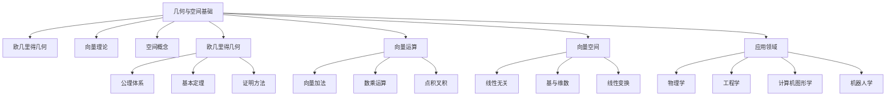

# 4-几何与空间 | Geometry and Space

## 目录 | Table of Contents

- [4.1 欧几里得几何基础](./4.1-欧几里得几何基础.md)
- [4.2 向量与空间](./4.2-向量与空间.md)

---

## 章节概述 | Chapter Overview

几何与空间是数学中直观性最强、应用最广泛的领域之一。从欧几里得几何的公理化体系到现代向量空间理论，几何学不仅提供了空间直觉，还为物理学、工程学、计算机图形学等提供了重要的数学工具。

### 🎯 学习目标 | Learning Objectives

- **理解几何基础**：掌握欧几里得几何的基本概念和公理
- **掌握向量理论**：理解向量运算和向量空间的基本性质
- **建立空间直觉**：培养对空间关系和几何变换的直觉
- **应用几何方法**：在现实问题中应用几何和向量方法

### 📚 核心概念 | Core Concepts

- **欧几里得几何**：公理体系、基本定理、证明方法
- **向量运算**：加法、数乘、点积、叉积
- **向量空间**：线性无关、基、维数、线性变换
- **几何变换**：平移、旋转、缩放、反射
- **空间关系**：平行、垂直、距离、角度

### 🧠 认知结构 | Cognitive Structure

#### 学习难点 | Learning Difficulties

- **抽象概念**：向量空间的抽象性理解困难
- **空间想象**：三维空间的几何关系想象
- **证明方法**：几何证明的逻辑推理

#### 教学建议 | Teaching Suggestions

- **具体实例**：从具体例子开始理解几何概念
- **多表征**：使用图形、符号、坐标等多种表征
- **渐进抽象**：从平面到空间，从具体到抽象
- **实际应用**：结合现实生活中的几何例子

---

## 知识图谱 | Knowledge Graph

## 相关主题 | Related Topics

- [1-集合论](../1-集合论/README.md) - 几何对象的集合论描述
- [2-映射与关系](../2-映射与关系/README.md) - 几何变换作为映射
- [3-数与代数](../3-数与代数/README.md) - 坐标系统与代数方法
- [6-微积分与分析](../6-微积分与分析/README.md) - 几何在分析中的应用

## 学习路径 | Learning Path

### 初级路径 | Beginner Path

1. 理解欧几里得几何的基本概念和公理
2. 掌握平面几何的基本定理和证明方法
3. 学习向量的基本运算和性质
4. 理解二维和三维空间的基本概念

### 中级路径 | Intermediate Path

1. 深入理解几何证明的逻辑结构
2. 掌握向量空间的基本理论
3. 学习线性变换和矩阵表示
4. 理解几何变换的代数方法

### 高级路径 | Advanced Path

1. 学习非欧几里得几何的基本思想
2. 理解向量空间在抽象代数中的作用
3. 探索几何在拓扑学中的应用
4. 研究几何在微分几何中的作用

---

[返回总目录 | Back to Main Directory](../README.md)
