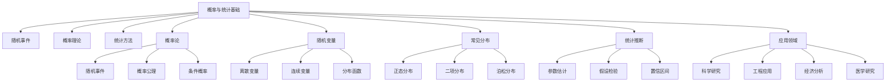

# 5-概率与统计 | Probability and Statistics

## 目录 | Table of Contents

- [5.1 随机事件与概率](./5.1-随机事件与概率.md)
- [5.2 随机变量与分布](./5.2-随机变量与分布.md)

---

## 章节概述 | Chapter Overview

概率与统计是处理不确定性和数据的重要数学工具。从随机事件的基本概念到复杂的概率分布，统计学为科学研究、工程应用、经济分析等提供了强大的数学基础。本章节不仅介绍理论概念，还强调实际应用和数据分析方法。

### 🎯 学习目标 | Learning Objectives

- **理解概率基础**：掌握随机事件和概率的基本概念
- **掌握分布理论**：理解常见概率分布的性质和应用
- **建立统计思维**：培养对不确定性的数学直觉
- **应用统计方法**：在现实问题中应用概率统计方法

### 📚 核心概念 | Core Concepts

- **随机事件**：样本空间、事件、概率公理
- **概率计算**：古典概率、几何概率、统计概率
- **随机变量**：离散变量、连续变量、分布函数
- **常见分布**：正态分布、二项分布、泊松分布
- **统计推断**：参数估计、假设检验、置信区间

### 🧠 认知结构 | Cognitive Structure

#### 学习难点 | Learning Difficulties

- **抽象概念**：概率的抽象性理解困难
- **分布识别**：不同分布的特征识别
- **统计推理**：统计推断的逻辑理解

#### 教学建议 | Teaching Suggestions

- **具体实例**：从具体例子开始理解概率概念
- **多表征**：使用图形、表格、模拟等多种表征
- **渐进抽象**：从具体到抽象的渐进过程
- **实际应用**：结合现实生活中的概率统计例子

---

## 知识图谱 | Knowledge Graph

## 相关主题 | Related Topics

- [1-集合论](../1-集合论/README.md) - 事件空间的集合论描述
- [3-数与代数](../3-数与代数/README.md) - 概率计算的代数方法
- [6-微积分与分析](../6-微积分与分析/README.md) - 连续概率分布的积分方法
- [7-数学哲学与认知](../7-数学哲学与认知/README.md) - 概率的哲学基础

## 学习路径 | Learning Path

### 初级路径 | Beginner Path

1. 理解随机事件和概率的基本概念
2. 掌握古典概率和几何概率的计算
3. 学习离散随机变量的基本性质
4. 理解常见离散分布的特征

### 中级路径 | Intermediate Path

1. 深入理解连续随机变量的概念
2. 掌握正态分布和其他连续分布
3. 学习条件概率和独立性
4. 理解期望和方差的概念

### 高级路径 | Advanced Path

1. 学习大数定律和中心极限定理
2. 理解参数估计和假设检验
3. 掌握多元随机变量的理论
4. 研究概率在机器学习中的应用

---

[返回总目录 | Back to Main Directory](../README.md)
