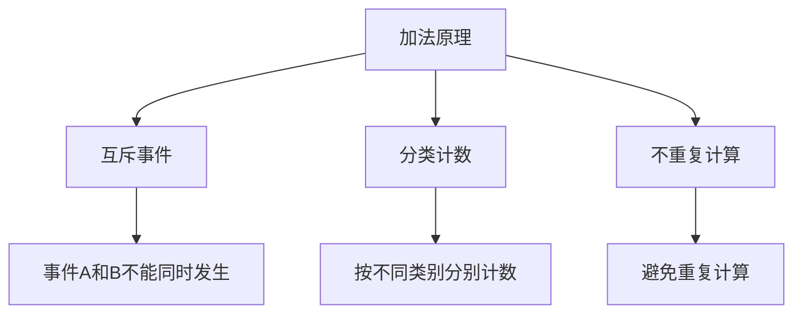
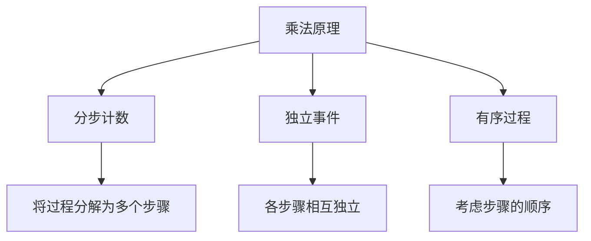
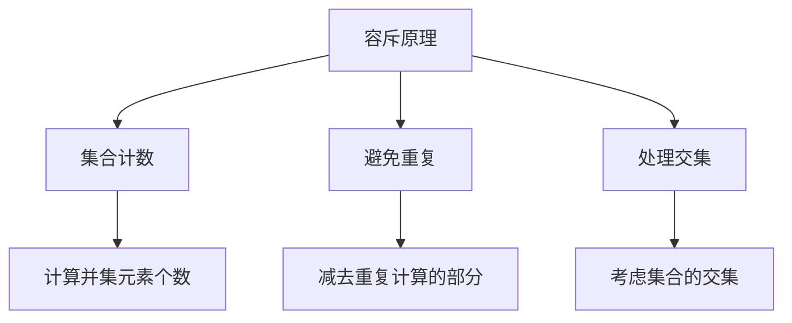
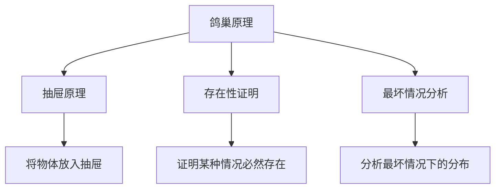
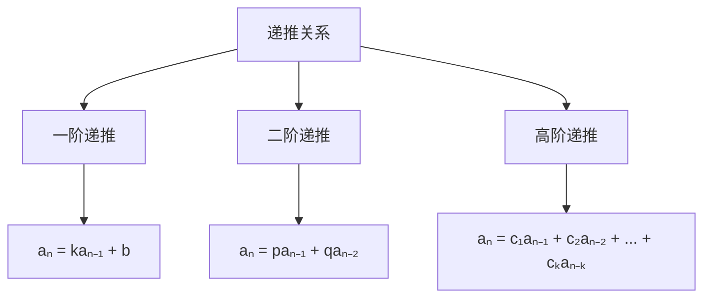
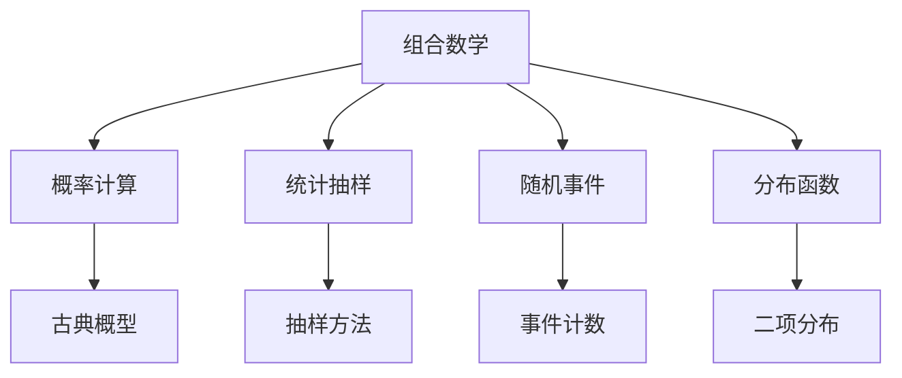

# 5.1 组合数学 | Combinatorics

## 内容概述 | Content Overview

组合数学是研究离散对象排列、组合、计数等问题的数学分支，包括计数原理、排列组合、鸽巢原理、递推关系等核心内容。这些内容是高中数学的重要组成部分，也是计算机科学、统计学等领域的重要基础。

### 学习目标 | Learning Objectives

- **掌握计数原理**：理解加法原理和乘法原理的应用
- **熟练排列组合**：掌握排列、组合的计算方法和应用
- **理解鸽巢原理**：掌握鸽巢原理及其应用
- **应用递推关系**：掌握递推数列和递推公式的应用

## 1. 计数原理 | Counting Principles

### 1.1 加法原理 | Addition Principle

**加法原理**：
如果事件A有m种方式发生，事件B有n种方式发生，且A与B互斥，则A或B有m + n种方式发生。

**加法原理应用**：



**例1：选择课程**
某学生可以从数学、物理、化学三门课程中选择一门，也可以从英语、历史、地理三门课程中选择一门。问有多少种不同的选择方式？

**解**：

- 选择理科课程：3种方式
- 选择文科课程：3种方式
- 总选择方式：3 + 3 = 6种

### 1.2 乘法原理 | Multiplication Principle

**乘法原理**：
如果一个过程可以分为k个步骤，第i个步骤有nᵢ种方式完成，则整个过程有n₁ × n₂ × ... × nₖ种方式完成。

**乘法原理应用**：



**例2：密码组合**
一个密码由4位数字组成，每位数字可以是0-9中的任意一个，问有多少种不同的密码？

**解**：

- 第一位：10种选择
- 第二位：10种选择
- 第三位：10种选择
- 第四位：10种选择
- 总密码数：10 × 10 × 10 × 10 = 10⁴ = 10000种

### 1.3 容斥原理 | Inclusion-Exclusion Principle

**容斥原理**：
对于有限集合A和B，有：
|A ∪ B| = |A| + |B| - |A ∩ B|

**容斥原理应用**：



**例3：班级统计**
某班级有30名学生，其中20名会英语，15名会法语，8名两种语言都会。问有多少名学生至少会一种语言？

**解**：

- 会英语的学生：20名
- 会法语的学生：15名
- 两种语言都会：8名
- 至少会一种语言：20 + 15 - 8 = 27名

## 2. 排列组合 | Permutations and Combinations

### 2.1 排列 | Permutations

**排列定义**：
从n个不同元素中取出r个元素，按一定顺序排列，称为n个元素中取r个元素的排列。

**排列公式**：
P(n, r) = n!/(n - r)! = n × (n-1) × ... × (n-r+1)

**排列性质**：

```mermaid
graph TD
    A[排列P(n,r)] --> B[有序排列]
    A --> C[元素不重复]
    A --> D[位置重要]
    
    B --> E[考虑元素的顺序]
    C --> F[每个元素只能使用一次]
    D --> G[不同位置算不同排列]
```

**特殊排列**：

- **全排列**：P(n, n) = n!
- **圆排列**：n个元素围成圆圈的排列数为(n-1)!
- **重复排列**：n个元素中有重复元素时，排列数为n!/n₁!n₂!...nₖ!

### 2.2 组合 | Combinations

**组合定义**：
从n个不同元素中取出r个元素，不考虑顺序，称为n个元素中取r个元素的组合。

**组合公式**：
C(n, r) = n!/[r!(n-r)!] = P(n, r)/r!

**组合性质**：

```mermaid
graph TD
    A[组合C(n,r)] --> B[无序选择]
    A --> C[元素不重复]
    A --> D[位置不重要]
    
    B --> E[不考虑元素的顺序]
    C --> F[每个元素只能选择一次]
    D --> G[相同元素不同顺序算同一组合]
```

**组合性质**：

- **对称性**：C(n, r) = C(n, n-r)
- **递推关系**：C(n, r) = C(n-1, r) + C(n-1, r-1)
- **二项式系数**：C(n, r) = (ⁿᵣ)

### 2.3 排列组合应用 | Applications of Permutations and Combinations

**例4：委员会选择**
从10名学生中选择3名组成委员会，问有多少种不同的选择方式？

**解**：

- 这是一个组合问题，因为委员会成员的顺序不重要
- 选择方式：C(10, 3) = 10!/(3!7!) = 120种

**例5：座位安排**
5名学生坐在一排的5个座位上，问有多少种不同的坐法？

**解**：

- 这是一个排列问题，因为座位顺序重要
- 坐法数：P(5, 5) = 5! = 120种

## 3. 鸽巢原理 | Pigeonhole Principle

### 3.1 基本鸽巢原理 | Basic Pigeonhole Principle

**鸽巢原理**：
如果将n个物体放入m个盒子中，且n > m，则至少有一个盒子中放入的物体数不少于⌈n/m⌉。

**鸽巢原理应用**：



**例6：同色球**
在一个袋子中有红、蓝、绿三种颜色的球，每种颜色至少有一个。从中取出4个球，证明至少有两个球是同色的。

**解**：

- 颜色种类：3种（相当于3个盒子）
- 球的数量：4个（相当于4个物体）
- 根据鸽巢原理，至少有一个盒子中有⌈4/3⌉ = 2个物体
- 因此至少有两个球是同色的

### 3.2 推广鸽巢原理 | Generalized Pigeonhole Principle

**推广鸽巢原理**：
如果将n个物体放入m个盒子中，则至少有一个盒子中放入的物体数不少于⌈n/m⌉，至少有一个盒子中放入的物体数不超过⌊n/m⌋。

**例7：连续整数**
从1到100的整数中任意选择51个数，证明其中一定有两个数的差为50。

**解**：

- 将1到100的数按模50的余数分类，共50个余数类
- 选择51个数，根据鸽巢原理，至少有一个余数类中有2个数
- 这两个数模50同余，差为50的倍数
- 由于数在1到100之间，差只能是50

## 4. 递推关系 | Recurrence Relations

### 4.1 递推数列 | Recurrence Sequences

**递推数列定义**：
一个数列{aₙ}，如果存在关系aₙ = f(aₙ₋₁, aₙ₋₂, ..., aₙ₋ₖ)，则称这个数列为递推数列。

**常见递推关系**：



### 4.2 斐波那契数列 | Fibonacci Sequence

**斐波那契数列定义**：
F₀ = 0, F₁ = 1, Fₙ = Fₙ₋₁ + Fₙ₋₂ (n ≥ 2)

**斐波那契数列性质**：

- **通项公式**：Fₙ = (φⁿ - ψⁿ)/√5，其中φ = (1+√5)/2，ψ = (1-√5)/2
- **极限性质**：limₙ→∞ Fₙ₊₁/Fₙ = φ
- **和的性质**：F₁ + F₂ + ... + Fₙ = Fₙ₊₂ - 1

**例8：兔子繁殖**
一对兔子每月生一对小兔，小兔两个月后开始繁殖。问n个月后有多少对兔子？

**解**：

- 设aₙ为n个月后的兔子对数
- 递推关系：aₙ = aₙ₋₁ + aₙ₋₂
- 初始条件：a₀ = 1, a₁ = 1
- 这就是斐波那契数列

### 4.3 递推关系求解 | Solving Recurrence Relations

**一阶线性递推**：
aₙ = kaₙ₋₁ + b

**求解方法**：

1. **齐次方程**：aₙ = kaₙ₋₁
2. **特解**：设aₙ = c为常数解
3. **通解**：aₙ = A·kⁿ + c

**例9：求解递推关系**
a₀ = 1, aₙ = 2aₙ₋₁ + 1

**解**：

1. 齐次方程：aₙ = 2aₙ₋₁，通解为A·2ⁿ
2. 特解：设aₙ = c，代入得c = 2c + 1，c = -1
3. 通解：aₙ = A·2ⁿ - 1
4. 代入初始条件：1 = A·2⁰ - 1，A = 2
5. 最终解：aₙ = 2ⁿ⁺¹ - 1

## 5. 二项式定理 | Binomial Theorem

### 5.1 二项式展开 | Binomial Expansion

**二项式定理**：
(a + b)ⁿ = Σₖ₌₀ⁿ C(n, k) aⁿ⁻ᵏ bᵏ

**二项式系数性质**：

```mermaid
graph TD
    A[二项式系数] --> B[对称性]
    A --> C[递推关系]
    A --> D[和的性质]
    
    B --> E[C(n,k) = C(n,n-k)]
    C --> F[C(n,k) = C(n-1,k) + C(n-1,k-1)]
    D --> G[Σₖ₌₀ⁿ C(n,k) = 2ⁿ]
```

**例10：二项式展开**
展开(x + y)⁴

**解**：
(x + y)⁴ = C(4,0)x⁴y⁰ + C(4,1)x³y¹ + C(4,2)x²y² + C(4,3)x¹y³ + C(4,4)x⁰y⁴
= x⁴ + 4x³y + 6x²y² + 4xy³ + y⁴

### 5.2 二项式定理应用 | Applications of Binomial Theorem

**概率应用**：
在n次独立试验中，事件A发生的概率为p，则A恰好发生k次的概率为：
P(X = k) = C(n, k) pᵏ (1-p)ⁿ⁻ᵏ

**例11：抛硬币**
抛10次硬币，求恰好出现3次正面的概率。

**解**：

- n = 10, k = 3, p = 1/2
- P(X = 3) = C(10, 3) (1/2)³ (1/2)⁷ = 120 × (1/2)¹⁰ = 120/1024 = 15/128

## 6. 应用实例 | Application Examples

### 6.1 概率应用 | Probability Applications

**例12：生日问题**
在一个班级中有23名学生，求至少有两人生日相同的概率。

**解**：

- 总情况数：365²³
- 所有人生日都不同的情况数：P(365, 23)
- 至少两人生日相同的概率：1 - P(365, 23)/365²³ ≈ 0.507

### 6.2 计算机科学应用 | Computer Science Applications

**例13：密码学**
一个密码由8位字符组成，每位可以是字母或数字，问有多少种不同的密码？

**解**：

- 每位字符选择：26个字母 + 10个数字 = 36种
- 总密码数：36⁸ ≈ 2.8 × 10¹²

### 6.3 统计学应用 | Statistics Applications

**例14：抽样调查**
从1000名学生中随机选择100名进行调查，问有多少种不同的选择方式？

**解**：

- 选择方式：C(1000, 100) = 1000!/(100!900!)
- 这是一个巨大的数字，约为6.3 × 10¹³⁹

## 7. 习题练习 | Exercise Practice

### 7.1 基础习题 | Basic Exercises

**习题1：计数原理**
某学生可以从数学、物理、化学中选择两门课程，也可以从英语、历史、地理中选择一门课程。问有多少种不同的选择方式？

**习题2：排列计算**
计算P(8, 3)和P(5, 5)。

**习题3：组合计算**
计算C(10, 4)和C(6, 2)。

**习题4：鸽巢原理**
从1到20的整数中任意选择11个数，证明其中一定有两个数的差为10。

**习题5：递推数列**
已知a₀ = 1, a₁ = 2, aₙ = 3aₙ₋₁ - 2aₙ₋₂，求a₅。

### 7.2 提高习题 | Advanced Exercises

**习题6：二项式展开**
展开(2x - 3y)⁵。

**习题7：概率应用**
抛6次硬币，求恰好出现2次正面的概率。

**习题8：组合应用**
从10名男生和8名女生中选择5人组成委员会，要求至少有2名女生，问有多少种选择方式？

**习题9：递推关系**
求解递推关系：a₀ = 0, a₁ = 1, aₙ = aₙ₋₁ + aₙ₋₂。

**习题10：应用题**
一个密码由6位数字组成，要求相邻两位数字不同，问有多少种不同的密码？

## 8. 知识关联 | Knowledge Connections

### 8.1 与概率统计的关联 | Connections with Probability and Statistics



### 8.2 与计算机科学的关联 | Connections with Computer Science

- **算法分析**：算法复杂度分析
- **数据结构**：树、图等结构的计数
- **密码学**：密码空间大小计算
- **网络设计**：网络拓扑结构分析

### 8.3 与代数的关联 | Connections with Algebra

- **多项式展开**：二项式定理
- **矩阵运算**：组合矩阵
- **群论**：置换群
- **图论**：图的计数

## 9. 学习建议 | Learning Suggestions

### 9.1 学习方法 | Learning Methods

1. **概念理解**：深入理解每个概念的本质
2. **公式记忆**：熟练掌握各种计数公式
3. **应用实践**：将知识应用到实际问题
4. **思维训练**：培养组合思维和逻辑推理能力

### 9.2 常见错误 | Common Mistakes

1. **重复计算**：在计数时重复计算某些情况
2. **遗漏情况**：在计数时遗漏某些情况
3. **公式错误**：使用错误的排列组合公式
4. **应用错误**：实际问题建模错误

### 9.3 提高建议 | Improvement Suggestions

1. **多做练习**：通过大量练习提高计数能力
2. **总结规律**：总结各种计数问题的规律
3. **应用拓展**：将知识应用到各个领域
4. **思维训练**：培养数学思维和创新能力

---

*组合数学是高中数学的重要组成部分，掌握好这些内容对后续学习和实际应用都至关重要。通过系统学习和大量练习，可以建立扎实的组合数学基础。*
