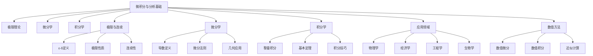

# 6-微积分与分析 | Calculus and Analysis

## 目录 | Table of Contents

- [6.1 极限与连续](./6.1-极限与连续.md)
- [6.2 导数与微分](./6.2-导数与微分.md)
- [6.3 积分与应用](./6.3-积分与应用.md)

---

## 章节概述 | Chapter Overview

微积分与分析是数学的核心分支，为自然科学、工程技术和经济学提供了强大的数学工具。从极限的严格定义到积分的广泛应用，微积分不仅建立了变化率的数学理论，还为优化问题、物理建模等提供了基础方法。

### 🎯 学习目标 | Learning Objectives

- **理解极限概念**：掌握ε-δ语言和极限的严格定义
- **掌握微分理论**：理解导数的几何意义和物理应用
- **掌握积分方法**：熟练运用各种积分技巧和应用
- **建立分析思维**：培养对连续性和变化率的数学直觉

### 📚 核心概念 | Core Concepts

- **极限理论**：ε-δ定义、极限性质、连续性
- **微分学**：导数定义、微分法则、几何应用
- **积分学**：黎曼积分、微积分基本定理、积分技巧
- **应用领域**：物理建模、经济分析、工程优化
- **数值方法**：数值微分、数值积分、近似计算

### 🧠 认知结构 | Cognitive Structure

#### 学习难点 | Learning Difficulties

- **抽象概念**：极限的ε-δ语言理解困难
- **几何直观**：导数和积分的几何意义
- **计算技巧**：复杂积分的计算方法

#### 教学建议 | Teaching Suggestions

- **具体实例**：从具体例子开始理解极限概念
- **多表征**：使用图形、符号、数值等多种表征
- **渐进抽象**：从直观到严格，从具体到抽象
- **实际应用**：结合物理、经济等实际问题

---

## 知识图谱 | Knowledge Graph

## 相关主题 | Related Topics

- [3-数与代数](../3-数与代数/README.md) - 实数系为分析提供基础
- [4-几何与空间](../4-几何与空间/README.md) - 几何为微积分提供直观
- [5-概率与统计](../5-概率与统计/README.md) - 连续概率分布需要积分
- [7-数学哲学与认知](../7-数学哲学与认知/README.md) - 无穷小概念的哲学基础

## 学习路径 | Learning Path

### 初级路径 | Beginner Path

1. 理解极限的基本概念和直观意义
2. 掌握导数的定义和基本求导法则
3. 学习积分的几何意义和基本积分公式
4. 理解微积分基本定理

### 中级路径 | Intermediate Path

1. 深入理解ε-δ语言和极限的严格定义
2. 掌握复杂的求导技巧和微分应用
3. 学习各种积分技巧和数值方法
4. 理解微积分在物理建模中的应用

### 高级路径 | Advanced Path

1. 学习多元微积分和向量分析
2. 理解微分方程和动力系统
3. 掌握变分法和优化理论
4. 研究微积分在数学分析中的作用

---

[返回总目录 | Back to Main Directory](../README.md)
