# 6-微积分与分析 | Calculus and Analysis

## 目录 | Table of Contents

- [6.1 极限与连续](./6.1-极限与连续.md)
- [6.2 导数与微分](./6.2-导数与微分.md)
- [6.3 积分与应用](./6.3-积分与应用.md)

---

## 章节概述 | Chapter Overview

微积分与分析是数学的核心分支，为自然科学、工程技术和经济学提供了强大的数学工具。从极限的严格定义到积分的广泛应用，微积分不仅建立了变化率的数学理论，还为优化问题、物理建模等提供了基础方法。

### 🎯 学习目标 | Learning Objectives

- **理解极限概念**：掌握ε-δ语言和极限的严格定义
- **掌握微分理论**：理解导数的几何意义和物理应用
- **掌握积分方法**：熟练运用各种积分技巧和应用
- **建立分析思维**：培养对连续性和变化率的数学直觉

### 📚 核心概念 | Core Concepts

- **极限理论**：ε-δ定义、极限性质、连续性
- **微分学**：导数定义、微分法则、几何应用
- **积分学**：黎曼积分、微积分基本定理、积分技巧
- **应用领域**：物理建模、经济分析、工程优化
- **数值方法**：数值微分、数值积分、近似计算

### 🧠 认知结构 | Cognitive Structure

#### 学习难点 | Learning Difficulties

- **抽象概念**：极限的ε-δ语言理解困难
- **几何直观**：导数和积分的几何意义
- **计算技巧**：复杂积分的计算方法

#### 教学建议 | Teaching Suggestions

- **具体实例**：从具体例子开始理解极限概念
- **多表征**：使用图形、符号、数值等多种表征
- **渐进抽象**：从直观到严格，从具体到抽象
- **实际应用**：结合物理、经济等实际问题

---

## 知识图谱 | Knowledge Graph

```mermaid
graph TD;
  A["微积分与分析基础"]
  A1["极限理论"]
  A2["微分学"]
  A3["积分学"]
  B["极限与连续"]
  B1["ε-δ定义"]
  B2["极限性质"]
  B3["连续性"]
  C["微分学"]
  C1["导数定义"]
  C2["微分法则"]
  C3["几何应用"]
  D["积分学"]
  D1["黎曼积分"]
  D2["基本定理"]
  D3["积分技巧"]
  E["应用领域"]
  E1["物理学"]
  E2["经济学"]
  E3["工程学"]
  E4["生物学"]
  F["数值方法"]
  F1["数值微分"]
  F2["数值积分"]
  F3["近似计算"]
  
  A --> A1
  A --> A2
  A --> A3
  A --> B
  B --> B1
  B --> B2
  B --> B3
  A --> C
  C --> C1
  C --> C2
  C --> C3
  A --> D
  D --> D1
  D --> D2
  D --> D3
  A --> E
  E --> E1
  E --> E2
  E --> E3
  E --> E4
  A --> F
  F --> F1
  F --> F2
  F --> F3
```

## 相关主题 | Related Topics

- [3-数与代数](../3-数与代数/README.md) - 实数系为分析提供基础
- [4-几何与空间](../4-几何与空间/README.md) - 几何为微积分提供直观
- [5-概率与统计](../5-概率与统计/README.md) - 连续概率分布需要积分
- [7-数学哲学与认知](../7-数学哲学与认知/README.md) - 无穷小概念的哲学基础

## 学习路径 | Learning Path

### 初级路径 | Beginner Path

1. 理解极限的基本概念和直观意义
2. 掌握导数的定义和基本求导法则
3. 学习积分的几何意义和基本积分公式
4. 理解微积分基本定理

### 中级路径 | Intermediate Path

1. 深入理解ε-δ语言和极限的严格定义
2. 掌握复杂的求导技巧和微分应用
3. 学习各种积分技巧和数值方法
4. 理解微积分在物理建模中的应用

### 高级路径 | Advanced Path

1. 学习多元微积分和向量分析
2. 理解微分方程和动力系统
3. 掌握变分法和优化理论
4. 研究微积分在数学分析中的作用

---

## 高阶递归扩展索引与未来创新方向 | Advanced Recursive Expansion Index and Future Innovation

- 本模块将持续递归扩展至：
  - AI、可视化数学、知识图谱、数据库、自动化证明、认知科学等现代应用中的微积分与分析创新
  - 范畴论、模型论、结构主义等领域的分析理论深度融合与理论前沿
  - 哲学、认知科学等多学科交汇的分析创新表达
- 每一节内容均可继续深度细化，支持跨模块链接与现实创新
- 强调微积分与分析与现代数学、AI、信息科学、哲学、认知科学的交汇与创新
- 所有内容将持续递归扩展，保持国际化、规范化、形式化表达，结合最新理论与前沿实践。

- This module will continue to recursively expand to:
  - Innovations in calculus and analysis in modern applications such as AI, visual mathematics, knowledge graphs, databases, automated proof, cognitive science, etc.
  - Deep integration and theoretical frontiers of analysis in category theory, model theory, structuralism, etc.
  - Innovative expressions of analysis at the intersection of philosophy, cognitive science, and other disciplines
- Each section can be further refined, supporting cross-module links and real-world innovation
- Emphasize the intersection and innovation of calculus and analysis with modern mathematics, AI, information science, philosophy, and cognitive science
- All content will be recursively expanded, maintaining internationalization, standardization, formalization, and integration of the latest theories and cutting-edge practices.

> 本README将持续引导微积分与分析模块递归扩展，所有内容均严格遵循国际标准、数学规范与哲学前沿，支持高中及更高层次的数学学习与创新。
> This README will continue to guide the recursive expansion of the calculus and analysis module. All content strictly follows international standards, mathematical norms, and philosophical frontiers, supporting high school and higher-level mathematics learning and innovation.

[返回总目录 | Back to Main Directory](../README.md)
