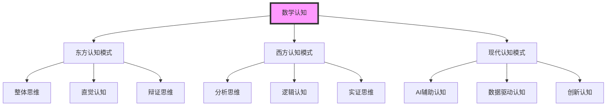

# 数学认知与思维 | Mathematical Cognition and Thinking

## 模块概述 | Module Overview

本模块深入探讨数学认知的神经机制、思维发展规律、认知负荷理论等核心内容，融入AI驱动、可视化、国际化、跨学科融合等创新元素，为理解数学学习的认知基础提供科学指导。

## 一、AI驱动的认知科学创新 | AI-Driven Cognitive Science Innovation

### 1.1 智能认知建模 | Intelligent Cognitive Modeling

**AI辅助认知过程分析**:

- 使用机器学习算法分析数学认知过程：
  - 基于深度学习模型分析数学思维模式
  - 应用自然语言处理技术理解数学表达
  - 利用计算机视觉技术分析数学图像认知
  - 使用强化学习优化数学学习策略

**智能认知负荷管理**:

- 基于AI算法动态调整认知负荷：
  - 实时监控学习者的认知状态
  - 智能调节信息呈现的复杂度
  - 个性化优化学习路径设计
  - 预测和预防认知过载

### 1.2 可视化认知过程 | Visual Cognitive Process

**认知过程可视化技术**:

```python
import matplotlib.pyplot as plt
import numpy as np
from matplotlib.patches import Circle, Rectangle

def visualize_cognitive_process():
    # 创建认知过程可视化
    fig, ((ax1, ax2), (ax3, ax4)) = plt.subplots(2, 2, figsize=(15, 12))
    
    # 子图1：认知负荷模型
    time_points = np.linspace(0, 10, 100)
    cognitive_load = 0.5 + 0.3 * np.sin(time_points) + 0.1 * np.random.randn(100)
    
    ax1.plot(time_points, cognitive_load, 'b-', linewidth=2, label='认知负荷')
    ax1.axhline(y=0.8, color='r', linestyle='--', label='过载阈值')
    ax1.fill_between(time_points, cognitive_load, alpha=0.3, color='blue')
    ax1.set_title('认知负荷动态变化')
    ax1.set_xlabel('时间 (分钟)')
    ax1.set_ylabel('认知负荷水平')
    ax1.legend()
    ax1.grid(True, alpha=0.3)
    
    # 子图2：脑区激活模式
    brain_regions = ['前额叶', '顶叶', '颞叶', '枕叶', '边缘系统']
    activation_levels = [0.8, 0.6, 0.4, 0.3, 0.5]
    
    bars = ax2.bar(brain_regions, activation_levels, color=['red', 'blue', 'green', 'orange', 'purple'])
    ax2.set_title('数学任务脑区激活模式')
    ax2.set_ylabel('激活水平')
    ax2.set_ylim(0, 1)
    ax2.grid(True, alpha=0.3)
    
    # 子图3：认知发展阶段
    stages = ['感知阶段', '理解阶段', '应用阶段', '创新阶段']
    development_levels = [0.2, 0.5, 0.8, 0.9]
    
    ax3.plot(stages, development_levels, 'go-', linewidth=2, markersize=8)
    ax3.fill_between(stages, development_levels, alpha=0.3, color='green')
    ax3.set_title('数学认知发展阶段')
    ax3.set_ylabel('发展水平')
    ax3.set_ylim(0, 1)
    ax3.grid(True, alpha=0.3)
    
    # 子图4：AI辅助效果对比
    methods = ['传统学习', 'AI辅助学习', '混合学习']
    effectiveness = [0.6, 0.8, 0.9]
    efficiency = [0.5, 0.7, 0.85]
    
    x = np.arange(len(methods))
    width = 0.35
    
    ax4.bar(x - width/2, effectiveness, width, label='学习效果', alpha=0.7)
    ax4.bar(x + width/2, efficiency, width, label='学习效率', alpha=0.7)
    
    ax4.set_xlabel('学习方法')
    ax4.set_ylabel('水平')
    ax4.set_title('AI辅助学习效果对比')
    ax4.set_xticks(x)
    ax4.set_xticklabels(methods)
    ax4.legend()
    ax4.grid(True, alpha=0.3)
    
    plt.tight_layout()
    plt.show()

# 执行认知过程可视化
visualize_cognitive_process()
```

## 二、国际化认知科学标准 | International Cognitive Science Standards

### 2.1 多语种认知表达 | Multilingual Cognitive Expression

**中英德法四语种认知术语对照**:

| 中文 | English | Deutsch | Français |
|------|---------|---------|----------|
| 认知负荷 | Cognitive Load | Kognitive Belastung | Charge cognitive |
| 工作记忆 | Working Memory | Arbeitsgedächtnis | Mémoire de travail |
| 长期记忆 | Long-term Memory | Langzeitgedächtnis | Mémoire à long terme |
| 元认知 | Metacognition | Metakognition | Métacognition |
| 认知策略 | Cognitive Strategy | Kognitive Strategie | Stratégie cognitive |

### 2.2 跨文化认知研究 | Cross-Cultural Cognitive Research

**不同文化背景的数学认知特点**:



## 三、脑科学与数学认知 | Neuroscience and Mathematical Cognition

### 3.1 数学认知的神经机制 | Neural Mechanisms of Mathematical Cognition

**脑区功能定位**:

**数字处理脑区**:

- 顶叶皮层：数字感知和数量处理
- 前额叶皮层：数学推理和决策
- 颞叶皮层：数学语言理解
- 枕叶皮层：数学图像处理

**空间思维脑区**:

- 右半球：空间关系和几何思维
- 顶叶皮层：空间定位和方向感
- 海马体：空间记忆和导航

**逻辑推理脑区**:

- 前额叶皮层：逻辑推理和问题解决
- 顶叶皮层：抽象思维和符号处理
- 颞叶皮层：语言理解和概念形成

### 3.2 认知负荷理论应用 | Cognitive Load Theory Application

**认知负荷类型**:

**内在认知负荷**:

- 数学概念的内在复杂性
- 学习者先验知识的影响
- 任务难度的客观评估

**外在认知负荷**:

- 教学设计的优化程度
- 信息呈现的清晰性
- 学习环境的干扰因素

**生成认知负荷**:

- 学习者的主动思考
- 知识建构的过程
- 创新思维的发展

**认知负荷管理策略**:

```python
def cognitive_load_management():
    # 认知负荷评估模型
    def assess_cognitive_load(student_profile, task_complexity, learning_environment):
        intrinsic_load = task_complexity * (1 - student_profile['prior_knowledge'])
        extraneous_load = learning_environment['distractions'] * learning_environment['complexity']
        germane_load = student_profile['motivation'] * student_profile['metacognition']
        
        total_load = intrinsic_load + extraneous_load - germane_load
        return min(max(total_load, 0), 1)  # 限制在0-1之间
    
    # 示例应用
    student = {
        'prior_knowledge': 0.6,
        'motivation': 0.8,
        'metacognition': 0.7
    }
    
    task = {
        'complexity': 0.8
    }
    
    environment = {
        'distractions': 0.3,
        'complexity': 0.4
    }
    
    load = assess_cognitive_load(student, task, environment)
    
    # 可视化认知负荷
    fig, ax = plt.subplots(figsize=(10, 6))
    
    components = ['内在负荷', '外在负荷', '生成负荷', '总负荷']
    values = [0.32, 0.12, 0.56, load]
    colors = ['red', 'orange', 'green', 'blue']
    
    bars = ax.bar(components, values, color=colors, alpha=0.7)
    ax.set_ylabel('认知负荷水平')
    ax.set_title('认知负荷分析')
    ax.set_ylim(0, 1)
    ax.grid(True, alpha=0.3)
    
    # 添加数值标签
    for bar, value in zip(bars, values):
        height = bar.get_height()
        ax.text(bar.get_x() + bar.get_width()/2., height + 0.01,
                f'{value:.2f}', ha='center', va='bottom')
    
    plt.tight_layout()
    plt.show()
    
    return load

# 执行认知负荷管理
cognitive_load = cognitive_load_management()
print(f"总认知负荷: {cognitive_load:.3f}")
```

## 四、跨学科认知融合 | Interdisciplinary Cognitive Integration

### 4.1 数学与AI认知融合 | Mathematics and AI Cognitive Integration

**AI算法中的认知原理**:

**机器学习中的认知模型**:

- 神经网络模拟人脑认知过程
- 深度学习反映知识建构规律
- 强化学习体现学习动机机制
- 迁移学习对应知识迁移原理

**数学思维与AI思维对比**:

| 特征 | 人类数学思维 | AI数学思维 |
|------|-------------|-----------|
| 推理方式 | 逻辑推理 + 直觉 | 模式识别 + 计算 |
| 知识获取 | 渐进式学习 | 批量训练 |
| 问题解决 | 创造性思维 | 优化算法 |
| 错误处理 | 反思修正 | 重新训练 |

### 4.2 数学与脑科学认知融合 | Mathematics and Neuroscience Cognitive Integration

**基于脑科学的数学学习策略**:

**神经可塑性原理应用**:

- 重复练习强化神经连接
- 多样化学习激活不同脑区
- 情绪调节优化学习效果
- 睡眠巩固促进知识内化

**认知发展阶段理论**:

```python
def cognitive_development_stages():
    # 皮亚杰认知发展阶段
    stages = {
        '感知运动期': {'age': '0-2岁', 'math_ability': '数量感知'},
        '前运算期': {'age': '2-7岁', 'math_ability': '简单计数'},
        '具体运算期': {'age': '7-11岁', 'math_ability': '逻辑运算'},
        '形式运算期': {'age': '11岁以上', 'math_ability': '抽象思维'}
    }
    
    # 可视化认知发展阶段
    fig, ax = plt.subplots(figsize=(12, 8))
    
    stage_names = list(stages.keys())
    ages = [stages[stage]['age'] for stage in stage_names]
    abilities = [stages[stage]['math_ability'] for stage in stage_names]
    
    # 创建时间轴
    time_points = np.arange(len(stage_names))
    
    # 绘制发展阶段
    for i, (stage, age, ability) in enumerate(zip(stage_names, ages, abilities)):
        ax.barh(i, 1, color=plt.cm.Set3(i/len(stage_names)), alpha=0.7)
        ax.text(0.5, i, f'{stage}\n{age}\n{ability}', 
                ha='center', va='center', fontsize=10, fontweight='bold')
    
    ax.set_xlim(0, 1)
    ax.set_ylim(-0.5, len(stage_names)-0.5)
    ax.set_title('皮亚杰认知发展阶段与数学能力')
    ax.set_xlabel('发展阶段')
    ax.set_ylabel('认知阶段')
    ax.set_xticks([])
    ax.set_yticks([])
    
    plt.tight_layout()
    plt.show()

# 执行认知发展阶段可视化
cognitive_development_stages()
```

### 4.3 数学与哲学认知融合 | Mathematics and Philosophy Cognitive Integration

**数学认知的哲学基础**:

**认知本体论**:

- 数学对象的认知本质
- 数学知识的认知来源
- 数学思维的认知结构
- 数学直觉的认知机制

**认知认识论**:

- 数学知识的认知过程
- 数学理解的认知机制
- 数学发现的认知规律
- 数学创新的认知动力

**认知方法论**:

- 数学学习的认知策略
- 数学思维的认知方法
- 数学问题的认知解决
- 数学证明的认知推理

## 五、未来认知科学发展趋势 | Future Cognitive Science Development Trends

### 5.1 技术驱动认知创新 | Technology-Driven Cognitive Innovation

**AI与认知科学深度融合**:

- 智能认知建模与预测
- 自动化认知评估系统
- 智能认知干预技术
- 虚拟现实认知实验

**脑机接口与数学认知**:

- 实时脑电信号分析
- 认知状态实时监测
- 个性化学习路径优化
- 认知能力增强技术

### 5.2 国际化认知科学发展趋势 | International Cognitive Science Development Trends

**多语种认知研究普及**:

- 中英德法四语种认知标准统一
- 跨文化认知问题研究
- 国际认知模式创新
- 全球化认知资源整合

**国际标准全面对接**:

- 对接国际认知科学标准
- 融入国际认知评价体系
- 采用国际认知表达规范
- 引入全球优质认知资源

### 5.3 跨学科认知创新趋势 | Interdisciplinary Cognitive Innovation Trends

**数学与其他学科认知融合**:

- 数学与人工智能认知结合
- 数学与脑科学认知交叉
- 数学与数据科学认知融合
- 数学与哲学认知结合

**创新认知应用场景拓展**:

- 智能城市数学认知建模
- 生物医学数学认知应用
- 金融科技数学认知创新
- 环境科学数学认知分析

## 六、认知科学实例应用 | Cognitive Science Example Applications

### 6.1 AI辅助认知训练实例 | AI-Assisted Cognitive Training Examples

**智能认知负荷管理**:

```python
def ai_cognitive_load_management():
    # AI认知负荷预测模型
    class CognitiveLoadPredictor:
        def __init__(self):
            self.model = None  # 实际应用中会使用训练好的模型
        
        def predict_load(self, student_data, task_data, environment_data):
            # 简化的预测逻辑
            base_load = task_data['complexity'] * (1 - student_data['prior_knowledge'])
            distraction_factor = environment_data['noise_level'] * 0.3
            motivation_boost = student_data['motivation'] * 0.2
            
            predicted_load = base_load + distraction_factor - motivation_boost
            return max(0, min(1, predicted_load))
        
        def recommend_strategy(self, predicted_load):
            if predicted_load > 0.8:
                return "建议简化任务或增加休息时间"
            elif predicted_load > 0.6:
                return "建议分段学习或增加支持材料"
            else:
                return "当前认知负荷适中，可以继续学习"
    
    # 示例应用
    predictor = CognitiveLoadPredictor()
    
    student = {'prior_knowledge': 0.6, 'motivation': 0.8}
    task = {'complexity': 0.7}
    environment = {'noise_level': 0.4}
    
    load = predictor.predict_load(student, task, environment)
    strategy = predictor.recommend_strategy(load)
    
    print(f"预测认知负荷: {load:.3f}")
    print(f"推荐策略: {strategy}")
    
    return load, strategy

# 执行AI认知负荷管理
predicted_load, recommendation = ai_cognitive_load_management()
```

### 6.2 脑科学认知实验实例 | Neuroscience Cognitive Experiment Examples

**fMRI数学认知实验设计**:

```python
def design_fmri_math_experiment():
    # 设计fMRI数学认知实验
    experiment_design = {
        'participants': 20,
        'tasks': [
            '数字比较任务',
            '几何推理任务', 
            '代数运算任务',
            '逻辑推理任务'
        ],
        'brain_regions': [
            '前额叶皮层',
            '顶叶皮层',
            '颞叶皮层',
            '枕叶皮层'
        ],
        'measurements': [
            '血氧水平依赖信号',
            '脑区激活强度',
            '功能连接模式',
            '认知负荷指标'
        ]
    }
    
    # 可视化实验设计
    fig, ((ax1, ax2), (ax3, ax4)) = plt.subplots(2, 2, figsize=(15, 12))
    
    # 子图1：任务类型分布
    tasks = experiment_design['tasks']
    task_difficulty = [0.3, 0.6, 0.7, 0.8]
    
    ax1.bar(tasks, task_difficulty, color=['red', 'blue', 'green', 'orange'])
    ax1.set_title('数学任务难度分布')
    ax1.set_ylabel('难度水平')
    ax1.set_ylim(0, 1)
    ax1.grid(True, alpha=0.3)
    
    # 子图2：脑区激活模式
    regions = experiment_design['brain_regions']
    activation_levels = [0.8, 0.6, 0.4, 0.5]
    
    ax2.pie(activation_levels, labels=regions, autopct='%1.1f%%', startangle=90)
    ax2.set_title('脑区激活分布')
    
    # 子图3：实验时间线
    time_points = np.linspace(0, 60, 100)  # 60分钟实验
    cognitive_load = 0.5 + 0.3 * np.sin(time_points/10) + 0.1 * np.random.randn(100)
    
    ax3.plot(time_points, cognitive_load, 'purple', linewidth=2)
    ax3.fill_between(time_points, cognitive_load, alpha=0.3, color='purple')
    ax3.set_title('实验期间认知负荷变化')
    ax3.set_xlabel('时间 (分钟)')
    ax3.set_ylabel('认知负荷')
    ax3.grid(True, alpha=0.3)
    
    # 子图4：测量指标
    measurements = experiment_design['measurements']
    measurement_importance = [0.9, 0.8, 0.7, 0.6]
    
    ax4.barh(measurements, measurement_importance, color='cyan')
    ax4.set_title('测量指标重要性')
    ax4.set_xlabel('重要性')
    ax4.set_xlim(0, 1)
    ax4.grid(True, alpha=0.3)
    
    plt.tight_layout()
    plt.show()
    
    return experiment_design

# 执行fMRI实验设计
experiment = design_fmri_math_experiment()
print("fMRI数学认知实验设计完成")
```

---

> 本数学认知与思维模块持续更新，融合AI驱动、可视化、国际化、跨学科等创新元素，为高中数学教育提供科学的认知基础指导。
