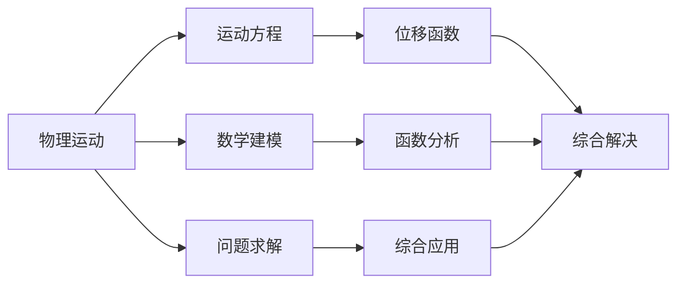
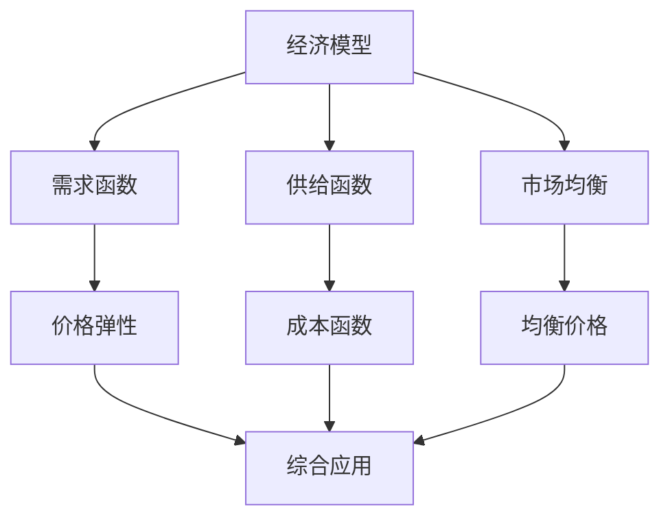
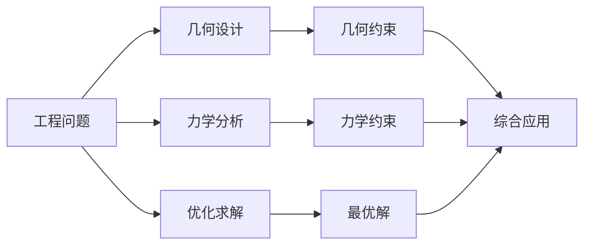
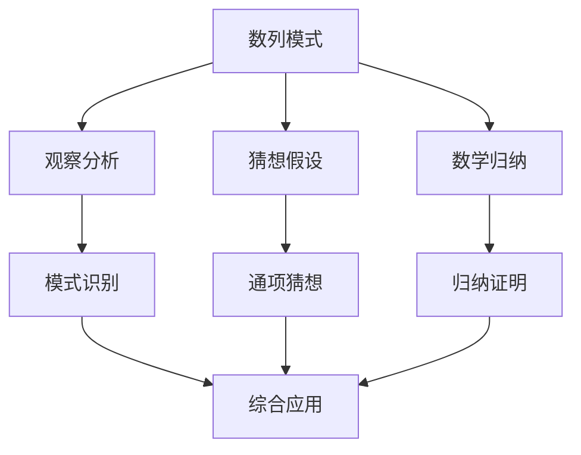
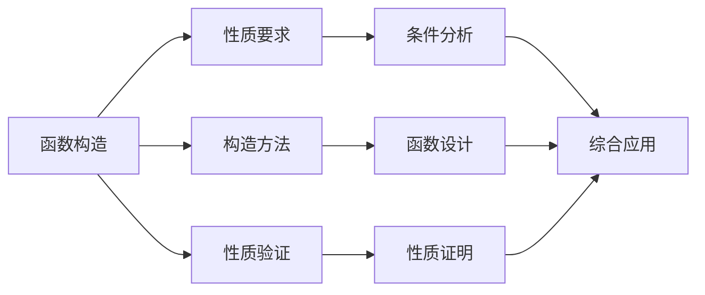
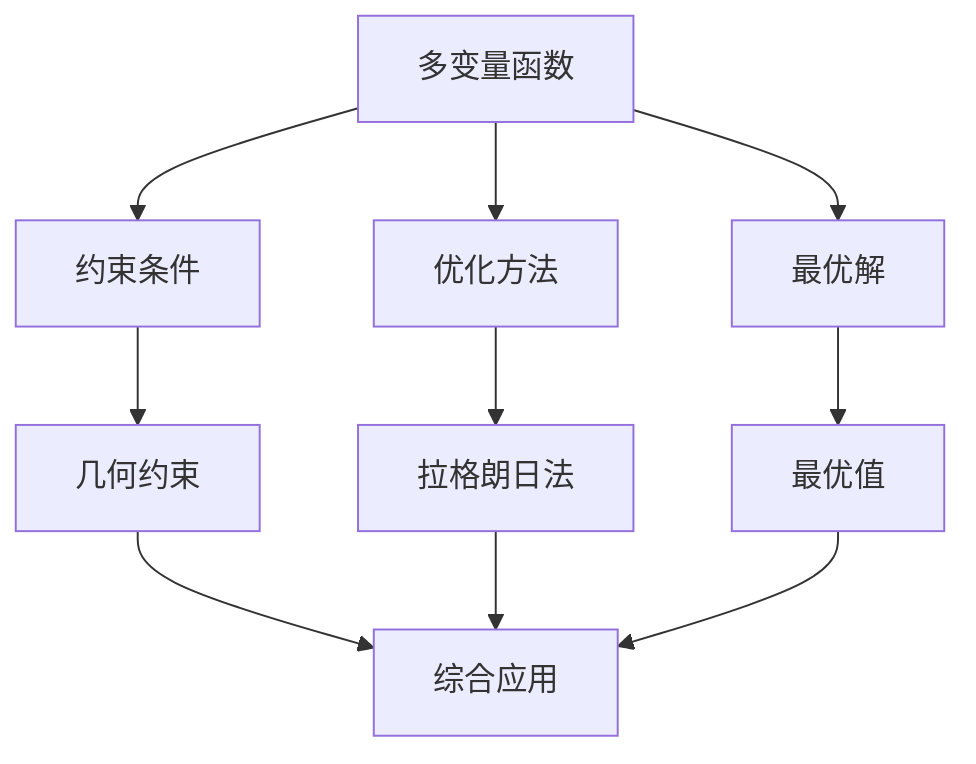
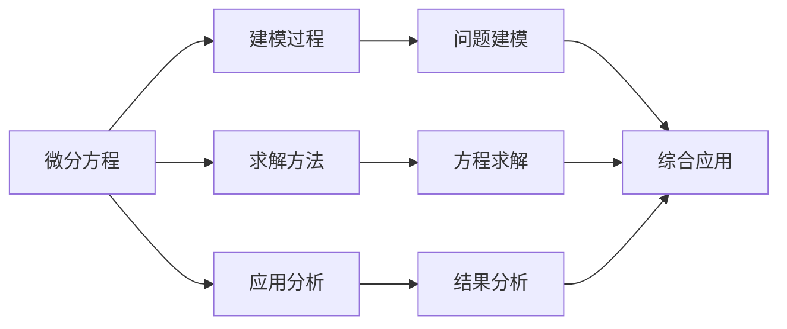

# 数学综合应用习题集 | Comprehensive Mathematical Application Exercise Collection

## 习题集总览 | Exercise Collection Overview

### 1. 跨领域综合应用习题 | Cross-domain Comprehensive Application Exercises

#### 1.1 代数与几何综合应用 | Algebra and Geometry Comprehensive Application

**习题1：函数与几何的综合应用**:

```mermaid
graph TD
    A[函数f(x) = ax² + bx + c] --> B[几何意义]
    A --> C[代数性质]
    A --> D[应用问题]
    
    B --> E[抛物线图像]
    C --> F[极值问题]
    D --> G[实际问题]
    
    E --> H[几何性质]
    F --> I[代数方法]
    G --> J[综合解决]
    
    H --> K[综合应用]
    I --> K
    J --> K
```

**问题描述**：
已知函数f(x) = x² - 4x + 3，抛物线y = f(x)与x轴交于A、B两点，与y轴交于C点。
(1) 求A、B、C三点的坐标；
(2) 求抛物线在点C处的切线方程；
(3) 求抛物线在区间[0,3]上的最大值和最小值；
(4) 若点P(x,y)在抛物线上，求点P到直线y = x的最短距离。

**解题思路**：

- **代数分析**：通过函数性质分析抛物线的特征
- **几何分析**：通过图像分析几何性质
- **综合应用**：结合代数和几何方法解决问题

**知识关联**：

- 二次函数性质与抛物线图像
- 导数与切线方程
- 函数极值与区间最值
- 点到直线距离公式

#### 1.2 代数与分析综合应用 | Algebra and Analysis Comprehensive Application

**习题2：数列与极限的综合应用**:

```mermaid
graph LR
    A[数列{an}] --> B[递推关系]
    A --> C[通项公式]
    A --> D[极限问题]
    
    B --> E[递推求解]
    C --> F[公式应用]
    D --> G[极限计算]
    
    E --> H[综合应用]
    F --> H
    G --> H
```

**问题描述**：
已知数列{an}满足a₁ = 1，a₂ = 2，且对任意正整数n，有an+2 = 2an+1 - an + 1。
(1) 求数列{an}的通项公式；
(2) 求数列{an}的前n项和Sn；
(3) 求极限lim(n→∞) an/n²；
(4) 若bn = an/n，求数列{bn}的极限。

**解题思路**：

- **递推分析**：分析递推关系的特征
- **特征方程**：求解特征方程得到通项
- **求和公式**：利用通项求前n项和
- **极限计算**：利用极限性质计算极限

**知识关联**：

- 递推数列与特征方程
- 数列求和与通项公式
- 极限性质与计算方法
- 数列收敛性判断

#### 1.3 几何与分析综合应用 | Geometry and Analysis Comprehensive Application

**习题3：曲线与积分的综合应用**:

```mermaid
graph TD
    A[曲线y = f(x)] --> B[几何性质]
    A --> C[分析性质]
    A --> D[积分应用]
    
    B --> E[图像特征]
    C --> F[导数性质]
    D --> G[面积计算]
    
    E --> H[综合应用]
    F --> H
    G --> H
```

**问题描述**：
已知函数f(x) = x³ - 3x² + 2x，曲线y = f(x)与x轴围成的区域为D。
(1) 求函数f(x)的单调区间和极值点；
(2) 求曲线y = f(x)与x轴的交点坐标；
(3) 求区域D的面积；
(4) 若将区域D绕x轴旋转一周，求所得旋转体的体积。

**解题思路**：

- **函数分析**：分析函数的单调性和极值
- **图像分析**：分析曲线与x轴的交点
- **积分计算**：利用定积分计算面积
- **体积计算**：利用旋转体体积公式

**知识关联**：

- 函数单调性与极值
- 曲线与坐标轴交点
- 定积分与面积计算
- 旋转体体积公式

### 2. 实际问题综合应用习题 | Real-world Problem Comprehensive Application Exercises

#### 2.1 物理问题综合应用 | Physics Problem Comprehensive Application

**习题4：运动学与数学的综合应用**:



**问题描述**：
一个物体在重力作用下从高度h₀ = 100米处自由下落，同时受到空气阻力，阻力大小与速度成正比，比例系数为k = 0.1。
(1) 建立物体的运动方程；
(2) 求物体下落的速度函数v(t)；
(3) 求物体下落的位移函数s(t)；
(4) 求物体落地所需的时间；
(5) 求物体落地时的速度。

**解题思路**：

- **物理建模**：根据物理定律建立运动方程
- **微分方程**：求解微分方程得到速度函数
- **积分计算**：通过积分得到位移函数
- **数值计算**：利用数值方法求解具体问题

**知识关联**：

- 牛顿运动定律与微分方程
- 微分方程求解方法
- 定积分与位移计算
- 数值计算方法

#### 2.2 经济问题综合应用 | Economics Problem Comprehensive Application

**习题5：经济学与数学的综合应用**:



**问题描述**：
某商品的市场需求函数为D(p) = 1000 - 10p，供给函数为S(p) = 200 + 5p，其中p为价格。
(1) 求市场均衡价格和均衡数量；
(2) 求需求价格弹性函数；
(3) 若政府对每单位商品征收t元的税，求新的均衡价格和数量；
(4) 求税收收入函数R(t)；
(5) 求使税收收入最大的税率t。

**解题思路**：

- **市场分析**：分析需求与供给的关系
- **均衡计算**：计算市场均衡点
- **弹性分析**：计算需求价格弹性
- **税收影响**：分析税收对市场的影响
- **优化问题**：求税收收入的最大值

**知识关联**：

- 线性函数与市场均衡
- 导数与价格弹性
- 函数最值与优化
- 经济学基本概念

#### 2.3 工程问题综合应用 | Engineering Problem Comprehensive Application

**习题6：工程设计与数学的综合应用**:



**问题描述**：
设计一个圆柱形储罐，要求容积为V = 1000立方米，材料成本最小。
(1) 建立储罐的表面积函数S(r,h)，其中r为底面半径，h为高度；
(2) 利用容积约束，将表面积函数化为单变量函数S(r)；
(3) 求使表面积最小的半径r₀；
(4) 求对应的最优高度h₀；
(5) 求最小表面积S₀。

**解题思路**：

- **几何建模**：建立几何约束关系
- **函数优化**：将多变量问题转化为单变量问题
- **导数应用**：利用导数求函数极值
- **约束处理**：利用约束条件简化问题

**知识关联**：

- 圆柱体几何性质
- 函数极值与导数
- 约束优化问题
- 工程优化设计

### 3. 创新思维综合应用习题 | Innovative Thinking Comprehensive Application Exercises

#### 3.1 模式识别综合应用 | Pattern Recognition Comprehensive Application

**习题7：数列模式与数学归纳的综合应用**:



**问题描述**：
观察数列：1, 3, 6, 10, 15, 21, ...
(1) 观察数列的规律，猜想通项公式；
(2) 用数学归纳法证明你的猜想；
(3) 求数列的前n项和Sn；
(4) 若bn = an/n，求数列{bn}的通项公式；
(5) 求极限lim(n→∞) an/n²。

**解题思路**：

- **模式观察**：仔细观察数列的变化规律
- **猜想形成**：基于观察形成合理的猜想
- **归纳证明**：用数学归纳法严格证明
- **公式应用**：利用通项公式解决相关问题

**知识关联**：

- 数列模式识别
- 数学归纳法
- 数列求和公式
- 极限计算方法

#### 3.2 构造性思维综合应用 | Constructive Thinking Comprehensive Application

**习题8：函数构造与性质分析的综合应用**:



**问题描述**：
构造一个函数f(x)，满足以下条件：
(1) f(x)在R上连续；
(2) f(x)在x = 0处可导，且f'(0) = 1；
(3) f(x)在x = 1处不可导；
(4) f(x)在区间[0,1]上单调递增；
(5) f(x)在区间[1,2]上单调递减。

**解题思路**：

- **条件分析**：分析每个条件的数学含义
- **分段构造**：根据条件分段构造函数
- **连续性**：确保函数在分界点连续
- **可导性**：分析函数在关键点的可导性
- **单调性**：利用导数判断函数的单调性

**知识关联**：

- 函数连续性
- 函数可导性
- 导数与单调性
- 分段函数构造

### 4. 高级综合应用习题 | Advanced Comprehensive Application Exercises

#### 4.1 多变量优化综合应用 | Multi-variable Optimization Comprehensive Application

**习题9：多变量函数与约束优化的综合应用**:



**问题描述**：
求函数f(x,y) = x² + y²在约束条件x + y = 1下的最小值。
(1) 用拉格朗日乘数法求解；
(2) 用几何方法验证结果；
(3) 若约束条件改为x² + y² = 1，求f(x,y)的最大值和最小值；
(4) 若目标函数改为f(x,y) = xy，约束条件为x + y = 1，求最大值。

**解题思路**：

- **拉格朗日法**：利用拉格朗日乘数法求解约束优化
- **几何分析**：从几何角度理解优化问题
- **方法比较**：比较不同方法的优缺点
- **问题变体**：分析不同约束条件下的优化问题

**知识关联**：

- 多变量函数
- 拉格朗日乘数法
- 约束优化问题
- 几何优化方法

#### 4.2 微分方程综合应用 | Differential Equation Comprehensive Application

**习题10：微分方程与应用的综合应用**:



**问题描述**：
一个容器中装有100升盐水，盐的浓度为2克/升。现在以5升/分钟的速度向容器中注入清水，同时以5升/分钟的速度从容器中排出混合液。
(1) 建立容器中盐的质量m(t)满足的微分方程；
(2) 求解微分方程，得到m(t)的表达式；
(3) 求容器中盐的浓度c(t)；
(4) 求当t→∞时，容器中盐的浓度极限；
(5) 求容器中盐的质量减少到初始值的一半所需的时间。

**解题思路**：

- **问题建模**：根据物理过程建立微分方程
- **方程求解**：利用分离变量法求解微分方程
- **浓度计算**：利用质量与体积的关系计算浓度
- **极限分析**：分析长时间后的极限状态
- **时间计算**：利用方程求解特定时间

**知识关联**：

- 微分方程建模
- 分离变量法
- 指数函数性质
- 极限计算方法

## 习题评价体系 | Exercise Evaluation System

### 1. 难度评价 | Difficulty Evaluation

#### 1.1 知识难度

- **基础难度**：基础概念和方法的应用
- **中等难度**：多个知识点的综合应用
- **高级难度**：复杂问题的综合解决
- **创新难度**：需要创新思维的问题

#### 1.2 思维难度

- **记忆难度**：需要记忆的知识点
- **理解难度**：需要理解的概念和方法
- **应用难度**：需要应用知识解决问题
- **创新难度**：需要创新思维的问题

### 2. 应用价值评价 | Application Value Evaluation

#### 2.1 实用价值

- **实际应用**：在现实生活中的应用价值
- **学科应用**：在其他学科中的应用价值
- **技术应用**：在技术领域中的应用价值
- **创新应用**：在创新领域中的应用价值

#### 2.2 教育价值

- **知识整合**：促进知识整合的价值
- **能力培养**：培养综合能力的价值
- **思维发展**：发展数学思维的价值
- **创新培养**：培养创新能力的价值

### 3. 教学价值评价 | Teaching Value Evaluation

#### 3.1 教学适用性

- **目标匹配**：与教学目标的匹配程度
- **学生适应**：对学生水平的适应性
- **方法适合**：对教学方法的适合性
- **效果显著**：教学效果的显著性

#### 3.2 教学创新性

- **方法创新**：教学方法的创新性
- **内容创新**：教学内容的创新性
- **应用创新**：应用方式的创新性
- **评价创新**：评价方式的创新性

## 习题发展展望 | Exercise Development Prospects

### 1. 技术发展趋势 | Technology Development Trends

#### 1.1 信息技术应用

- **计算机辅助**：利用计算机辅助解题
- **软件工具**：利用数学软件工具
- **网络资源**：利用网络资源辅助学习
- **智能系统**：利用智能系统辅助教学

#### 1.2 人工智能应用

- **智能出题**：利用AI智能出题
- **智能评价**：利用AI智能评价
- **智能推荐**：利用AI智能推荐习题
- **智能辅导**：利用AI智能辅导解题

### 2. 教育发展趋势 | Education Development Trends

#### 2.1 个性化发展

- **个性化习题**：根据个人特点设计习题
- **适应性习题**：根据学习情况调整习题
- **发展性习题**：促进学生发展的习题
- **创新性习题**：培养创新能力的习题

#### 2.2 协作化发展

- **协作习题**：需要协作解决的习题
- **互动习题**：具有互动性的习题
- **共享习题**：可以共享的习题资源
- **创新习题**：促进创新的习题

### 3. 研究发展趋势 | Research Development Trends

#### 3.1 习题研究

- **习题设计**：研究习题设计方法
- **习题评价**：研究习题评价方法
- **习题应用**：研究习题应用方法
- **习题发展**：研究习题发展方向

#### 3.2 教学研究

- **教学理论**：发展教学理论
- **学习理论**：发展学习理论
- **评价理论**：发展评价理论
- **发展理论**：发展发展理论

---

*本综合应用习题集为SeniorMath项目的核心内容之一，旨在通过综合性的数学应用问题，培养学生的综合思维能力和实际应用能力。*
