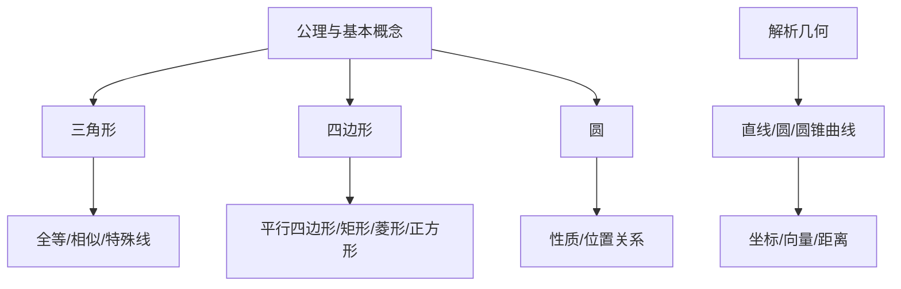

# 几何概念图

```mermaid
graph TD
  A[公理与基本概念] --> B[三角形]
  A --> C[四边形]
  A --> D[圆]
  B --> E[全等/相似/特殊线]
  C --> F[平行四边形/矩形/菱形/正方形]
  D --> G[性质/位置关系]
  H[解析几何] --> I[直线/圆/圆锥曲线]
  I --> J[坐标/向量/距离]
```

> 平面几何与解析几何的结构化对应：性质—坐标表达—计算工具。
