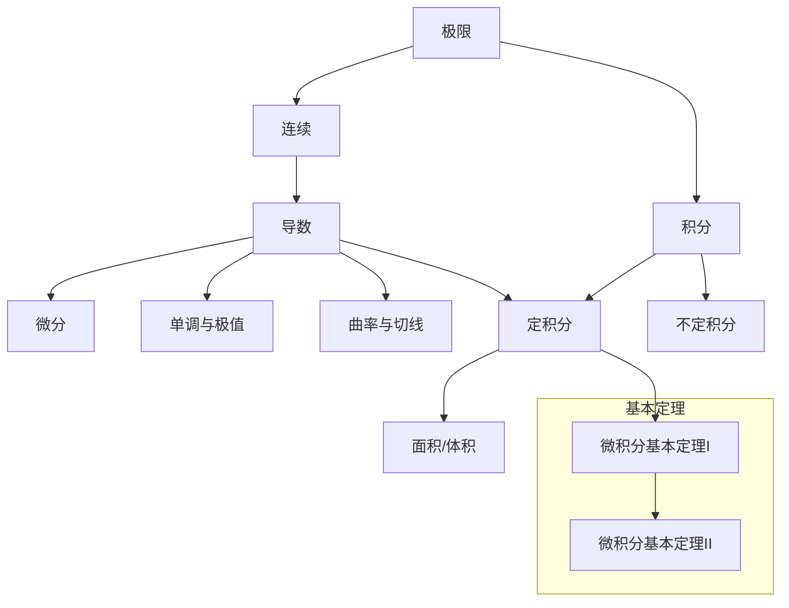

# 微积分核心概念图

```mermaid
graph TD
  A[极限] --> B[连续]
  B --> C[导数]
  C --> D[微分]
  C --> E[单调与极值]
  C --> F[曲率与切线]
  G[积分] --> H[定积分]
  G --> I[不定积分]
  H --> J[面积/体积]
  C --> H
  A --> G
  subgraph 基本定理
    C1[微积分基本定理I]
    C2[微积分基本定理II]
  end
  H --> C1
  C1 --> C2
```

> 主线：极限→连续→导数→（微分/单调/极值）与积分互通；基本定理连接导数与定积分。
