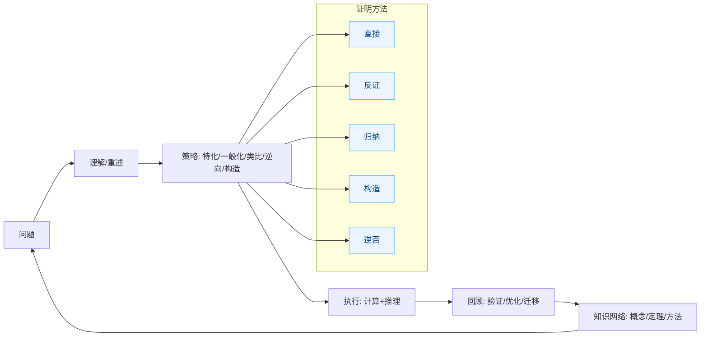

# 数学思维概念图

```mermaid
graph LR
  P[问题] --> U[理解/重述]
  U --> S[策略: 特化/一般化/类比/逆向/构造]
  S --> E[执行: 计算+推理]
  E --> R[回顾: 验证/优化/迁移]
  R --> K[知识网络: 概念/定理/方法]
  K --> P
  subgraph 证明方法
    D1[直接]:::m; D2[反证]:::m; D3[归纳]:::m; D4[构造]:::m; D5[逆否]:::m
  end
  S --> D1
  S --> D2
  S --> D3
  S --> D4
  S --> D5
  classDef m fill:#eaf5ff,stroke:#4da3ff,color:#004080
```

> 闭环：问题→理解→策略→执行→回顾→网络，强调证明与建模的互通。
