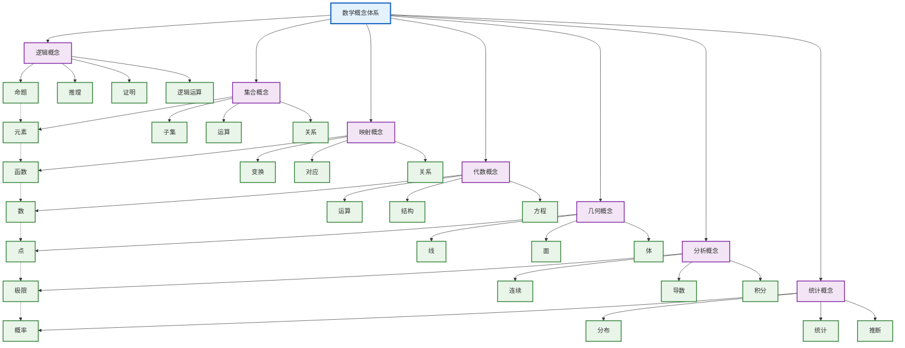
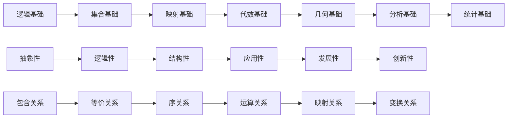
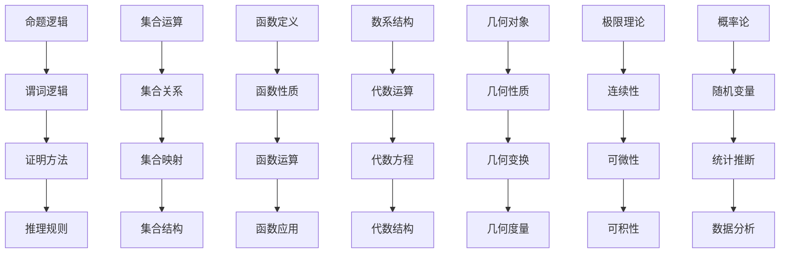
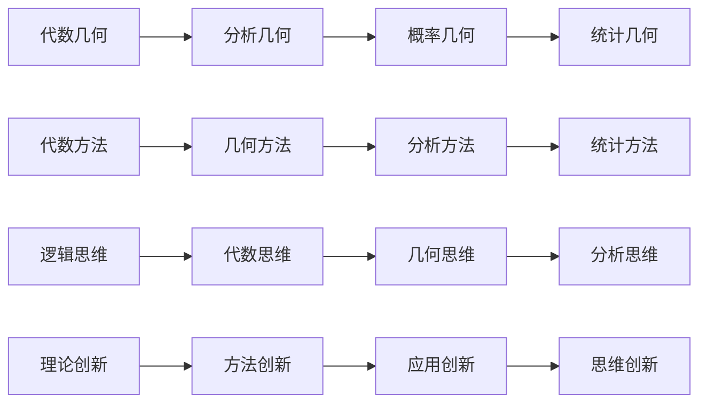
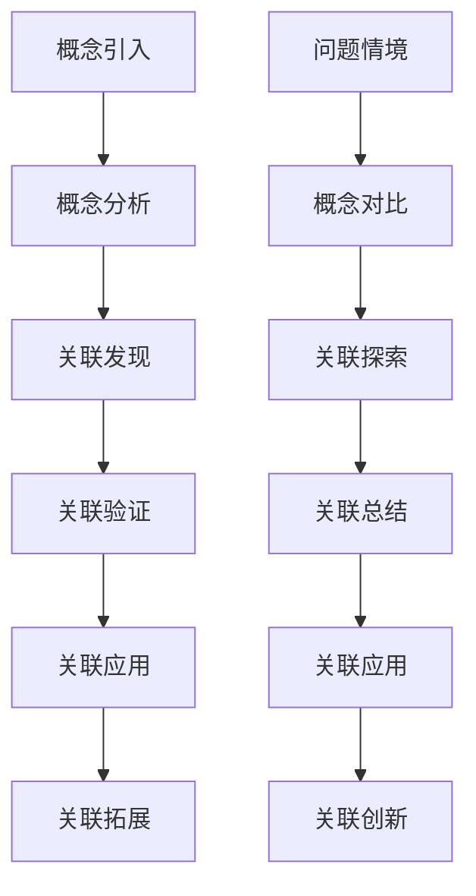
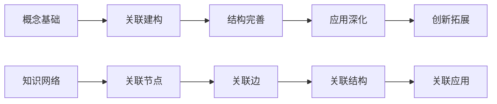
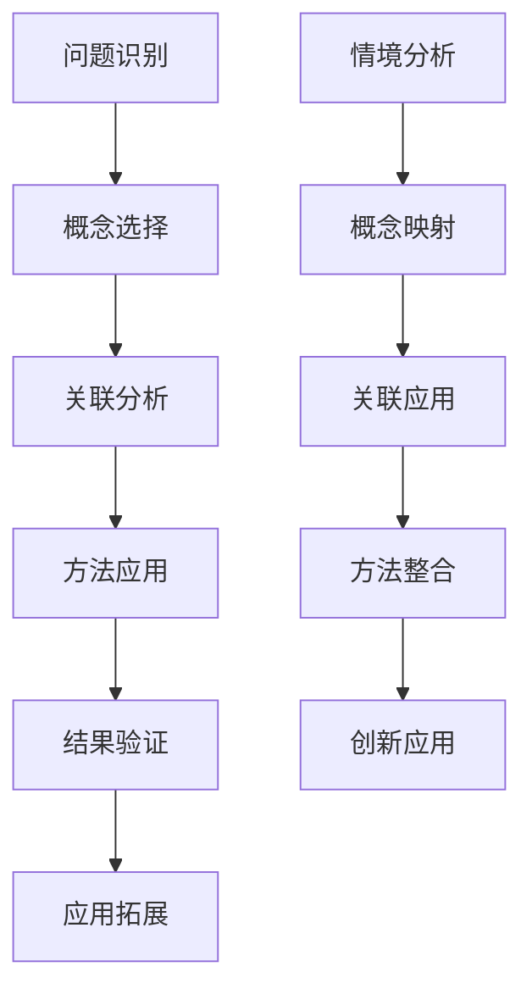
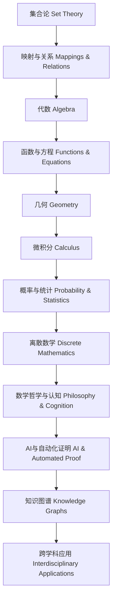
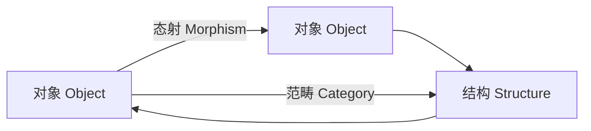
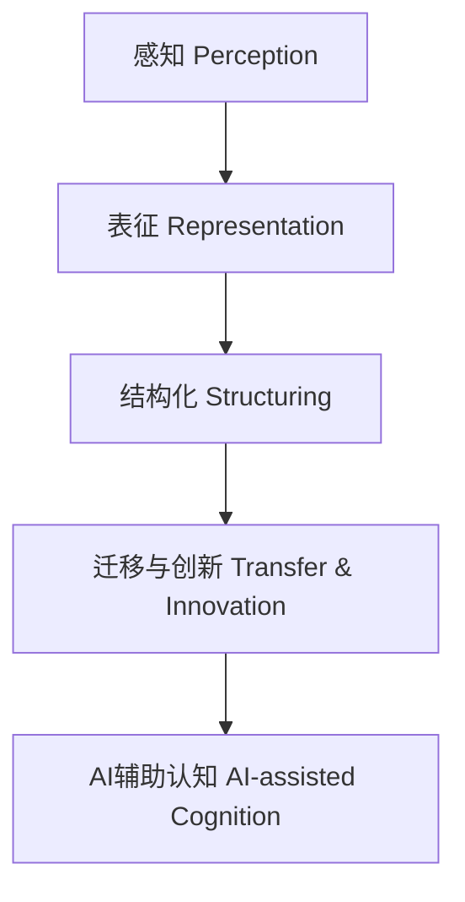

# 数学核心概念关联图 | Mathematical Core Concept Connectivity Map

## 概念关联总览 | Concept Connectivity Overview

## 概念层次分析 | Concept Hierarchy Analysis

### 第一层：基础概念层 | Foundation Concept Level

### 第二层：核心概念层 | Core Concept Level

### 第三层：应用概念层 | Application Concept Level

## 概念关联深度分析 | Deep Concept Connectivity Analysis

### 1. 逻辑-集合关联 | Logic-Set Connectivity

#### 关联机制

- **逻辑推理** → **集合运算**：逻辑运算与集合运算的对应关系
- **命题逻辑** → **集合关系**：命题的真值与集合的包含关系
- **谓词逻辑** → **集合映射**：量词与集合的映射关系
- **证明方法** → **集合构造**：逻辑证明与集合构造方法

#### 教学应用

- **概念对比**：通过对比逻辑运算与集合运算发现关联
- **方法迁移**：将逻辑推理方法迁移到集合问题
- **思维训练**：通过逻辑-集合关联训练抽象思维
- **应用拓展**：在集合问题中应用逻辑推理

### 2. 集合-映射关联 | Set-Mapping Connectivity

#### 2.1 关联机制

- **集合元素** → **映射对象**：集合元素作为映射的定义域和值域
- **集合关系** → **映射性质**：集合关系决定映射的性质
- **集合运算** → **映射运算**：集合运算与映射运算的对应
- **集合结构** → **映射结构**：集合结构决定映射的结构

#### 2.2 教学应用

- **概念递进**：从集合概念递进到映射概念
- **性质类比**：通过类比理解集合与映射的性质
- **方法整合**：整合集合方法与映射方法
- **应用深化**：在映射应用中深化集合理解

### 3. 映射-代数关联 | Mapping-Algebra Connectivity

#### 3.1 关联机制

- **函数映射** → **代数运算**：函数是特殊的代数映射
- **映射性质** → **代数性质**：映射的性质决定代数性质
- **映射运算** → **代数运算**：映射运算与代数运算的对应
- **映射结构** → **代数结构**：映射结构决定代数结构

#### 3.2 教学应用

- **概念整合**：整合映射概念与代数概念
- **方法迁移**：将映射方法迁移到代数问题
- **思维拓展**：通过映射-代数关联拓展思维
- **应用创新**：在代数应用中创新映射方法

### 4. 代数-几何关联 | Algebra-Geometry Connectivity

#### 4.1 关联机制

- **代数对象** → **几何对象**：代数方程对应几何曲线
- **代数运算** → **几何变换**：代数运算对应几何变换
- **代数性质** → **几何性质**：代数性质决定几何性质
- **代数结构** → **几何结构**：代数结构决定几何结构

#### 4.2 教学应用

- **多表征教学**：通过代数与几何的多表征理解概念
- **方法整合**：整合代数方法与几何方法
- **思维训练**：通过代数-几何关联训练综合思维
- **应用拓展**：在几何应用中拓展代数方法

### 5. 几何-分析关联 | Geometry-Analysis Connectivity

#### 5.1 关联机制

- **几何直观** → **分析抽象**：几何直观为分析提供直观基础
- **几何性质** → **分析性质**：几何性质决定分析性质
- **几何变换** → **分析变换**：几何变换对应分析变换
- **几何度量** → **分析度量**：几何度量决定分析度量

#### 5.2 教学应用

- **直观教学**：通过几何直观理解分析概念
- **方法迁移**：将几何方法迁移到分析问题
- **思维深化**：通过几何-分析关联深化思维
- **应用创新**：在分析应用中创新几何方法

### 6. 分析-统计关联 | Analysis-Statistics Connectivity

#### 6.1 关联机制

- **极限理论** → **概率极限**：极限理论为概率论提供基础
- **连续性** → **随机连续性**：连续性决定随机连续性
- **可微性** → **概率密度**：可微性与概率密度相关
- **可积性** → **统计积分**：可积性与统计积分相关

#### 6.2 教学应用

- **理论应用**：将分析理论应用到统计问题
- **方法整合**：整合分析方法与统计方法
- **思维拓展**：通过分析-统计关联拓展思维
- **应用深化**：在统计应用中深化分析理解

## 概念关联教学模式 | Concept Connectivity Teaching Model

### 1. 概念关联发现模式 | Concept Connectivity Discovery Model

#### 教学策略

- **问题驱动**：通过问题驱动概念关联发现
- **对比分析**：通过对比分析发现概念关联
- **探索验证**：通过探索验证概念关联
- **应用拓展**：通过应用拓展概念关联

### 2. 概念关联建构模式 | Concept Connectivity Construction Model

#### 2.1 教学策略

- **网络建构**：建构概念关联网络
- **节点连接**：连接概念关联节点
- **结构完善**：完善概念关联结构
- **应用深化**：深化概念关联应用

### 3. 概念关联应用模式 | Concept Connectivity Application Model

#### 3.1 教学策略

- **问题导向**：以问题为导向应用概念关联
- **方法整合**：整合多种方法应用概念关联
- **结果验证**：验证概念关联应用结果
- **创新拓展**：创新拓展概念关联应用

## 概念关联评价体系 | Concept Connectivity Evaluation System

### 1. 概念理解评价 | Concept Understanding Evaluation

#### 评价维度

- **概念准确性**：概念理解的准确性
- **概念完整性**：概念理解的完整性
- **概念深刻性**：概念理解的深刻性
- **概念灵活性**：概念理解的灵活性

#### 评价方法

- **概念测试**：通过测试评价概念理解
- **概念应用**：通过应用评价概念理解
- **概念创新**：通过创新评价概念理解
- **概念反思**：通过反思评价概念理解

### 2. 关联理解评价 | Connectivity Understanding Evaluation

#### 2.1 评价维度

- **关联发现**：发现概念关联的能力
- **关联理解**：理解概念关联的能力
- **关联应用**：应用概念关联的能力
- **关联创新**：创新概念关联的能力

#### 2.2 评价方法

- **关联测试**：通过测试评价关联理解
- **关联应用**：通过应用评价关联理解
- **关联创新**：通过创新评价关联理解
- **关联反思**：通过反思评价关联理解

### 3. 应用能力评价 | Application Ability Evaluation

#### 3.1 评价维度

- **应用准确性**：应用能力的准确性
- **应用灵活性**：应用能力的灵活性
- **应用创新性**：应用创新的能力
- **应用整合性**：应用整合的能力

#### 3.2 评价方法

- **应用测试**：通过测试评价应用能力
- **应用实践**：通过实践评价应用能力
- **应用创新**：通过创新评价应用能力
- **应用反思**：通过反思评价应用能力

## 概念关联发展展望 | Concept Connectivity Development Prospects

### 1. 技术发展趋势 | Technology Development Trends

#### 人工智能应用

- **智能概念关联**：AI辅助概念关联发现
- **智能概念教学**：AI辅助概念关联教学
- **智能概念评价**：AI辅助概念关联评价
- **智能概念创新**：AI辅助概念关联创新

#### 虚拟现实应用

- **虚拟概念探索**：VR辅助概念关联探索
- **虚拟概念教学**：VR辅助概念关联教学
- **虚拟概念应用**：VR辅助概念关联应用
- **虚拟概念创新**：VR辅助概念关联创新

### 2. 教育发展趋势 | Education Development Trends

#### 个性化学习

- **个性化概念学习**：根据个人特点设计概念学习
- **个性化关联学习**：根据个人特点设计关联学习
- **个性化应用学习**：根据个人特点设计应用学习
- **个性化创新学习**：根据个人特点设计创新学习

#### 协作学习

- **协作概念探索**：通过协作进行概念关联探索
- **协作概念应用**：通过协作进行概念关联应用
- **协作概念创新**：通过协作进行概念关联创新
- **协作概念发展**：通过协作促进概念关联发展

### 3. 研究发展趋势 | Research Development Trends

#### 认知科学研究

- **概念认知过程**：研究概念关联的认知过程
- **概念认知机制**：研究概念关联的认知机制
- **概念认知发展**：研究概念关联的认知发展
- **概念认知应用**：研究概念关联的认知应用

#### 教育学研究

- **概念教学理论**：发展概念关联的教学理论
- **概念学习理论**：发展概念关联的学习理论
- **概念评价理论**：发展概念关联的评价理论
- **概念发展理论**：发展概念关联的发展理论

## 8. 现代前沿与跨学科创新核心概念关联 | Modern Frontier and Interdisciplinary Core Concept Connections

### 8.1 AI与知识图谱驱动的数学概念网络 | AI and Knowledge Graph Driven Mathematical Concept Networks

- 利用AI与知识图谱技术，构建数学核心概念、定理、方法、应用之间的多层次、多关系网络。
- Use AI and knowledge graph technology to build multi-level, multi-relation networks among core mathematical concepts, theorems, methods, and applications.
- 【Mermaid知识图谱示例 | Mermaid Knowledge Graph Example】

### 8.2 可视化与多表征创新 | Visualization and Multi-representation Innovation

- 结合Mermaid、LaTeX、交互式工具等多种可视化手段，表达数学知识的结构性与关联性。
- Combine Mermaid, LaTeX, interactive tools, etc., to visualize the structure and connectivity of mathematical knowledge.
- 【LaTeX结构示意 | LaTeX Structure Example】

$$
\begin{array}{cccc}
\text{集合} & \rightarrow & \text{映射} & \rightarrow \text{代数} \\
\downarrow & & \downarrow & \\
\text{几何} & \rightarrow & \text{微积分} & \rightarrow \text{概率统计} \\
\downarrow & & \downarrow & \\
\text{离散数学} & \rightarrow & \text{哲学认知} & \rightarrow \text{AI/知识图谱}
\end{array}
$$

### 8.3 范畴论、模型论、结构主义等理论的关联创新 | Connections via Category Theory, Model Theory, Structuralism

- 以范畴论、模型论、结构主义为桥梁，揭示不同数学分支间的深层结构与统一性。
- Use category theory, model theory, and structuralism as bridges to reveal deep structures and unification among mathematical branches.
- 【Mermaid范畴结构示意 | Mermaid Category Structure Example】

### 8.4 认知科学与脑科学视角下的知识关联 | Cognitive and Neuroscience Perspectives on Knowledge Connections

- 结合认知科学、脑科学理论，分析数学概念网络的认知表征、学习路径与创新机制。
- Combine cognitive science and neuroscience to analyze cognitive representation, learning paths, and innovation mechanisms of mathematical concept networks.
- 【认知结构图示 | Cognitive Structure Diagram】

> 本节内容持续递归扩展，结合AI、知识图谱、自动化证明、可视化、范畴论、认知科学等前沿，突出数学核心概念的结构性、关联性、国际化与多学科融合。
> This section will be recursively expanded, integrating AI, knowledge graphs, automated proof, visualization, category theory, cognitive science, etc., highlighting the structure, connectivity, internationalization, and interdisciplinary integration of core mathematical concepts.

---

*本概念关联图为SeniorMath项目的核心内容之一，旨在通过系统化的概念关联分析，为数学教育提供科学、完整、实用的概念体系参考。*
