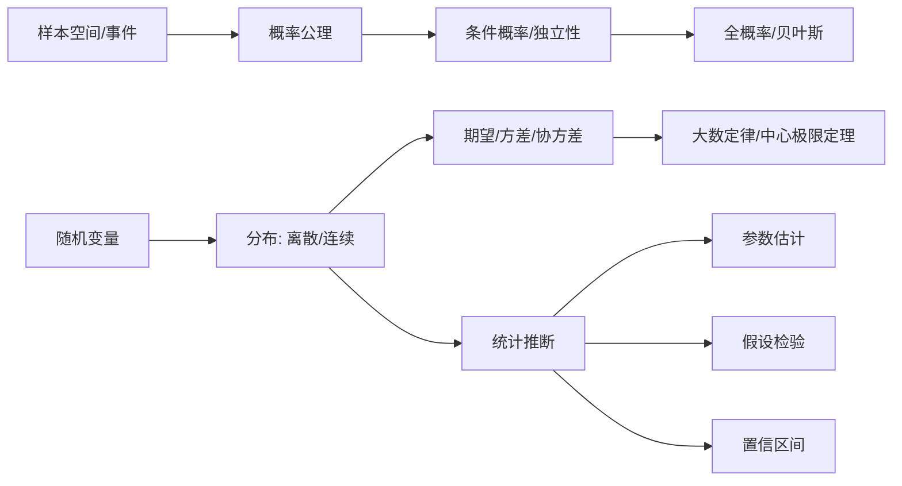

# 概率统计概念图

```mermaid
graph LR
  A[样本空间/事件] --> B[概率公理]
  B --> C[条件概率/独立性]
  C --> D[全概率/贝叶斯]
  E[随机变量] --> F[分布: 离散/连续]
  F --> G[期望/方差/协方差]
  G --> H[大数定律/中心极限定理]
  I[统计推断] --> J[参数估计]
  I --> K[假设检验]
  I --> L[置信区间]
  F --> I
```

> 概率奠基于公理与条件概率；分布刻画随机变量；推断建立在分布与样本之上。
