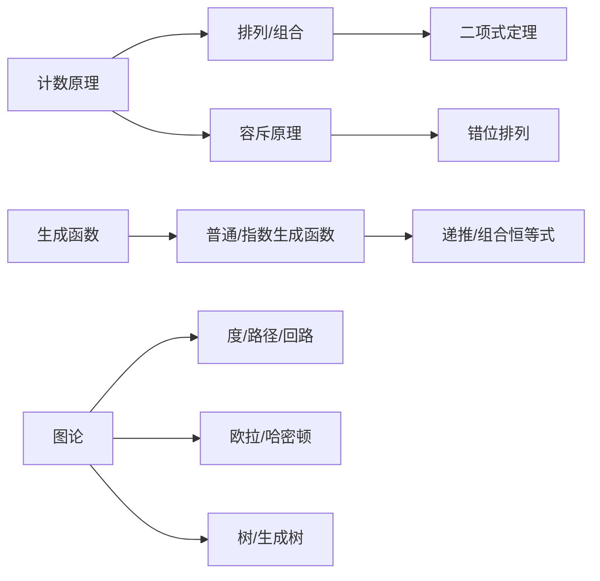

# 离散数学概念图

```mermaid
graph LR
  A[计数原理] --> B[排列/组合]
  A --> C[容斥原理]
  D[生成函数] --> E[普通/指数生成函数]
  E --> F[递推/组合恒等式]
  G[图论] --> H[度/路径/回路]
  G --> I[欧拉/哈密顿]
  G --> J[树/生成树]
  B --> K[二项式定理]
  C --> L[错位排列]
```

> 以“计数—生成—结构（图）”三线并行，贯通方法与对象。
