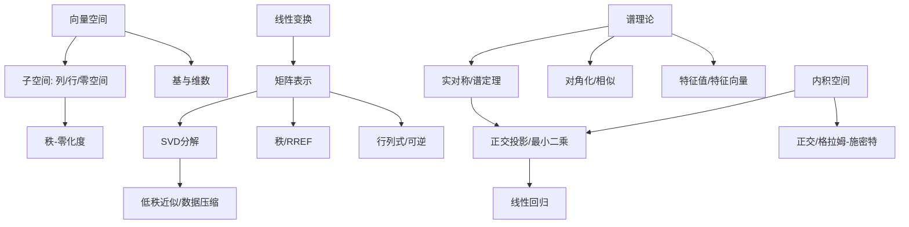

# 线性代数概念图

```mermaid
graph TD
  A[向量空间] --> B[基与维数]
  A --> C[子空间: 列/行/零空间]
  C --> C1[秩-零化度]
  D[线性变换] --> E[矩阵表示]
  E --> F[行列式/可逆]
  E --> G[秩/RREF]
  H[谱理论] --> I[特征值/特征向量]
  H --> J[对角化/相似]
  H --> K[实对称/谱定理]
  L[内积空间] --> M[正交/格拉姆-施密特]
  L --> N[正交投影/最小二乘]
  O[SVD分解] --> P[低秩近似/数据压缩]
  E --> O
  K --> N
  N --> Q[线性回归]
```

> 主线：结构（向量空间/变换）→ 代数（矩阵/行列式/秩）→ 谱（特征/对角化/正交）→ 应用（最小二乘/SVD）。
