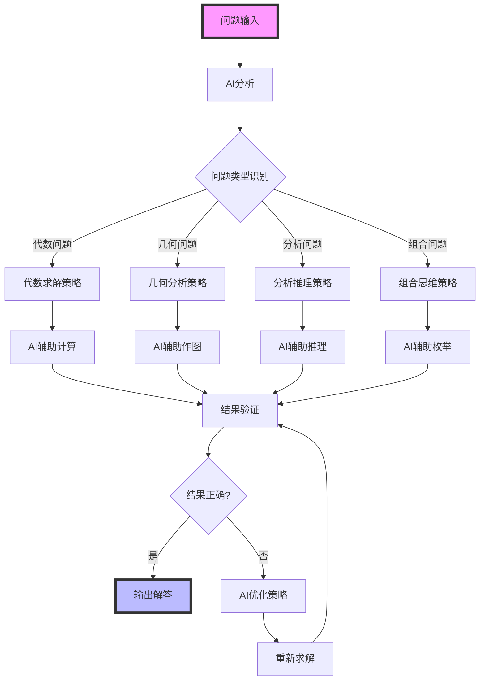
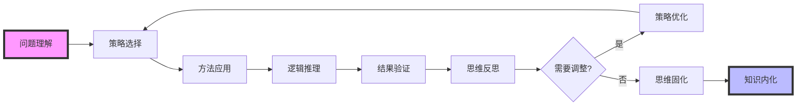
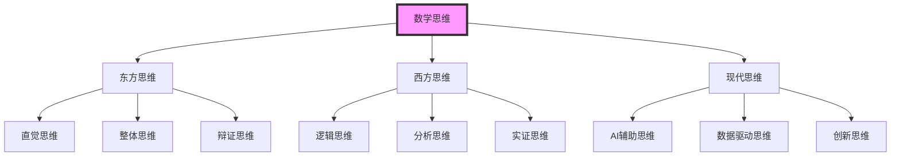
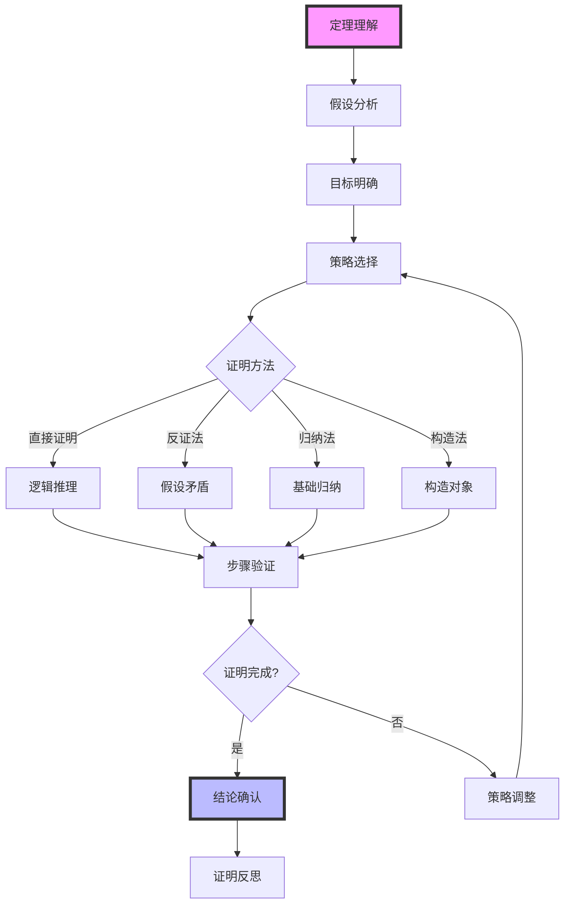
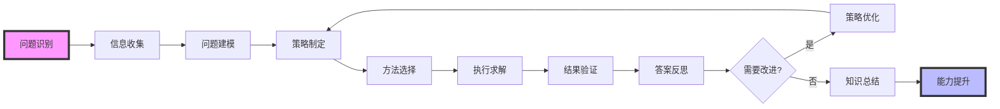
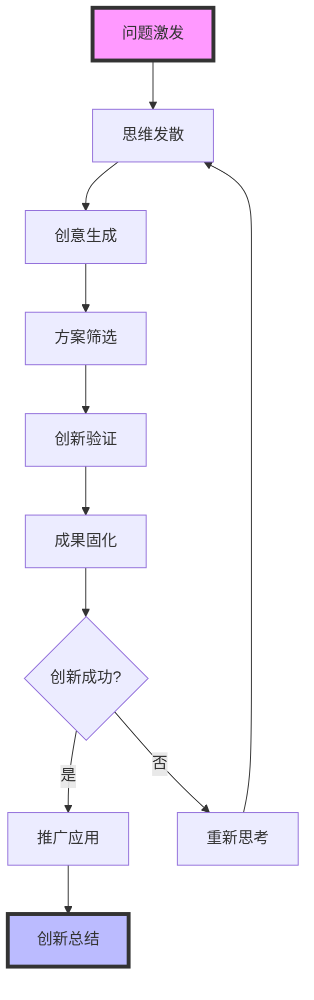
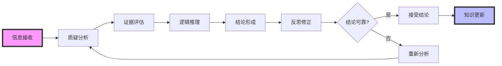
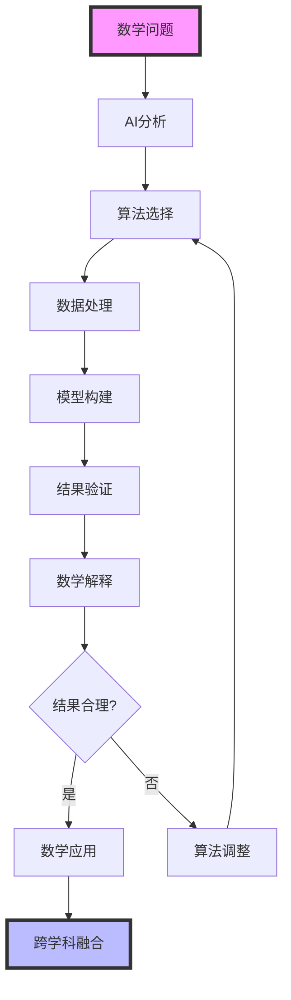
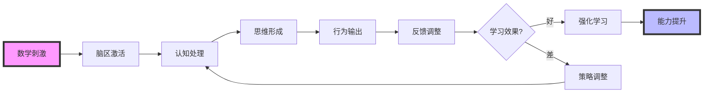
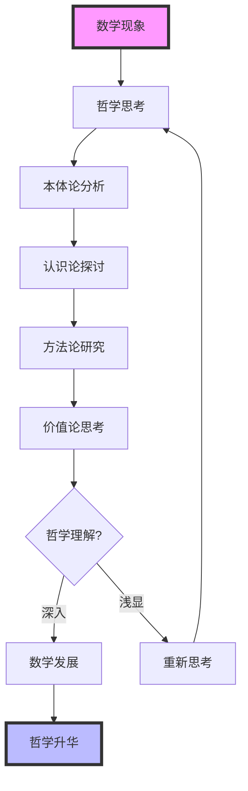

# 数学思维流程图 | Mathematical Thinking Flow Charts

## 模块概述 | Module Overview

本模块系统设计数学思维的各种流程图，包括问题解决流程、证明思维过程、创新思维路径等，融入AI驱动、可视化、国际化等创新元素，帮助学生建立系统化的数学思维模式。

## 一、AI驱动的思维流程创新 | AI-Driven Thinking Flow Innovation

### 1.1 智能问题解决流程 | Intelligent Problem-Solving Flow

**AI辅助数学问题解决流程图**:



**智能思维路径优化**:

- 基于历史数据优化思维路径
- 使用机器学习预测最佳解题策略
- 应用自然语言处理理解问题需求
- 利用知识图谱推荐相关概念

### 1.2 可视化思维过程 | Visual Thinking Process

**动态思维流程图**:



**交互式思维可视化**:

- 使用D3.js创建动态思维节点
- 实时显示思维过程变化
- 支持思维路径的交互式探索
- 提供思维过程的回放功能

## 二、国际化思维流程设计 | International Thinking Flow Design

### 2.1 多语种思维表达 | Multilingual Thinking Expression

**中英德法四语种思维流程**:

**中文思维流程**：

1. 问题分析 → 2. 策略制定 → 3. 方法选择 → 4. 逻辑推理 → 5. 结果验证

**English Thinking Flow**：

1. Problem Analysis → 2. Strategy Formulation → 3. Method Selection → 4. Logical Reasoning → 5. Result Verification

**Deutsche Denkprozess**：

1. Problemanalyse → 2. Strategieentwicklung → 3. Methodenauswahl → 4. Logisches Denken → 5. Ergebnisverifikation

**Processus de pensée français**：

1. Analyse du problème → 2. Formulation de stratégie → 3. Sélection de méthode → 4. Raisonnement logique → 5. Vérification du résultat

### 2.2 跨文化思维模式 | Cross-Cultural Thinking Patterns

**不同文化背景的数学思维特点**:



## 三、经典数学思维流程 | Classic Mathematical Thinking Flows

### 3.1 证明思维流程 | Proof Thinking Flow

**数学证明思维流程图**:



**AI辅助证明流程**:

- 使用Lean、Coq等工具进行形式化证明
- 应用AI算法辅助定理发现
- 利用机器学习优化证明策略
- 智能验证证明的正确性

### 3.2 问题解决思维流程 | Problem-Solving Thinking Flow

**数学问题解决流程图**:



**可视化问题解决过程**:

- 使用Python创建动态问题解决演示
- 通过动画展示解题步骤
- 实时显示思维过程变化
- 提供交互式问题解决体验

## 四、创新思维流程设计 | Innovative Thinking Flow Design

### 4.1 创造性思维流程 | Creative Thinking Flow

**数学创新思维流程图**:



**AI驱动的创新思维**:

- 使用AI算法生成创新思路
- 应用机器学习优化创新策略
- 利用知识图谱发现创新机会
- 智能评估创新方案的可行性

### 4.2 批判性思维流程 | Critical Thinking Flow

**数学批判性思维流程图**:



## 五、跨学科思维流程 | Interdisciplinary Thinking Flows

### 5.1 数学与AI融合思维 | Mathematics and AI Integration Thinking

**AI辅助数学思维流程**:



### 5.2 数学与脑科学融合思维 | Mathematics and Neuroscience Integration Thinking

**基于脑科学的数学思维流程**:



### 5.3 数学与哲学融合思维 | Mathematics and Philosophy Integration Thinking

**数学哲学思维流程**:



## 六、未来发展趋势 | Future Development Trends

### 6.1 技术驱动思维创新 | Technology-Driven Thinking Innovation

**AI与思维流程深度融合**:

- 智能思维路径推荐
- 自动化思维过程分析
- 智能思维效果评估
- 虚拟现实思维体验

**可视化思维技术广泛应用**:

- 3D思维过程可视化
- 动态思维交互演示
- 思维过程实时监控
- 思维结果可视化展示

### 6.2 国际化思维发展趋势 | International Thinking Development Trends

**多语种思维教育普及**:

- 中英德法四语种思维标准统一
- 跨文化思维问题设计
- 国际思维模式创新
- 全球化思维资源整合

**国际标准全面对接**:

- 对接国际思维教育标准
- 融入国际思维评价体系
- 采用国际思维表达规范
- 引入全球优质思维资源

### 6.3 跨学科思维创新趋势 | Interdisciplinary Thinking Innovation Trends

**数学与其他学科思维融合**:

- 数学与人工智能思维结合
- 数学与脑科学思维交叉
- 数学与数据科学思维融合
- 数学与哲学思维认知结合

**创新思维应用场景拓展**:

- 智能城市数学建模思维
- 生物医学数学应用思维
- 金融科技数学创新思维
- 环境科学数学分析思维

## 七、思维流程实例 | Thinking Flow Examples

### 7.1 AI辅助证明思维实例 | AI-Assisted Proof Thinking Example

**柯西-施瓦茨不等式证明思维流程**:

```python
import matplotlib.pyplot as plt
import numpy as np

def visualize_cauchy_schwarz_thinking():
    # 思维流程节点
    steps = ['问题理解', '策略选择', '方法应用', '逻辑推理', '结果验证']
    ai_assistance = [0.2, 0.4, 0.6, 0.8, 0.9]  # AI辅助程度
    
    # 可视化思维流程
    fig, (ax1, ax2) = plt.subplots(1, 2, figsize=(15, 6))
    
    # 思维流程图
    ax1.plot(steps, ai_assistance, 'bo-', linewidth=2, markersize=8)
    ax1.fill_between(steps, ai_assistance, alpha=0.3, color='blue')
    ax1.set_ylabel('AI辅助程度')
    ax1.set_title('AI辅助证明思维流程')
    ax1.grid(True, alpha=0.3)
    
    # 思维效率对比
    traditional = [0.1, 0.2, 0.3, 0.4, 0.5]
    ai_enhanced = [0.2, 0.4, 0.6, 0.8, 0.9]
    
    x = np.arange(len(steps))
    width = 0.35
    
    ax2.bar(x - width/2, traditional, width, label='传统思维', alpha=0.7)
    ax2.bar(x + width/2, ai_enhanced, width, label='AI增强思维', alpha=0.7)
    
    ax2.set_xlabel('思维步骤')
    ax2.set_ylabel('思维效率')
    ax2.set_title('思维效率对比')
    ax2.set_xticks(x)
    ax2.set_xticklabels(steps)
    ax2.legend()
    ax2.grid(True, alpha=0.3)
    
    plt.tight_layout()
    plt.show()

# 执行可视化
visualize_cauchy_schwarz_thinking()
```

### 7.2 国际化思维实例 | International Thinking Example

**多语种数学思维表达**:

**中文思维**：通过观察 → 发现规律 → 建立猜想 → 严格证明

**English Thinking**：Observation → Pattern Discovery → Conjecture Formation → Rigorous Proof

**Deutsche Denken**：Beobachtung → Musterentdeckung → Vermutungsbildung → Strenge Beweisführung

**Pensée française**：Observation → Découverte de motifs → Formation de conjectures → Preuve rigoureuse

---

> 本数学思维流程图持续更新，融合AI驱动、可视化、国际化、跨学科等创新元素，为高中数学教育提供系统化的思维指导。
