# 数学思维流程图 | Mathematical Thinking Flow Chart

## 数学思维发展总览 | Mathematical Thinking Development Overview

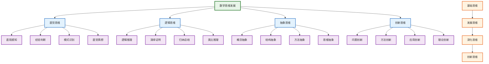

## 问题解决思维流程 | Problem Solving Thinking Flow

### 1. 问题理解阶段 | Problem Understanding Phase

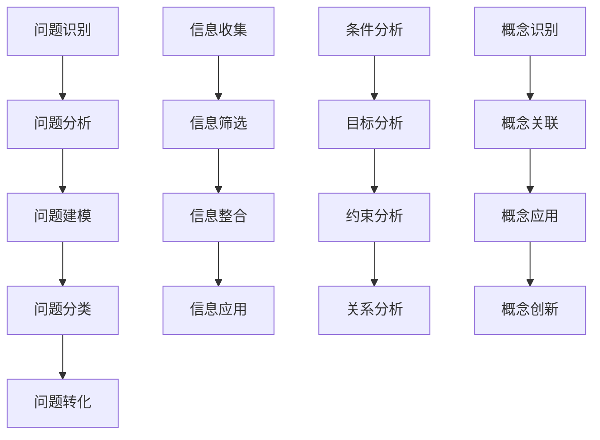

### 2. 策略制定阶段 | Strategy Formulation Phase

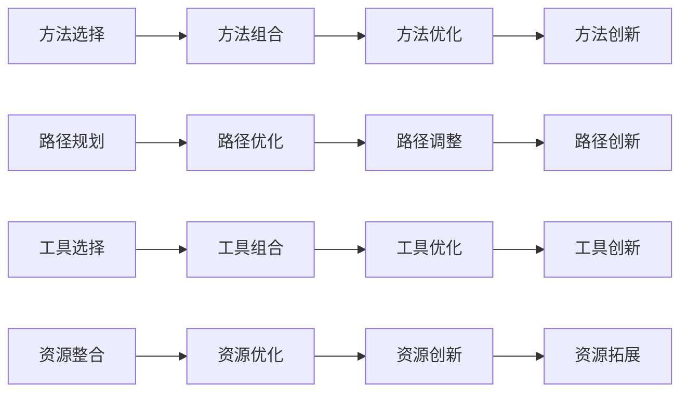

### 3. 执行解决阶段 | Execution Solution Phase

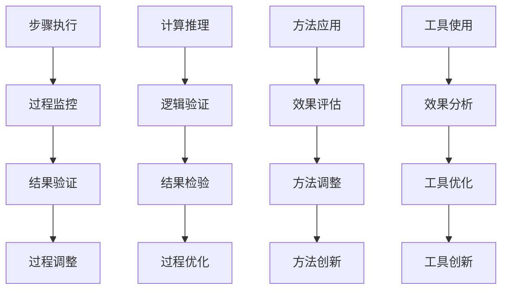

### 4. 反思总结阶段 | Reflection Summary Phase

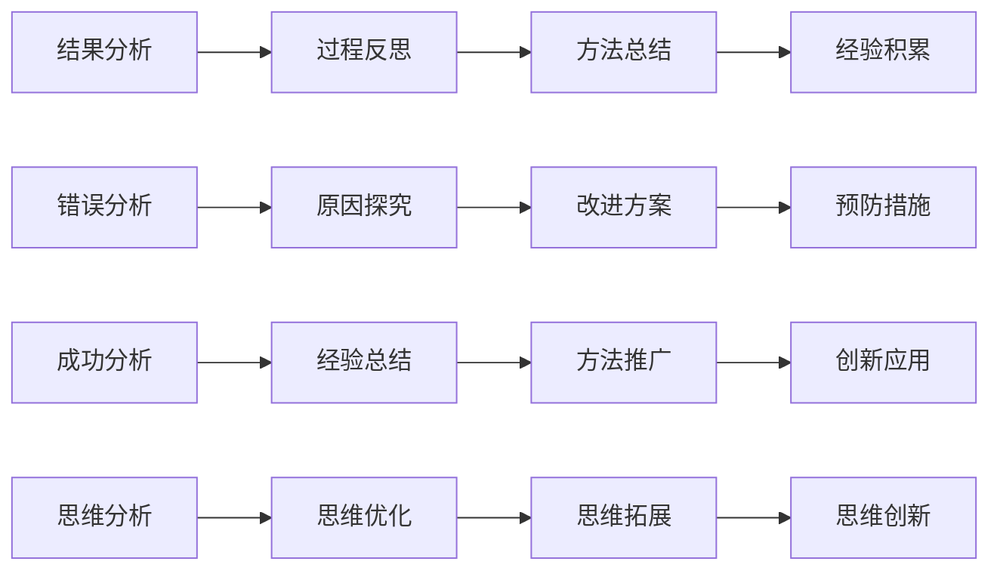

## 概念理解思维流程 | Concept Understanding Thinking Flow

### 1. 概念感知阶段 | Concept Perception Phase

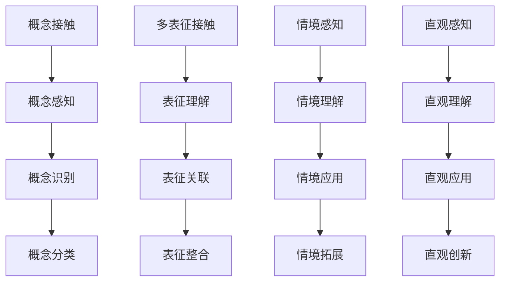

### 2. 概念理解阶段 | Concept Understanding Phase

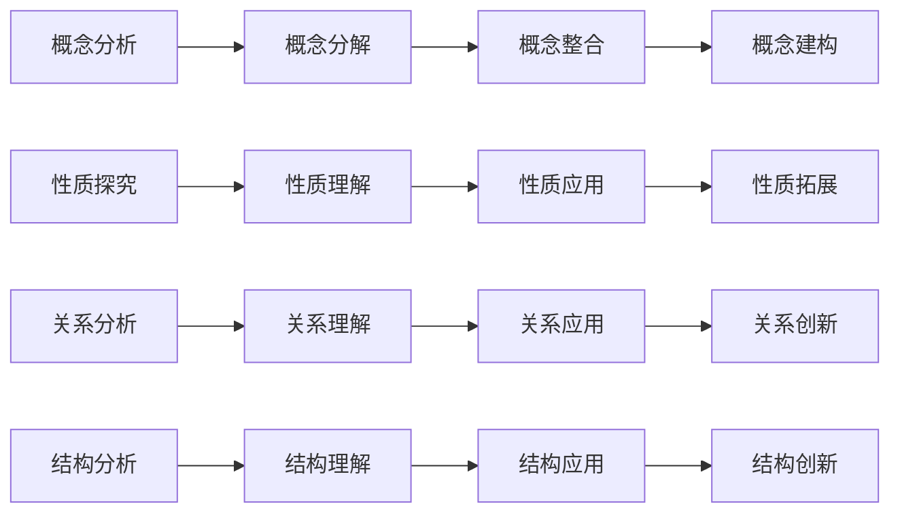

### 3. 概念应用阶段 | Concept Application Phase

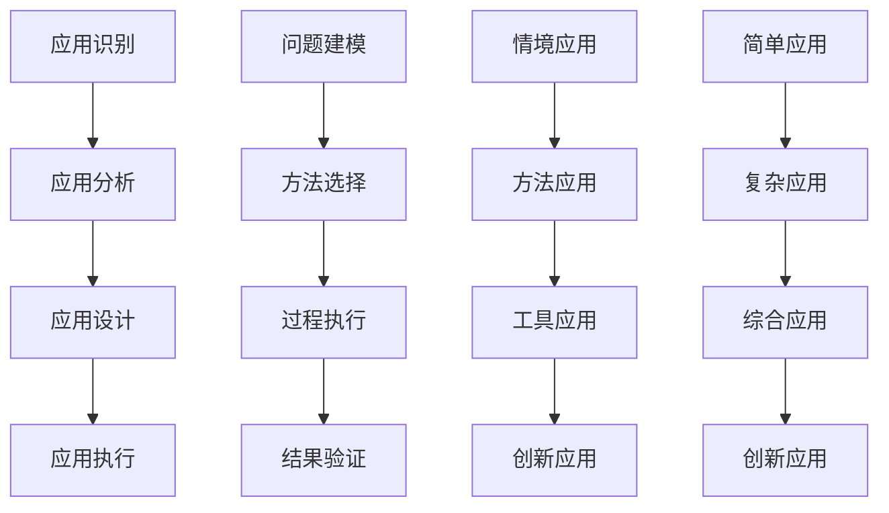

### 4. 概念创新阶段 | Concept Innovation Phase

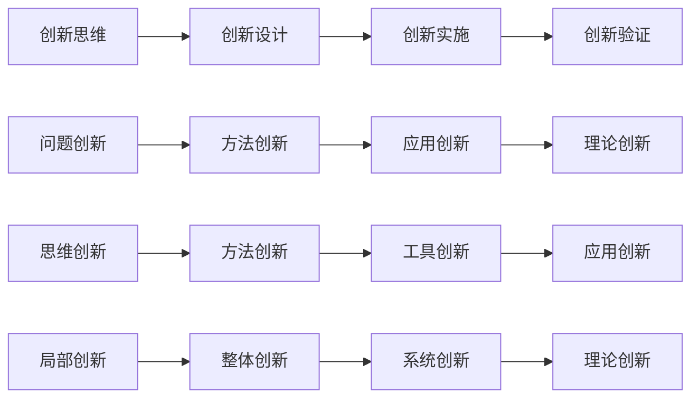

## 证明思维流程 | Proof Thinking Flow

### 1. 证明准备阶段 | Proof Preparation Phase

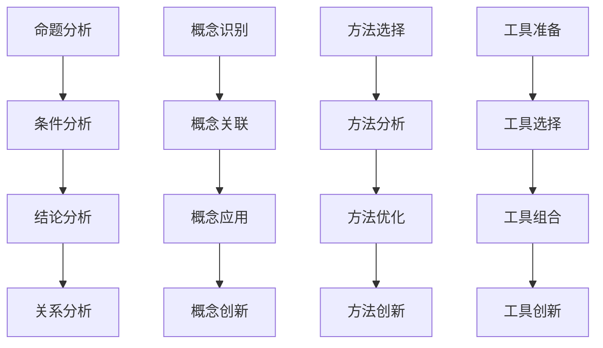

### 2. 证明设计阶段 | Proof Design Phase

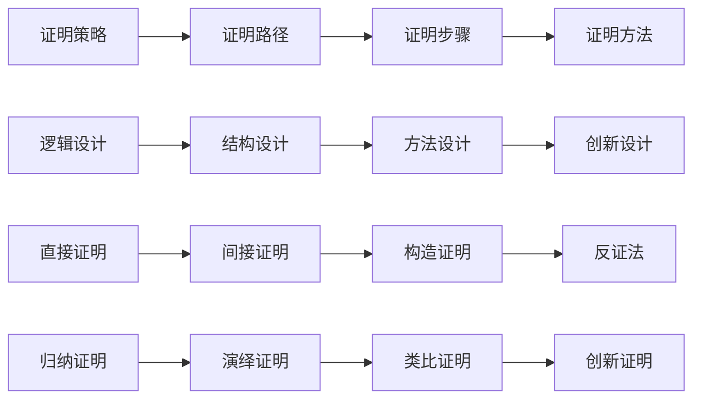

### 3. 证明执行阶段 | Proof Execution Phase

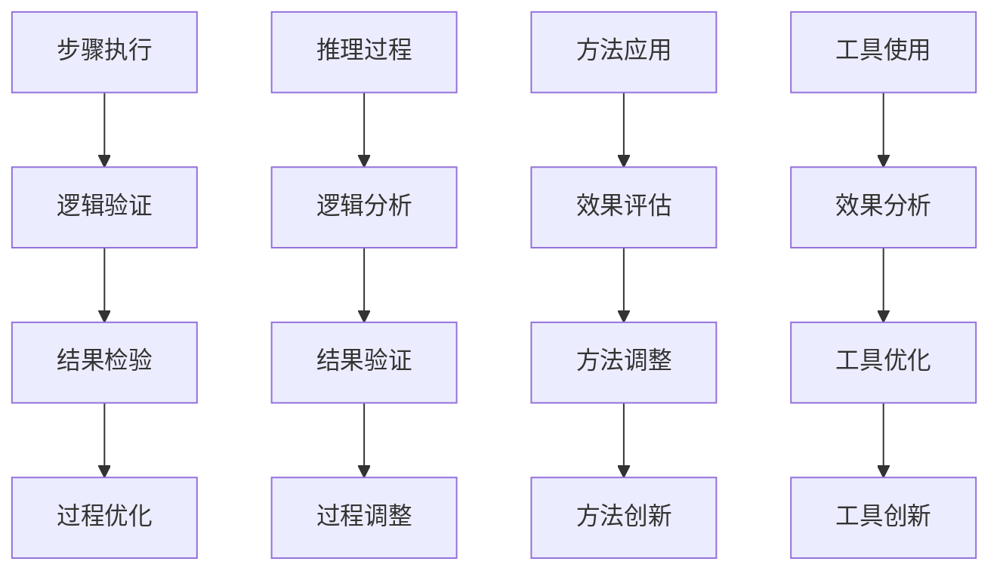

### 4. 证明反思阶段 | Proof Reflection Phase

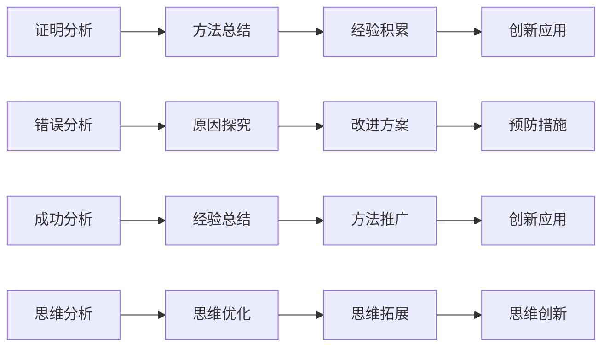

## 思维层次分析 | Thinking Level Analysis

### 第一层：直觉思维层 | Intuitive Thinking Level

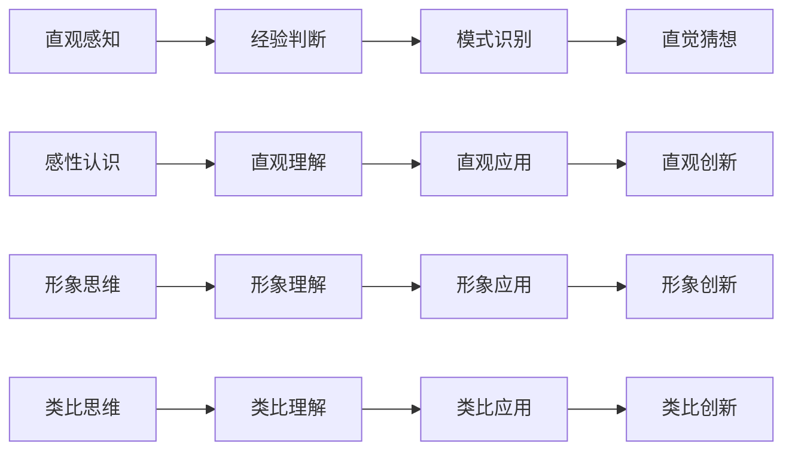

### 第二层：逻辑思维层 | Logical Thinking Level

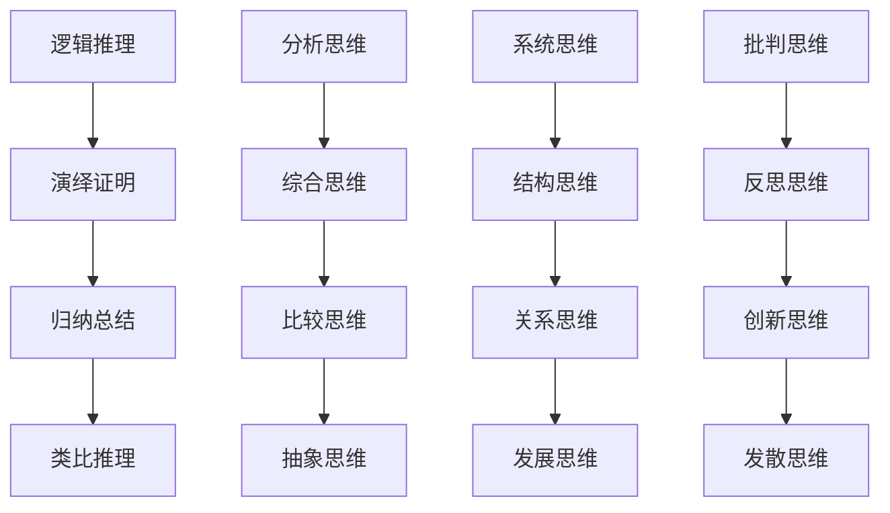

### 第三层：抽象思维层 | Abstract Thinking Level

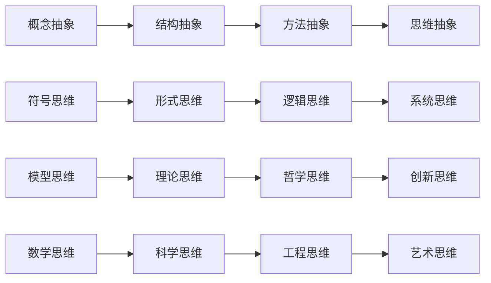

### 第四层：创新思维层 | Innovative Thinking Level

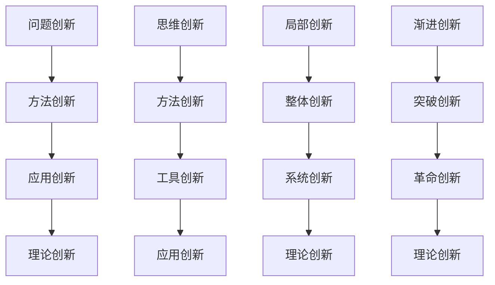

## 思维培养策略 | Thinking Cultivation Strategies

### 1. 直觉思维培养 | Intuitive Thinking Cultivation

#### 培养策略

- **直观教学**：通过直观教学培养直觉思维
- **经验积累**：通过经验积累培养直觉思维
- **模式训练**：通过模式训练培养直觉思维
- **猜想训练**：通过猜想训练培养直觉思维

#### 培养方法

- **多表征教学**：通过多表征教学培养直觉思维
- **情境教学**：通过情境教学培养直觉思维
- **探究教学**：通过探究教学培养直觉思维
- **合作教学**：通过合作教学培养直觉思维

### 2. 逻辑思维培养 | Logical Thinking Cultivation

#### 2.1 培养策略

- **推理训练**：通过推理训练培养逻辑思维
- **证明训练**：通过证明训练培养逻辑思维
- **归纳训练**：通过归纳训练培养逻辑思维
- **类比训练**：通过类比训练培养逻辑思维

#### 2.2 培养方法

- **问题驱动**：通过问题驱动培养逻辑思维
- **案例教学**：通过案例教学培养逻辑思维
- **实践教学**：通过实践教学培养逻辑思维
- **反思教学**：通过反思教学培养逻辑思维

### 3. 抽象思维培养 | Abstract Thinking Cultivation

#### 3.1 培养策略

- **概念抽象**：通过概念抽象培养抽象思维
- **结构抽象**：通过结构抽象培养抽象思维
- **方法抽象**：通过方法抽象培养抽象思维
- **思维抽象**：通过思维抽象培养抽象思维

#### 3.2 培养方法

- **概念教学**：通过概念教学培养抽象思维
- **结构教学**：通过结构教学培养抽象思维
- **方法教学**：通过方法教学培养抽象思维
- **思维教学**：通过思维教学培养抽象思维

### 4. 创新思维培养 | Innovative Thinking Cultivation

#### 4.1 培养策略

- **问题创新**：通过问题创新培养创新思维
- **方法创新**：通过方法创新培养创新思维
- **应用创新**：通过应用创新培养创新思维
- **理论创新**：通过理论创新培养创新思维

#### 4.2 培养方法

- **创新教学**：通过创新教学培养创新思维
- **研究教学**：通过研究教学培养创新思维
- **实验教学**：通过实验教学培养创新思维
- **项目教学**：通过项目教学培养创新思维

## 思维评价体系 | Thinking Evaluation System

### 1. 思维层次评价 | Thinking Level Evaluation

#### 评价维度

- **思维层次**：思维发展的层次水平
- **思维深度**：思维理解的深度程度
- **思维广度**：思维应用的广度范围
- **思维创新**：思维创新的能力水平

#### 评价方法

- **思维测试**：通过测试评价思维水平
- **思维应用**：通过应用评价思维水平
- **思维创新**：通过创新评价思维水平
- **思维反思**：通过反思评价思维水平

### 2. 思维过程评价 | Thinking Process Evaluation

#### 2.1 评价维度

- **思维过程**：思维过程的合理性
- **思维方法**：思维方法的有效性
- **思维工具**：思维工具的适用性
- **思维结果**：思维结果的准确性

#### 2.2 评价方法

- **过程观察**：通过观察评价思维过程
- **方法分析**：通过分析评价思维方法
- **工具评估**：通过评估评价思维工具
- **结果验证**：通过验证评价思维结果

### 3. 思维应用评价 | Thinking Application Evaluation

#### 3.1 评价维度

- **应用准确性**：思维应用的准确性
- **应用灵活性**：思维应用的灵活性
- **应用创新性**：思维应用的创新性
- **应用整合性**：思维应用的整合性

#### 3.2 评价方法

- **应用测试**：通过测试评价思维应用
- **应用实践**：通过实践评价思维应用
- **应用创新**：通过创新评价思维应用
- **应用反思**：通过反思评价思维应用

## 思维发展展望 | Thinking Development Prospects

### 1. 技术发展趋势 | Technology Development Trends

#### 人工智能应用

- **智能思维**：AI辅助思维发展
- **智能教学**：AI辅助思维教学
- **智能评价**：AI辅助思维评价
- **智能创新**：AI辅助思维创新

#### 虚拟现实应用

- **虚拟思维**：VR辅助思维发展
- **虚拟教学**：VR辅助思维教学
- **虚拟应用**：VR辅助思维应用
- **虚拟创新**：VR辅助思维创新

### 2. 教育发展趋势 | Education Development Trends

#### 个性化学习

- **个性化思维**：根据个人特点培养思维
- **个性化教学**：根据个人特点设计教学
- **个性化评价**：根据个人特点设计评价
- **个性化发展**：根据个人特点促进发展

#### 协作学习

- **协作思维**：通过协作培养思维
- **协作教学**：通过协作进行教学
- **协作应用**：通过协作进行应用
- **协作创新**：通过协作进行创新

### 3. 研究发展趋势 | Research Development Trends

#### 认知科学研究

- **认知过程**：研究思维发展的认知过程
- **认知机制**：研究思维发展的认知机制
- **认知发展**：研究思维发展的认知发展
- **认知应用**：研究思维发展的认知应用

#### 教育学研究

- **教学理论**：发展思维教学的理论
- **学习理论**：发展思维学习的理论
- **评价理论**：发展思维评价的理论
- **发展理论**：发展思维发展的理论

---

*本思维流程图为SeniorMath项目的核心内容之一，旨在通过系统化的思维流程分析，为数学教育提供科学、完整、实用的思维发展参考。*
