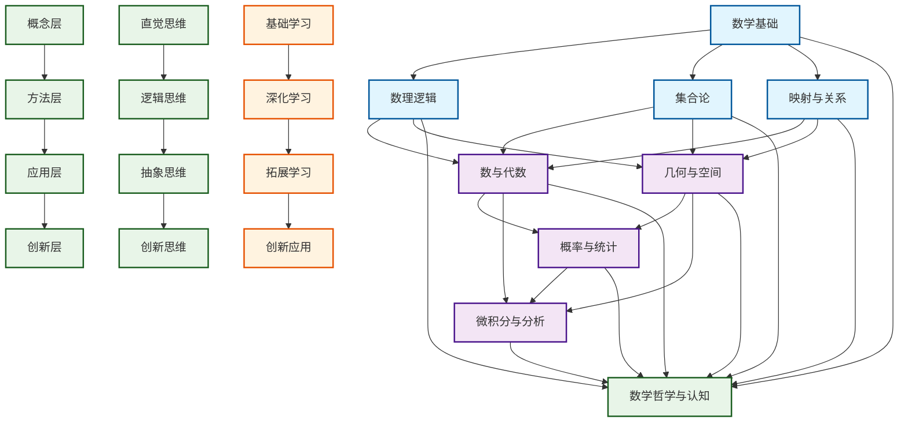
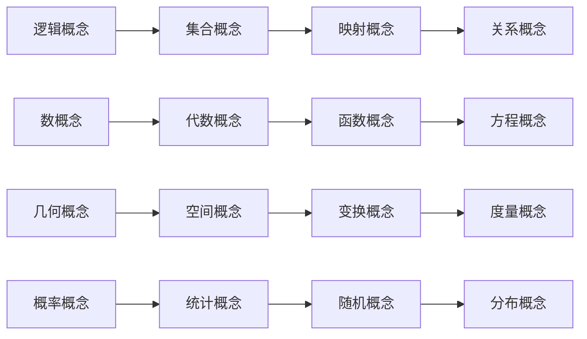
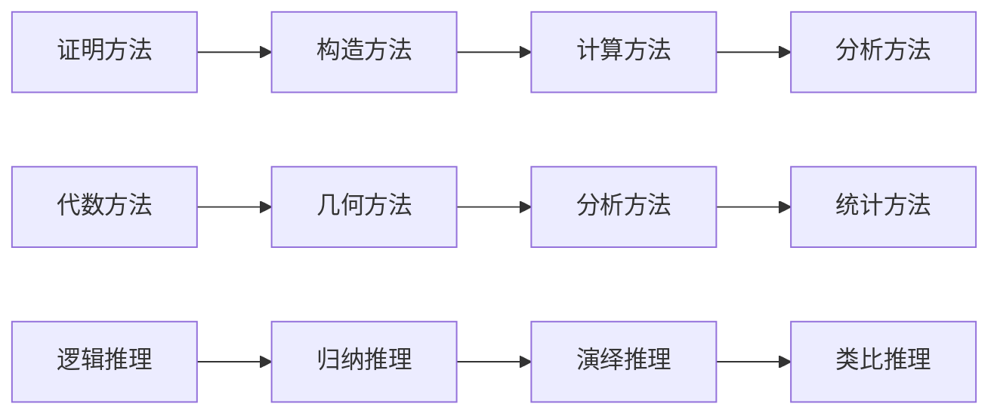
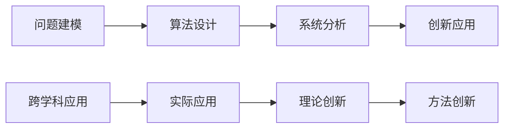
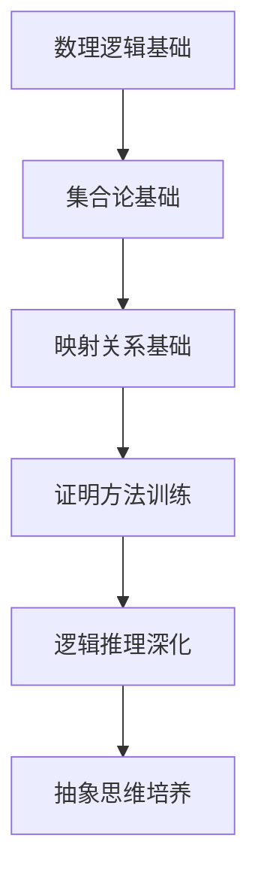
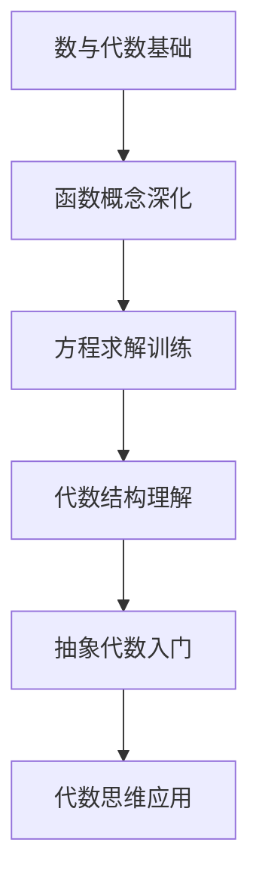
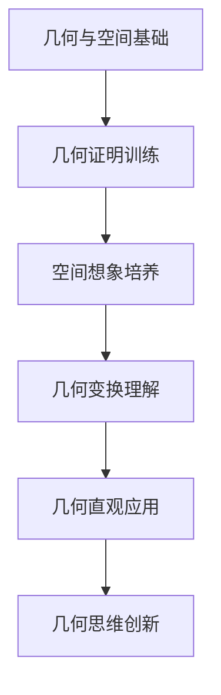
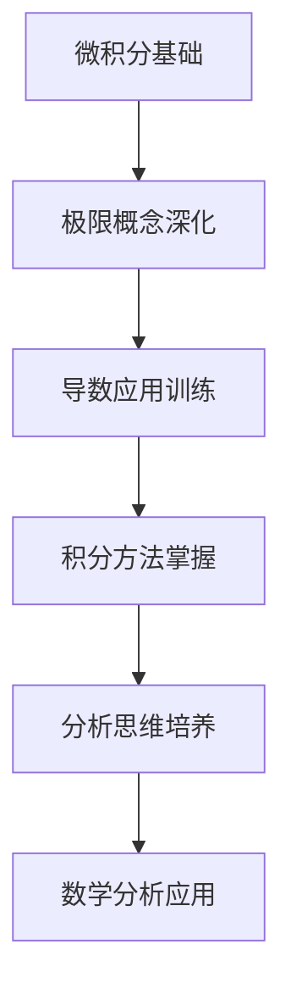

# 数学知识体系总览 | Mathematical Knowledge System Overview

## 知识图谱 | Knowledge Graph

## 知识关联分析 | Knowledge Connectivity Analysis

### 1. 基础层关联 | Basic Level Connectivity

#### 数理逻辑与其他模块的关联

- **与集合论**：逻辑推理为集合运算提供理论基础
- **与映射关系**：逻辑结构支撑映射的定义和性质
- **与代数**：逻辑运算为代数运算提供形式化基础
- **与几何**：逻辑推理支撑几何证明和构造

#### 集合论与其他模块的关联

- **与映射关系**：集合为映射提供定义域和值域
- **与代数**：集合运算为代数运算提供集合论基础
- **与几何**：点集为几何对象提供集合论描述
- **与概率**：样本空间和事件都是集合

#### 映射与关系与其他模块的关联

- **与代数**：函数是特殊的映射关系
- **与几何**：变换是几何中的映射
- **与微积分**：连续性和可微性基于映射性质
- **与统计**：随机变量是特殊的映射

### 2. 应用层关联 | Application Level Connectivity

#### 数与代数的跨模块应用

- **在几何中**：坐标几何、向量代数
- **在微积分中**：函数分析、极限计算
- **在概率中**：随机变量、期望计算
- **在统计中**：数据分析、回归分析

#### 几何与空间的跨模块应用

- **在代数中**：几何代数、代数几何
- **在微积分中**：几何直观、空间分析
- **在概率中**：几何概率、空间分布
- **在统计中**：空间统计、几何建模

#### 概率与统计的跨模块应用

- **在微积分中**：概率密度、积分应用
- **在代数中**：随机矩阵、概率代数
- **在几何中**：随机几何、统计几何
- **在分析中**：随机分析、统计推断

### 3. 创新层关联 | Innovation Level Connectivity

#### 微积分与分析的创新应用

- **在几何中**：微分几何、拓扑分析
- **在代数中**：代数分析、泛函分析
- **在概率中**：随机微积分、随机分析
- **在统计中**：统计推断、机器学习

#### 数学哲学与认知的创新应用

- **在教学中**：认知科学指导教学设计
- **在研究中**：哲学思维指导研究方向
- **在应用中**：创新思维指导问题解决
- **在发展中**：系统思维指导知识发展

## 知识结构层次 | Knowledge Structure Levels

### 第一层：基础概念层 | Foundation Concept Level

### 第二层：方法技巧层 | Method Technique Level

### 第三层：应用创新层 | Application Innovation Level

## 学习路径设计 | Learning Path Design

### 路径一：逻辑思维路径 | Logical Thinking Path

### 路径二：代数思维路径 | Algebraic Thinking Path

### 路径三：几何思维路径 | Geometric Thinking Path

### 路径四：分析思维路径 | Analytical Thinking Path

## 知识关联教学建议 | Knowledge Connectivity Teaching Suggestions

### 1. 概念关联教学 | Concept Connectivity Teaching

#### 教学策略

- **概念对比**：通过对比不同概念发现关联
- **概念递进**：通过概念递进建立知识链条
- **概念整合**：通过概念整合形成知识网络
- **概念应用**：通过概念应用深化理解

#### 教学方法

- **多表征教学**：符号、图形、语言、表格多表征
- **情境教学**：在具体情境中理解概念关联
- **探究教学**：通过探究发现概念关联
- **合作教学**：通过合作交流深化理解

### 2. 方法关联教学 | Method Connectivity Teaching

#### 2.1 教学策略

- **方法迁移**：将一种方法迁移到其他领域
- **方法整合**：整合多种方法解决复杂问题
- **方法创新**：在方法应用中产生创新
- **方法优化**：在方法应用中优化改进

#### 2.2 教学方法

- **问题驱动**：通过问题驱动方法学习
- **案例教学**：通过典型案例学习方法
- **实践教学**：通过实践应用掌握方法
- **反思教学**：通过反思总结方法规律

### 3. 应用关联教学 | Application Connectivity Teaching

#### 3.1 教学策略

- **跨学科应用**：在跨学科应用中理解关联
- **实际应用**：在实际应用中深化理解
- **创新应用**：在创新应用中拓展思维
- **综合应用**：在综合应用中整合知识

#### 3.2 教学方法

- **项目教学**：通过项目学习应用关联
- **研究教学**：通过研究学习应用关联
- **实验教学**：通过实验学习应用关联
- **创新教学**：通过创新学习应用关联

## 知识关联评价体系 | Knowledge Connectivity Evaluation System

### 1. 概念理解评价 | Concept Understanding Evaluation

#### 评价维度

- **概念准确性**：概念理解的准确性
- **概念关联性**：概念关联的理解程度
- **概念应用性**：概念应用的能力
- **概念创新性**：概念创新的能力

#### 评价方法

- **概念测试**：通过测试评价概念理解
- **概念应用**：通过应用评价概念理解
- **概念创新**：通过创新评价概念理解
- **概念反思**：通过反思评价概念理解

### 2. 方法掌握评价 | Method Mastery Evaluation

#### 2.1 评价维度

- **方法准确性**：方法掌握的准确性
- **方法灵活性**：方法应用的灵活性
- **方法创新性**：方法创新的能力
- **方法整合性**：方法整合的能力

#### 2.2 评价方法

- **方法测试**：通过测试评价方法掌握
- **方法应用**：通过应用评价方法掌握
- **方法创新**：通过创新评价方法掌握
- **方法反思**：通过反思评价方法掌握

### 3. 应用能力评价 | Application Ability Evaluation

#### 3.1 评价维度

- **应用准确性**：应用能力的准确性
- **应用灵活性**：应用能力的灵活性
- **应用创新性**：应用创新的能力
- **应用整合性**：应用整合的能力

#### 3.2 评价方法

- **应用测试**：通过测试评价应用能力
- **应用实践**：通过实践评价应用能力
- **应用创新**：通过创新评价应用能力
- **应用反思**：通过反思评价应用能力

## 知识关联发展展望 | Knowledge Connectivity Development Prospects

### 1. 技术发展趋势 | Technology Development Trends

#### 人工智能应用

- **智能教学**：AI辅助知识关联教学
- **智能评价**：AI辅助知识关联评价
- **智能推荐**：AI辅助知识关联推荐
- **智能创新**：AI辅助知识关联创新

#### 虚拟现实应用

- **虚拟教学**：VR辅助知识关联教学
- **虚拟实验**：VR辅助知识关联实验
- **虚拟探索**：VR辅助知识关联探索
- **虚拟创新**：VR辅助知识关联创新

### 2. 教育发展趋势 | Education Development Trends

#### 个性化学习

- **个性化路径**：根据个人特点设计学习路径
- **个性化内容**：根据个人特点设计学习内容
- **个性化方法**：根据个人特点设计学习方法
- **个性化评价**：根据个人特点设计评价方法

#### 协作学习

- **协作探究**：通过协作进行知识关联探究
- **协作创新**：通过协作进行知识关联创新
- **协作评价**：通过协作进行知识关联评价
- **协作发展**：通过协作促进知识关联发展

### 3. 研究发展趋势 | Research Development Trends

#### 认知科学研究

- **认知过程**：研究知识关联的认知过程
- **认知机制**：研究知识关联的认知机制
- **认知发展**：研究知识关联的认知发展
- **认知应用**：研究知识关联的认知应用

#### 教育学研究

- **教学理论**：发展知识关联的教学理论
- **学习理论**：发展知识关联的学习理论
- **评价理论**：发展知识关联的评价理论
- **发展理论**：发展知识关联的发展理论

---

*本知识图谱为SeniorMath项目的核心内容之一，旨在通过系统化的知识关联分析，为数学教育提供科学、完整、实用的知识体系参考。*
