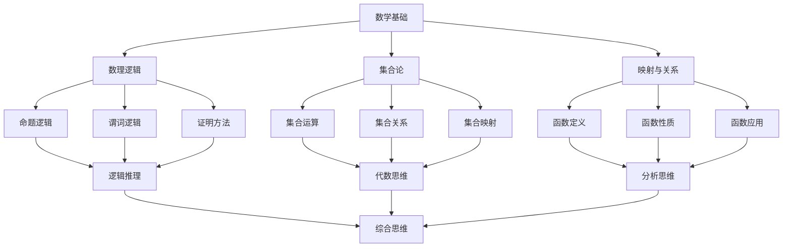
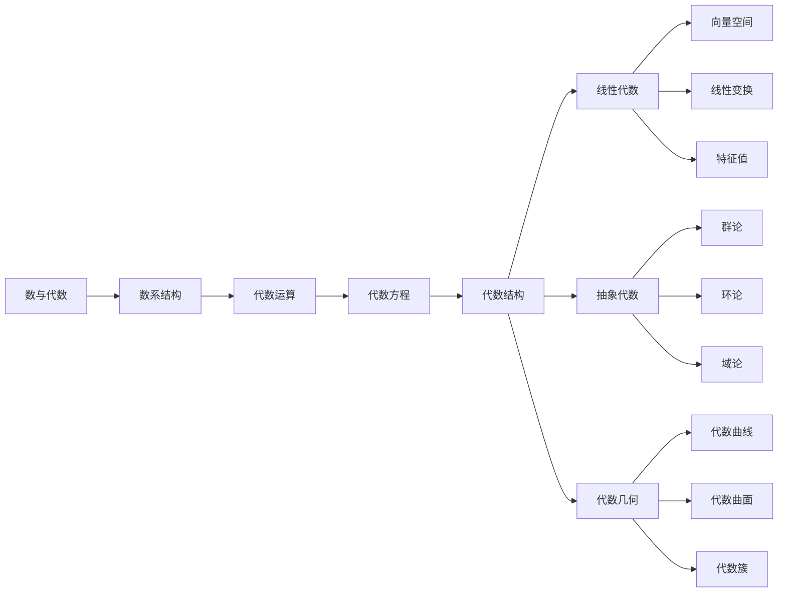
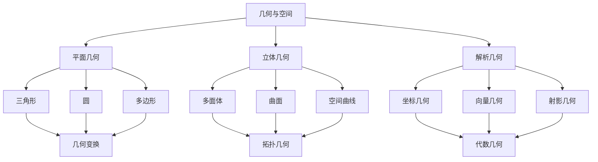
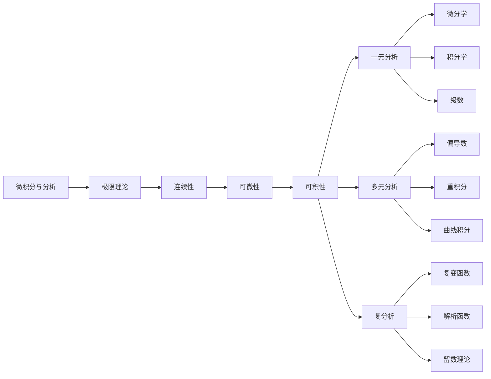
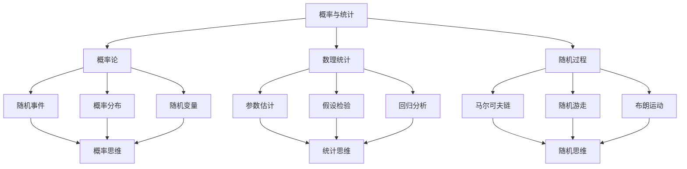
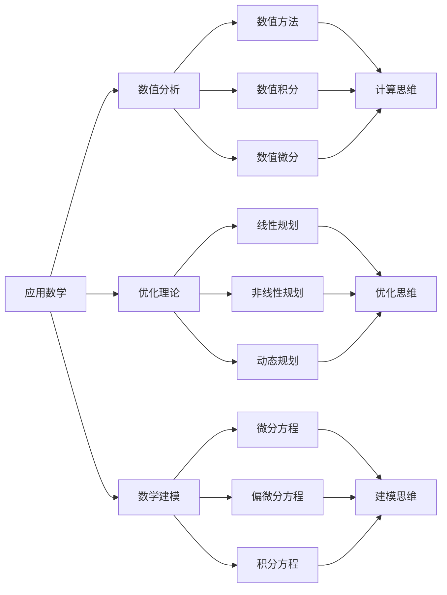

# 数学学习路径设计 | Mathematical Learning Path Design

## 学习路径总览 | Learning Path Overview

### 1. 基础学习路径 | Foundation Learning Path

### 2. 核心学习路径 | Core Learning Path

#### 2.1 代数学习路径 | Algebra Learning Path

#### 2.2 几何学习路径 | Geometry Learning Path

#### 2.3 分析学习路径 | Analysis Learning Path

### 3. 高级学习路径 | Advanced Learning Path

#### 3.1 概率统计路径 | Probability and Statistics Path

#### 3.2 应用数学路径 | Applied Mathematics Path

## 学习阶段设计 | Learning Stage Design

### 1. 入门阶段 | Introduction Stage

#### 1.1 概念认知阶段 | Concept Recognition Stage

**学习目标**：

- 理解基本数学概念
- 掌握基本数学符号
- 培养数学直觉
- 建立数学兴趣

**学习内容**：

- **数与运算**：自然数、整数、有理数、实数
- **几何直观**：点、线、面、体
- **逻辑思维**：命题、推理、证明
- **函数概念**：变量、对应、关系

**学习方法**：

- **直观教学**：通过具体例子理解抽象概念
- **动手实践**：通过操作活动加深理解
- **问题驱动**：通过问题激发学习兴趣
- **合作学习**：通过讨论交流促进理解

#### 1.2 技能培养阶段 | Skill Development Stage

**学习目标**：

- 掌握基本计算技能
- 培养逻辑推理能力
- 发展空间想象能力
- 提高问题解决能力

**学习内容**：

- **代数技能**：方程求解、不等式处理
- **几何技能**：图形构造、证明方法
- **分析技能**：极限计算、导数应用
- **统计技能**：数据处理、概率计算

**学习方法**：

- **练习巩固**：通过大量练习掌握技能
- **方法总结**：总结解题方法和技巧
- **错误分析**：分析常见错误和改进方法
- **能力拓展**：逐步提高问题难度

### 2. 发展阶段 | Development Stage

#### 2.1 知识整合阶段 | Knowledge Integration Stage

**学习目标**：

- 整合不同领域的数学知识
- 建立知识之间的联系
- 发展综合思维能力
- 提高应用能力

**学习内容**：

- **跨领域应用**：代数与几何的结合
- **方法迁移**：将一种方法应用到不同领域
- **问题综合**：解决综合性数学问题
- **创新应用**：创新性地应用数学知识

**学习方法**：

- **项目学习**：通过项目整合知识
- **探究学习**：通过探究发现知识联系
- **反思学习**：通过反思深化理解
- **创新学习**：通过创新拓展应用

#### 2.2 思维深化阶段 | Thinking Deepening Stage

**学习目标**：

- 发展抽象思维能力
- 培养创新思维能力
- 提高批判性思维
- 发展元认知能力

**学习内容**：

- **抽象思维**：从具体到抽象，从特殊到一般
- **创新思维**：发现新问题，创造新方法
- **批判思维**：质疑、分析、评价
- **元认知**：对思维过程的认识和控制

**学习方法**：

- **深度思考**：深入思考问题的本质
- **多角度分析**：从不同角度分析问题
- **思维训练**：专门训练各种思维能力
- **自我反思**：反思自己的思维过程

### 3. 高级阶段 | Advanced Stage

#### 3.1 理论研究阶段 | Theoretical Research Stage

**学习目标**：

- 理解数学理论体系
- 掌握数学研究方法
- 发展理论思维能力
- 培养研究兴趣

**学习内容**：

- **理论体系**：数学各分支的理论体系
- **研究方法**：数学研究的基本方法
- **前沿问题**：数学研究的前沿问题
- **历史发展**：数学发展的历史脉络

**学习方法**：

- **文献阅读**：阅读数学文献和经典著作
- **问题研究**：研究具体的数学问题
- **理论探讨**：探讨数学理论问题
- **历史研究**：研究数学发展历史

#### 3.2 创新应用阶段 | Innovation Application Stage

**学习目标**：

- 创新数学理论和方法
- 应用数学解决实际问题
- 发展跨学科思维
- 培养创新精神

**学习内容**：

- **理论创新**：创新数学理论和方法
- **应用创新**：创新数学应用领域
- **跨学科应用**：数学在其他学科中的应用
- **实际问题**：用数学解决实际问题

**学习方法**：

- **创新实践**：在实践中创新
- **跨学科学习**：学习其他学科知识
- **问题解决**：解决实际问题
- **合作研究**：与他人合作研究

## 学习策略设计 | Learning Strategy Design

### 1. 认知策略 | Cognitive Strategies

#### 1.1 理解策略

- **概念理解**：深入理解数学概念的本质
- **关系理解**：理解数学概念之间的关系
- **方法理解**：理解数学方法的原理
- **应用理解**：理解数学知识的应用

#### 1.2 记忆策略

- **结构化记忆**：将知识结构化便于记忆
- **关联记忆**：通过关联帮助记忆
- **重复记忆**：通过重复巩固记忆
- **应用记忆**：通过应用加深记忆

#### 1.3 思维策略

- **分析思维**：分析问题的结构和特点
- **综合思维**：综合不同知识解决问题
- **抽象思维**：从具体中抽象出一般
- **创新思维**：创造性地解决问题

### 2. 元认知策略 | Metacognitive Strategies

#### 2.1 计划策略

- **学习计划**：制定详细的学习计划
- **时间管理**：合理安排学习时间
- **目标设定**：设定明确的学习目标
- **资源准备**：准备必要的学习资源

#### 2.2 监控策略

- **过程监控**：监控学习过程
- **进度监控**：监控学习进度
- **效果监控**：监控学习效果
- **策略监控**：监控学习策略的使用

#### 2.3 调节策略

- **方法调节**：根据情况调节学习方法
- **进度调节**：根据情况调节学习进度
- **策略调节**：根据情况调节学习策略
- **目标调节**：根据情况调节学习目标

### 3. 资源管理策略 | Resource Management Strategies

#### 3.1 时间管理

- **时间规划**：合理规划学习时间
- **时间分配**：合理分配各科学习时间
- **时间利用**：充分利用碎片时间
- **时间调整**：根据情况调整时间安排

#### 3.2 环境管理

- **学习环境**：创造良好的学习环境
- **心理环境**：保持良好的心理状态
- **人际环境**：建立良好的人际关系
- **资源环境**：充分利用各种学习资源

#### 3.3 努力管理

- **动机管理**：保持学习动机
- **意志管理**：培养学习意志
- **情绪管理**：管理学习情绪
- **压力管理**：管理学习压力

## 评价体系设计 | Evaluation System Design

### 1. 形成性评价 | Formative Evaluation

#### 1.1 学习过程评价

- **参与度评价**：评价学习参与度
- **理解度评价**：评价知识理解程度
- **应用度评价**：评价知识应用能力
- **创新度评价**：评价创新能力

#### 1.2 学习策略评价

- **策略使用**：评价学习策略的使用
- **策略效果**：评价学习策略的效果
- **策略调整**：评价策略调整的能力
- **策略创新**：评价策略创新的能力

### 2. 总结性评价 | Summative Evaluation

#### 2.1 知识掌握评价

- **概念掌握**：评价概念掌握程度
- **方法掌握**：评价方法掌握程度
- **应用掌握**：评价应用掌握程度
- **综合掌握**：评价综合掌握程度

#### 2.2 能力发展评价

- **思维能力**：评价思维能力发展
- **创新能力**：评价创新能力发展
- **应用能力**：评价应用能力发展
- **学习能力**：评价学习能力发展

### 3. 发展性评价 | Developmental Evaluation

#### 3.1 个体发展评价

- **进步评价**：评价个体学习进步
- **潜力评价**：评价个体发展潜力
- **特长评价**：评价个体学习特长
- **不足评价**：评价个体学习不足

#### 3.2 群体发展评价

- **整体水平**：评价群体整体水平
- **个体差异**：评价群体个体差异
- **发展趋势**：评价群体发展趋势
- **发展策略**：评价群体发展策略

## 学习资源设计 | Learning Resource Design

### 1. 教材资源 | Textbook Resources

#### 1.1 基础教材

- **概念教材**：系统介绍数学概念
- **方法教材**：详细介绍数学方法
- **应用教材**：展示数学应用
- **练习教材**：提供大量练习题

#### 1.2 高级教材

- **理论教材**：深入介绍数学理论
- **研究教材**：介绍数学研究方法
- **前沿教材**：介绍数学前沿问题
- **历史教材**：介绍数学发展历史

### 2. 数字资源 | Digital Resources

#### 2.1 在线课程

- **视频课程**：提供视频教学
- **互动课程**：提供互动学习
- **微课程**：提供短小精悍的课程
- **MOOC课程**：提供大规模在线课程

#### 2.2 软件工具

- **计算软件**：提供计算工具
- **绘图软件**：提供绘图工具
- **模拟软件**：提供模拟工具
- **编程软件**：提供编程工具

### 3. 实践资源 | Practical Resources

#### 3.1 实验资源

- **数学实验**：提供数学实验
- **建模实验**：提供建模实验
- **编程实验**：提供编程实验
- **创新实验**：提供创新实验

#### 3.2 竞赛资源

- **数学竞赛**：提供数学竞赛
- **建模竞赛**：提供建模竞赛
- **创新竞赛**：提供创新竞赛
- **应用竞赛**：提供应用竞赛

## 学习环境设计 | Learning Environment Design

### 1. 物理环境 | Physical Environment

#### 1.1 教室环境

- **空间布局**：合理的空间布局
- **设备配置**：完善的设备配置
- **环境氛围**：良好的环境氛围
- **安全设施**：完善的安全设施

#### 1.2 实验室环境

- **实验设备**：先进的实验设备
- **实验环境**：良好的实验环境
- **实验管理**：完善的实验管理
- **实验安全**：严格的实验安全

### 2. 心理环境 | Psychological Environment

#### 2.1 学习氛围

- **积极氛围**：营造积极的学习氛围
- **合作氛围**：营造合作的学习氛围
- **创新氛围**：营造创新的学习氛围
- **竞争氛围**：营造适度的竞争氛围

#### 2.2 人际关系

- **师生关系**：建立良好的师生关系
- **同学关系**：建立良好的同学关系
- **团队关系**：建立良好的团队关系
- **社会关系**：建立良好的社会关系

### 3. 技术环境 | Technological Environment

#### 3.1 信息技术

- **网络环境**：完善的网络环境
- **软件环境**：丰富的软件环境
- **硬件环境**：先进的硬件环境
- **数据环境**：完善的数据环境

#### 3.2 智能技术

- **人工智能**：应用人工智能技术
- **虚拟现实**：应用虚拟现实技术
- **增强现实**：应用增强现实技术
- **物联网**：应用物联网技术

## 学习发展展望 | Learning Development Prospects

### 1. 技术发展趋势 | Technology Development Trends

#### 1.1 人工智能应用

- **智能教学**：AI辅助个性化教学
- **智能评价**：AI辅助学习评价
- **智能推荐**：AI辅助学习推荐
- **智能辅导**：AI辅助学习辅导

#### 1.2 虚拟现实应用

- **虚拟实验**：VR辅助数学实验
- **虚拟教学**：VR辅助数学教学
- **虚拟探索**：VR辅助数学探索
- **虚拟创新**：VR辅助数学创新

### 2. 教育发展趋势 | Education Development Trends

#### 2.1 个性化学习

- **个性化路径**：根据个人特点设计学习路径
- **个性化内容**：根据个人特点设计学习内容
- **个性化方法**：根据个人特点设计学习方法
- **个性化评价**：根据个人特点设计学习评价

#### 2.2 协作学习

- **协作学习**：通过协作进行学习
- **协作创新**：通过协作进行创新
- **协作评价**：通过协作进行评价
- **协作发展**：通过协作促进发展

### 3. 研究发展趋势 | Research Development Trends

#### 3.1 认知科学研究

- **认知过程**：研究数学学习的认知过程
- **认知机制**：研究数学学习的认知机制
- **认知发展**：研究数学学习的认知发展
- **认知应用**：研究数学学习的认知应用

#### 3.2 教育学研究

- **教学理论**：发展数学教学的理论
- **学习理论**：发展数学学习的理论
- **评价理论**：发展数学评价的理论
- **发展理论**：发展数学发展的理论

---

*本学习路径设计为SeniorMath项目的核心内容之一，旨在通过系统化的学习路径设计，为数学教育提供科学、完整、实用的学习指导。*
